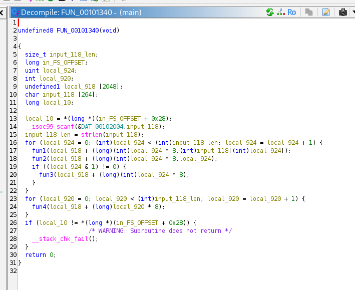
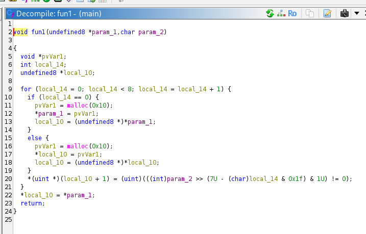
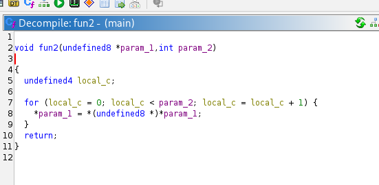
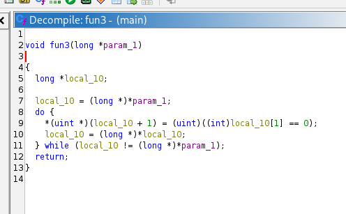
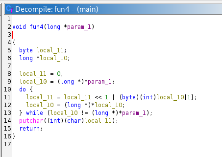
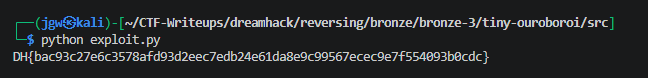

# [Dreamhack] Tiny Ouroboroi - Reversing

## 1. 문제 개요

* **문제 링크:** [Dreamhack - tiny-ouroboroi](https://dreamhack.io/wargame/challenges/2324)

* **분야:** Reversing

* **목표:** 제공된 ELF 바이너리의 다중 암호화(원형 연결 리스트 생성, Shift, 비트 반전) 로직을 정적 분석하고, 도출한 알고리즘을 바탕으로 역연산 파이썬 스크립트를 작성하여 최종 `output.bin` 대상으로부터 원본 입력값(FLAG) 복구.

## 2. 취약점 분석
제공된 ELF 바이너리 파일(`main`)을 Ghidra로 디컴파일하여 분석한 결과, 사용자 입력값을 1바이트씩 쪼개어 연결 리스트 형태로 메모리에 동적 할당하고 회전 및 비트 반전 연산을 수행하는 구조 파악.

```c
// ... (중략) ...

void fun1(undefined8 *param_1, char param_2) {
    // ... (중략) ...
    for (local_14 = 0; local_14 < 8; local_14 = local_14 + 1) {
        if (local_14 == 0) {
            pvVar1 = malloc(0x10);
            *param_1 = pvVar1;
            local_10 = (undefined8 *)*param_1;
        } else {
            pvVar1 = malloc(0x10);
            *local_10 = pvVar1;
            local_10 = (undefined8 *)*local_10;
        }
        *(uint *)(local_10 + 1) = (uint)(((int)param_2 >> (7U - (char)local_14 & 0x1f) & 1U) != 0);
    }
    *local_10 = *param_1;
    return;
}

void fun2(undefined8 *param_1, int param_2) {
    // ... (중략) ...
    for (local_c = 0; local_c < param_2; local_c = local_c + 1) {
        *param_1 = *(undefined8 *)*param_1;
    }
    return;
}

void fun3(long *param_1) {
    // ... (중략) ...
    do {
        *(uint *)(local_10 + 1) = (uint)((int)local_10[1] == 0);
        local_10 = (long *)*local_10;
    } while (local_10 != (long *)*param_1);
    return;
}

// ... (중략) ...
```

* **분석 결론:** 사용자의 입력값을 1바이트씩 8비트로 분할하여 8개의 노드를 가진 원형 연결 리스트(우로보로스) 생성(fun1). 이후 인덱스(i)만큼 노드 헤드를 이동(fun2)시키고, 홀수 인덱스일 경우 데이터 비트를 반전(fun3)시킨 뒤, 다시 1바이트로 재조립하여 출력(fun4)하는 구조. 연산 과정이 데이터 손실이 없는 단순 비트 이동 및 반전이므로, 역순으로 복호화 스크립트 작성 가능.

## 3. 공격 수행

### 3.1. 세부 역공학 및 익스플로잇 단계

1. Ghidra를 통해 `main` 함수의 전체적인 4단계 암호화 흐름 및 최종 타겟 파일(`output.bin`) 생성 로직 파악.



2. 1바이트 입력값을 8비트로 나누어 16바이트 크기의 동적 메모리(노드)를 생성하고 꼬리를 무는 원형 구조(`fun1`) 분석.



3. 생성된 리스트의 헤드 포인터를 인덱스 크기만큼 이동시켜 비트를 회전시키는(`fun2`) 로직 확인.



4. 인덱스가 홀수일 때, 원형 연결 리스트를 순회하며 데이터 비트를 반전(`fun3`)시키는 조건부 연산 파악.



5. 최종적으로 변형된 리스트를 다시 1바이트 문자로 병합(`fun4`)하여 파일로 내보내는 조립 로직 식별.



6. 파이썬을 활용하여 분석한 정방향 암호화 함수를 재조합. 획득한 `output.bin` 파일에서 바이트를 읽어와 홀수 인덱스 반전 원복 및 역방향 회전(Right Shift)을 적용하는 익스플로잇 스크립트 작성 및 실행.

```python
with open("output.bin", "rb") as f:
    encrypted_data = f.read()

flag = ""

for i, byte in enumerate(encrypted_data):
    
    if i % 2 != 0:
        byte = byte ^ 0xFF 
        
    shift = i % 8
    
    decrypted_byte = ((byte >> shift) | (byte << (8 - shift))) & 0xFF
    
    flag += chr(decrypted_byte)

print(flag)
```



## 4. 획득 결과
도출된 역연산 스크립트를 통해 암호화된 바이너리 값을 아스키 문자로 디코딩하여 최종 플래그 식별 성공.

* **FLAG:** `DH{bac93c27e6c3578afd93d2eec7db24e61da8e9c99567ecec9e7f554093b0cdc}`

## 5. 대응 방안
프로그램 내에서 중요한 데이터 암호화 시, 단순 역추적이 가능한 자체 로직 사용 방지를 위해 소스코드에 다음과 같은 시큐어 코딩 조치 적용.

* **강력한 표준 암호화 알고리즘 도입:** 단순 비트 이동(Shift) 및 반전(NOT/XOR) 연산은 역산출 및 솔버(Solver) 작성이 매우 쉬움. AES-256과 같이 보안성이 검증된 산업 표준 대칭키 암호화 알고리즘(OpenSSL 라이브러리 등)을 사용하도록 소스코드 재설계.

* **동적 메모리 관리 강화:** 암호화 과정에서 무수히 많은 `malloc`을 호출하나 명시적인 `free` 과정이 누락될 경우 심각한 메모리 누수(Memory Leak) 및 서비스 거부(DoS) 취약점 발생 가능성 존재. C언어 기반 프로그램 작성 시 철저한 동적 할당 해제 로직 구현 필수.

* **난독화 기법 적용:** 리버싱을 통한 알고리즘 분석을 지연시키기 위해 제어 흐름 난독화(Control Flow Flattening) 및 안티 디버깅 로직 추가.

## 6. 블루팀 관점 요약

### 6.1. 탐지 및 분석 한계
* **네트워크 행위 없음:** 해당 프로그램은 오프라인 환경에서 로컬 메모리 동적 할당 및 단순 비트 연산을 수행하는 단독 실행형 바이너리로, 외부 C2(명령 및 제어) 서버와의 통신이 발생하지 않음. 따라서 기존의 네트워크 관제 장비(NTA/IPS)로는 침해 시도 및 악성 행위 탐지 불가.

* **대응 방향:** EDR 및 호스트 엔드포인트 보안 모니터링 체계를 통해 의심스러운 실행 파일의 대량 동적 할당 행위나 `output.bin` 파일의 비정상적인 덤프/생성 이력을 프로세스 단위로 모니터링해야 함.

### 6.2. YARA 탐지 룰 (IoC)
바이너리 정적 분석 과정에서 식별된 특유의 16바이트 메모리 동적 할당(`malloc(0x10)`) 반복 패턴 및 특정 출력 파일명 생성 구조를 활용한 악성코드 식별 YARA 시그니처 제안.

```yara
rule Detect_Tiny_Ouroboroi {
    strings:
        // 0x10 바이트 동적 할당 반복을 수행하는 루프 시그니처 특징
        $malloc_loop = { BF 10 00 00 00 E8 ?? ?? ?? ?? 48 89 ?? ?? }
        
        // 최종 생성 대상 파일명 문자열
        $output_file = "output.bin" ascii
    condition:
        uint32(0) == 0x464c457f and // ELF Header
        ( $malloc_loop or $output_file )
}
```