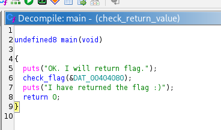
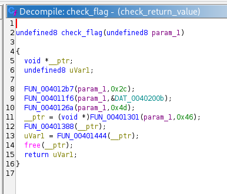
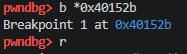
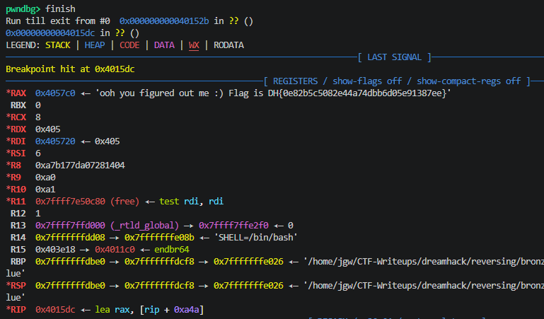

# [DreamHack] Check Return Value - Reversing

## 1. 문제 개요

* **문제 링크:** [DreamHack - Check Return Value](https://dreamhack.io/wargame/challenges/670)

* **분야:** Reversing

* **목표:** 프로그램 내에서 플래그가 담긴 문자열의 메모리 주소를 반환하지만 화면에 출력하지 않는 구조를 파악하고, 동적 디버깅을 통해 반환값을 가로채어 플래그 도출.

## 2. 취약점 분석
제공된 ELF 바이너리(`check_return_value`)를 Ghidra로 디컴파일하여 분석한 결과, 메인 함수에서 플래그를 생성하는 타겟 함수(`check_flag`)를 호출하지만 그 결과값을 출력하는 로직이 부재한 것을 파악.

```c
// ... (중략) ...
undefined8 check_flag(undefined8 param_1)
{
  void *__ptr;
  undefined8 uVar1;

// ... (중략) ...
  uVar1 = FUN_00401444(__ptr);
  free(__ptr);
  return uVar1;
}
// ... (중략) ...
```

* **분석 결론:** 대상 프로그램은 내부적으로 연산을 거쳐 플래그 문자열을 생성한 후 해당 메모리 주소를 반환(`return uVar1;`)함. 정적 분석만으로는 런타임에 동적으로 생성되는 플래그 값을 획득하기 어려우므로, 동적 디버거(GDB)를 활용하여 함수 종료 시점에 반환값을 저장하는 `RAX` 레지스터의 메모리 주소를 확인하는 방식이 요구됨.

## 3. 공격 수행

1. Ghidra를 통해 `main` 함수 로직 파악 및 내부에서 플래그 검증을 수행하는 타겟 함수 호출 흐름 분석 진행.



2. 플래그가 담긴 문자열의 주소를 뱉어내는 핵심 로직인 `check_flag`(`FUN_0040152b`) 함수의 메모리 주소 및 반환 구조 확인.



3. `gdb`를 활용하여 타겟 함수의 시작 주소(`0x40152b`)에 브레이크포인트(`b *0x40152b`) 설정 및 바이너리 실행(`r`).



4. `finish` 명령어를 입력하여 타겟 함수 내의 연산 로직이 완전히 종료되고 메인 함수로 복귀하는 순간에 실행 일시 정지. 이후 `RAX` 레지스터의 메모리 주소 데이터 확인.



## 4. 획득 결과
도출된 로직을 바탕으로 동적 디버깅을 수행하여 `RAX` 레지스터에 담겨 있던 문자열 포인터 주소를 추적, 메모리에 생성된 원본 플래그 복원 성공.

* **FLAG:** `DH{0e82b5c5082e44a74dbb6d05e91387ee}`

## 5. 대응 방안
프로그램 내에서 보안상 민감한 데이터(플래그, 암호화 키 등)를 처리할 때, 메모리에 평문 형태로 잔존하거나 반환값을 통해 외부로 노출되는 것을 방지하기 위해 프로그램 소스코드 단에 대한 시큐어 코딩 조치 적용.

* **메모리 즉각 초기화 (Zero-out) 적용:** 민감한 연산이 끝난 직후 `memset_s` 또는 `SecureZeroMemory` 등의 보안 함수를 활용하여, 플래그 데이터가 담겼던 힙(Heap) 포인터나 지역 변수 메모리 영역을 0으로 덮어써서 메모리 포렌식 및 덤프 방지.

* **안전한 반환 로직 설계:** 민감한 문자열의 실제 주소 자체를 함수 외부로 그대로 반환하는 아키텍처를 지양. 대신, 내부에 완전히 은닉된 상태로 처리하고 외부로는 상태 코드(성공 여부에 따른 `True/False` 등)만을 반환하도록 함수 구조 변경.

## 6. 블루팀 관점 요약

### 6.1. 탐지 및 분석 한계
* **네트워크 행위 없음:** 외부 C2 통신이나 네트워크 I/O가 발생하지 않는 단독 실행형 리눅스 바이너리(ELF)이므로 기존 관제 장비(NTA/IPS)로는 탐지 불가.

* **대응 방향:** EDR 및 리눅스 호스트 보안 모니터링 체계를 통해, 분석가의 불법적인 동적 디버깅 시도(비정상적인 `ptrace` 시스템 콜 호출)를 탐지하거나 프로세스 메모리 덤프 행위를 차단하는 접근 필요.

### 6.2. YARA 탐지 룰 (IoC)
분석으로 확보한 바이너리 내 하드코딩된 특정 알림 문자열 시그니처를 활용한 탐지 룰 제안.

```yara
rule Detect_Check_Return_Value {
    strings:
        // 프로그램 실행 시 노출되는 특징적인 안내 문자열
        $str1 = "OK. I will return flag."
        $str2 = "I have returned the flag :)"
    condition:
        all of them
}
```