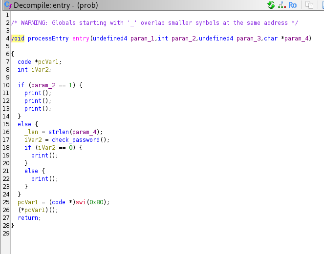
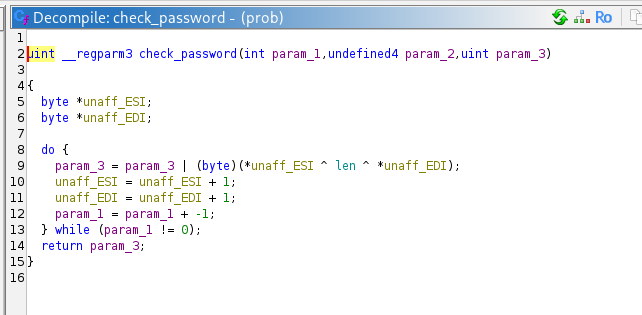
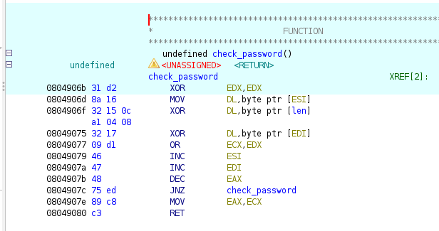
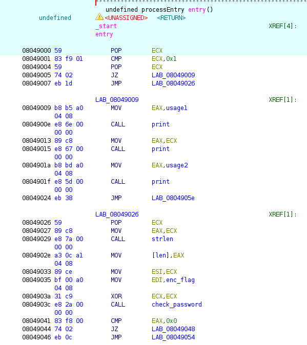
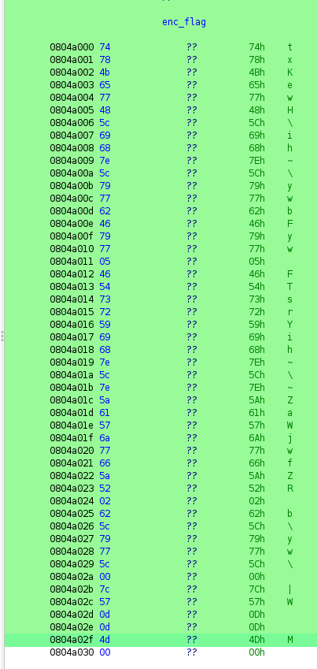
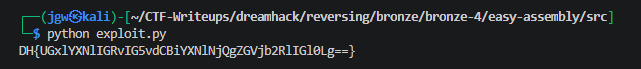

# [Dreamhack] Easy Assembly - Reversing

## 1. 문제 개요

* **문제 링크:** [Dreamhack - Easy Assembly](https://dreamhack.io/wargame/challenges/1095)

* **분야:** Reversing

* **목표:** 어셈블리 및 디컴파일 코드를 분석하여 플래그 검증 로직을 파악하고, 하드코딩된 데이터와 레지스터 연산 규칙을 역산하여 원본 플래그 도출.

## 2. 취약점 분석
제공된 ELF 바이너리(`prob`)를 Ghidra로 디컴파일하여 분석한 결과, 프로그램 진입점(`entry`)에서 사용자 입력값을 검증하는 `check_password` 호출 부분 식별.

```c
// ... (중략) ...
_len = strlen(param_4);
iVar2 = check_password();
if (iVar2 == 0) {
    print();
}
// ... (중략) ...
```

`check_password` 내부 연산 로직에서 파라미터로 명시되지 않은 포인터(`ESI`, `EDI`) 사용 확인.

```c
// ... (중략) ...
byte *unaff_ESI;
byte *unaff_EDI;
do {
    param_3 = param_3 | (byte)(*unaff_ESI ^ len ^ *unaff_EDI);
// ... (중략) ...
```

이를 어셈블리어로 교차 검증하여 레지스터 간의 비트 누적 연산 흐름 파악.
```assembly
; ... (중략) ...
0804906b XOR EDX, EDX
0804906d MOV DL, byte ptr [ESI]
0804906f XOR DL, byte ptr [len]
08049075 XOR DL, byte ptr [EDI]
08049077 OR ECX, EDX
; ... (중략) ...
```

* **분석 결론:** 성공 분기로 가기 위해서는 최종 반환값 `EAX`(`ECX`의 누적값)가 `0`이 되어야 함. 비트 `OR` 연산 특성상 단 한 번이라도 `1`이 섞이면 안 되므로, 매 반복마다 연산 결과인 `DL`이 무조건 `0`이어야 함. 즉, `[ESI] ^ [len] ^ [EDI] == 0` 구조가 강제되므로, `[ESI] = [len] ^ [EDI]` 라는 입력값(플래그) 역산 식 성립.

## 3. 공격 수행

1. 프로그램 진입점(`entry`)에서 `check_password` 함수가 호출되는 흐름 파악. 디컴파일 코드상 함수의 정규 파라미터로 명확한 입력값이 전달되지 않음을 확인.



2. `check_password` 함수의 디컴파일 화면과 어셈블리어를 교차 분석. 뜬금없이 등장한 `ESI`와 `EDI`가 반복문에서 핵심 연산에 쓰이며, 누적 결과인 `ECX`가 `0`이 되어야 함을 확인. 이를 통해 `ESI` (입력값)와 `EDI` (비교 대상) 간의 논리적 관계식 도출.





3. `ESI`와 `EDI`의 실체를 파악하기 위해 이전 함수인 `entry`의 어셈블리어 영역으로 회귀. `CALL check_password` 명령어 직전 레지스터 세팅 과정에서 `MOV EDI, enc_flag`를 통해 `EDI`에 하드코딩된 정답 데이터가 들어가고, `ESI`에 입력값이 세팅됨을 확인.



4. 파악해 낸 `EDI`의 메모리 주소(`enc_flag`)로 점프하여 연속적으로 나열된 16진수 바이트 배열을 확인. 데이터가 시작 주소 `0x0804a000`부터 끝 주소 `0x0804a02f`까지 이어지고, 다음 주소에서 `00` (Null 바이트)으로 종료됨을 확인. 주소 연산(`0x2f - 0x00 + 1 = 0x30`)을 통해 암호화된 배열의 총 크기가 10진수 기준 48바이트임을 도출.



5. 어셈블리 분석 결과, `len` 변수는 `entry`에서 계산된 입력값의 길이(`strlen`)이며, 이 값은 루프 카운터(`EAX`)이자 암호 해독의 XOR 키로 동시에 사용됨을 파악. 48바이트 크기의 정답 배열 전체를 완벽하게 대조하기 위해서는 루프를 정확히 48번 반복해야만 하므로, 우리가 입력해야 할 문자열의 길이(`len`) 역시 48임을 논리적으로 확신.

6. 추출한 바이트 배열과, 문자열 길이(`len = 48`)를 통해 복호화 로직 구성. 둘을 XOR 연산하는 파이썬 스크립트(`exploit.py`)를 실행하여 최종 원본 플래그 획득 성공.



## 4. 획득 결과

* **FLAG:** `DH{UGxlYXNlIGRvIG5vdCBiYXNlNjQgZGVjb2RlIGl0Lg==}`

## 5. 대응 방안
프로그램 내부에 주요 검증 로직의 비교 대상이 되는 데이터가 단순한 연산 형태로 노출되는 것을 방지하기 위한 시큐어 코딩 및 보호 조치 적용.

* **비밀값의 단방향 해시 적용:** 패스워드나 플래그 같은 민감한 문자열을 바이너리에 하드코딩할 때 평문이나 단순 XOR 암호화 형태가 아닌, SHA-256 등의 강력한 단방향 해시 함수 알고리즘을 거친 해시값으로 저장. 공격자가 역산을 통해 원본 문자열을 복구하는 것을 원천 차단.

* **코드 난독화 및 안티 디버깅:** 디스어셈블러 및 디컴파일러를 통한 정적 분석 흐름을 끊기 위해 핵심 검증 함수(`check_password`) 주변에 제어 흐름 난독화(Control Flow Flattening) 기법 적용. 동적 디버거 부착을 방지하여 메모리 주소(ESI, EDI) 노출 및 레지스터 값 추적 지연.

## 6. 블루팀 관점 요약

### 6.1. 탐지 및 분석 한계
해당 프로그램은 외부 C2 서버와 통신하거나 추가 악성 페이로드를 드롭하는 행위가 없는 단순 로컬 검증용 바이너리로 구성됨. 따라서 침입 탐지 시스템(IDS)이나 WAF 등 네트워크 기반의 보안 관제 장비에서는 행위 식별 및 차단에 한계 존재.

### 6.2. 위협 헌팅 및 YARA 탐지 룰 제안
정적 분석을 통해 도출된 호스트 기반 단서(하드코딩된 고유 바이트 패턴, 특유의 XOR 및 OR 누적 연산 어셈블리 시그니처)를 바탕으로, 동일한 암호화 루틴을 공유하는 유사 악성 바이너리를 식별할 수 있는 YARA 탐지 룰 제안. 추가로 분석 파이프라인에서 해당 패턴 탐지 시 자동으로 역산을 수행하는 Decrypter 스크립트 연동을 통한 분석 자동화 권장.

```yara
rule Detect_Easy_Assembly {
    strings:
        // 바이너리 내 하드코딩된 enc_flag 바이트 패턴 일부 (시그니처)
        $enc_pattern = { 74 78 4b 65 77 48 5c 69 68 7e 5c 79 77 }
        
        // check_password 내부의 고유한 반복문 XOR 및 OR 누적 어셈블리 명령 패턴
        // XOR EDX, EDX | MOV DL, [ESI] | XOR DL, [len] | XOR DL, [EDI] | OR ECX, EDX
        $asm_logic = { 31 d2 8a 16 32 15 ?? ?? ?? ?? 32 17 09 d1 } 

    condition:
        ($enc_pattern or $asm_logic)
}
```