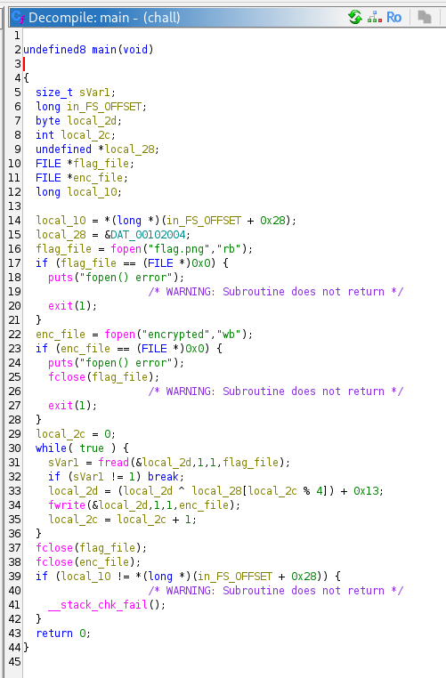
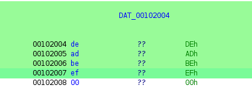

# [Dreamhack] Recover - Reversing

## 1. 문제 개요

* **문제 링크:** [Dreamhack - Recover](https://dreamhack.io/wargame/challenges/1569)

* **분야:** Reversing

* **목표:** 제공된 바이너리의 파일 암호화 로직을 분석하고, 역연산 스크립트를 작성하여 암호화된 파일(`encrypted`)로부터 원본 이미지 파일(`flag.png`)을 복구.

## 2. 취약점 분석
제공된 ELF 바이너리(`chall`)를 Ghidra로 디컴파일하여 분석한 결과, 하드코딩된 키를 이용한 단순 XOR 및 덧셈 연산으로 파일을 암호화하는 취약한 로직 파악.

> 💡 **분석 메모:** 디컴파일 코드의 가독성을 위해 기드라 상에서 원본 파일 포인터(`local_20`)는 `flag_file`로, 암호화 결과 파일 포인터(`local_18`)는 `enc_file`로 변수명을 변경하여 분석을 진행함.

```c
// ... (중략) ...

  local_2c = 0;
  while( true ) {
    sVar1 = fread(&local_2d,1,1,flag_file);
    if (sVar1 != 1) break;
    local_2d = (local_2d ^ local_28[local_2c % 4]) + 0x13;
    fwrite(&local_2d,1,1,enc_file);
    local_2c = local_2c + 1;
  }

// ... (중략) ...
```

* **분석 결론:** 원본 파일(`flag.png`)에서 1바이트씩 읽어와 특정 4바이트 배열(`local_28`)과 인덱스를 순환하며 XOR 연산을 수행한 뒤, `0x13`을 더해 저장하는 구조. 단순한 사칙연산과 비트 연산이므로 `(암호화된 바이트 - 0x13) ^ 키` 공식을 통해 역연산(복호화) 가능.

## 3. 공격 수행

1. Ghidra를 통해 메인 암호화 로직 파악 및 내부에 사용된 타겟 변수 추적 진행.



2. 메모리 데이터 참조를 통해 `local_28`에 할당된 하드코딩 암호화 키(`DAT_00102004`)가 `0xde`, `0xad`, `0xbe`, `0xef` (deadbeef) 임을 확인.



3. 파이썬을 활용하여 원본 복구용 익스플로잇 스크립트 작성. 암호화된 파일의 바이트를 순회하며 사전에 파악한 역연산 `((enc - 0x13) & 0xFF) ^ key[i%4]`를 적용하여 순수 바이너리 데이터를 `flag.png`로 저장.

```python
hex_data = "deadbeef"

with open("encrypted", "rb") as f:
    enc_data = f.read()

key = bytes.fromhex(hex_data)

flag = bytearray()

for i in range(len(enc_data)):
    enc = enc_data[i]

    original_byte = ((enc - 0x13) & 0xFF) ^ key[i%4]

    flag.append(original_byte)

with open("flag.png", "wb") as f:
    f.write(flag)
```

4. 작성된 파이썬 스크립트 실행 후 동일 디렉터리에 정상적인 PNG 이미지 파일이 생성됨을 확인. 이미지를 열어 플래그 획득.


## 4. 획득 결과
도출된 역연산 스크립트를 통해 생성된 원본 이미지에서 텍스트 형태의 플래그 식별 성공.

* **FLAG:** `DH{9a89d702b9}`

## 5. 대응 방안
프로그램 내에서 파일을 암호화하거나 민감한 데이터를 처리할 때, 데이터가 손쉽게 복호화되는 것을 방지하기 위해 프로그램 소스코드 단에 대한 시큐어 코딩 조치 적용.

* **하드코딩된 키 사용 지양:** 암호화 키(`deadbeef`)를 바이너리의 데이터 영역(.data, .rodata)에 평문으로 하드코딩하는 것을 금지. 환경 변수, 안전한 키 관리 시스템(KMS) 또는 사용자 입력을 통한 동적 키 생성 방식 적용.

* **강력한 표준 암호화 알고리즘 도입:** 단순 XOR 및 산술 연산 조합은 역추적이 매우 쉬우므로, AES-256과 같은 검증된 대칭키 암호화 알고리즘이나 안전한 라이브러리(OpenSSL 등)를 활용하여 로직 재설계.

## 6. 블루팀 관점 요약

### 6.1. 탐지 및 분석 한계
* **네트워크 행위 없음:** 외부 C2 통신이나 네트워크 통신이 일절 발생하지 않는 단독 실행형 바이너리이므로 기존 관제 장비(NTA/IPS)로는 탐지 불가.

* **대응 방향:** EDR 및 엔드포인트 보안 모니터링 체계를 통해 파일 시스템에 대한 비정상적인 일괄 읽기/쓰기 행위(랜섬웨어 의심 행위)를 탐지하거나, 악성 파일에 내포된 특이 시그니처를 정적 분석하여 파일 기반 탐지 수행 필요.

### 6.2. YARA 탐지 룰 (IoC)
바이너리 정적 분석을 통해 확보한 하드코딩된 특정 키(Hex 시그니처)와 주요 문자열을 활용한 탐지 룰 제안.

```yara
rule Detect_Recover {
    strings:
        // 하드코딩된 암호화 키 시그니처
        $hex_key = { DE AD BE EF }
        
        // 대상 파일 입출력 문자열
        $s1 = "flag.png" ascii
        $s2 = "encrypted" ascii
        $s3 = "fopen() error" ascii

    condition:
        $hex_key and 2 of ($s*)
}
```