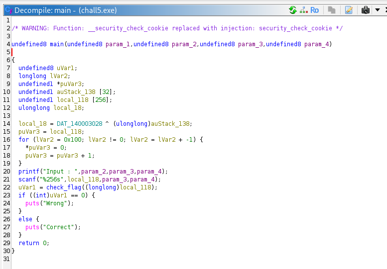
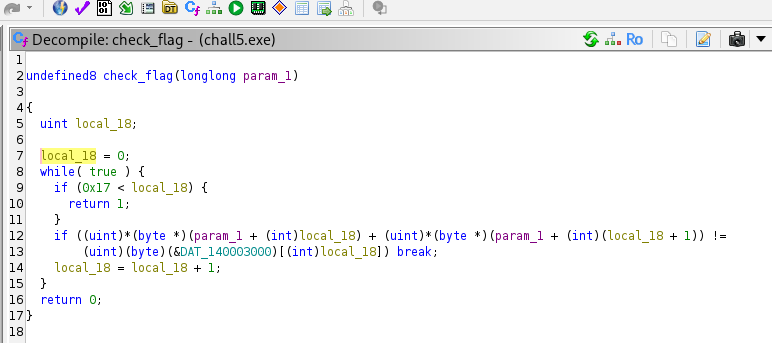
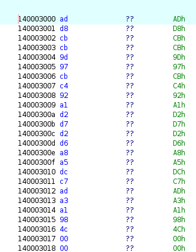
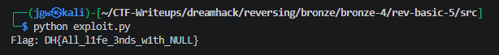

# [DreamHack] Rev-Basic-5 - Reversing

## 1. 문제 개요

* **문제 링크:** [DreamHack - rev-basic-5](https://dreamhack.io/wargame/challenges/19)

* **분야:** Reversing

* **목표:** 프로그램의 입력값 검증 로직을 역산하여 'Correct'를 출력하게 만드는 올바른 플래그 문자열 도출.

## 2. 취약점 분석
제공된 PE 바이너리(`chall5.exe`)를 Ghidra로 디컴파일하여 분석한 결과, 사용자의 입력값을 연속된 두 바이트씩 더한 후 하드코딩된 특정 16진수 데이터 배열과 비교하는 검증 로직 파악.

```c
// ... (중략) ...
undefined8 check_flag(longlong param_1)
{
  uint local_18;

  local_18 = 0;
  while( true ) {
    if (0x17 < local_18) {
      return 1;
    }
    if ((uint)*(byte *)(param_1 + (int)local_18) + (uint)*(byte *)(param_1 + (int)(local_18 + 1)) !=
       (uint)(byte)(&DAT_140003000)[(int)local_18]) break;
    local_18 = local_18 + 1;
  }
  return 0;
}
// ... (중략) ...
```

* **분석 결론:** 사용자의 입력값을 순차적으로 두 바이트씩 더한 값을 하드코딩된 타겟 배열(`DAT_140003000`)과 비교. 별도의 복잡한 암호화 과정 없이 단순 덧셈을 수행하며, C언어 문자열의 끝이 Null Byte(`0x00`)임을 이용해 맨 뒤에서부터 역산(뺄셈)하면 원본 입력값 복원 가능.

## 3. 공격 수행

1. Ghidra를 통해 `main` 함수 로직 파악 및 내부 주요 함수로의 데이터 흐름 분석 진행.



2. 검증 로직인 `check_flag` 함수에서 입력값 인덱스 `i`와 `i+1`의 합이 `DAT_140003000` 메모리 배열의 값과 일치해야 함을 확인.



3. 메모리에 하드코딩된 24바이트 길이의 16진수 타겟 데이터(`ad d8 cb cb ... 00`)를 추출하여 기록.



4. 파이썬을 활용하여 타겟 데이터를 바이트 객체로 변환한 후, 맨 마지막 Null Byte(`0x00`)부터 역순으로 뺄셈 연산을 수행하는 익스플로잇 스크립트 작성 및 실행.

```python
hex_data = "add8cbcb9d97cbc492a1d2d7d2d6a8a5dcc7ada3a1984c00"
target_bytes = bytes.fromhex(hex_data)

flag = [0] * 24

flag[23] = 0

for i in range(22, -1, -1):
    flag[i] = target_bytes[i] - flag[i+1]

result = ""
for num in flag:
    if num != 0:
        result += chr(num)

print(f"Flag: DH{{{result}}}")
```



## 4. 획득 결과
도출된 로직을 바탕으로 파이썬 스크립트를 실행하여 플래그 복원 성공 및 검증 통과 확인.

* **FLAG:** `DH{All_l1fe_3nds_w1th_NULL}`

## 5. 대응 방안
프로그램 검증 로직의 주요 타겟 데이터 노출 및 단순 역산 취약점을 방지하기 위해 프로그램에 대한 보안 조치 적용.

* **단방향 해시 알고리즘 적용:** 검증 로직에 단순 사칙연산 대신, 역추적이 불가능한 SHA-256과 같은 단방향 해시 알고리즘을 사용하여 입력값 검증.

* **데이터 난독화 및 패킹 적용:** 하드코딩된 비교 값 배열을 쉽게 식별 및 추출하지 못하도록 데이터 난독화 기법을 적용하거나 실행 압축을 통해 정적 분석 난이도 상승 유도.

## 6. 블루팀 관점 요약

### 6.1. 탐지 및 분석 한계
* **네트워크 행위 없음:** 외부 C2 통신이 없는 단독 실행형 파일이므로 네트워크 장비(IPS/WAF)로는 탐지 불가능.

* **대응 방향:** EDR이나 백신 등 엔드포인트(호스트) 단에서 내부 시그니처를 기반으로 탐지해야 함.

### 6.2. YARA 탐지 룰 (IoC)
* 분석으로 확보한 고유 바이트 배열 및 문자열을 활용한 탐지 룰:

```yara
rule Detect_Rev_Basic_5 {
    strings:
        $hex_pattern = { AD D8 CB CB 9D 97 CB C4 92 A1 D2 D7 D2 D6 A8 A5 DC C7 AD A3 A1 98 4C 00 }
        $success_str = "Correct"
    condition:
        any of them
}