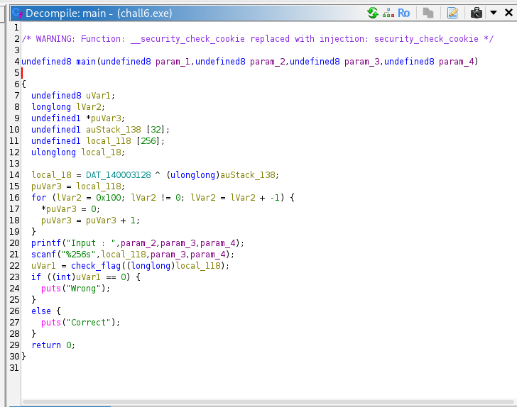
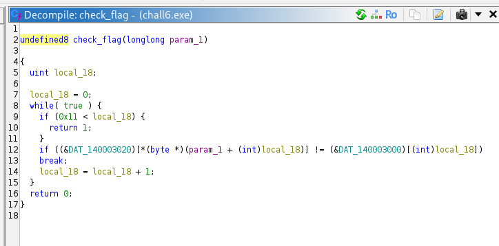
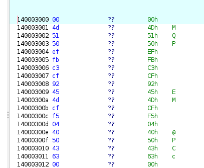
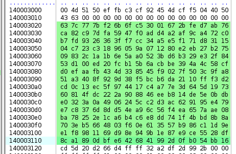
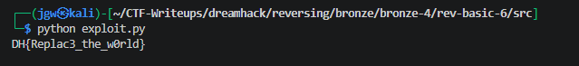

# [DreamHack] Rev-Basic-6 - Reversing

## 1. 문제 개요

* **문제 링크:** [DreamHack - rev-basic-6](https://dreamhack.io/wargame/challenges/20)

* **분야:** Reversing

* **목표:** 프로그램의 입력값 검증 로직을 역산하여 'Correct'를 출력하게 만드는 올바른 플래그 문자열 도출.

## 2. 취약점 분석
제공된 PE 바이너리(`chall6.exe`)를 Ghidra로 디컴파일하여 분석한 결과, 사용자의 입력값을 인덱스로 사용하여 특정 치환 테이블 데이터를 참조한 후 하드코딩된 타겟 배열과 비교하는 검증 로직 파악.

```c
// ... (중략) ...
undefined8 check_flag(longlong param_1)
{
  uint local_18;
  
  local_18 = 0;
  while( true ) {
    if (0x11 < local_18) {
      return 1;
    }
    if ((&DAT_140003020)[*(byte *)(param_1 + (int)local_18)] != (&DAT_140003000)[(int)local_18]) break;
    local_18 = local_18 + 1;
  }
  return 0;
}
// ... (중략) ...
```

* **분석 결론:** 사용자의 입력값(아스키코드)을 인덱스 삼아 메모리에 하드코딩된 특정 배열(`DAT_140003020`)을 참조하고, 그 결괏값이 타겟 배열(`DAT_140003000`)과 일치하는지 비교. 별도의 복잡한 암호화 과정 없이 단순 치환(S-Box) 방식을 수행하며, 타겟 배열의 데이터와 치환 테이블의 요소를 대조하여 역산하면 원본 입력값 복원 가능.

## 3. 공격 수행

1. Ghidra를 통해 `main` 함수 로직 파악 및 내부 주요 함수로의 데이터 흐름 분석 진행.



2. 검증 로직인 `check_flag` 함수에서 입력값을 활용하여 메모리 배열의 값을 참조하고 비교하는 주요 원리 확인.



3. 메모리에 하드코딩된 18바이트 길이의 16진수 타겟 데이터(`00 4d 51 50 ... 63`)를 추적하여 기록.



4. 동일한 방식으로 치환 테이블 역할을 하는 256바이트 길이의 비교 데이터(`DAT_140003020`)를 통째로 추출.



5. 파이썬을 활용하여 두 배열 데이터를 매칭하고, 타겟 데이터의 값과 일치하는 치환 테이블의 인덱스 번호를 아스키 문자로 복원해 내는 익스플로잇 스크립트 작성 및 실행.

```python
lhex_data = "637c777bf26b6fc53001672bfed7ab76ca82c97dfa5947f ... (중략) ... 81169d98e949b1e87e9ce5528df8ca1890dbfe6426841992d0fb054bb16"
rhex_data = "004d5150effbc3cf92454dcff50440504363"

ltarget_bytes = bytes.fromhex(lhex_data)
rtarget_bytes = bytes.fromhex(rhex_data)

flag = ""

# ltarget_bytes[flag[i]] == rtarget_bytes[i] 이를 만족
for i in range(18):
    target_val = rtarget_bytes[i]
    flag_char = ltarget_bytes.index(target_val)

    flag += chr(flag_char)

print(f"DH{{{flag}}}")
```



## 4. 획득 결과
도출된 로직을 바탕으로 파이썬 스크립트를 실행하여 플래그 복원 성공 및 검증 통과 확인.

* **FLAG:** `DH{Replac3_the_w0rld}`

## 5. 대응 방안
프로그램 검증 로직의 주요 타겟 데이터 노출 및 단순 치환 테이블 역산 취약점을 방지하기 위해 프로그램에 대한 보안 조치 적용.

* **단방향 해시 알고리즘 적용:** 검증 로직에 단순 1:1 매칭 구조 대신, 역추적이 불가능한 SHA-256과 같은 단방향 해시 알고리즘을 사용하여 입력값 검증.

* **데이터 난독화 및 패킹 적용:** 하드코딩된 비교 배열 및 치환 테이블 데이터를 쉽게 식별 및 추출하지 못하도록 데이터 난독화 기법을 적용하거나 실행 압축을 통해 정적 분석 난이도 상승 유도.

## 6. 블루팀 관점 요약

### 6.1. 탐지 및 분석 한계
* **네트워크 행위 없음:** 외부 C2 통신이 없는 단독 실행형 파일이므로 네트워크 장비(IPS/WAF)로는 탐지 불가.

* **대응 방향:** EDR이나 백신 등 엔드포인트(호스트) 단에서 내부 시그니처를 기반으로 탐지 수행.

### 6.2. YARA 탐지 룰 (IoC)
* 분석으로 확보한 고유 바이트 배열 및 문자열을 활용한 탐지 룰:

```yara
rule Detect_Rev_Basic_6 {
    strings:
        $hex_target = { 00 4D 51 50 EF FB C3 CF 92 45 4D CF F5 04 40 50 43 63 }
        $success_str = "Correct"
    condition:
        any of them
}
```