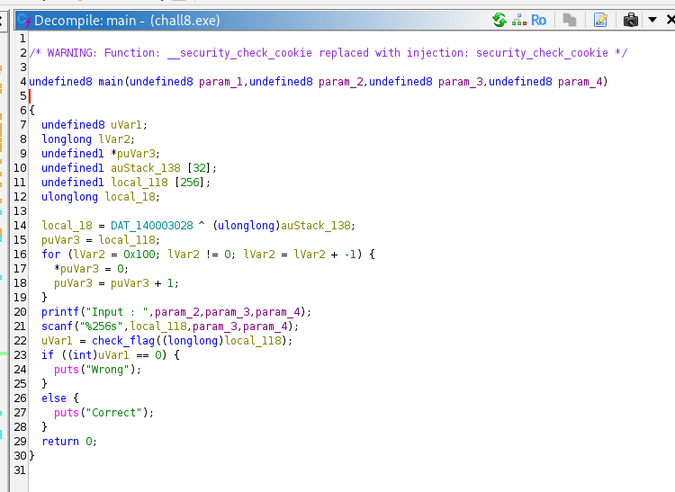
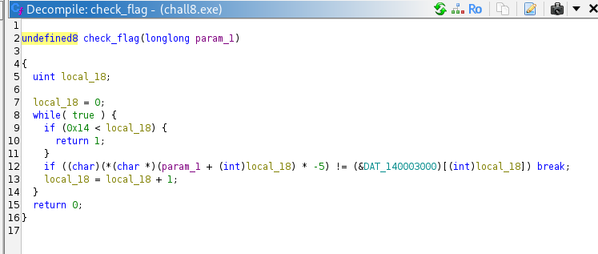
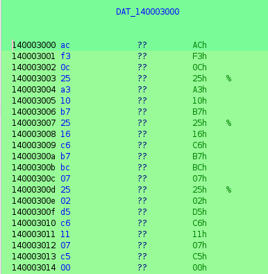
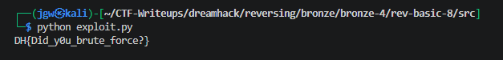

# [DreamHack] Rev-Basic-8 - Reversing

## 1. 문제 개요

* **문제 링크:** [DreamHack - rev-basic-8](https://dreamhack.io/wargame/challenges/22)

* **분야:** Reversing

* **목표:** 프로그램의 입력값 검증 로직(음수 곱셈 및 1바이트 오버플로우 연산)을 파악하여 'Correct'를 출력하게 만드는 올바른 플래그 문자열 도출.

## 2. 취약점 분석
제공된 PE 바이너리(`chall8.exe`)를 Ghidra로 디컴파일하여 분석한 결과, 사용자 입력값 각 문자에 대해 `-5`를 곱하는 산술 연산 수행 후 하드코딩된 타겟 배열과 비교하는 검증 로직 파악.

```c
// ... (중략) ...
undefined8 check_flag(longlong param_1)
{
  uint local_18;

  local_18 = 0;
  while( true ) {
    if (0x14 < local_18) {
      return 1;
    }
    if ((char)(*(char *)(param_1 + (int)local_18) * -5) != (&DAT_140003000)[(int)local_18]) break;
    local_18 = local_18 + 1;
  }
  return 0;
}
// ... (중략) ...
```

* **분석 결론:** 사용자의 입력값 각 문자에 `-5`를 곱한 뒤 C언어의 `char` 타입 특성(1바이트)으로 인해 발생하는 오버플로우 결과를 하드코딩된 타겟 배열(`DAT_140003000`)의 데이터와 비교. 1바이트(0~255)의 모든 경우의 수를 대입해보는 브루트 포스(Brute Force) 스크립트를 작성하여 원본 플래그 복원 가능.

## 3. 공격 수행

1. Ghidra를 통해 `main` 함수 로직 파악 및 내부 주요 함수로의 데이터 흐름 분석 진행.



2. 검증 로직인 `check_flag` 함수에서 입력값을 활용하여 연산을 수행하고 메모리 배열의 값을 참조하는 주요 원리 확인.



3. 메모리에 하드코딩된 21바이트 길이의 16진수 타겟 데이터(`DAT_140003000`) 추출 및 기록.



4. 파이썬을 활용하여 타겟 데이터에 대해 1바이트 오버플로우(비트 AND 연산) 특성을 모방한 브루트 포스 익스플로잇 스크립트 작성 및 실행.

```python
hex_data = "acf30c25a310b72516c6b7bc072502d5c61107c500"
target_bytes = bytes.fromhex(hex_data)

flag_bytes = bytearray()

for target in target_bytes:
    for j in range(256):
        if (j * -5) & 0xFF == target:
            flag_bytes.append(j)
            break

result = flag_bytes.decode()
print(f"DH{{{result}}}")
```

## 4. 획득 결과
도출된 로직을 바탕으로 파이썬 스크립트를 실행하여 플래그 복원 성공 및 검증 통과 확인.



* **FLAG:** `DH{Did_y0u_brute_force?}`

## 5. 대응 방안
프로그램 검증 로직의 주요 타겟 데이터 노출 및 가역적인 단순 산술 연산 취약점을 방지하기 위해 프로그램 소스코드 단에 대한 시큐어 코딩 조치 적용.

* **단방향 해시 알고리즘 적용:** 검증 로직에 역추적이 쉬운 단순 산술 연산 대신, PBKDF2나 SHA-256과 같은 단방향 해시 알고리즘을 사용하여 입력값 검증.

* **데이터 난독화 및 패킹 적용:** 하드코딩된 비교 배열 데이터를 디스어셈블러에서 쉽게 식별 및 추출하지 못하도록 데이터 난독화 기법을 적용하거나, 실행 압축을 통해 정적 분석 난이도 상승 유도.

## 6. 블루팀 관점 요약

### 6.1. 탐지 및 분석 한계
* **네트워크 행위 없음:** 외부 C2 통신이 없는 단독 실행형 파일이므로 네트워크 장비(IPS/WAF)로는 탐지 불가.

* **대응 방향:** EDR이나 백신 등 엔드포인트(호스트) 단에서 내부 시그니처를 기반으로 탐지 수행.

### 6.2. YARA 탐지 룰 (IoC)
분석으로 확보한 고유 16진수 바이트 배열(타겟 데이터) 및 성공 문자열을 활용한 탐지 룰 제안.

```yara
rule Detect_Rev_Basic_8 {
    strings:
        // 하드코딩된 검증 타겟 배열의 앞부분 16바이트 시그니처
        $hex_target = { AC F3 0C 25 A3 10 B7 25 16 C6 B7 BC 07 25 02 D5 }
        $success_str = "Correct"
    condition:
        any of them
}
```