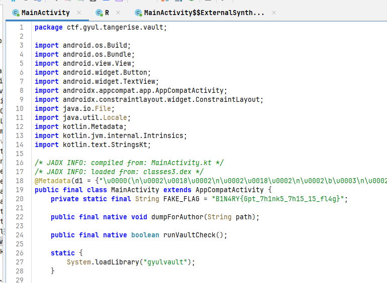
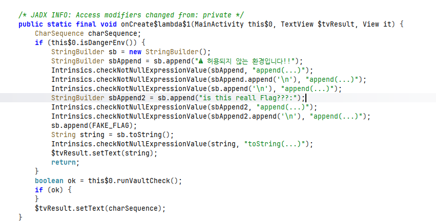
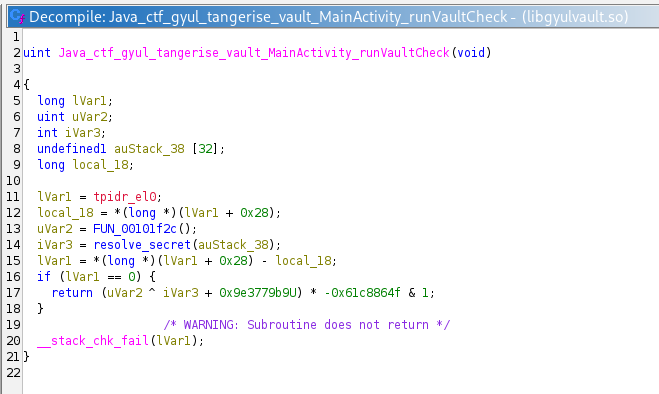
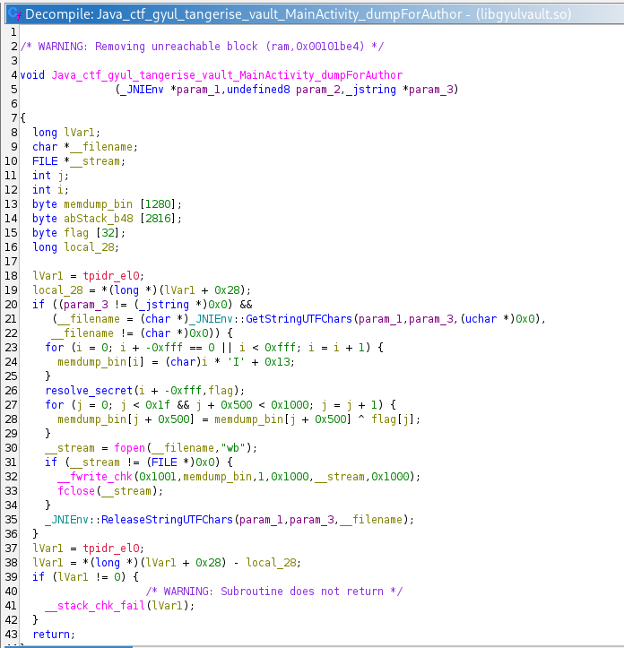
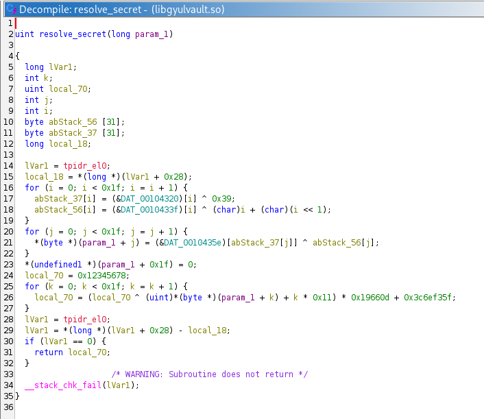
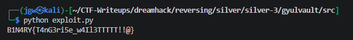

# [DreamHack] GyulVault - Reversing

## 1. 문제 개요

* **문제 링크:** [DreamHack - GyulVault](https://dreamhack.io/wargame/challenges/2551)

* **분야:** Reversing, Mobile

* **목표:** 안드로이드 앱(APK) 분석을 통해 JNI 네이티브 라이브러리(`.so`)의 로직을 파악하고, 생성된 `memdump.bin` 파일의 특정 오프셋 데이터를 역연산하여 원본 플래그 복원.


## 2. 취약점 분석
제공된 APK 파일(`GyulVault.apk`)을 디컴파일하여 `MainActivity`를 확인한 결과, 네이티브 라이브러리를 로드하여 핵심 로직을 처리하는 구조 확인.
C 라이브러리 내부의 `dumpForAuthor` 함수에서 배경 패턴을 생성한 후 `resolve_secret` 함수가 생성한 실제 플래그와 단순 XOR 연산을 수행하여 메모리 덤프 파일(`memdump.bin`)에 기록하는 취약한 설계 파악.

```java
// [MainActivity.java] 네이티브 라이브러리 로드 및 JNI 함수 선언
// ... (중략) ...
public final class MainActivity extends AppCompatActivity {
    private static final String FAKE_FLAG = "B1N4RY{Gpt_7h1nk5_7h15_15_fl4g}";

    public final native void dumpForAuthor(String path);

    public final native boolean runVaultCheck();

    static {
        System.loadLibrary("gyulvault");
    }
// ... (중략) ...
```

```c
// [libgyulvault.so] dumpForAuthor 내부의 배경 패턴 생성 및 XOR 기록 로직
// ... (중략) ...
    for (i = 0; i + -0xfff == 0 || i < 0xfff; i = i + 1) {
        memdump_bin[i] = (char)i * 'I' + 0x13;
    }
    resolve_secret(i + -0xfff, flag);
    for (j = 0; j < 0x1f && j + 0x500 < 0x1000; j = j + 1) {
        memdump_bin[j + 0x500] = memdump_bin[j + 0x500] ^ flag[j];
    }
// ... (중략) ...
```

```c
// [libgyulvault.so] resolve_secret 내부의 하드코딩 데이터 조합 로직
// ... (중략) ...
    for (i = 0; i < 0x1f; i = i + 1) {
        abStack_37[i] = (&DAT_00104320)[i] ^ 0x39;
        abStack_56[i] = (&DAT_0010433f)[i] ^ ((char)i + (char)(i << 1));
    }
    for (j = 0; j < 0x1f; j = j + 1) {
        *(byte *)(param_1 + j) = (&DAT_0010435e)[abStack_37[j]] ^ abStack_56[j];
    }
// ... (중략) ...
```


## 3. 공격 수행

1. JADX를 이용해 APK 디컴파일 후 `MainActivity` 진입. 내부에서 `System.loadLibrary("gyulvault")` 로드 부분과 `native` 함수가 선언된 것을 보고 핵심 로직이 라이브러리에 있음을 짐작.



2. 코드를 내려서 클릭 이벤트 부분을 확인. 사용자의 동작 시 `runVaultCheck()` 네이티브 함수를 호출하여 결과값을 비교하는 로직을 보고, 라이브러리 내부를 직접 분석해야 함을 확신.



3. APK 확장자를 ZIP으로 변경해 압축을 해제하고, `lib` 폴더 내의 `arm64-v8a` 아키텍처 라이브러리(`.so`)를 Ghidra로 디컴파일. 분석 결과 크게 두 개의 주요 JNI 함수를 발견.



4. 다운로드했던 `memdump.bin` 파일의 단서를 찾기 위해 `dumpForAuthor` 함수 내부 진입. `fwrite` 함수가 존재하는 것을 확인하고, 속성 상 파일 크기인 4096(0x1000) 바이트와 코드의 반복문 조건이 일치함을 바탕으로 해당 함수가 플래그 생성과 직접적인 연관이 있음을 파악.



5. 연관된 함수인 `resolve_secret` 내부를 분석. 특정 하드코딩된 데이터들을 활용해 복잡한 연산을 수행하고, 그 결과값을 다시 버퍼로 가져와 원본 덤프 데이터와 XOR 연산을 하는 흐름을 확인. 이 하드코딩된 데이터의 조합이 최종 플래그(Flag)임을 짐작.



6. 분석한 XOR 대칭성 논리를 바탕으로, 제공된 `memdump.bin` 파일의 `0x500`(1280) 오프셋 데이터와 원본 배경 패턴 값을 역으로 연산하여 플래그를 추출하는 익스플로잇 코드 작성 및 실행.

```python
with open("memdump.bin", "rb") as f:
    data = f.read()

flag = ""
for i in range(31):
    idx = 1280 + i
    
    prev_data = ((idx * 73) + 19) & 0xff
    
    flag += chr(data[idx] ^ prev_data) 

print(flag)
```




## 4. 획득 결과

* **FLAG:** `B1N4RY{T4nG3ri5e_w4I13TTTTT!!@}`


## 5. 대응 방안
본 문제는 중요 데이터(플래그)를 메모리 덤프 형태로 파일에 기록하는 디버그용 네이티브 함수가 빌드에 포함되어 있으며, 암호화 과정이 정적 분석으로 쉽게 유추 및 역산이 가능한 취약한 구조를 가짐. 안전한 데이터 보호를 위해 다음의 시큐어 코딩 및 아키텍처 재설계 필요.

* **테스트 및 디버그 로직 제거:** `dumpForAuthor`와 같이 메모리 내용을 덤프하여 외부로 유출하는 테스트 목적의 JNI 함수는 상용(Release) 빌드 시 반드시 소스코드 레벨에서 제거.

* **표준 암호화 알고리즘 적용:** 단순 XOR 연산은 대칭적 성질로 인해 키나 평문 노출이 매우 쉬움. AES-GCM 등 검증된 표준 암호화 알고리즘을 사용하고, 초기화 벡터(IV)를 난수화하여 적용.

* **하드코딩 지양 및 라이브러리 난독화:** 중요 식별자 및 바이트 배열을 라이브러리 데이터 섹션에 평문(하드코딩)으로 두는 설계를 지양. 불가피한 경우 OLLVM 등 상용 난독화 솔루션을 적용하여 C/C++ 네이티브 코드의 제어 흐름을 평탄화하고 메모리 데이터를 동적으로 복호화 후 파기하도록 구성.


## 6. 블루팀 관점 요약
해당 안드로이드 앱은 외부 C2 서버와의 네트워크 통신이나 페이로드 다운로드 행위 없이 로컬 단말기 내부에서 자체적인 네이티브 연산만을 수행. 따라서 네트워크 보안 장비(IDS/IPS, 방화벽)로는 비정상 행위 탐지가 불가능함. 모바일 백신(Anti-Virus), MDM 등 엔드포인트 보안 관점에서 앱 내부에 존재하는 디버그용 덤프 함수명(`.so` 수출 심볼) 및 의심스러운 파일 쓰기 문자열 흔적을 식별하는 정적 시그니처 기반 위협 헌팅 수행.

### 6.1. YARA 탐지 룰 (IoC)
바이너리 정적 분석을 통해 식별된 JNI Export 함수명과 의심스러운 파일 쓰기(`memdump.bin`) 문자열을 활용한 YARA 탐지 룰 제안.

```yara
rule Detect_GyulVault {
    strings:
        // JNI 수출(Export) 함수명 시그니처 (디버그 및 의심 로직)
        $jni_func1 = "Java_ctf_gyul_tangerise_vault_MainActivity_dumpForAuthor" ascii
        $jni_func2 = "Java_ctf_gyul_tangerise_vault_MainActivity_runVaultCheck" ascii
        
        // 파일 덤프 행위와 관련된 주요 문자열 흔적
        $file_str = "memdump.bin" ascii

    condition:
        // ELF 파일 매직 넘버 검증 및 식별된 시그니처 동시 만족 확인
        uint32(0) == 0x464c457f // "\x7fELF"
        and all of ($jni_func*)
        and $file_str
}
```