# [DreamHack] bitchanger - Reversing

## 1. 문제 개요

* **문제 링크:** [DreamHack - bitchanger](https://dreamhack.io/wargame/challenges/2601)

* **분야:** Reversing

* **목표:** 32비트 PE 파일에 은닉된 Heaven's Gate 및 안티 디버깅 기법을 식별 및 우회하고, 64비트 연산으로 동작하는 검증 알고리즘을 역산하여 원본 플래그 획득.

## 2. 취약점 분석
제공된 윈도우 PE 파일(`chall.exe`)을 정적 분석한 결과, 디스어셈블러를 교란하기 위한 아키텍처 스위칭 기법과 안전하지 않은 형태의 선형 대수 방정식 인증 로직 식별.

```assembly
; [취약점 1] 정적 분석 도구(Ghidra)의 디스어셈블을 방해하는 Heaven's Gate 트릭
; ... (중략) ...
004010c0  53           PUSH   EBX
004010c1  56           PUSH   ESI
004010c2  57           PUSH   EDI
004010c3  ea ca 10     JMPF   0x33:LAB_004010ca ; 세그먼트 레지스터를 0x33으로 변경하여 64비트 모드로 강제 전환
; ... (중략) ...
```

```assembly
; [취약점 2] 하드코딩된 SYSCALL을 통한 취약한 안티 디버깅 로직
; ... (중략) ...
00401148  48 c7 c1 fe ff ff ff   MOV    RCX, -0x2 ; 현재 스레드 핸들(-2) 지정
0040114f  48 c7 c2 11 00 00 00   MOV    RDX, 0x11 ; ThreadHideFromDebugger 옵션(0x11) 부여
0040115c  49 89 ca               MOV    R10, RCX
0040115f  48 c7 c0 0d 00 00 00   MOV    RAX, 0xd  ; Windows NtSetInformationThread 커널 함수 콜 번호(0xD)
00401166  0f 05                  SYSCALL          ; 시스템 콜 직접 호출로 디버거 은닉
; ... (중략) ...
```

```assembly
; [취약점 3] 역산이 가능한 형태의 단순 연립방정식 검증 알고리즘
; ... (중략) ...
004011b0  4c 89 e0                 MOV    RAX, R12
004011b3  48 01 d8                 ADD    RAX, RBX
004011b6  48 01 c8                 ADD    RAX, RCX
004011b9  48 01 d0                 ADD    RAX, RDX
004011bc  4c 39 c0                 CMP    RAX, R8  ; 첫 번째 방정식 검증
; ... (중략) ...
```

* **분석 결론:** 32비트 프로세스 내부에서 `JMPF` 명령어와 세그먼트 셀렉터 `0x33`을 조합하여 CPU를 64비트 모드로 강제 전환(Heaven's Gate)함으로써 분석 도구에 혼란을 줌. 또한 윈도우 커널 API를 직접 호출(SYSCALL)하여 디버거 연결을 차단함. 그러나 이러한 방어 기법들을 정적으로 우회하고 나면, 최종 검증 로직이 단방향 해시 암호화 없이 평문의 단순 덧셈과 상수 비교로 이루어져 있어 대입법을 통한 역산 스크립트로 손쉽게 원본 입력값(플래그) 복구가 가능한 논리적 취약점이 존재함.

## 3. 공격 수행

1. 최초 32비트 환경으로 분석 시 `main` 함수 내부 코드 내용이 빈약하고 정상적으로 디컴파일되지 않음을 확인.

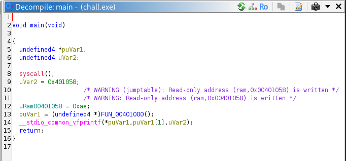

2. 어셈블리를 확인한 결과, `JMPF 0x33:LAB_004010ca` 명령어를 통해 지정된 함수 주소로 점프하며 64비트 환경으로 전환하는 Heaven's Gate 트릭 식별.

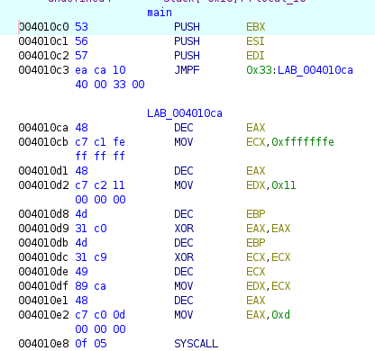

3. 기드라를 64비트(`x86:LE:64:default`) 설정으로 다시 연 뒤, 전환되는 대상 주소(`004010ca`)로 이동.

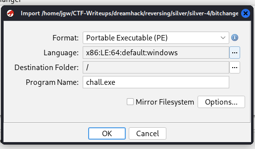

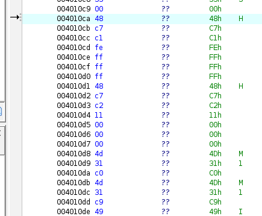

4. 해당 주소에서 단축키 `D`를 눌러 디스어셈블 및 C 코드 디컴파일 진행. 디컴파일된 코드의 `scanf` 함수 호출 부근에서 `PUSH` 인자로 전달되는 포맷 스트링 `%32s`를 확인하여 검증 대상 입력값이 32글자임을 파악.

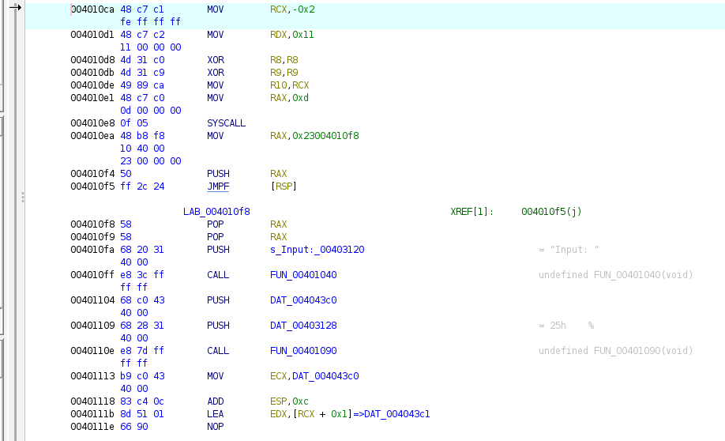

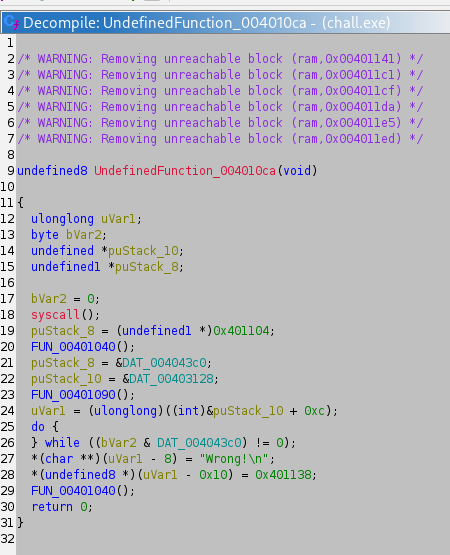


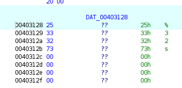

5. 오답 처리되는 `Wrong!` 분기로 빠지지 않기 위해 어셈블리를 추적. `CMP` 명령어로 길이를 비교하고, 일치할 경우 `LAB_00401141` 주소로 점프(`JZ`)하는 흐름을 확인하여 해당 주소로 이동.

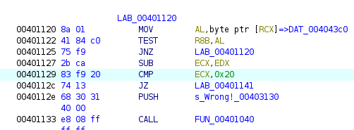

6. `LAB_00401141` 주소에서 64비트 어셈블리 재확인. 진입 직후 `SYSCALL`을 호출하여 안티 디버깅을 수행하는 로직을 식별하고 정적 분석을 통해 우회.

7. 안티 디버깅 구간 하단에서 사용자의 입력값을 8바이트(8글자)씩 4번 나누어 64비트 레지스터에 각각 할당하는 분할 로직 확인.

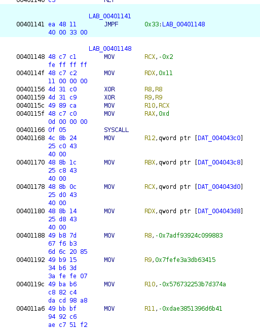

8. 64비트 레지스터들을 차례대로 더하며 하드코딩된 상수(`R8, R9, R10, R11`)와 비교(`CMP`)하는 4원 1차 연립방정식 로직 파악. 해당 검증식들이 모두 통과되어야 최종 반환(True) 루틴으로 진입함을 확인.

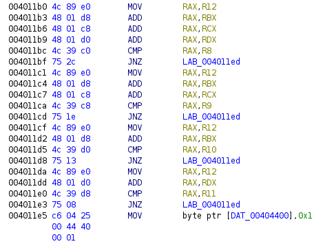

9. 도출된 연립방정식과 레지스터 상수값을 토대로 파이썬 역산 스크립트 작성 및 플래그 연산 수행.

```python
MASK = 0xFFFFFFFFFFFFFFFF

R8 = -0x7adf93924c099883  
R9 = 0x7fefe3a3db63415
R10 = -0x576732253b7d374a
R11 = -0x0dae3851396d6b41

# R12 = data1, RBX = data2, RCX = data3, RDX = data4
# data1 + data2 + data3 + data4 = R8
# data1 + data2 + data3 = R9
# data1 + data2 = R10
# data1 + data4 = R11

data4 = (R8 - R9) & MASK
data3 = (R9 - R10) & MASK
data1 = (R11 - data4) & MASK
data2 = (R10 - data1) & MASK

flag = b""
flag += data1.to_bytes(8, 'little')
flag += data2.to_bytes(8, 'little')
flag += data3.to_bytes(8, 'little')
flag += data4.to_bytes(8, 'little')

print(flag.decode())
```

## 4. 획득 결과
작성한 파이썬 스크립트를 실행한 결과, 4조각으로 나뉘었던 플래그가 정상적으로 복호화되어 병합 출력됨.

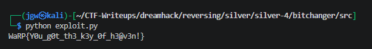

* **FLAG:** `WaRP{y0u_g0t_Th3_k3y_0f_h3@v3n!}`

## 5. 대응 방안
본 프로그램은 단방향/양방향 암호화 알고리즘 없이 평문의 단순 덧셈을 통한 검증 로직을 사용하고 있어 정적 분석을 통한 역산 공격에 무방비함. 시큐어 코딩 및 보안 아키텍처 관점에서 다음의 보호 기법 적용 필요.

* **견고한 암호화 알고리즘 도입:** 사용자 입력값을 단순 선형 대수로 연산하여 하드코딩된 상수와 비교하는 구조 지양. SHA-256과 같은 단방향 해시 함수를 사용하여 입력값의 해시 결괏값만 비교하거나, 검증 알고리즘에 일방향성을 띠는 수학적 복잡도를 추가하여 정적 분석을 통한 대입법 역산을 원천 차단해야 함.

* **표준 빌드 및 난독화 적용:** Heaven's Gate와 같은 OS 종속적인 꼼수(Trick) 기법은 분석가를 일시적으로 지연시킬 수는 있으나, 대부분의 백신 솔루션 휴리스틱 엔진에서 악성 행위로 분류되므로 정상적인 서비스 환경에 부적합함. 정규 x64 타겟으로 빌드하되 코드 가상화 기반의 상용 난독화(VMProtect 등)를 적용하여 정적/동적 디버깅 난이도를 상승시켜야 함.

## 6. 블루팀 관점 요약
해당 프로그램은 외부 C2 통신 등을 수반하지 않는 단독 실행형 바이너리이므로 방화벽이나 NIDS 중심의 네트워크 보안 장비로는 탐지가 불가능함. 침해사고 대응(IR) 시 엔드포인트 기반으로 프로세스 비정상 행위를 탐지하는 위협 헌팅 수행.

### 6.1. 위협 헌팅 시나리오
* **비정상적 컨텍스트 스위칭 탐지:** EDR 원격 측정 데이터를 기반으로 32비트 프로세스(WoW64) 내부에서 `CS` 세그먼트 레지스터를 `0x33`으로 변경하여 네이티브 64비트 코드를 은밀하게 호출하려는 비정상 행위(Heaven's Gate)를 모니터링하여 공격자 페이로드 식별.

* **디버깅 방해 시스템 콜 탐지:** 사용자 모드 애플리케이션이 `NtSetInformationThread` API를 직접 호출하여 파라미터로 `ThreadHideFromDebugger(0x11)`를 전달하는 행위를 의심스러운 안티 디버깅 기법으로 식별 및 격리 조치.

### 6.2. YARA 탐지 룰 (IoC)
기드라 디컴파일 과정에서 식별된 명시적인 평문 문자열 단서를 기반으로, 유사한 구조를 가진 악성 의심 파일을 스캔하기 위한 YARA 룰 제안.

```yara
rule Detect_Bitchanger {
    strings:
        // 프로그램 내부에서 사용자 입출력 및 분기 처리를 위해 사용된 핵심 평문 문자열
        $s1 = "Input: " ascii
        $s2 = "Wrong!\n" ascii
        $s3 = "%32s" ascii

    condition:
        // 윈도우 PE 파일 형태를 띄며, 식별된 핵심 문자열이 모두 존재하는 파일 탐지
        uint16(0) == 0x5A4D and all of ($s*)
}
```

## 7. 부록: IDA 환경 교차 분석 (Ghidra와의 비교)

동일 바이너리를 IDA에서도 분석해본 결과, 디스어셈블러별 Heaven's Gate 처리 방식에 뚜렷한 차이를 확인함.

### 7.1. 최초 진입점 오역
Ghidra는 jmpf 명령어의 실제 목적지(0x4010CA)를 정직하게 표시한 반면, IDA의 자동 분석 엔진은
`jmp far ptr loc_4013FA`라는 잘못된 라벨을 생성하고 JUMPOUT 에러를 발생시킴.

### 7.2. 옵코드 직접 역산
IDA가 제시한 라벨을 따라가면 무한 루프에 빠지는 구조. Options → General → Opcode bytes를 활성화해
`EA [CA 10 40 00] [33 00]` 원본 바이트를 확인하고, 리틀 엔디언 역산을 통해 실제 목적지(0x4010CA)를 수동 도출.

### 7.3. 아키텍처 전환의 반복 처리
Ghidra는 64비트 설정 이후 내부 모드 전환을 유연하게 처리한 반면, IDA는 진입/복귀 지점마다
Alt+S로 64bit ↔ 32bit를 수동 전환해야 코드가 정상적으로 디스어셈블됨.

### 7.4. 디컴파일러 한계
IDA F5 디컴파일러는 단일 함수 내 아키텍처 전환 구간에서 Inconsistent database 오류로 동작 실패,
전 구간을 어셈블리 레벨 정적 분석으로 직접 추적해야 했음.

* **분석 결론:** 동일한 안티 분석 기법(Heaven's Gate)도 디스어셈블러의 자동화 수준에 따라 분석 난이도가
크게 달라짐을 확인. 자동화 도구가 실패하는 지점에서 옵코드 레벨 수동 분석 역량이 요구됨을 체감.