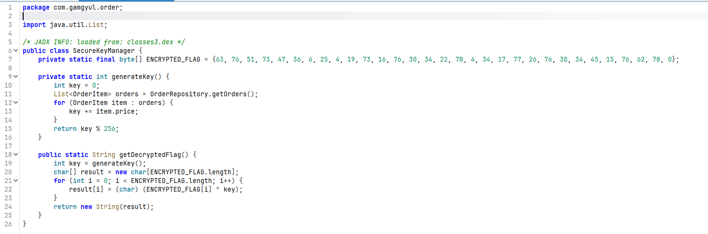
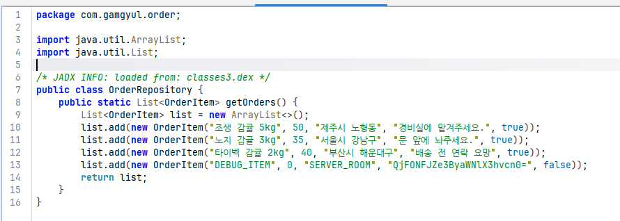
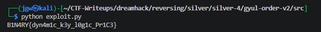

# [DreamHack] Gyul Order v2 - Reversing

## 1. 문제 개요

* **문제 링크:** [DreamHack - Gyul Order v2](https://dreamhack.io/wargame/challenges/2559)

* **분야:** Reversing, Mobile

* **목표:** 안드로이드 앱 파일(APK)을 디컴파일하여 자바 소스 코드를 정적 분석. 내부 클래스에 하드코딩된 암호화 플래그 배열과 동적으로 계산되는 복호화 키 생성 알고리즘을 파악하여 원본 플래그 복원.

## 2. 취약점 분석
제공된 APK 파일(`gyul_order_v2.apk`)을 `jadx-gui` 디컴파일러로 분석한 결과, `SecureKeyManager` 클래스에 하드코딩된 암호화 배열(`ENCRYPTED_FLAG`)과 단순 XOR 기반 복호화 로직 존재 확인. 복호화 키(`key`)는 `OrderRepository`에 등록된 주문 내역 객체들의 특정 변수(`price`) 값을 합산하여 동적으로 생성하는 취약한 구조 파악.

```java
// [OrderRepository] 주문 내역 객체 생성 및 가격(price) 데이터 할당
// ... (중략) ...
public static List<OrderItem> getOrders() {
    List<OrderItem> list = new ArrayList<>();
    list.add(new OrderItem("조생 감귤 5kg", 50, "제주시 노형동", "경비실에 맡겨주세요.", true));
    list.add(new OrderItem("노지 감귤 3kg", 35, "서울시 강남구", "문 앞에 놔주세요.", true));
    list.add(new OrderItem("타이벡 감귤 2kg", 40, "부산시 해운대구", "배송 전 연락 요망", true));
    list.add(new OrderItem("DEBUG_ITEM", 0, "SERVER_ROOM", "...", false));
    return list;
}
// ... (중략) ...
```

```java
// [SecureKeyManager] 하드코딩된 암호화 플래그 배열 및 복호화 키 생성 로직
// ... (중략) ...
private static final byte[] ENCRYPTED_FLAG = {63, 76, 51, 73, 47, 36, 6, 25, ... (중략) ... 76, 62, 78, 0};

private static int generateKey() {
    int key = 0;
    List<OrderItem> orders = OrderRepository.getOrders();
    for (OrderItem item : orders) {
        key += item.price;
    }
    return key % 256;
}
// ... (중략) ...
```

```java
// [SecureKeyManager] 동적 생성된 키를 이용한 단순 XOR 플래그 복호화
// ... (중략) ...
public static String getDecryptedFlag() {
    int key = generateKey();
    char[] result = new char[ENCRYPTED_FLAG.length];
    for (int i = 0; i < ENCRYPTED_FLAG.length; i++) {
        result[i] = (char) (ENCRYPTED_FLAG[i] ^ key);
    }
    return new String(result);
}
// ... (중략) ...
```

* **분석 결론:** 복호화에 사용되는 시드(Key)가 내부 하드코딩된 객체들의 `price` 필드 단순 합산 로직(모듈러 256 연산 포함)으로 결정됨. 암호화된 데이터와 키 생성 로직이 모두 클라이언트 코드(앱) 상에 노출되어 있어, 프로그램 실행 없이 정적 분석만으로 오프라인 환경에서 평문 플래그 도출 가능.

## 3. 공격 수행

1. 디컴파일러 패키지 탐색기에서 클래스명이 수상한 `SecureKeyManager`로 먼저 진입하여 분석. 내부에서 `ENCRYPTED_FLAG` 바이트 배열과, `price` 합계를 이용한 키 생성(`generateKey`), XOR 복호화 로직(`getDecryptedFlag`) 확인.



2. 복호화 키 생성에 사용되는 아이템 가격(`price`)을 확인하기 위해 `OrderRepository` 소스 코드로 진입. 하드코딩된 아이템 목록 확인 및 각 아이템의 `price` 값 파악.



3. 파악한 `price` 값들을 모두 더하여 복호화 Key 값 계산. (50 + 35 + 40 + 0 = 125)

4. 추출한 `ENCRYPTED_FLAG` 배열의 각 요소를 산출된 Key 값과 XOR 연산하여 평문으로 변환하는 파이썬 익스플로잇 스크립트 작성.

```python
encrypted_flag = [63, 76, 51, 73, 47, 36, 6, 25, 4, 19, 73, 16, 76, 30, 34, 22, 78, 4, 34, 17, 77, 26, 76, 30, 34, 45, 15, 76, 62, 78, 0]

key = 125
flag = "".join([chr(b ^ key) for b in encrypted_flag])

print(flag)
```

5. 작성한 익스플로잇 스크립트를 실행하여 최종 원본 플래그 획득.



## 4. 획득 결과

* **FLAG:** `B1N4RY{dyn4m1c_k3y_l0g1c_Pr1C3}`

## 5. 대응 방안
본 문제는 중요 데이터(플래그 및 암호화 키 생성 로직)가 안드로이드 앱 패키지(APK) 내부에 평문 및 자바 코드로 그대로 노출되어 있어, 디컴파일을 통한 정적 분석에 매우 취약함. 앱 내 중요 정보 유출 및 로직 분석을 방지하기 위한 시큐어 코딩 및 아키텍처 재설계 필요.

* **중요 데이터 하드코딩 지양:** `ENCRYPTED_FLAG`와 같은 보안상 민감한 데이터나 검증 로직에 쓰이는 핵심 상수(`price` 등)를 클라이언트 코드 내부에 명시하지 않아야 함. 암호화된 상태라도 복호화 키 로직이 동봉되어 있으면 무용지물이므로, 안전한 서버(Backend) API 통신을 통해 인증 후 데이터를 내려받는 구조로 설계.

* **핵심 로직 난독화 및 NDK 활용:** 자바(Java) 및 코틀린(Kotlin) 코드는 디컴파일 시 원본과 거의 유사한 형태로 복원되는 특성이 있음. 복호화나 라이선스 검증 같은 핵심 보안 알고리즘은 ProGuard/R8 등을 통해 식별자(클래스, 메서드 명)를 강하게 난독화하거나, 정적 분석이 까다로운 C/C++ 기반의 JNI/NDK(Native Library `.so` 파일) 환경으로 이관하여 리버싱 난이도 상향.

## 6. 블루팀 관점 요약
해당 안드로이드 앱은 외부 네트워크(C2 서버 등)와의 추가적인 통신이나 페이로드 다운로드 행위 없이, 로컬 단말기 내부에서 자체적인 복호화 연산만을 수행. 따라서 방화벽, IDS/IPS 등의 네트워크 기반 보안 장비로는 비정상 행위 탐지 불가. 모바일 백신(Anti-Virus), MDM, MTD 등 엔드포인트 단에서 앱 고유의 패키지명, 클래스명, 디버그용 하드코딩 문자열 및 특정 암호화 바이트 패턴을 식별하는 정적 시그니처 기반 위협 헌팅 수행.

### 6.1. YARA 탐지 룰 (IoC)
정적 분석을 통해 식별된 바이너리(classes.dex) 내부의 고유 패키지 정보, 하드코딩된 디버그 문자열 데이터 및 특징적인 암호화 바이트 배열 시그니처를 조합하여 유사 취약/의심 앱으로 분류하기 위한 YARA 룰 제안.

```yara
rule Detect_Gyul_Order_V2 {
    strings:
        // 앱 고유 패키지 경로 및 관련 주요 클래스명
        $pkg1 = "com.gamgyul.order" ascii
        $cls1 = "SecureKeyManager" ascii
        $cls2 = "OrderRepository" ascii
        
        // 코드 내부에 숨겨진 특이 하드코딩 문자열 (디버그 아이템 흔적)
        $str1 = "DEBUG_ITEM" ascii wide
        $str2 = "SERVER_ROOM" ascii wide
        
        // ENCRYPTED_FLAG 바이트 배열의 고유 시작 패턴 (63, 76, 51, 73, 47, 36...)
        $hex_flag = { 3F 4C 33 49 2F 24 06 19 04 13 }
        
    condition:
        // DEX 파일 매직 넘버 검증 및 식별된 시그니처 조건 동시 만족 확인
        uint32(0) == 0x0A786564 // "dex\n"
        and 2 of ($pkg1, $cls1, $cls2)
        and any of ($str*)
        and $hex_flag
}
```