# [DreamHack] Gyul Cam v1.14 - Reversing

## 1. 문제 개요

* **문제 링크:** [DreamHack - Gyul Cam v1.14](https://dreamhack.io/wargame/challenges/2524)

* **분야:** Reversing, Forensics, Embedded

* **목표:** binwalk로 추출한 IoT 카메라(SmartCam v1.14) 펌웨어의 파일시스템에서 CGI 바이너리를 정적/동적으로 분석하여 admin 계정 비밀번호 검증 로직을 파악하고, 원본 평문(플래그)을 복원.

## 2. 취약점 분석

`www/cgi-bin/login.cgi`를 디컴파일한 결과, POST body의 `password=` 파라미터를 파싱한 뒤 전역 함수 포인터 `g_vfs_driver_ops`가 가리키는 함수에 사용자 입력 문자열과 길이를 그대로 전달해 검증하는 구조를 확인.

```c
// ... (중략, CONTENT_LENGTH 환경변수 읽기 및 "password=" 파라미터 파싱) ...
pcVar1 = g_vfs_driver_ops;
sVar2 = strlen(pcStack_1c);
iVar3 = (*pcVar1)(pcStack_1c,sVar2);
if (iVar3 == 0) {
    printf("<h1>Access Denied</h1>");
}
else {
    printf("<h1>Login Success</h1><p>Flag: %s</p>",pcStack_1c);
}
```

`nm`으로 `g_vfs_driver_ops` 심볼의 실제 주소를 `lib/libauth.so`에서 재확인한 뒤 해당 함수(`FUN_00010390`)를 디스어셈블한 결과, 입력 길이가 정확히 81바이트(0x51)일 때만 통과되는 커스텀 바이트 변환 알고리즘과 81바이트 정답 배열(`DAT_00030040`)을 비교하는 루프 확인. 단, Ghidra 디컴파일러가 `open()`/`lseek()` 시스템콜(`swi`)이 레지스터를 덮어쓰는 부작용을 모델링하지 못해, 알고리즘에 쓰이는 두 상수(`0x91`, `0xe6`)를 실제와 다르게 잘못 표시하는 결함 확인.

```
39c: mov r7, #5          ; syscall 5 = open()
3a0: ldr r0, [pc, #344]  ; r0 = "/etc/shadow" 문자열 주소
...
3ac: swi 0x0             ; open("/etc/shadow", O_RDONLY, 0)
...
3cc: swi 0x0             ; lseek(fd, 0, SEEK_END) -> 파일 크기
3d0: mov r3, r0
3d4: and r3, r3, #0xff   ; r3 = 파일크기 & 0xff  <- 진짜 XOR 키
```

* **분석 결론:** 정답 배열과 비교되는 값은 `(사용자 입력 XOR r3) + i²` 등 4단계 연산과 상태 변수(`uVar3`, 초기값 0xCC)의 누적 갱신으로 산출되며, 여기서 사용되는 XOR 키(r3)는 하드코딩된 상수가 아니라 **펌웨어 루트파일시스템에 실제 존재하는 `/etc/shadow` 파일의 크기(바이트 수) & 0xff**로 런타임에 결정되는 구조.

## 3. 공격 수행

### 3.1 정적 분석 및 심볼 추적

1. `binwalk -e "Gyul Cam v1.14.bin"`로 펌웨어를 추출, squashfs 루트파일시스템 확보.

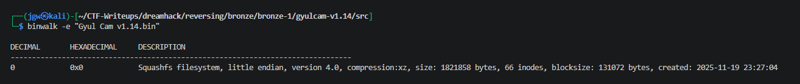

2. 추출된 루트파일시스템의 `www/` 디렉토리 구조 확인.

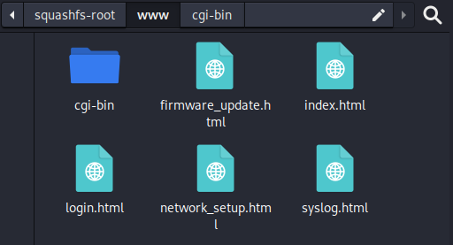

3. `www/cgi-bin/` 안의 CGI 바이너리 목록 확인, 그중 `login.cgi`를 Ghidra로 디컴파일하여 `g_vfs_driver_ops` 함수 포인터 발견.

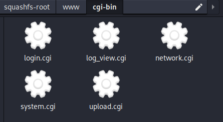

4. `login.cgi` 디컴파일 결과 확인. `password=` 파라미터를 파싱한 뒤 `g_vfs_driver_ops`가 가리키는 함수에 그대로 전달하는 구조 확인.

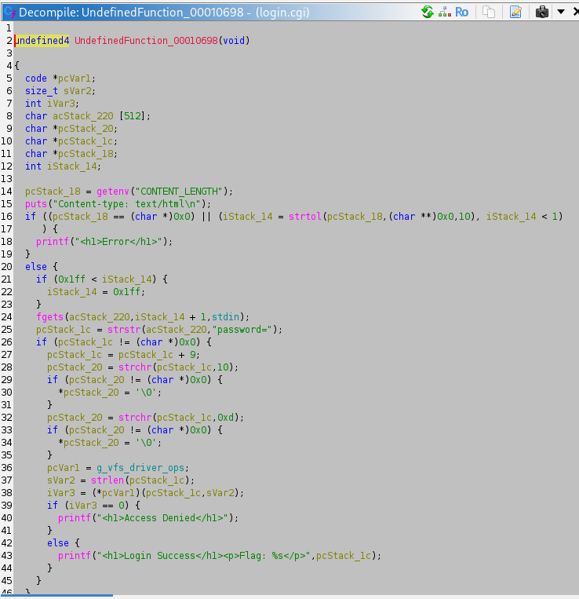

5. `nm -A -D lib/*.so 2>/dev/null | grep g_vfs_driver_ops`로 해당 심볼이 정의된 실제 라이브러리(`libauth.so`)와 주소(`0x200a0`) 특정.

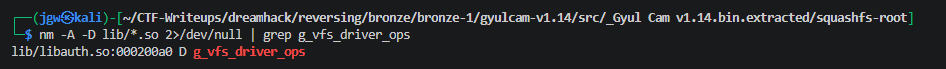

6. `libauth.so`를 Ghidra로 열어 Symbol Tree에서 "ops" 필터로 `g_vfs_driver_ops` 심볼이 이 파일에 실제 존재함을 재확인.

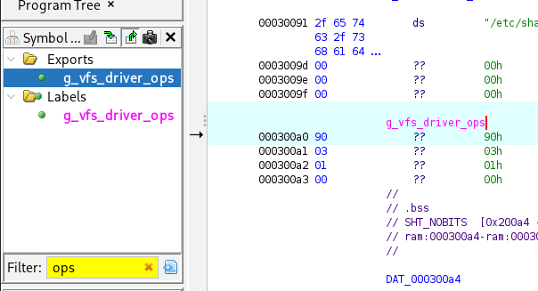

7. 심볼이 가리키는 리틀엔디언 주소(`0x390`)로 이동하면 `??`(undefined)로 표시되어 있던 영역을, `D`(Disassemble)로 명령어 복원 후 `F`(Create Function)로 함수 경계를 부여. 그 결과 `FUN_00010390`의 전체 디컴파일 코드 확보.

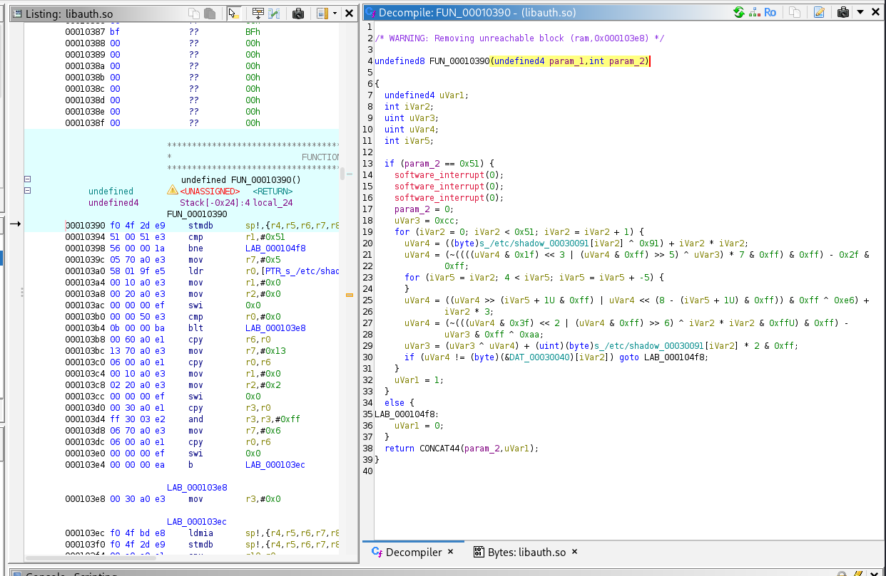

8. 위 결과에서 참조되는 정답 배열 `DAT_00030040`으로 이동하면 아직 `undefined4 ??`로 미해석된 81바이트 데이터임을 확인.

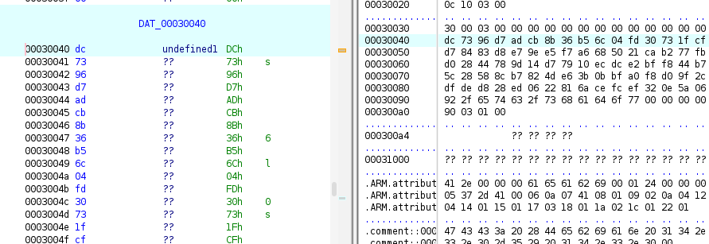

### 3.2 1차 시도: Z3 제약조건 기반 풀이 (실패)

9. Ghidra 디컴파일 C 코드를 기준으로 4단계 바이트 변환(순환이동·XOR·곱셈) 및 상태 변수 갱신 로직을, Z3 SMT Solver 제약조건으로 재구현. 각 문자를 `BitVec(8)` 미지수로 선언하고 `s.add(uVar4 == target_bytes[i])`로 81개 제약조건을 등록한 뒤 `s.check()`로 동시에 만족하는 값을 탐색.

```python
from z3 import *

target_bytes = [
    0xDC, 0x73, 0x96, 0xD7, 0xAD, 0xCB, 0x8B, 0x36, 0xB5, 0x6C, 0x04, 0xFD, 0x30, 0x73, 0x1F, 0xCF,
    0xD7, 0x84, 0x83, 0xD8, 0xE7, 0x9E, 0xE5, 0xF7, 0xA6, 0x68, 0x50, 0x21, 0xCA, 0xB2, 0x77, 0xFB,
    0xD0, 0x28, 0x44, 0x78, 0x9D, 0x14, 0xD7, 0x79, 0x10, 0xEC, 0xDC, 0xE2, 0xBF, 0xF8, 0x44, 0xB7,
    0x5C, 0x28, 0x58, 0x8C, 0xB7, 0x82, 0x4D, 0xE6, 0x3B, 0x0B, 0xBF, 0xA0, 0xF8, 0xD0, 0x9F, 0x2C,
    0xDF, 0xDE, 0xD8, 0x28, 0xED, 0x06, 0x22, 0x81, 0x6A, 0xCE, 0xFC, 0xEF, 0x32, 0x0E, 0x5A, 0x06,
    0x92
]

n = len(target_bytes)
chars = [BitVec(f'ch_{i}', 8) for i in range(n)]

s = Solver()
uVar3 = BitVecVal(0xCC, 8)  # 초기 상태값

for i in range(n):
    ch = chars[i]

    uVar4 = (ch ^ 0x91) + (i * i)

    t1 = RotateLeft(uVar4, 3)
    t2 = (t1 ^ uVar3) * 7
    uVar4 = (~t2) - 0x2F

    shift1 = (i % 5) + 1
    uVar4 = RotateRight(uVar4, shift1)
    uVar4 = (uVar4 ^ 0xE6) + (i * 3)

    t3 = RotateLeft(uVar4, 2)
    t4 = t3 ^ (i * i)
    uVar4 = ((~t4) - uVar3) ^ 0xAA

    uVar3 = (uVar3 ^ uVar4) + (ch * 2)

    s.add(uVar4 == BitVecVal(target_bytes[i], 8))

result = s.check()
if result == sat:
    m = s.model()
    password = "".join(chr(m[chars[i]].as_long()) for i in range(n))
    print(password)
```

10. **[실패]** 실행 결과 index 0("k")만 정상 출력되고 이후 전부 깨진 바이트 출력.

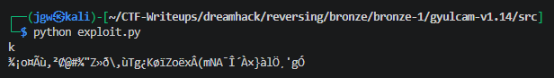

### 3.3 실제 디스어셈블리 대조 (원인 특정)

11. Ghidra 메모리 덤프에서 target_bytes 81바이트를 raw hex로 재추출해 대조했으나 기존 값과 일치 — 데이터 자체는 문제 없음을 확인.

12. Ghidra의 Listing(어셈블리 리스팅) 패널과 Decompile(디컴파일 C) 패널을 나란히 놓고 `FUN_00010390` 전체를 명령어 단위로 대조. `^0x91`, `^0xe6`가 실제로는 고정 상수가 아니라 `open("/etc/shadow")` → `lseek(fd, 0, SEEK_END)` → `close()` 시퀀스의 결과값(`r3`)이라는 것을 확인. Ghidra가 `swi`(SoftWare Interrupt — ARM 구(舊) 표기, 최신 표기로는 `svc`) 명령어의 부작용(레지스터 덮어쓰기)을 추적하지 못해 우연히 `0x91`이라는 잘못된 상수로 상수 전파(constant propagation)한 것으로 판단.

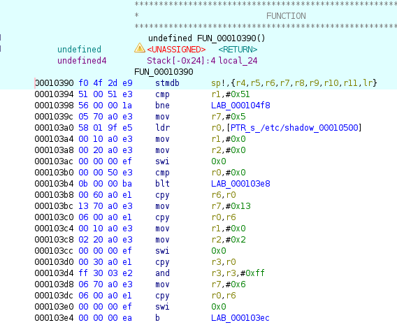

### 3.4 QEMU 동적 검증 중 오판, 그리고 최종 원인 규명 (성공)

13. **[실패]** `qemu-arm` 사용자 모드 에뮬레이션으로 `libauth.so`를 직접 dlopen하여 대상 함수를 호출한 결과, `open()`이 성공하든 실패하든 항상 세그멘테이션 폴트 발생을 확인. 사용자 입력 포인터(`param_1`)가 `open()`/`lseek()`/`close()` 시퀀스 도중 별도로 보존되지 않고 `r0`에서 소실되는 것으로 보여, 이 검증 루프가 사용자 입력을 애초에 읽지 못하는 죽은 코드(decoy)라고 잘못 판단.

```c
#include <stdio.h>
#include <stdlib.h>
#include <string.h>
#include <dlfcn.h>

int main(int argc, char **argv) {
    void *h = dlopen("./libauth.so", RTLD_NOW);
    if (!h) { fprintf(stderr, "dlopen failed: %s\n", dlerror()); return 1; }

    void **ops = (void**)dlsym(h, "g_vfs_driver_ops");
    if (!ops) { fprintf(stderr, "dlsym failed: %s\n", dlerror()); return 1; }
    printf("g_vfs_driver_ops addr = %p, value(fn ptr) = %p\n", (void*)ops, *ops);

    typedef int (*fn_t)(const char*, size_t);
    fn_t fn = (fn_t)(*ops);

    char buf[100];
    memset(buf, 'A', 81);   // 81바이트짜리 아무 문자열
    buf[81] = 0;

    printf("Calling with 81 x 'A'...\n");
    fflush(stdout);
    int r = fn(buf, 81);
    printf("Result: %d\n", r);
    return 0;
}
```

```bash
arm-linux-gnueabihf-gcc -o harness harness.c -ldl
qemu-arm -L /usr/arm-linux-gnueabihf ./harness
```

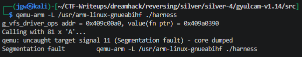

14. **[실패]** 대신 노출된 `/etc/shadow`의 `admin` 계정 해시(`c93ccd78b2076528346216b3b2f701e6`)가 crypt(3) 포맷이 아닌 raw MD5임을 확인하고 흔한 IoT 기본 비밀번호 사전으로 크랙, `admin1234`를 플래그로 제출했으나 오답 확인.

15. 오답 확인 후 재검토 결과, 세그폴트는 분석 환경이 root 권한으로 실행되어 분석 환경 자체의 `/etc/shadow`(펌웨어와 무관한 크기)를 열었기 때문에 발생한 부수 현상일 뿐, **실제 대상 기기에서는 펌웨어 루트파일시스템에 포함된 진짜 `/etc/shadow`(222바이트)가 열리는 것이 정상 동작**이라는 점을 재확인.

```bash
wc -c squashfs-root/etc/shadow
```

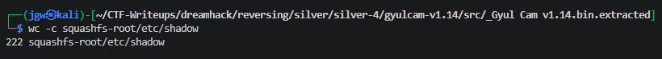

16. `/etc/shadow` 파일 크기(222 = 0xDE)를 XOR 키로 대입해 4단계 변환 알고리즘을 재계산한 결과, 81바이트 전체가 완전한 ASCII 평문으로 복원됨을 확인.

```python
from z3 import *

target_bytes = [
    0xDC, 0x73, 0x96, 0xD7, 0xAD, 0xCB, 0x8B, 0x36, 0xB5, 0x6C, 0x04, 0xFD, 0x30, 0x73, 0x1F, 0xCF,
    0xD7, 0x84, 0x83, 0xD8, 0xE7, 0x9E, 0xE5, 0xF7, 0xA6, 0x68, 0x50, 0x21, 0xCA, 0xB2, 0x77, 0xFB,
    0xD0, 0x28, 0x44, 0x78, 0x9D, 0x14, 0xD7, 0x79, 0x10, 0xEC, 0xDC, 0xE2, 0xBF, 0xF8, 0x44, 0xB7,
    0x5C, 0x28, 0x58, 0x8C, 0xB7, 0x82, 0x4D, 0xE6, 0x3B, 0x0B, 0xBF, 0xA0, 0xF8, 0xD0, 0x9F, 0x2C,
    0xDF, 0xDE, 0xD8, 0x28, 0xED, 0x06, 0x22, 0x81, 0x6A, 0xCE, 0xFC, 0xEF, 0x32, 0x0E, 0x5A, 0x06,
    0x92
]

R3 = 222 & 0xFF  # /etc/shadow 실제 파일 크기(222바이트) & 0xff = 0xDE  <- 진짜 XOR 키

n = len(target_bytes)
chars = [BitVec(f'ch_{i}', 8) for i in range(n)]

s = Solver()
uVar3 = BitVecVal(0xCC, 8)  # 초기 상태값

for i in range(n):
    ch = chars[i]

    uVar4 = (ch ^ R3) + (i * i)                              # 0x91 -> R3

    t1 = RotateLeft(uVar4, 3)
    t2 = (t1 ^ uVar3) * 7
    uVar4 = (~t2) - 0x2F

    shift1 = (i % 5) + 1
    uVar4 = RotateRight(uVar4, shift1)
    uVar4 = (uVar4 ^ ((R3 + 0x55) & 0xFF)) + (i * 3)          # 0xE6 -> (R3+0x55)&0xFF

    t3 = RotateLeft(uVar4, 2)
    t4 = t3 ^ (i * i)
    uVar4 = ((~t4) - uVar3) ^ 0xAA

    uVar3 = (uVar3 ^ uVar4) + (ch * 2)

    s.add(uVar4 == BitVecVal(target_bytes[i], 8))

result = s.check()
if result == sat:
    m = s.model()
    password = "".join(chr(m[chars[i]].as_long()) for i in range(n))
    print(password)
```

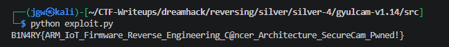

## 4. 획득 결과

* **FLAG:** `B1N4RY{ARM_IoT_Firmware_Reverse_Engineering_C@ncer_Architecture_SecureCam_Pwned!}`

* **분석 결론:** 이 문제의 핵심은 단순 알고리즘 리버싱이 아니라, **암호화 키 재료를 하드코딩하지 않고 펌웨어 루트파일시스템 내 특정 파일의 메타데이터(크기)에서 동적으로 끌어오는 구조**를 간파하는 데 있음. `libauth.so` 단독 분석으로는 절대 풀리지 않으며, 반드시 전체 루트파일시스템을 확보한 상태에서 `/etc/shadow`의 실제 바이트 수까지 대조해야 하는 설계. 또한 Ghidra 등 디컴파일러가 `swi`/`svc`(시스템콜) 직후의 레지스터 상태를 신뢰할 수 없게 표시할 수 있다는 점을 실제 삽질을 통해 재확인.

## 5. 대응 방안

암호학적으로 취약하고 예측 가능한 방식으로 인증 로직이 설계되어 있어, 다음과 같은 시큐어 코딩 관점의 개선이 필요.

* **예측 가능한 파일 메타데이터를 암호화 키로 사용 금지:** 파일 크기·mtime 등은 공격자가 동일 펌웨어를 확보하면 그대로 재현 가능한 정보이므로 키 유도 재료로 부적합. HKDF 등 표준 키 유도 함수와 디바이스 고유 시크릿(장치별 고유 하드웨어 키, 부트로더 퓨즈값 등)을 조합해야 함.

* **하드코딩된 정답 배열과의 직접 비교(오프라인 비교) 지양:** `DAT_00030040`처럼 변환된 결과를 정적 배열과 바로 비교하는 구조는 바이너리 확보 시 오프라인 브루트포스가 가능함. bcrypt/scrypt/Argon2 등 검증된 KDF와 서버 측(또는 보안 요소 내) 비교로 대체 필요.

* **민감 파일의 CGI 프로세스 접근 최소화:** `/etc/shadow`를 웹 서버 CGI 프로세스가 직접 열 수 있는 권한 구조 자체가 위험. 최소 권한 원칙에 따라 CGI 프로세스를 전용 저권한 계정으로 분리하고, `/etc/shadow` 접근이 필요한 로직은 별도의 권한 상승된 데몬을 통해서만 수행하도록 재설계.

## 6. 블루팀 관점 요약

로컬 실행 환경(원격 네트워크 통신 부재)인 리버싱/임베디드 문제 특성상 네트워크 기반 IDS/IPS로는 탐지가 불가능함. 정적 분석으로 확인된 시스템콜 시퀀스와 상태 초기값을 기반으로 한 호스트 단서 위주의 탐지 전략이 필요.

* **위협 헌팅 시나리오:** 웹 서버(httpd/CGI) 프로세스가 `/etc/shadow`를 직접 `open()`하는 행위 자체가 강한 이상 징후. auditd 또는 eBPF 기반 syscall 모니터링으로 `(comm=*cgi*, syscall=open, path=/etc/shadow)` 패턴을 룰로 등록하면 정상적인 웹 요청 처리 과정에서는 발생할 수 없는 행위를 실시간 탐지 가능.

* **분석 자동화(Decrypter) 아이디어:** 루트파일시스템 경로만 입력받으면 `/etc/shadow` 크기를 자동으로 읽어 XOR 키를 계산하고, `DAT_00030040` 81바이트를 대입해 즉시 평문을 출력하는 파이썬 스크립트로 유사 변형 문제 대응 시간을 단축 가능.

### 6.1. YARA 탐지 룰 (IoC)

디스어셈블리에서 실제 확인된 명령어 바이트 시퀀스(`open("/etc/shadow")` 시스템콜 준비 구간)와 상태 변수 초기값(`0xCC`) 상수를 조합한 탐지 룰.

```
rule Detect_GyulCam_ShadowKeyed_Auth {
    strings:
        // open("/etc/shadow", O_RDONLY, 0) 시스템콜 준비 시퀀스 (ARM, 실제 확인된 바이트)
        // mov r7,#5 ; ldr r0,[pc,#344] ; mov r1,#0 ; mov r2,#0 ; swi 0x0 (=svc 0x0)
        $arm_open_shadow_seq = { 05 70 A0 E3 58 01 9F E5 00 10 A0 E3 00 20 A0 E3 00 00 00 EF }

        // 상태 변수 초기값 0xCC 설정 (mov r4, #0xcc)
        $arm_state_init_cc = { CC 40 A0 E3 }

        // 참조 문자열
        $str_shadow = "/etc/shadow" ascii

    condition:
        uint32(0) == 0x464C457F and // ELF "\x7FELF"
        $arm_open_shadow_seq and
        $arm_state_init_cc and
        $str_shadow
}
```