# [DreamHack] Long Sleep - Reversing

## 1. 문제 개요

* **문제 링크:** [DreamHack - Long Sleep](https://dreamhack.io/wargame/challenges/635)

* **분야:** Reversing

* **목표:** 바이너리 내에 은닉된 무결성 검증 및 무한 지연(Trap) 함정을 식별하고, 동적 메모리 패치를 통해 우회하여 원본 플래그 획득.

## 2. 취약점 분석
제공된 ELF 바이너리 파일(`prob`)을 정적 분석한 결과, 프로그램 실행 흐름을 교란하기 위해 생성자(`_INIT`)를 활용한 트릭과 해시 알고리즘 내부에 의도적인 지연(Delay) 분기 식별.

```c
// [취약점 1] 메인 함수의 무결성 검증 및 전역 변수 조작 (FUN_00101411)
// ... (중략) ...
iVar1 = memcmp(&local_58, local_38, 0x20);
if (iVar1 != 0) {
    fwrite("*** assertin failed *** integrity_check(): file has been corrupted.", 1, 0x43, stderr);
    exit(-1);
}
DAT_00104030 = DAT_00104030 + 1; 
// ... (중략) ...
```

```c
// [취약점 2] 해시 연산 루프 내부에 삽입된 지연 함정 (FUN_00101552)
// ... (중략) ...
for (local_128 = 0; local_128 < 0x40; local_128 = local_128 + 1) {
    // ... (SHA-256 비트 연산 중략) ...
    if (DAT_00104030 != 0) {
        FUN_001014d2(); // syscall을 통한 고의적 무한 지연 유발
    }
}
// ... (중략) ...
```

```c
// [취약점 3] 생성자(Constructor)를 이용한 초기 함정 세팅 (_INIT_1)
// ... (중략) ...
void _INIT_1(void) {
    // ... (중략) ...
    iVar1 = memcmp(&local_58, local_38, 0x20);
    if (iVar1 != 0) {
        exit(-1);
    }
    DAT_00104030 = DAT_00104030 + 1; // 플래그 생성 진입 전, 지연 루프 조건(1) 선행 세팅
// ... (중략) ...
```

* **분석 결론:** 바이너리 실행 시 메인 로직보다 먼저 호출되는 `_INIT_1`에서 무결성 검사 통과 후 지연 트리거 변수(`DAT_00104030`)를 1로 세팅. 플래그를 생성하는 본 해시 연산 과정에서 해당 변수가 1로 유지되어 `syscall` 무한 대기 함정에 빠지도록 설계. 파일 변조 시 자체 무결성 검사에 적발되므로, 실행 중 메모리 변조를 통한 스위치 우회 필수.

## 3. 공격 수행

1. 최초 실행 시 `Wait! I'm generating flag!!` 문자열 출력 후 무한 대기 현상 확인.

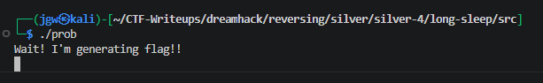

2. 정적 분석을 통해 프로그램의 시작 흐름 추적. `main` 함수(`FUN_00101367`) 확인 결과, 대기 문자열 출력 후 `FUN_00101411` 함수를 호출하여 플래그(`local_38`)를 연산함을 파악. 이후 해당 핵심 로직 내부 진입 및 분석.

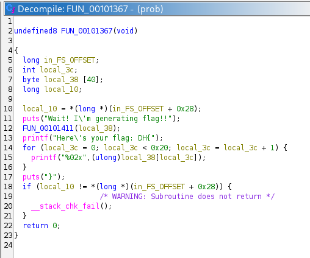

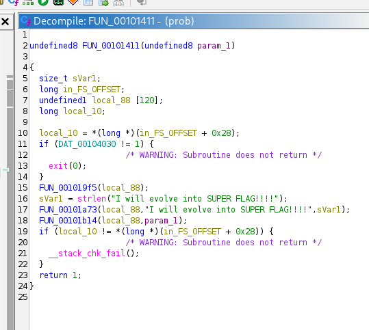

3. 메인 함수 내부에서 순차적으로 호출되는 초기화 함수(`FUN_001019f5`) 및 해시 연산 함수(`FUN_00101a73`) 식별.

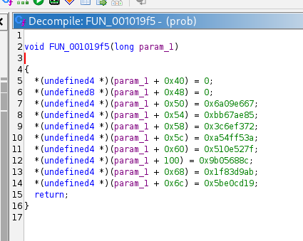

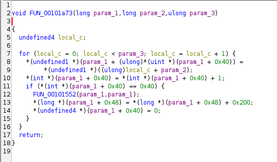

4. 연산 함수 내부의 `FUN_00101552` 진입. 압축 루프 진행 중 전역 변수(`DAT_00104030`) 검사를 통한 뜬금없는 함수(`FUN_001014d2`) 호출 로직 발견.

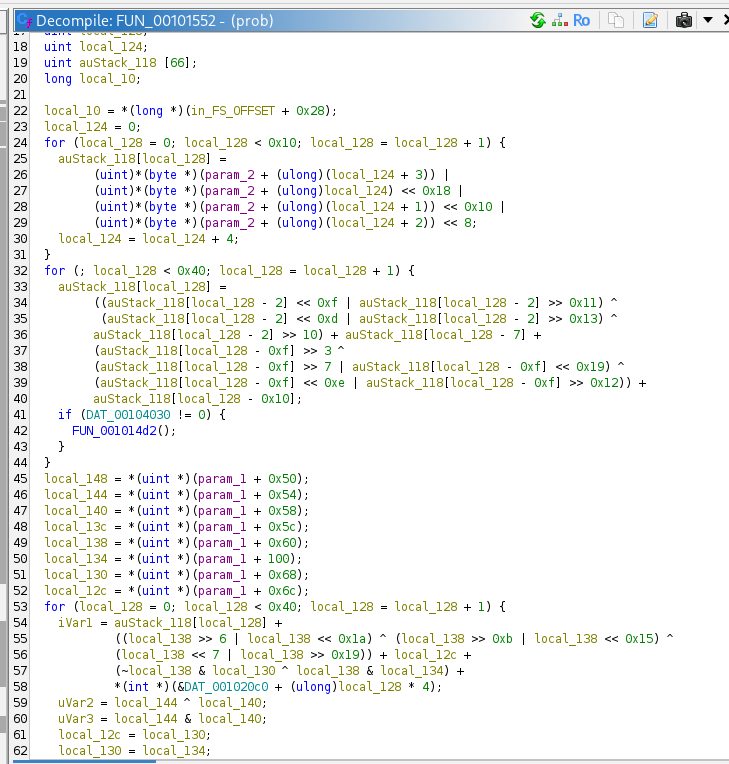

5. 해당 함수 내부 분석 결과, `syscall`을 이용한 의도적인 시간 지연 유발 로직 파악.

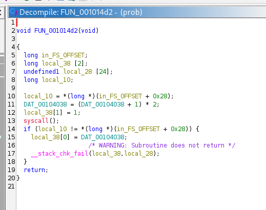

6. 지연 함수 호출을 막기 위해 조건 분기문을 `NOP`으로 덮어쓰는 바이너리 패치 적용. 그러나 실행 결과 자체 무결성 검사에 의해 `file has been corrupted` 에러 발생.

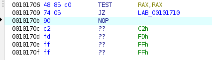

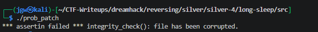

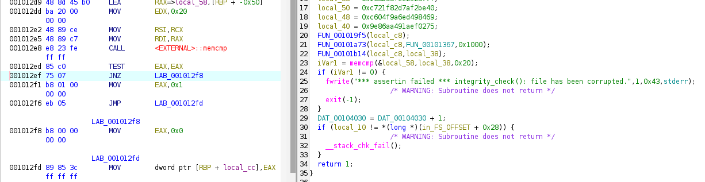

7. 무결성 우회를 위해 GDB 동적 분석 시도. 조건문 강제 패스를 위해 `$eax = 0`으로 조작하였으나, 스택 오염에 따른 `SIGSEGV` 크래시 발생으로 패치 방식 폐기.

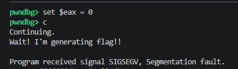

8. 원본 파일을 유지한 상태에서 메모리 변조만 수행하는 방향으로 전략 수정. `XREF` 기능을 활용하여 문제의 지연 스위치인 `DAT_00104030` 변수의 참조 지점 확인. 사후 분석 결과, 메인 함수 이전 단계인 `_INIT_1` 로직이 변수를 1로 선행 세팅함을 파악.

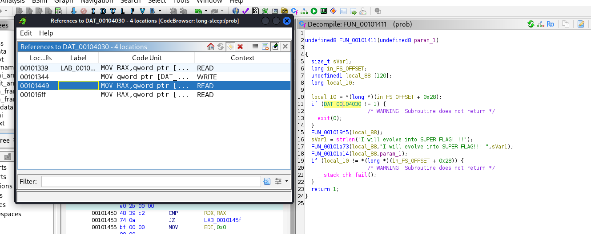

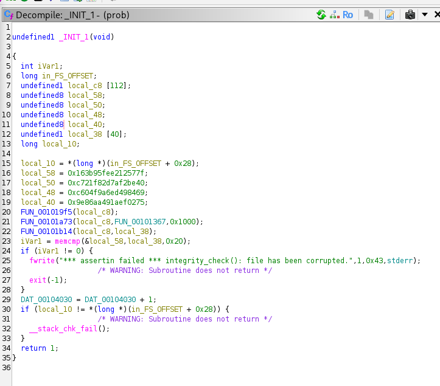

9. 동적 패치를 위해 해시 연산 진입 직전인 `0x1471` 주소에만 Breakpoint를 설정 후 실행했으나 무결성 에러 재발생. 이는 GDB의 소프트웨어 브레이크포인트로 인해 메모리가 변조되어 `_INIT_1` 무결성 검사에 재적발된 것임을 확인. 이를 해결하기 위해 검사 분기점(`0x12ed`)과 호출부(`0x1471`) 양쪽에 이중 BP 설정.

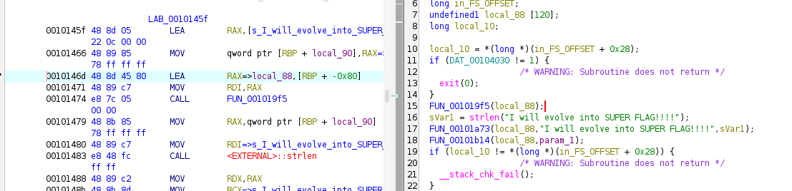

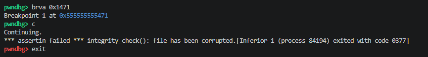

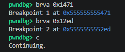

10. 프로그램 실행 시 가장 먼저 적중하는 BP는 `_INIT_1` 로직에 포함된 무결성 검사 분기(`0x12ed`). 강제 우회를 위해 레지스터 조작(`set $eax = 0`) 후 진행(`c`). 검사 통과 후 `_INIT_1`에 의해 지연 스위치 변수가 1로 장전되며, 이후 `main` 함수로 넘어가 `Wait! I'm generating flag!!` 문자열 정상 출력.

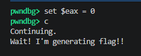

11. 메인 문자열 출력 직후, 진짜 플래그 연산을 위한 `1411` 함수 내부의 두 번째 BP(`0x1471`) 적중. 지연 루프를 원천 차단하기 위해 1로 장전되어 있던 스위치 변수를 메모리에서 강제로 0으로 무력화(`set *(int*)0x555555558030 = 0`) 후 진행(`c`).

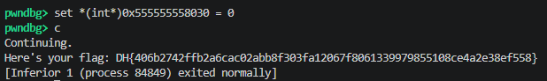

12. 무한 지연 루프 및 무결성 검사가 완벽하게 회피되어 원본 플래그 복호화 및 출력 성공.

## 4. 획득 결과
동적 메모리 패치를 통해 지연 함정 및 무결성 검사를 모두 회피하여 원본 플래그 획득 성공.

* **FLAG:** `DH{406b2742ffb2a6cac02abb8f303fa12067f8061339979855108ce4a2e38ef558}`

## 5. 대응 방안
본 프로그램은 단순 `memcmp` 기반의 무결성 검사와 전역 변수에 의존한 얕은 안티 디버깅 기법을 사용하므로 동적 분석 도구를 이용한 변수 값 변조 공격에 매우 취약.

* **다중/난독화된 무결성 검증 도입:** 
바이너리 무결성 검사를 수행할 때 단일 `memcmp` 또는 문자열 비교에 의존하는 대신, 코드 섹션 전체의 체크섬이나 해시값을 동적으로 산출하여 다형성 검증 적용 필요.

* **전역 변수 의존도 축소 및 은닉:** 
상태 변수(`DAT_00104030` 등)를 데이터 섹션에 평문으로 노출하지 말고, Thread Environment Block(TEB)의 예약 영역을 활용하거나 동적 할당된 힙 영역에 암호화하여 저장하는 방식 채택.

* **안티 디버깅 기법 고도화:** 
단순 `syscall` 트랩 대신 `ptrace` 탐지(리눅스 환경), 타이밍 체크 기법(RDTSC) 등 디버거 부착 여부를 식별할 수 있는 다양한 OS 기반 안티 디버깅 기술 결합 필요.

## 6. 블루팀 관점 요약
해당 바이너리는 외부 네트워크 통신을 유발하지 않는 오프라인 기반 실행 파일이므로 방화벽 및 NIDS(네트워크 틈입 탐지 시스템)로는 공격 행위 탐지 불가. 엔드포인트 단말(EDR) 및 메모리 포렌식 기반의 위협 헌팅(Threat Hunting)과 정적 시그니처 매칭 수행.

### 6.1. 위협 헌팅 시나리오
* **비정상 디버깅/프로세스 인젝션 탐지:** EDR 원격 측정 데이터를 통해 gdb, strace 등의 디버깅 툴이 의심스러운 리눅스 ELF 바이너리에 부착(ptrace)되어 실행 상태를 제어하거나 특정 메모리 번지에 지속적으로 Write 작업을 수행하는 행위 모니터링.

* **스레드 지연 이상 징후 추적:** CPU 점유 없이 대량의 `syscall` 대기 상태(Sleep)에 빠지는 이상 프로세스 식별을 통해 안티 샌드박스/지연 실행(Time-wasting) 악성코드 의심군 분류 및 분석가에게 경고.

### 6.2. YARA 탐지 룰 (IoC)
정적 분석 과정에서 식별된 하드코딩 에러 메시지와 출력 문자열 조합을 기반으로 동일한 트릭(무결성 체크 + 플래그 연산)을 사용하는 유사 악성/CTF 바이너리를 식별하는 규칙.

```yara
rule Detect_LongSleep {
    strings:
        // 프로그램 실행 시 노출되는 핵심 진행 문자열
        $s1 = "Wait! I'm generating flag!!" ascii
        $s2 = "I will evolve into SUPER FLAG!!!!" ascii
        
        // 무결성 검사 실패 시 출력되는 하드코딩 에러 메시지
        $e1 = "*** assertin failed ***" ascii
        $e2 = "integrity_check(): file has been corrupted." ascii

    condition:
        // 리눅스 ELF 포맷 파일 중 식별된 핵심 문자열이 모두 존재하는 파일 탐지
        uint32(0) == 0x464c457f and all of ($s*) and all of ($e*)
}
```