# [DreamHack] Patch - Reversing

## 1. 문제 개요

* **문제 링크:** [DreamHack - Patch](https://dreamhack.io/wargame/challenges/49)

* **분야:** Reversing

* **목표:** 윈도우 GUI 프로그램의 GDI+ 렌더링 과정을 분석하고, 플래그를 검은색 선으로 가리는 방해 함수를 찾아 리턴(`ret`) 명령어로 패치하여 원본 플래그 획득.

## 2. 취약점 분석
제공된 윈도우 PE 파일(`patch.exe`)을 기드라로 디컴파일 분석한 결과, 윈도우 프로시저(`WndProc`)에서 화면 그리기(`WM_PAINT`) 이벤트 발생 시 플래그 원본을 그린 직후 특정 그리기 함수를 수십 번 반복 호출하여 화면을 검은색 선으로 덮어버리는 논리적 취약점(단순 렌더링 덮어쓰기) 식별.

```c
// [wndproc_fun 함수] 윈도우 메시지 처리 및 화면 그리기 분기점
// ... (중략) ...
if (param_2 == 0xf) { // 0xf = WM_PAINT (화면 그리기 이벤트)
    // ... (중략) ...
    pHVar4 = DAT_140007910;
    uVar1 = GdipCreateFromHDC();
    // ... (중략) ...
    DAT_140007918 = puVar3;
    paint_fun(pHVar4, puVar5); // 화면을 그리는 메인 커스텀 함수 호출
// ... (중략) ...
```

```c
// [paint_fun 함수] 진짜 플래그와 가림막을 렌더링하는 핵심 로직
// ... (중략) ...
lVar1 = DAT_140007880;
// 0xff000000(불투명한 검은색) 인자를 주며 paint_pen_fun 수십 번 반복 호출
paint_pen_fun(DAT_140007880, param_2, 0x1e, 0x1d6, 0x50, 0xff000000);
paint_pen_fun(lVar1, param_2, 0x23, 0x1d6, 0x4b, 0xff000000);
paint_pen_fun(lVar1, param_2, 0x28, 0x1d6, 0x46, 0xff000000);
// ... (중략) ...
// 진짜 Flag 글자를 그리는 함수들
FUN_1400017a0(DAT_140007880, 0x28, uVar3, 0xff000000);
FUN_140001c80(lVar1, 0x50, uVar3, 0xff000000);
// ... (중략) ...
```

```c
// [paint_pen_fun 함수] 가림막용 검은색 굵은 선(Pen) 생성 및 드로잉
// ... (중략) ...
uVar2 = GdipCreatePen1(param_6, 0x41200000, 0, &local_38); // Pen 생성
// ... (중략) ...
iVar3 = GdipDrawLineI(*puVar1, local_38, 0x96, param_3); // 화면에 선 긋기 적용
// ... (중략) ...
```

* **분석 결론:** 윈도우 API 특성상 `paint_pen_fun` 함수 호출을 개별적으로 무력화하기엔 횟수가 너무 많음. 따라서 해당 함수 메모리 진입점 자체를 `ret`으로 패치하여, 함수 호출 즉시 아무 동작 없이 반환되도록 만들어 가림막 생성 로직 원천 차단 필요.

## 3. 공격 수행

1. 원본 프로그램 실행 시, 플래그 영역이 검은색으로 가려져 식별 불가 상태 확인.

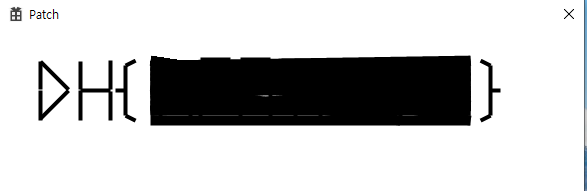

2. 기드라를 통한 정적 분석 진입. `winmain` 함수에서 윈도우 프로시저(`wndproc_fun`)가 등록되는 절차 처리 구간 확인.

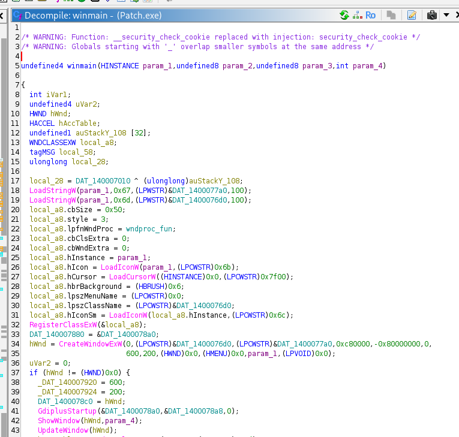

3. `wndproc_fun` 내부로 진입하여 윈도우 메시지(`param_2`) 분기문 탐색. `0xf`(`WM_PAINT`) 발생 시 GDI 도화지를 세팅하고 `paint_fun` 함수를 호출하는 흐름 파악.

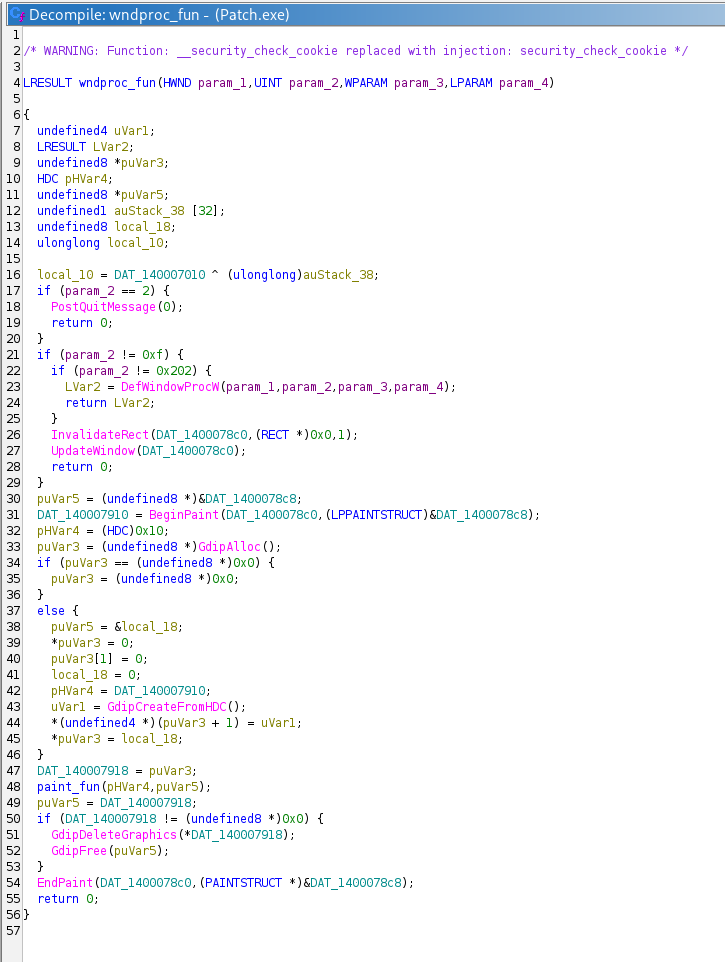

4. `paint_fun` 내부 분석. 특정 함수(`paint_pen_fun`)를 불투명한 검은색(`0xff000000`) 인자와 함께 수십 번 반복 호출하는 로직 확인.

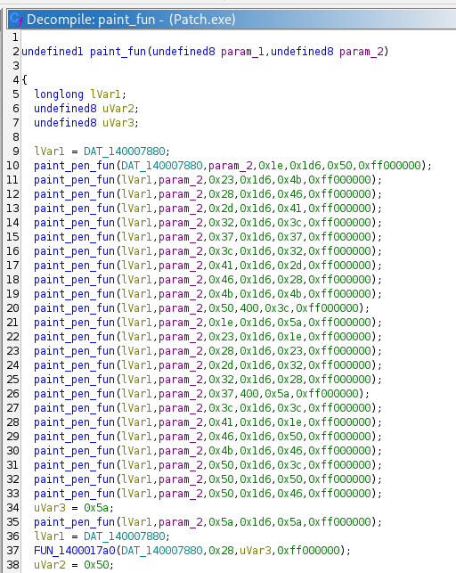

5. `paint_pen_fun` 내부 진입 결과, `GdipCreatePen1` 및 `GdipDrawLineI` 함수를 통해 화면에 펜으로 선을 긋는 가림막 로직임을 최종 확정.

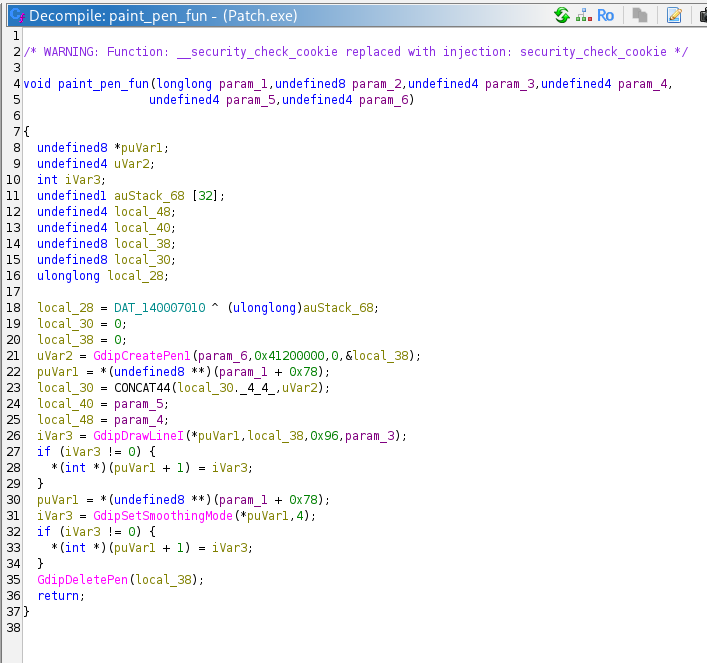

6. 해당 함수 자체를 무효화하기 위해 기드라 Listing 뷰에서 함수의 첫 번째 명령어 오프셋(`2B80`) 기록 및 주소 연산 준비.

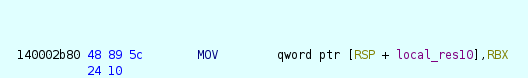

7. x64dbg에 프로그램을 로드한 뒤, [기호] 탭에서 파일이 실제로 로드된 베이스 주소(`00007FF6DFE60000`) 획득.

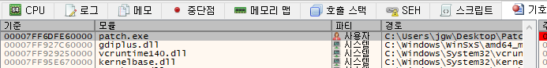

8. 베이스 주소와 기드라 오프셋을 더한 실제 메모리 주소(`7FF6DFE62B80`) 계산 후, 해당 주소로 이동(Ctrl+G).

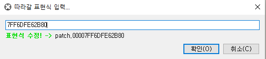

9. `paint_pen_fun` 함수의 최상단 명령어에서 어셈블(Assemble) 창을 띄운 뒤, 함수를 즉시 종료시키는 `ret` 명령어로 변조.

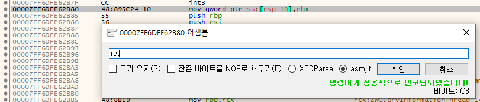

10. 첫 바이트가 정상적으로 `C3`(`ret`)으로 변경되어, 해당 함수 호출 시 도화지에 펜을 그리기 전 즉각 반환되도록 흐름 수정 완료.

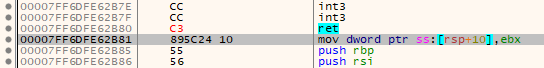

11. 패치 창에서 변조된 인스트럭션 내역을 확인하고, `Patched.exe`라는 이름으로 최종 실행 파일 저장 및 패치 완료.

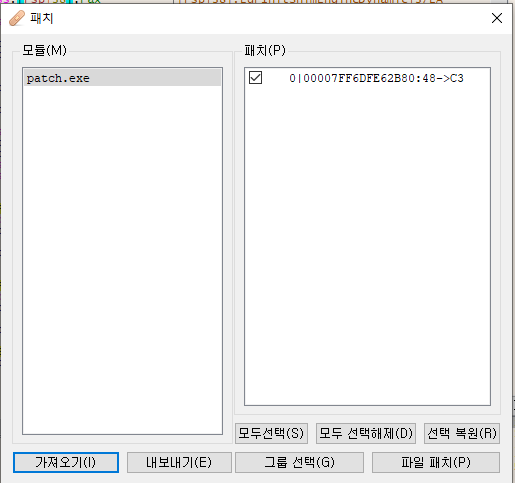

## 4. 획득 결과
저장된 `Patched.exe`를 실행한 결과, 선을 긋는 GDI 렌더링 로직이 즉시 반환되면서 화면 덮어쓰기가 무효화되었고 원본 플래그가 선명하게 출력됨.

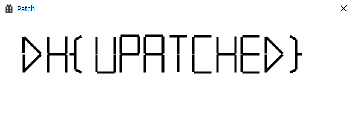

* **FLAG:** `DH{UPATCHED}`

## 5. 대응 방안
해당 프로그램은 클라이언트 단에서 렌더링을 제어하는 로직이 변조(Patching) 공격에 무방비하게 노출되어 발생한 취약점. 시큐어 코딩 및 아키텍처 관점에서 다음의 보호 기법 적용.

* **코드 섹션 무결성 검증 추가:** 프로그램 실행 중 자신의 `.text` 섹션 메모리에 대한 해시 값을 주기적으로 계산. 함수 프롤로그 영역에 `0xC3`(`ret`)이나 `0xCC`(`int 3`) 등의 디버깅/패치 바이트가 삽입되었는지 감지하고, 변조 식별 시 프로세스 강제 종료.

* **로직 혼동 및 서버 사이드 렌더링 도입:** 민감한 텍스트 데이터(플래그) 자체를 클라이언트 바이너리에 하드코딩하여 렌더링하는 구조 지양. 렌더링용 핵심 GDI 로직에 난독화 및 가상화(VMProtect 등)를 적용하여 정적/동적 디버깅 난이도 상승 도모.

## 6. 블루팀 관점 요약
해당 프로그램은 C2 통신 등 외부 네트워크 활동을 수반하지 않는 로컬 단독형 GUI 애플리케이션으로, 방화벽이나 NIDS 중심의 네트워크 관제 장비로는 탐지가 불가능함. 침해사고 대응(IR) 시 엔드포인트 기반으로 파일 무결성 훼손 여부 및 프로세스 비정상 행위를 탐지하는 위협 헌팅 수행.

### 6.1. YARA 탐지 룰 (IoC)
정적 분석을 통해 식별된 바이너리 내부의 하드코딩된 상태 알림 문자열 데이터와 GDI+ 핵심 API들을 조합하여 리버싱 과제 및 크랙 툴로 분류하기 위한 YARA 룰 제안.

```yara
rule Detect_Patch {
    strings:
        // GDI+ 관련 핵심 그리기 API 임포트 문자열
        $api1 = "GdipCreatePen1" ascii
        $api2 = "GdipDrawLineI" ascii
        $api3 = "GdiplusStartup" ascii

    condition:
        // MZ 매직 넘버 검증을 통한 Windows PE 파일 식별 및 GDI+ 함수 탐지
        uint16(0) == 0x5A4D and all of ($api*)
}