# [DreamHack] Randzzz - Reversing

## 1. 문제 개요

* **문제 링크:** [DreamHack - randzzz](https://dreamhack.io/wargame/challenges/932)

* **분야:** Reversing

* **목표:** `srand()`를 통한 시드 초기화 누락 취약점을 식별하고, 동적 디버깅(메모리 직접 변조)을 통해 두 번의 `rand()` 조건문을 우회하여 정상적인 플래그 획득.

## 2. 취약점 분석
제공된 ELF 바이너리 파일(`chall`)을 정적 분석한 결과, 난수 생성 로직의 취약점 및 메모리 내 변수 의존성 확인.

```c
// [취약점 1] main 함수: 시드 초기화 누락 및 실행 지연 유발
puts("----Start----");
sleep(seconds);
puts("fall asleep from now on.");
seconds = rand() + 1; // srand() 없이 rand() 사용 -> 고정된 난수 시퀀스 발생
sleep(seconds);
rand();
rand();
printf("Can you guess the rand num?: ");
__isoc99_scanf("%d", &seconds); // 입력받은 값 메모리(&seconds) 적재

// ... (중략) ...

// [취약점 2] 첫 번째 플래그 복호화 조건문
if ( rand() % 10 == seconds ) 
{
  v6[0] = 0x386C2C39364C396CLL;
  // ... (중략) ...
  for ( i = 0; i <= 27; ++i )
    v8[i] = get_flag(*((char *)v6 + i), seconds); // 조건값인 seconds를 복호화 인자로 사용
}

// ... (중략) ...

// [취약점 3] 두 번째 플래그 복호화 조건문
if ( rand() % 10 == seconds ) 
{
  v4[0] = 0x1B323838330B1335LL;
  // ... (중략) ...
  for ( j = 0; j <= 35; ++j )
    v8[j + 28] = get_flag(*((char *)v4 + j), seconds); // 여기서도 동일한 메모리 변수(seconds) 사용
}
```

* **분석 결론:** 시드 없는 `rand()` 호출로 인해 생성되는 난수 패턴 예측 및 재현 가능. 하지만 `rand() % 10` 분기문이 두 번 등장하며 매번 다른 난수 값을 요구함. 또한, 검증에 사용되는 `seconds` 변수가 `get_flag()` 함수의 핵심 인자로 사용되므로, 단순 분기점 점프(JMP) 우회나 레지스터 단일 조작으로는 정상적인 플래그 복호화 불가. 실제 메모리상의 값을 직접 조작하는 전략 필수.

## 3. 공격 수행

1. `main` 함수 분석 결과, `sleep` 함수로 인한 긴 대기 시간 유발 식별. 원활한 동적 디버깅을 위해 해당 구간 우회 필요성 인지. 또한 `get_flag` 함수 동작도 동시 파악.

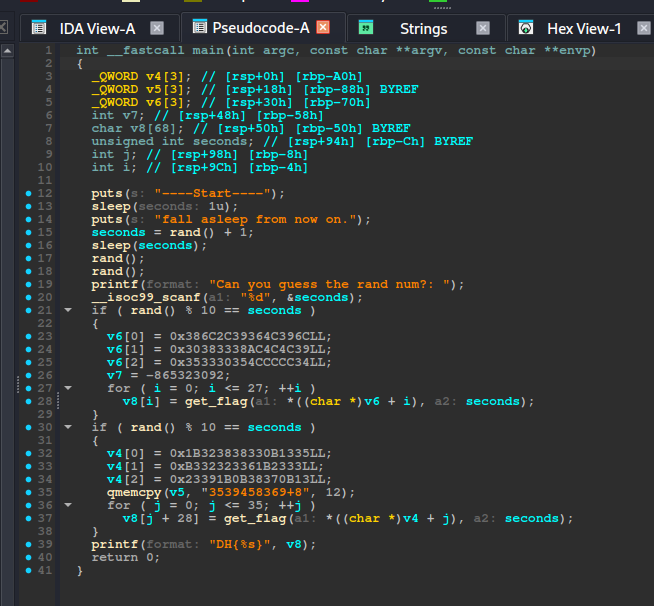

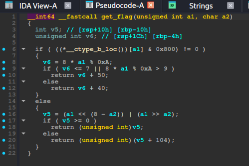

2. `if (rand() % 10 == seconds)` 조건문 돌파를 위해 어셈블리어를 점검. `mov eax, [rbp+seconds]` 이후 `cmp ecx, eax` 연산이 수행됨을 파악. 즉, 검증해야 할 난수의 일의 자리 정답은 `ECX` 레지스터에 담김을 확인.

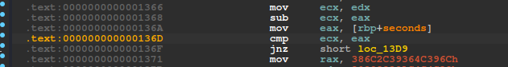

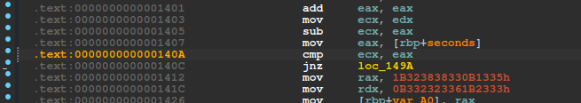

3. `sleep` 함수에 브레이크포인트(BP)를 설정하고 프로그램을 실행. 실행 흐름이 멈출 때마다 GDB의 `return` 명령어를 연속 사용해 대기 시간을 즉각 스킵 처리.

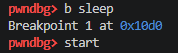

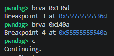

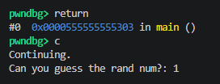

4. 첫 번째 분기문 도달 시 레지스터 상태 점검 결과, 정답 값이 담긴 `RCX`가 **5**임을 확인. 검증 통과를 위해 비교 대상인 `$rax`를 5로 강제 조작(`set $rax = 5`)하여 첫 번째 조건문 우회.

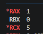

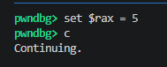

5. 두 번째 분기문 도달 시 `RCX` 값은 **3**으로 확인됨. 이전과 동일하게 `$rax`를 3으로 조작하여 분기를 넘겼으나, 획득한 플래그가 비정상적인 쓰레기 값(`DH{68&...}`)으로 출력됨. 

**원인 분석:** 레지스터 조작은 분기문(`cmp`)만 속일 뿐, `get_flag` 연산 시 참조하는 실제 메모리 변수(`seconds`) 값은 덮어쓰지 못해 복호화 연산이 실패한 것.

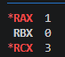

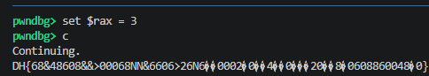

6. 메모리 원본 값을 변조하기 위해 레지스터 복사(`mov`) 직전 주소(`0x136a`, `0x1407`)로 BP 포인트 재설정.

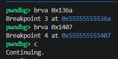

7. 정적 분석 단계에서 확인한 `seconds`의 스택 위치(`[rbp-0xc]`)를 기반으로, 메모리에 직접 난수 정답을 삽입. 첫 번째 분기에서는 `set {int}($rbp-0xc) = 5`, 두 번째 분기에서는 `set {int}($rbp-0xc) = 3`을 덮어써 모든 검증 및 복호화 로직을 완벽히 통과.

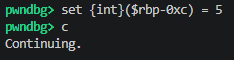

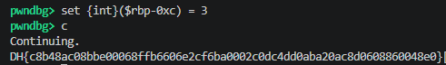

## 4. 획득 결과

* **FLAG:** `DH{c8b48ac08bbe00068ffb6606e2cf6ba0002c0dc4dd0aba20ac8d0608860048e0}`

## 5. 대응 방안
본 프로그램은 난수 생성기의 시드 초기화 부재와 메모리 내 변수에 대한 무결성 검증 누락으로 인해 동적 변조 공격에 매우 취약한 상태임. 안전한 코딩(Secure Coding)을 위해 다음의 조치 필요.

* **난수 생성기 시드 초기화(Seeding):**
프로그램 시작 지점에 `srand(time(NULL))` 등을 삽입하여, 매 실행 시 `rand()` 함수의 결과값이 다르게 도출되도록 난수 시퀀스의 예측 가능성 차단.

* **암호학적으로 안전한 난수 함수 사용:**
보안 인증이나 중요 로직에서는 예측 가능성이 내포된 `rand()` 대신 OS에서 제공하는 `urandom`이나 암호학적 난수 생성 API(예: `BCryptGenRandom`, `getrandom()`) 사용 권장.

* **안티 디버깅(Anti-Debugging) 및 메모리 보호 적용:**
`ptrace` 기반의 디버깅 시도를 탐지(예: 리눅스의 경우 `PTRACE_TRACEME`)하거나 코드 및 중요 변수 영역의 무결성을 해시화하여 주기적으로 검증하는 로직 추가.

## 6. 블루팀 관점 요약
해당 바이너리는 외부 네트워크 통신을 유발하지 않는 오프라인 기반의 독립 실행 파일이므로 방화벽 및 NIDS(네트워크 침입 탐지 시스템)로는 공격 행위 탐지 불가. 엔드포인트 단말(EDR) 및 메모리 포렌식 기반의 위협 헌팅(Threat Hunting)과 정적 시그니처 매칭 수행 필요.

### 6.1. 위협 헌팅 시나리오
* **비정상 디버깅/프로세스 인젝션 탐지:** EDR 원격 측정 데이터를 통해 gdb, strace 등의 디버깅 툴이 의심스러운 리눅스 ELF 바이너리에 부착(`ptrace`)되어 실행 상태를 제어하거나 특정 메모리 번지에 지속적으로 `write` 작업을 수행하는 행위 모니터링.

* **비정상 대기열(Sleep) 패턴 분석:** 행위 없이 대량의 `syscall` 대기 상태(sleep)에 빠지거나, 실행 흐름을 지연시키는 이상 프로세스를 식별하여 안티 샌드박스/지연 실행(Time-wasting) 악성코드로 분류 및 경고.

### 6.2. YARA 탐지 룰 (IoC)
정적 분석 과정에서 식별된 하드코딩 에러 메시지와 출력 문자열 조합을 기반으로 동일한 트릭(취약한 난수 사용)을 사용하는 유사 악성/CTF 바이너리를 식별하는 규칙.

```yara
rule Detect_randzzz {
    strings:
        // 프로그램 실행 시 노출되는 특징적 문자열
        $s1 = "----Start----" ascii
        $s2 = "fall asleep from now on." ascii
        $s3 = "Can you guess the rand num?: " ascii
        
        // 플래그 출력 포맷
        $flag = "DH{%s}" ascii
        
    condition:
        // 리눅스 ELF 포맷 파일 중 타겟 바이너리 내 특정 문자열 패턴이 모두 탐지될 경우 의심 파일로 분류
        uint32(0) == 0x464c457f and all of them
}
```