# [DreamHack] Rivest - Reversing

## 1. 문제 개요

* **문제 링크:** [DreamHack - Rivest](https://dreamhack.io/wargame/challenges/2278)

* **분야:** Reversing

* **목표:** UPX 패킹을 해제하고, 바이너리 내부의 네트워크 다운로드(C2형 통신) 및 해시(MD5) 기반 암호 키 생성 로직 파악. 접속이 차단된 원격 서버의 통신 에러를 동적 디버깅(GDB)으로 우회하고, 수동으로 연산한 해시값을 메모리에 주입하여 최종 플래그 복구.

## 2. 취약점 분석
제공된 ELF 바이너리 파일(`chall`)을 IDA로 분석한 결과, UPX로 패킹되어 있음을 식별. 언패킹 후 `main` 함수를 디컴파일하여 `argc == 2` 입력값 검증 로직 파악.
프로그램 중반부에서 `libcurl`을 이용해 특정 URL(`.mp4`)에서 데이터를 다운로드하고, `EVP_md5`를 이용해 페이로드의 MD5 해시를 생성. 생성된 해시를 키(Key)로 삼아 RC4와 유사한 로직으로 내부 데이터를 복호화한 뒤, 사용자 입력값(`argv[1]`)과 `memcmp`로 최종 평문 비교를 수행하는 구조 확인.

```c
// [언패킹 후 main 함수] 인자 개수(argc) 검증
// ... (중략) ...
if ( a1 != 2 ) {
    fprintf(stderr, "usage: %s <flag>\n", *a2);
    return 1;
}
// ... (중략) ...

// 외부 원격 서버에서 파일 다운로드 및 MD5 해시 생성
v19 = EVP_md5();
EVP_DigestInit_ex(v32, v19, 0);
curl_easy_setopt(v18, 10002, v36); // CURLOPT_URL 설정
// ... (중략) ...
v30 = curl_easy_perform(v18); // 네트워크 통신 실행
if ( v30 ) {
    EVP_MD_CTX_free(v32);
    puts("NO"); // 통신 실패 시 에러 출력 후 프로그램 강제 종료
    return 3;
}
// ... (중략) ...
v31 = 0;
EVP_DigestFinal_ex(v32, v33, &v31); // 정상 통신 시 v33 버퍼에 16바이트 MD5 해시(복호화 키) 저장

// ... (중략) ...
// 내부 복호화 연산 수행 (v33 해시 키와 바이너리 내 하드코딩 데이터 XOR 연산)
// ... (중략) ...

// 메모리에 노출된 최종 플래그와 사용자 입력값 평문 비교
sub_15E0(v34, s1, 36, 0, v22);
if ( !memcmp(s1, a2[1], 0x24u) )
    v29 = "OK";
else
    v29 = "NO";
// ... (중략) ...
```

* **분석 결론:** 대상 URL(`archive.org`)이 로컬 네트워크 환경에서 차단되어 있어 `curl_easy_perform` 통신 실패 시 비정상 종료됨. 외부에서 원본 페이로드를 직접 다운로드하여 MD5 해시를 구한 뒤, GDB를 이용해 통신 로직을 우회(`return 0`)하고 `EVP_DigestFinal_ex` 실행 후 반환되는 버퍼 주소에 확보한 해시값을 덮어쓰는 방식으로 플래그 추출 가능.

## 3. 공격 수행

1. IDA를 통해 Strings 영역에서 `UPX` 확인 및 터미널에서 `upx -d` 명령어로 바이너리 압축 해제.

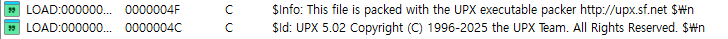

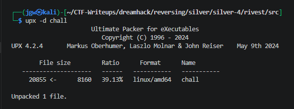

2. 디컴파일을 통해 `main` 함수의 인자 매개변수 구조(`argc, argv`) 식별.

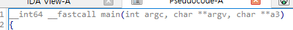

3. 인자 개수 검증(`argc != 2`) 로직 및 바이너리 내 하드코딩된 암호화 배열 구조 파악.

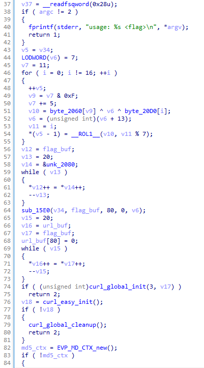

4. `libcurl` 통신 후 MD5 해시 생성 결과물로 플래그를 복호화하고, 사용자 입력과 `memcmp`로 비교하는 전체 비즈니스 로직 확인.

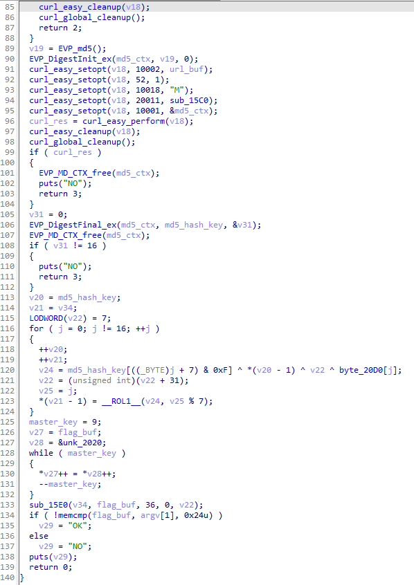

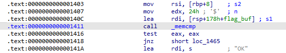

5. GDB 동적 분석 시 인자 검증 로직을 통과하기 위해 36바이트 길이의 더미 인자를 세팅하고 프로세스 진입점(`start`)을 고정시켜 베이스 주소 확보.

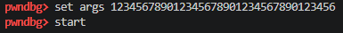

6. `memcmp` 비교 지점(`0x1411`)에 브레이크포인트를 설정하고 실행(Continue) 시 네트워크 타임아웃으로 인해 프로세스가 에러 코드(01)와 함께 비정상 종료됨을 확인.

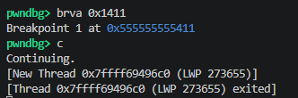

7. 페이로드를 다운로드하는 대상 URL을 확보하기 위해 `curl_easy_setopt` 호출 시점에 브레이크포인트 설정.

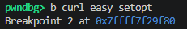

8. 함수 호출 규약에 따라 `RSI` 레지스터가 `CURLOPT_URL`의 고유값인 `0x2712(10002)`일 때, 세 번째 인자인 `RDX` 레지스터 메모리 조회를 통해 원격 대상 URL 추출.

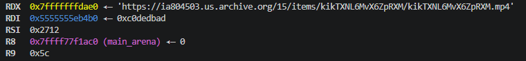

9. 추출된 대상 URL의 특정 캐시 노드 서브도메인(`ia804503.us.archive.org`)이 현재 죽어있어, 브라우저 및 프로그램 내부에서 `ERR_CONNECTION_REFUSED` 에러와 함께 통신이 거부되는 것을 확인.

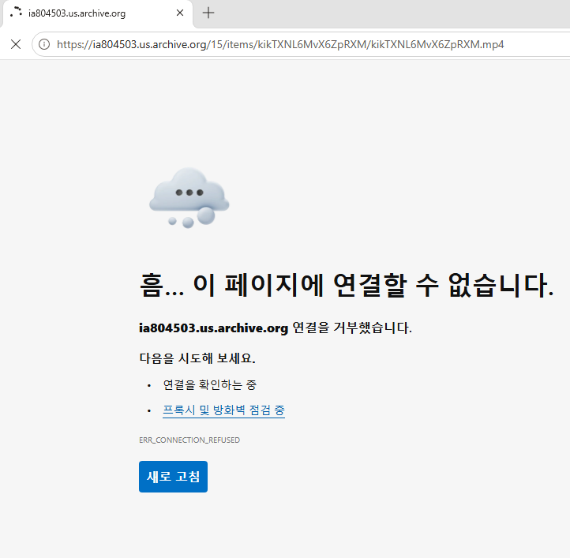

10. archive.org의 정식 다운로드 경로(`https://archive.org/download/kikTXNL6MvX6ZpRXM/kikTXNL6MvX6ZpRXM.mp4`)로 재구성하여 원본 페이로드(`.mp4`) 다운로드 수행.

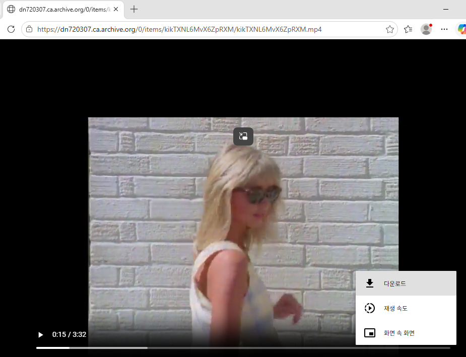

11. 다운로드된 원본 페이로드 파일의 MD5 해시값(`e6b9ef5...`)을 외부 온라인 계산기를 활용하여 연산 및 확보.

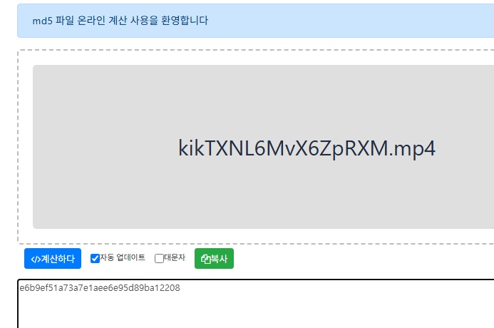

12. 다시 GDB로 복귀하여, 강제 종료를 막기 위해 `curl_easy_perform` 통신 실행 시점에 브레이크포인트 설정.

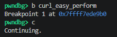

13. 함수 리턴까지 실행(`finish`) 시도 시, 네트워크 연결 장애로 인해 스레드가 무한 대기 상태에 빠짐을 확인.

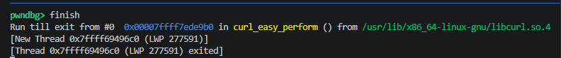

14. 무한 대기 스레드를 강제 인터럽트한 뒤, return (int)0 명령어로 네트워크 통신이 성공한 것처럼 강제 우회함. 이로 인해 실제 파일 다운로드가 생략되었으므로, 다음 단계인 해시 연산(EVP_DigestFinal_ex)이 비정상적인 쓰레기 값을 뱉어낼 것임을 인지하고 해당 지점으로 진행.

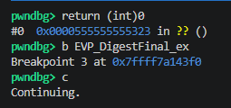

15. `EVP_DigestFinal_ex` 호출 시 2번째 인자인 `RSI` 레지스터 조회를 통해 해시 결과물이 적재될 메모리 버퍼 주소(`0x7fffffffda70`) 확인 후 함수 리턴 처리.

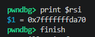

16. 사전에 외부에서 연산해 둔 실제 페이로드의 16바이트 MD5 해시 배열을 해당 버퍼 주소에 강제로 덮어쓰기(Memory Patch)하여 완전한 암호 키 구성 완료. 이후 최종 비교 지점(`0x1411`)까지 계속 실행(Continue).

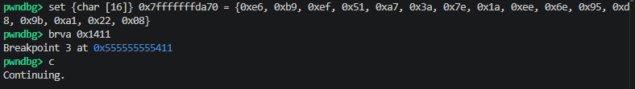

17. 최종 `memcmp` 검증 단계 정지 시점, `RDI` 레지스터 문자열 덤프를 통해 프로그램 내부 연산으로 완벽히 복호화된 원본 플래그 도출.

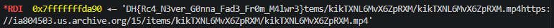

## 4. 획득 결과

* **FLAG:** `DH{Rc4_N3ver_G0nna_Fad3_Fr0m_M4lwr3}`

## 5. 대응 방안
본 문제는 파일리스 및 외부 리소스 기반 페이로드 연동에 의존하는 악성코드 구조를 가짐. 네트워크 가용성에 치명적으로 의존하며, 메모리상에 비교 평문이 덤프되는 로직 결함에 취약하므로 시큐어 코딩 및 보안 아키텍처 재설계 필요.

* **메모리 내 평문 직접 노출 지양:** `memcmp`를 통해 하드코딩된 평문 정답(플래그)과 사용자 입력값을 메모리상에서 1:1로 직접 비교하는 구조 지양. 사용자의 입력을 SHA-256 등으로 안전하게 단방향 해싱한 후, 내부 해시 결과값끼리 비교하는 구조로 변경하여 메모리 덤프 공격을 원천 차단.

* **외부 종속성 예외 처리(Fallback) 강화:** `curl_easy_perform` 실패 시 단순 에러 로그 출력 후 프로세스를 중단하는 대신, 로컬에 암호화 보관된 백업 키(Fallback Key)를 활용하는 로직을 추가하여 네트워크 단절 시에도 최소한의 애플리케이션 가용성을 확보하도록 재설계.

* **안티 디버깅 및 무결성 검증 추가:** 프로그램 실행 초기에 `ptrace(PTRACE_TRACEME, ...)` 등을 호출하여 GDB와 같은 외부 디버거의 프로세스 어태치(Attach)를 방지. 특정 메모리 영역 패치 방지를 위해 무결성 체크(Checksum) 스레드를 백그라운드에 배치.

## 6. 블루팀 관점 요약
해당 바이너리는 일반적인 실행 파일로 위장하고 있으나, 내부적으로 외부 원격지(`archive.org` 노드)에서 임의의 페이로드(`.mp4` 포맷 위장)를 다운로드하여 암호화 루틴에 활용하는 드로퍼형 악성코드의 전형적인 행위 패턴을 보임. 네트워크 샌드박스 및 EDR 환경에서 다음과 같은 탐지 메커니즘을 적용할 수 있음.

### 6.1. YARA 탐지 룰 (IoC)
정적 분석을 통해 식별된 UPX 패킹 특징, `libcurl`을 이용한 외부 통신 라이브러리 시그니처 및 동적 링킹된 `OpenSSL` 해시 루틴 문자열을 조합하여 악성 바이너리를 필터링하는 YARA 룰 제안.

```yara
rule Detect_Rivest {
    strings:
        // UPX 패킹 시그니처 및 식별자
        $upx_sig = "UPX!" ascii
        $upx_info = "$Info: This file is packed with the UPX executable packer" ascii

        // 동적 페이로드 다운로드 및 암호화 관련 라이브러리 심볼
        $lib_curl_perform = "curl_easy_perform" ascii
        $lib_curl_opt = "curl_easy_setopt" ascii
        $lib_ssl_digest = "EVP_DigestFinal_ex" ascii
        $lib_md5 = "EVP_md5" ascii

        // 악성코드 셸 유도/에러 메시지 하드코딩
        $str_usage = "usage: %s <flag>" ascii

    condition:
        // ELF 파일 매직 넘버 검증
        uint32(0) == 0x464C457F and // ELF "\x7FELF"
        ( $upx_sig or $upx_info ) and
        3 of ($lib_*) and
        $str_usage
}
```