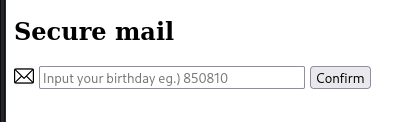
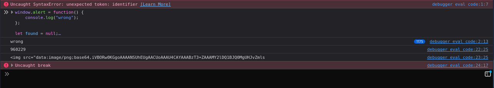
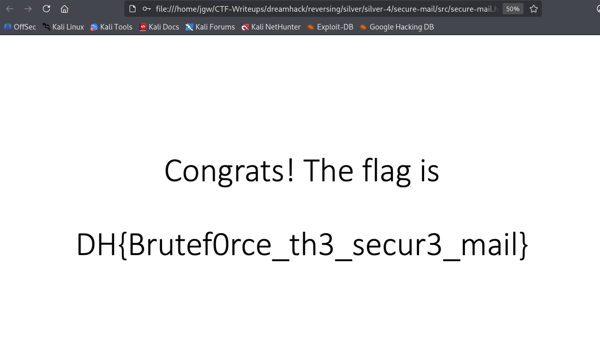

# [DreamHack] Secure Mail - Reversing

## 1. 문제 개요

* **문제 링크:** [DreamHack - Secure Mail](https://dreamhack.io/wargame/challenges/92)

* **분야:** Reversing

* **목표:** 브라우저에서 실행되는 단일 HTML 파일 내 난독화된 JavaScript 소스를 분석하여, `Wrong` 알림을 발생시키는 검증 로직을 찾아내고, 6자리 생년월일 형식의 비밀번호를 전수조사로 도출.

## 2. 취약점 분석
제공된 `secure-mail.html` 파일을 분석한 결과, 하나의 `<script>` 태그 안에 라이브러리와 검증 로직이 압축·난독화되어 포함된 구조 확인. VSCode에서 소스 코드를 열어 `Wrong` 문자열을 검색하여 검증 로직 발견.

```javascript
// [복호화 및 검증] 암호문 복호화 결과를 재해시하여 하드코딩된 값과 비교
dfbora = _0x2fef58['decrypt'](file);
odradurs1 = '';
for (var _0x302add = 0x0; _0x302add < dfbora.length; _0x302add++)
    odradurs1 += String.fromCharCode(dfbora[_0x302add]);

if (_0x3eebe5(odradurs1, null, raw=true) != _0x540d50('0x55','dGZC'))
    return alert('Wrong'), false;

return document.write(''), true;
```

* **분석 결론:** 입력값(비밀번호)을 이용해 하드코딩된 암호문(`file` 배열)을 복호화하고, 그 결과가 특정 조건을 만족해야 통과하는 구조. 내부 암호화 방식을 역산할 필요 없이, 입력값 힌트(`Input your birthday`)와 6자리 길이 제한으로 비밀번호 공간이 37,200가지(00-99년 × 01-12월 × 01-31일)로 한정되어, 원본 검증 함수(`_0x9a220`)를 그대로 반복 호출하는 브루트포스만으로 공략 가능한 구조로 판단.

## 3. 공격 수행

1. 페이지를 브라우저로 로드하여 입력창에 임의의 값을 입력, `Confirm` 클릭 시 `Wrong` 알림이 발생함을 확인.



2. VSCode에서 `secure-mail.html` 소스 코드를 열어 `Wrong` 문자열을 검색하여 검증 로직 발견. if 조건을 만족하면(비교값이 다르면) `Wrong`, if 조건에 걸리지 않고 지나가면(비교값이 같으면) `document.write`로 화면이 그려지는 구조임을 확인하고, if 조건에 안 걸리는 입력값을 찾는 것이 목표임을 파악. 같은 소스에서 `Confirm` 버튼이 `onclick="_0x9a220(pass.value)"`로 연결되어 있음을 확인하고, 해당 함수를 그대로 재사용하되 반복 실행을 방해하는 `window.alert`와 `document.write`를 오버라이드하여 팝업 차단 및 성공 결과 캡처 구조로 대체.

3. 생년월일 형식(YYMMDD) 전 범위를 대입하는 반복문 작성. 정답이 최근 연도일 가능성을 고려해 `yy=99`부터 내림차순으로 탐색 순서 구성.

```javascript
window.alert = function() {
    console.log("wrong");
};

let found = null;
document.write = function(html) {
    found = html;
};

for (let yy = 99; yy >= 0; yy--) {
    for (let mm = 1; mm <= 12; mm++) {
        for (let dd = 1; dd <= 31; dd++) {

            let birth =
                String(yy).padStart(2, '0') +
                String(mm).padStart(2, '0') +
                String(dd).padStart(2, '0');

            _0x9a220(birth);

            if (found !== null) {
                console.log(birth);
                console.log(found.slice(0, 100));
                throw "break";
            }
        }
    }
}
```

4. 콘솔 실행 결과, 1,175번째 시도에서 비밀번호 `960229` 도출 및 복호화된 base64 이미지 데이터 확보.



5. 페이지 새로고침으로 오버라이드된 함수를 원상 복구한 뒤, 도출된 비밀번호를 입력창에 직접 입력하여 정상 렌더링 여부 재검증.

## 4. 획득 결과
콘솔에서 도출한 비밀번호 `960229`를 새로고침된 페이지의 입력창에 직접 입력한 결과, 하드코딩된 정답 해시와 일치하여 검증을 통과하였고 암호문이 정상적으로 복호화되어 원본 이미지가 화면에 렌더링됨. 이미지 내부에 플래그가 텍스트로 명시되어 있음.



* **FLAG:** `DH{Brutef0rce_th3_secur3_mail}`

## 5. 대응 방안

해당 페이지는 비밀번호 검증 로직 전체가 클라이언트에 그대로 노출되어 있어, 공격자가 브라우저 콘솔만으로 검증 함수를 무제한 반복 호출할 수 있는 구조. 시큐어 코딩 관점에서 다음과 같은 개선 방안 적용 필요.

* **서버 사이드 검증 전환:** 비밀번호 대조와 복호화 로직을 서버로 이전하고, 클라이언트는 성공 시에만 결과(복호화된 리소스 URL 등)를 전달받는 구조로 재설계.

* **요청 속도 제한:** 서버 이전 후에도 동일 클라이언트의 반복 검증 시도 횟수를 제한하고, 실패 누적 시 지수 백오프 또는 계정 잠금 적용.

* **예측 가능한 비밀번호 정책 개선:** 생년월일과 같이 경우의 수가 한정된 값이 아닌, 충분한 엔트로피를 가진 비밀번호 정책 안내 또는 별도의 2차 인증 수단 병행.

## 6. 블루팀 관점 요약

해당 문제는 로컬 HTML 파일 단위로 완결되는 구조로 별도의 네트워크 통신이 발생하지 않아, 방화벽·WAF 등 네트워크 기반 보안관제 장비로는 공격 시도 자체를 탐지할 수 없음. 호스트 단 정적 스캔과 배포 파일 자체의 문자열·구조적 특징을 기반으로 한 위협 헌팅이 유효하며, 향후 유사한 "클라이언트 사이드 검증 로직 노출 + 전수조사 취약" 계열 페이지 식별 시 본 분석에서 확인한 콘솔 오버라이드 방식의 브루트포스 스크립트를 분석 자동화 도구로 편입하여 대응 소요 시간 단축 가능.

### 6.1. YARA 탐지 룰 (IoC)

정적 분석 과정에서 식별된 페이지 내 하드코딩 문자열을 조합하여, 동일 계열의 클라이언트 사이드 검증 페이지를 식별하기 위한 YARA 룰 제안.

```yara
rule Detect_Secure_Mail
{
    strings:
        $s1 = "Input your birthday" ascii
        $s2 = "Wrong" ascii
        $s3 = "decrypt" ascii
        $s4 = "raw=!![]" ascii

    condition:
        $s1 and 2 of ($s2, $s3, $s4)
}
```