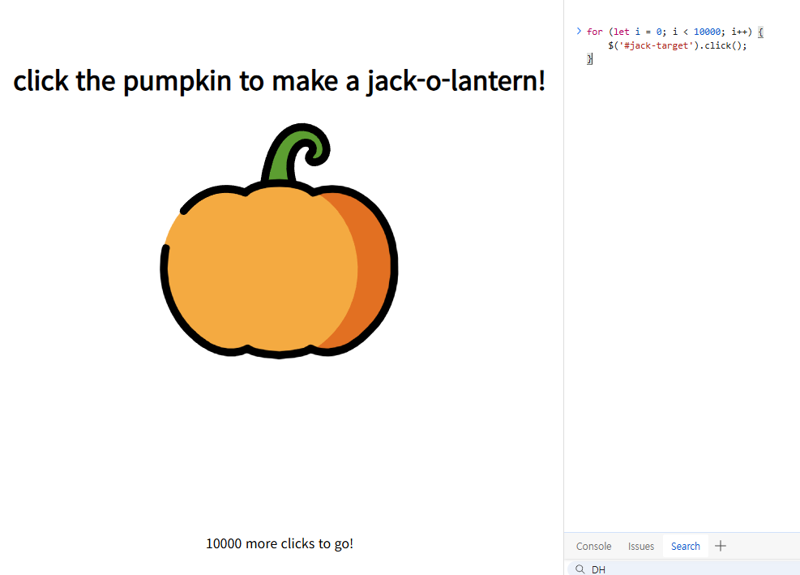
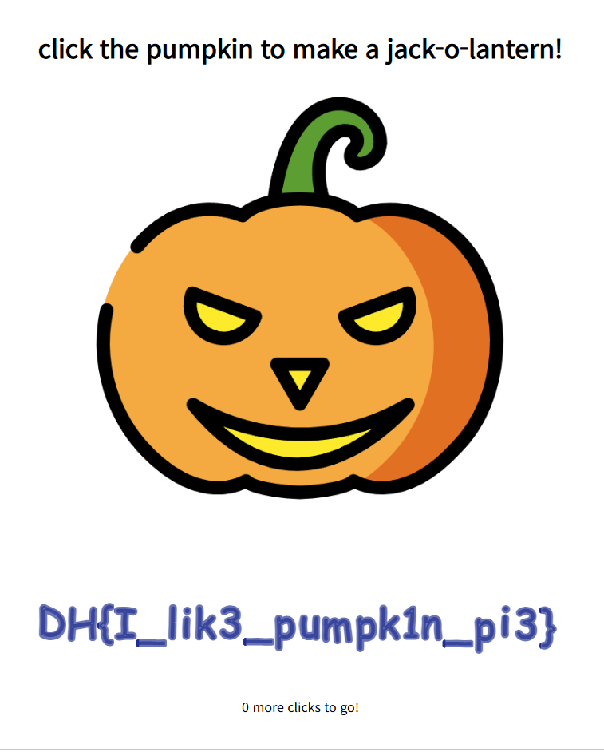
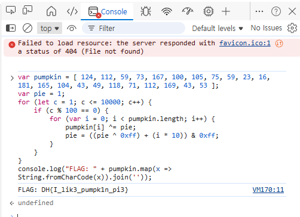

# [Dreamhack] Carve Party - Web Hacking

## 1. 문제 개요
* **문제 링크:** [Dreamhack - Carve Party](https://dreamhack.io/wargame/challenges/96)

* **분야:** Web

* **목표:** 프론트엔드에 구현된 검증 로직을 분석하고, 브라우저 콘솔을 활용한 자바스크립트 강제 실행으로 숨겨진 플래그 획득.

## 2. 취약점 분석
제공된 `jack-o-lantern.html` 소스 코드를 분석한 결과, 서버와의 통신 없이 프론트엔드 환경에서만 플래그 복호화 및 렌더링 로직이 작동함을 확인.

```js
$(function() {
  $('#jack-target').click(function () {
    counter += 1;
    if (counter <= 10000 && counter % 100 == 0) {
      for (var i = 0; i < pumpkin.length; i++) {
        pumpkin[i] ^= pie;
        pie = ((pie ^ 0xff) + (i * 10)) & 0xff;
      }
    }
    make();
  });
});
```

* **분석 결론:** 사용자의 클릭 이벤트(`counter`)가 10,000회에 도달하면, 하드코딩된 `pumpkin` 배열을 일정 규칙(XOR 연산)으로 복호화하여 Canvas에 출력하는 구조. 이는 **클라이언트 사이드 검증 취약점**으로, 브라우저 개발자 도구를 이용해 DOM 이벤트를 강제 발생시키거나 복호화 로직만 별도로 추출하여 손쉽게 우회 가능

## 3. 공격 수행
로컬 환경에서 파이썬 웹 서버를 구동하여 파일을 브라우저에 로드한 뒤, 취약점 검증 및 플래그를 획득.

### 3.1. 브라우저 콘솔을 이용한 DOM 이벤트 강제 발생 

개발자 도구의 콘솔을 이용해 사용자의 클릭 행위를 자동화.

1. 브라우저를 통해 문제 페이지에 접근.

2. 브라우저 개발자 도구의 **Console** 탭으로 이동.

3. 아래의 자바스크립트 코드를 삽입하여 호박 클릭 이벤트를 10,000회 강제 반복 실행.

```js
for (let i = 0; i < 10000; i++) {
    $('#jack-target').click();
}
```


**[실행 결과]** 코드 실행 즉시 10,000회 클릭 조건이 달성되어 화면에 복호화된 플래그가 나타남.



### 3.2. 로직 추출을 통한 정적 복호화

화면 렌더링을 거치지 않고, 악성코드 분석 시 난독화를 해제하듯 핵심 연산 로직만 추출하여 실행하는 방법.

```js
var pumpkin = [ 124, 112, 59, 73, 167, 100, 105, 75, 59, 23, 16, 181, 165, 104, 43, 49, 118, 71, 112, 169, 43, 53 ];
var pie = 1;
for (let c = 1; c <= 10000; c++) {
    if (c % 100 == 0) {
        for (var i = 0; i < pumpkin.length; i++) {
            pumpkin[i] ^= pie;
            pie = ((pie ^ 0xff) + (i * 10)) & 0xff;
        }
    }
}
console.log("FLAG: " + pumpkin.map(x => String.fromCharCode(x)).join(''));
```

**[실행 결과]** DOM 요소 조작 없이, 콘솔 출력 결과로 최종 플래그 연산 값을 직접 확인 가능.



## 4. 획득 결과
클라이언트 사이드의 암호화 로직을 해제하고 최종 플래그를 성공적으로 획득.

* **FLAG:** `DH{I_lik3_pumpk1n_pi3}`

## 5. 대응 방안
중요한 인증 정보나 챌린지 플래그를 클라이언트 측(HTML, JS) 소스 코드에 하드코딩하거나 브라우저 내에서만 검증하는 구조는, 공격자에게 비즈니스 로직이 100% 노출되므로 매우 위험.

* **서버 사이드 검증 전환:**  클릭 횟수 카운팅 및 플래그 발급에 대한 핵심 검증 로직을 백엔드 서버에서 수행하도록 아키텍처를 변경. 클라이언트는 클릭 이벤트 발생 사실만 서버로 전달하고, 서버가 10,000회 조건을 검증한 뒤 권한을 확인하여 플래그를 응답으로 내려주는 구조로 재설계가 필요.