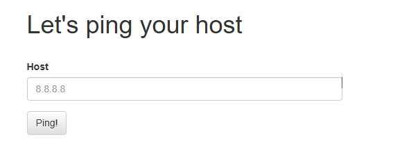
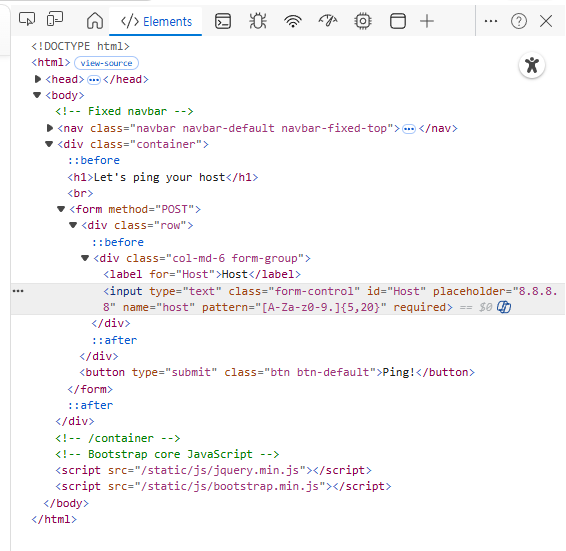
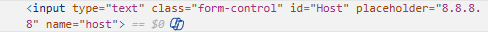
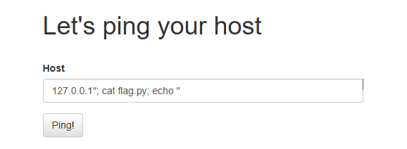
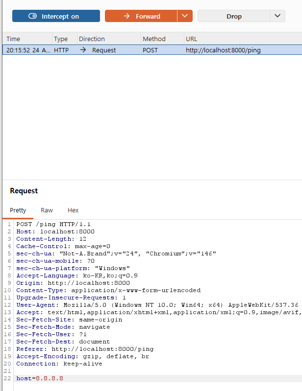
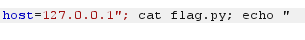
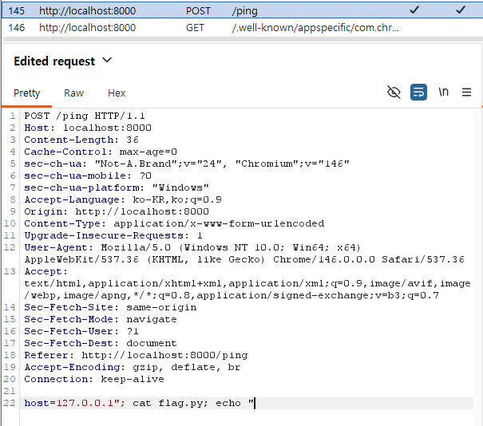
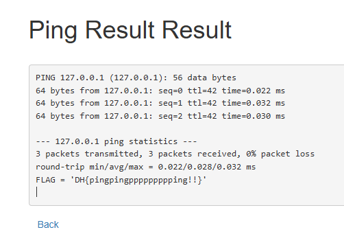
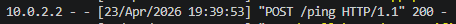

# [Dreamhack] Command Injection-1 - Web Hacking

## 1. 문제 개요
* **문제 링크:** [Dreamhack - Command Injection-1](https://dreamhack.io/wargame/challenges/44)

* **분야:** Web

* **목표:** 특정 Host에 ping을 보내는 웹 서비스에서 Command Injection 취약점을 찾아 `flag.py`의 내용을 읽어내기.



## 2. 취약점 분석
제공된 `app.py` 소스 코드 분석

```python
host = request.form.get('host')
        cmd = f'ping -c 3 "{host}"'
        try:
            output = subprocess.check_output(['/bin/sh', '-c', cmd], timeout=5)
```
* 분석 결과, 사용자의 입력값(`host`)이 아무런 필터링 없이 `/bin/sh -c` 의 인자로 전달되어 쉘 단에서 해석되도록 구현된 핵심 취약점 발견.

## 3. 클라이언트 검증 우회

서버로 악성 명령어를 보내기 전, 브라우저 단에서 특수문자 입력을 차단하는 `pattern` 속성을 우회하기 위해 두 가지 방식을 적용함.

### 3.1. 브라우저 개발자 도구(F12) 활용
* **방식:** 브라우저 개발자 도구를 열어 HTML `<input>` 태그에 설정된 `pattern` 속성을 강제로 삭제하여 검증 로직을 무력화.







### 3.2. 프록시 도구(Burp Suite) 활용

* **방식:** 브라우저에서는 정상적인 IP(예: `8.8.8.8`)를 입력하여 클라이언트 검증을 자연스럽게 통과시킨 후, Burp Suite의 Intercept 기능을 통해 서버로 전송되는 Request 패킷을 낚아채어(Intercept) 악성 페이로드로 변조함.





## 4. 서버 측 방어 로직 우회 
단순 명령어 주입(`; cat flag.py`) 시도 시 서버 에러가 발생하는 것을 확인하고, 서버 측의 명령어 실행 구조를 분석하여 최종 페이로드를 작성함.

* **서버 방어 추정:** 서버가 사용자 입력값을 큰따옴표(`" "`)로 묶어서 하나의 문자열로 처리하려 시도함.

* **우회 기법 (Escape):** 페이로드에 큰따옴표(`"`)를 직접 입력하여 서버의 구문을 강제로 닫고, 세미콜론(`;`)으로 새로운 명령어를 실행시킴. 마지막에 남는 서버 측의 따옴표는 에러를 유발하지 않도록 처리함.

**[최종 페이로드]**
`127.0.0.1"; cat flag.py; echo "`

**[Raw HTTP Request(프록시 변조 패킷)]**



## 5. 결과
명령어가 성공적으로 실행되어 서버에서 핑 결과와 함께 플래그 값이 출력됨을 확인.



## 6. 로그 분석
* **공격 흔적:** 공격 성공 직후 접근 로그 확인.



* **분석:** 해당 Command Injection은 `POST` 메서드로 페이로드를 전송했음. 
기본 웹 서버 접근 로그에는 내부 내용 없이 `POST /ping` 경로만 기록될 뿐, HTTP Body에 숨겨진 실제 악성 페이로드(`127.0.0.1"; cat flag.py; echo `)는 기록되지 않는 한계점을 확인.

* **로깅 보완점:** 실제 운영 환경에서는 WAF를 통해 POST Body를 검사하거나, 어플리케이션 단에서 사용자의 입력값(`host`)을 검증하기 전 별도의 감사 로그로 남기는 로직이 필수적임.

## 7. 대응 방안
* **원인:** 사용자의 입력값을 검증 없이 문자열로 조립하여 리눅스 쉘(`/bin/sh`)에 통째로 전달했기 때문에 발생.

* **해결책:** `subprocess.check_output` 사용 시 쉘을 거치지 않도록, 실행할 프로그램(`ping`)과 인자값을 리스트 형태로 분리하여 전달. 이렇게 하면 사용자의 입력에 포함된 메타 문자(`;`)가 쉘 명령어로 해석되지 않고 단순 문자열로 처리되어 안전함 (Prepared Statement와 유사한 원리).

```python
# 1. 취약한 코드 (사용자의 입력을 문자열로 합쳐서 쉘에게 통째로 전달함)
host = request.form.get('host')
cmd = f'ping -c 3 "{host}"'
output = subprocess.check_output(['/bin/sh', '-c', cmd], timeout=5)

# 2. 안전한 코드 (프로그램(ping)과 인자(옵션, IP)를 리스트 형태로 분리하여 전달함)
host = request.form.get('host')
# cmd = f'ping ...' 조립 과정 삭제
output = subprocess.check_output(['ping', '-c', '3', host], timeout=5)
```