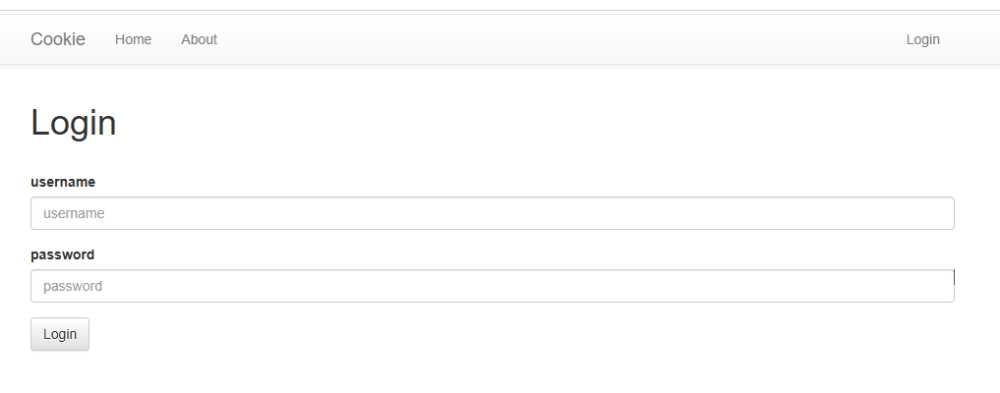
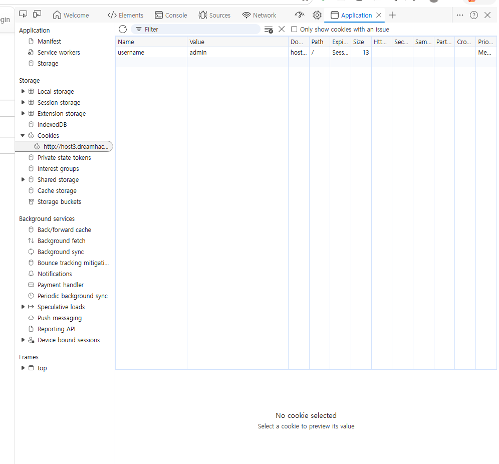
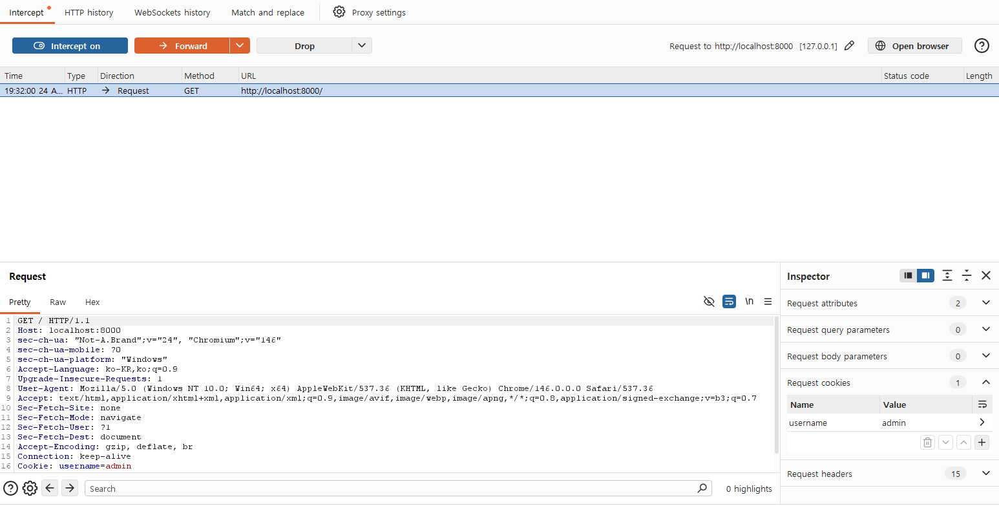
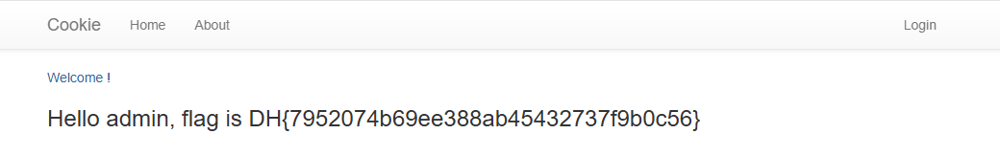

# [Dreamhack] Cookie - Web Hacking

## 1. 문제 개요
* **문제 링크:** [Dreamhack - cookie](https://dreamhack.io/wargame/challenges/6)

* **분야:** Web

* **목표:** 쿠키를 이용한 인증 로직의 취약점을 파악하고 관리자(`admin`) 권한을 획득하여 플래그를 탈취.



## 2. 취약점 분석
제공된 `app.py` 소스 코드에서, 메인 페이지(`/`) 접속 시 사용자의 권한을 검증하는 과정에서 결함 발견.

```python
@app.route('/')
def index():
    # 1. 사용자의 브라우저에서 보낸 쿠키 중 'username' 값을 그대로 가져옴
    username = request.cookies.get('username', None)
    
    if username:
        # 2. [취약점 발생] 쿠키 값이 "admin"인지 여부만 확인하고 플래그를 노출함

        # 비밀번호 확인이나 세션 검증 로직이 전혀 존재하지 않음

        return render_template('index.html', text=f'Hello {username}, {"flag is " + FLAG if username == "admin" else "you are not admin"}')
    
    return render_template('index.html')
```

* **분석 결론:** 서버는 클라이언트가 조작할 수 있는 평문 쿠키 값(`username`)을 신뢰하고 있음. 따라서 관리자 계정의 비밀번호를 몰라도, 브라우저에서 쿠키 값만 `admin`으로 위조하여 전송하면 인증을 우회할 수 있음.

* 즉, 사용자가 임의로 쿠키의 `username` 값을 `admin`으로 조작하여 서버에 전송하면, 서버는 이를 관리자의 정상적인 요청으로 착각하게 됨.

## 3. 공격 수행
서버가 쿠키 값을 무조건 신뢰한다는 점을 이용하여 클라이언트 측에서 쿠키 변조 공격을 수행.

### 3.1. 브라우저 개발자 도구를 활용한 클라이언트 조작



1. 개발자 도구의 `Application` -> `Cookies` 탭으로 이동.
2. 새로 생성한 쿠키의 `Name`을 `username`으로 설정.
3. 해당 쿠키의 `Value`를 `admin`으로 변조.
4. 웹 페이지를 새로고침하여 조작된 쿠키를 서버로 전송.

### 3.2. Burp Suite를 활용한 HTTP 패킷 프록시 변조



* **방식:** 서버로 전송되는 GET 요청을 Proxy로 가로채어, Cookie 헤더의 값을 조작하여 Forwarding 함.

하단의 Cookie: username=admin에서 확인 가능

## 4. 획득 결과
조작된 쿠키를 받은 서버가 관리자 권한을 부여하며 플래그를 정상적으로 출력.



* **FLAG:** `DH{7952074b69ee388ab45432737f9b0c56}`

## 5. 대응 방안
이러한 취약점을 막기 위해서는 클라이언트(브라우저)에서 보내는 값을 직접적인 인증 수단으로 사용해서는 안 됨.

* **세션 사용:** 로그인 시 서버 측 메모리나 DB에 무작위로 생성된 '세션 ID'를 저장하고, 클라이언트에게는 이 세션 ID만 쿠키로 발급해야 함.

* **무결성 검증:** 쿠키에 중요한 정보를 담아야 한다면, 서명을 추가하거나 암호화하여 클라이언트가 임의로 값을 조작할 수 없도록 설계해야 함.