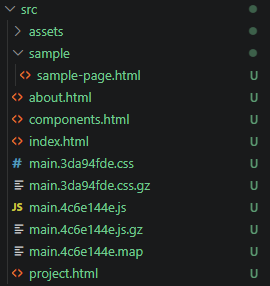
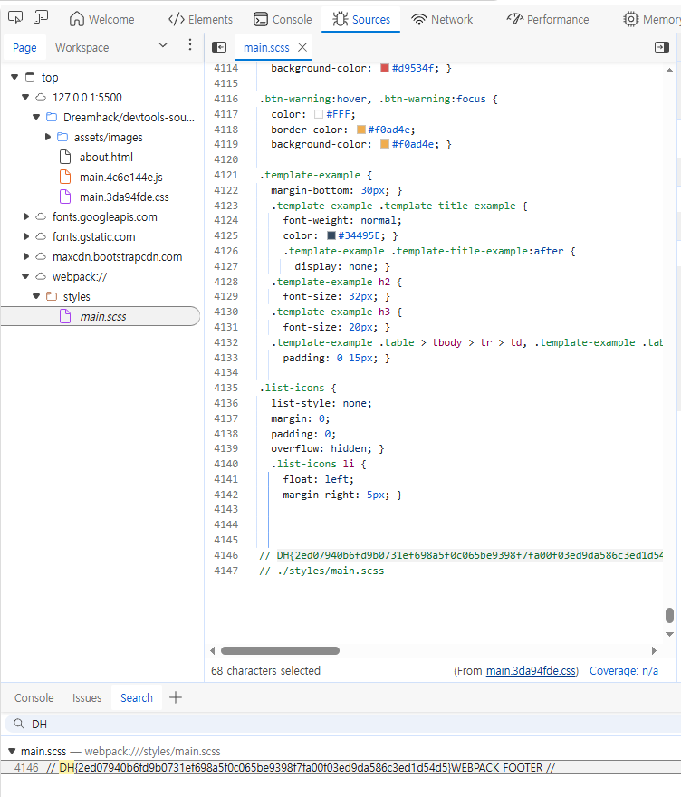

# [Dreamhack] devtools-sources - Web Hacking

## 1. 문제 개요
* **문제 링크:** [Dreamhack - devtools-sources](https://dreamhack.io/wargame/challenges/267)

* **분야:** Web

* **목표:** 프론트엔드 환경에서 브라우저 개발자 도구(DevTools)를 활용하여 숨겨진 플래그 탈취.

## 2. 취약점 분석
제공된 문제 파일들을 분석한 결과, 서버사이드(백엔드) 로직 없이 프론트엔드 정적 파일들로만 구성되어 있음을 확인.

* **분석 결론:** 디렉토리 구조를 보면 배포용으로 압축 및 난독화된 파일(`main.3da94fde.css`, `main.4c6e144e.js`)과 함께 **소스맵(Source Map) 파일(`main.4c6e144e.map`)이 퍼블릭 디렉토리에 그대로 노출**되어 있음. 공격자는 이 `.map` 파일을 통해 브라우저에서 난독화되기 이전의 원본 소스 코드를 100% 복원하여 열람할 수 있음.

## 3. 공격 수행
로컬 환경에서 파이썬 웹 서버(`python3 -m http.server 8000`)를 구동하여 파일들을 브라우저에 로드한 뒤, 취약점을 검증.

### 3.1. 개발자 도구 및 Source Map 복원 활용
1. 브라우저를 통해 `about.html` 페이지에 접근하여 `main.css` 파일이 로드되도록 유도.
2. 브라우저 개발자 도구(`F12`)의 **Sources** 탭으로 이동.
3. `.map` 파일이 자동 인식되어 `webpack://` 경로 하위에 압축 전 원본 프로젝트 구조가 복원된 것을 확인.
4. 개발자 도구의 전체 검색(`Ctrl + Shift + F`) 기능을 사용하여 플래그 포맷인 `DH{`를 검색.

## 4. 획득 결과
검색 결과, 복원된 원본 파일인 `styles/main.scss`의 4146번 라인 주석에 하드코딩된 플래그를 발견함.

* **FLAG:** `DH{2ed07940b6fd9b0731ef698a5f0c065be9398f7fa00f03ed9da586c3ed1d54d5}`

## 5. 대응 방안
웹 애플리케이션 프로덕션(운영) 환경 배포 시, 디버깅 목적으로 생성되는 소스맵(`.map`) 파일은 외부 사용자가 접근할 수 없도록 반드시 제거해야 함.

* **Webpack 설정 보완:** 빌드 설정 파일(`webpack.config.js`)에서 `devtool` 옵션을 프로덕션 빌드 시 `hidden-source-map`이나 `false`로 설정하여, 에러 트래킹 시스템에서만 사용하고 퍼블릭 디렉토리에는 노출되지 않도록 조치.