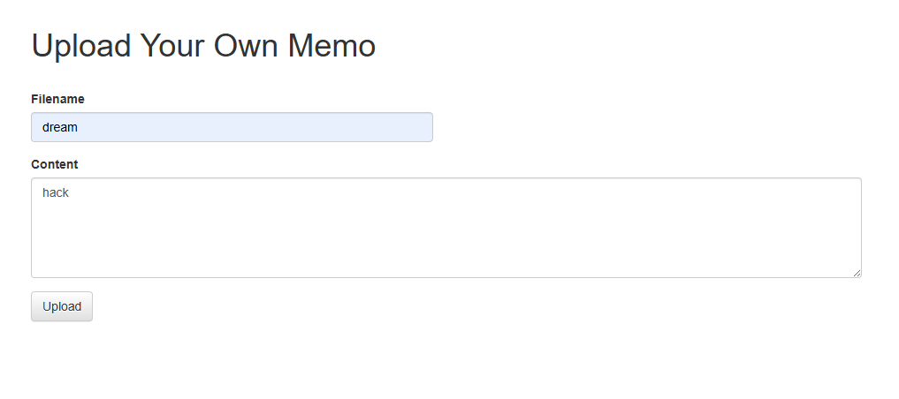
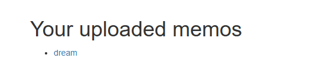
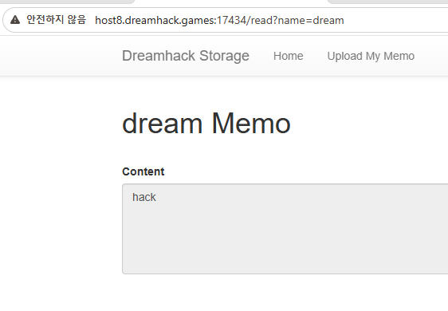
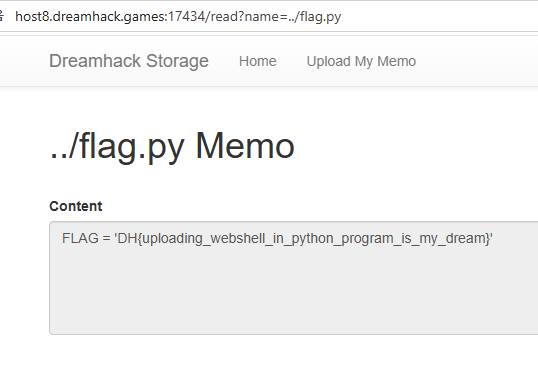

# [Dreamhack] File Download-1 - Web Hacking

## 1. 문제 개요

* **문제 링크:** [Dreamhack - file-download-1](https://dreamhack.io/wargame/challenges/37)

* **분야:** Web

* **목표:** 경로 조작 취약점을 이용하여 상위 디렉토리에 숨겨진 `flag.py` 파일 탈취.

## 2. 취약점 분석
`app.py` 소스 코드를 분석한 결과, 파일을 업로드하는 `/upload` 엔드포인트에는 `..`을 필터링하는 로직이 존재하나, 파일을 읽는 `/read` 엔드포인트에는 입력값 검증이 누락되어 있음을 확인.

```python
@APP.route('/upload', methods=['GET', 'POST'])
def upload_memo():
    if request.method == 'POST':
        filename = request.form.get('filename')
        content = request.form.get('content').encode('utf-8')

        if filename.find('..') != -1:
            return render_template('upload_result.html', data='bad characters,,')

...생략...

@APP.route('/read')
def read_memo():
    error = False
    data = b''

    # 취약점 발생 지점: 사용자의 입력값(name 파라미터)을 검증 없이 그대로 받아옴
    filename = request.args.get('name', '')

    try:
        # 받아온 filename을 기반으로 경로를 구성하여 파일을 염 (경로 조작 가능)
        with open(f'{UPLOAD_DIR}/{filename}', 'rb') as f:
            data = f.read()
    except (IsADirectoryError, FileNotFoundError):
        error = True
```

* **분석 결론:** `/read` 라우터에서 파라미터로 전달받은 `filename` 값을 필터링 없이 `open()` 함수에 전달하고 있음. 공격자는 `../` 문자를 삽입하여 `uploads` 디렉토리를 벗어나 시스템 내부의 다른 파일에 접근할 수 있음.

## 3. 공격 수행

1. 메모 업로드 기능을 통해 임의의 메모(`dream`)를 생성하고, 해당 메모를 클릭하여 읽기 페이지로 이동함.




2. 브라우저 주소창을 확인하면 `/read?name=dream` 형태로 파라미터가 전달되는 것을 알 수 있음.



3. 주소창의 파라미터 값을 상위 경로로 이동하는 문자열을 포함하여 `../flag.py`로 변조한 뒤 서버에 요청함. (URL: `/read?name=../flag.py`)



## 4. 획득 결과
서버 내부 로직이 `uploads/../flag.py`를 해석하여 최상위 디렉토리에 있는 `flag.py`의 내용이 화면에 노출됨.

* **FLAG:** `DH{uploading_webshell_in_python_program_is_my_dream}`

## 5. 대응 방안
파일 다운로드 및 읽기 기능 구현 시 사용자의 입력값을 그대로 파일 경로로 사용하지 않도록 철저한 검증이 필요함.

* **입력값 필터링 및 안전한 함수 사용:** `/read` 라우터에서도 `..` 혹은 `/` 와 같은 경로 조작 문자열을 차단하는 로직을 추가하거나, 파이썬의 `os.path.basename()`과 같은 함수를 사용하여 전달받은 경로에서 순수 파일 이름만 추출하도록 수정해야 함.
