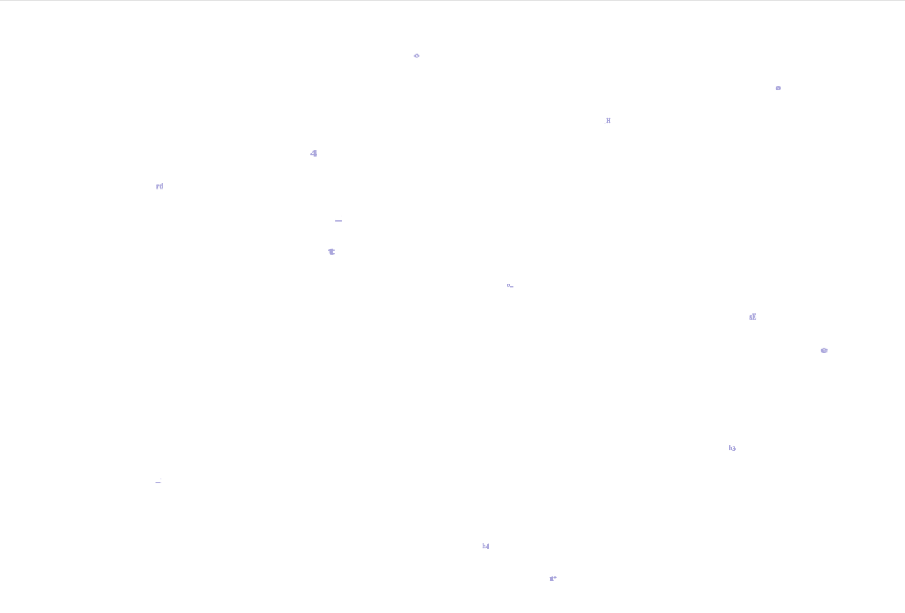
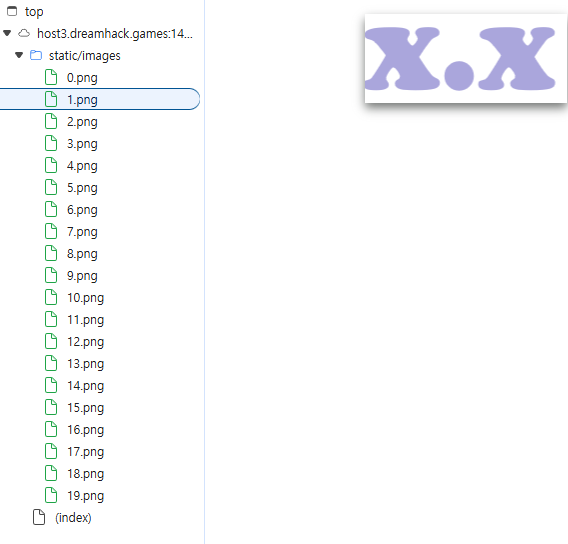
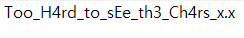

# [Dreamhack] flying-chars - Web Hacking

## 1. 문제 개요

* **문제 링크:** [Dreamhack - flying-chars](https://dreamhack.io/wargame/challenges/850)

* **분야:** Web

* **목표:** 프론트엔드 환경에서 자바스크립트 애니메이션으로 시각적 교란이 적용된 정적 데이터를 분석하여 숨겨진 플래그 탈취.

## 2. 취약점 분석
제공된 문제는 서버사이드(백엔드) 로직 및 첨부파일 없이, 프론트엔드 파일로만 구성되어 브라우저에 렌더링됨을 확인.



```js
    const img_files = ["/static/images/10.png", "/static/images/17.png", "/static/images/13.png", "/static/images/7.png","/static/images/16.png", "/static/images/8.png", "/static/images/14.png", "/static/images/2.png", "/static/images/9.png", "/static/images/5.png", "/static/images/11.png", "/static/images/6.png", "/static/images/12.png", "/static/images/3.png", "/static/images/0.png", "/static/images/19.png", "/static/images/4.png", "/static/images/15.png", "/static/images/18.png", "/static/images/1.png"];
    var imgs = [];
    for (var i = 0; i < img_files.length; i++){
      imgs[i] = document.createElement('img');
      imgs[i].src = img_files[i]; 
      imgs[i].style.display = 'block';
      imgs[i].style.width = '10px';
      imgs[i].style.height = '10px';
      document.getElementById('box').appendChild(imgs[i]);
    }

    const max_pos = self.innerWidth;
    function anim(elem, pos, dis){
      function move() {
        pos += dis;
        if (pos > max_pos) {
          pos = 0;
        }
        elem.style.transform = `translateX(${pos}px)`;
        requestAnimationFrame(move);
      }
      move();
    }

    for(var i = 0; i < 20; i++){
      anim(imgs[i], 0, Math.random()*60+20);
    }
```

* **분석 결론:** 화면상에서는 자바스크립트의 `Math.random()`을 활용한 애니메이션 탓에 글자들이 무작위 속도로 움직여 육안으로 식별이 불가능함. 그러나 소스 코드를 분석한 결과, 화면을 렌더링하기 전 원본 데이터인 `img_files` 배열에는 이미지 경로들이 **플래그 문자열 순서 그대로 정렬**되어 클라이언트에 그대로 노출되어 있음. 공격자는 시각적 교란을 무시하고 이 정적 배열 데이터를 통해 원본 플래그를 100% 복원하여 열람할 수 있음.

## 3. 공격 수행
웹 브라우저를 통해 문제 페이지에 접근한 뒤, 개발자 도구를 활용하여 취약점을 검증.

### 3.1. 개발자 도구 및 정적 배열 데이터 복원 활용
1. 브라우저를 통해 문제 페이지에 접근하여 자바스크립트가 로드되도록 유도.

2. 브라우저 개발자 도구의 **Elements** 또는 **Sources** 탭으로 이동.

3. HTML 문서 내 `<script>` 태그를 확인하여 `img_files` 배열의 선언부를 확인.

4. `for` 반복문 내 `appendChild` 로직을 통해 이미지가 배열 순서대로 DOM에 삽입됨을 파악.

5. 시각적 움직임을 무시하고, 배열에 나열된 이미지 파일(`/static/images/*.png`)을 순서대로 이어붙이거나 콘솔(`Console`)을 사용하여 데이터를 추출한 뒤 플래그 포맷인 `DH{` 형태로 조합. (제약 조건: x, s, o 소문자 / C 대문자 적용)





## 4. 획득 결과
배열 순서대로 이미지를 조합한 결과, 클라이언트 측에 하드코딩된 플래그를 발견함.

* **FLAG:** `DH{Too_H4rd_to_sEe_th3_Ch4rs_x.x}`

## 5. 대응 방안
웹 애플리케이션 프로덕션 환경 배포 시, 플래그와 같은 중요 민감 데이터는 클라이언트 사이드 스크립트에 평문이나 유추 가능한 배열 형태로 하드코딩되어 노출되지 않도록 반드시 제거해야 함.

* **아키텍처 검증 보완:** 중요 데이터(플래그) 검증 로직은 반드시 서버사이드에서 수행되도록 설계하고, 프론트엔드에서는 시각적 효과만 담당하도록 책임을 분리하여 조치.