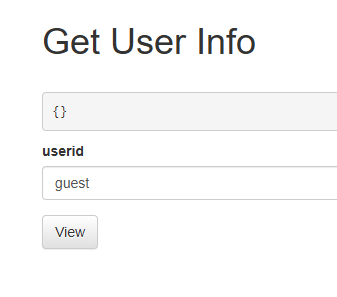
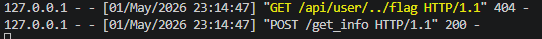
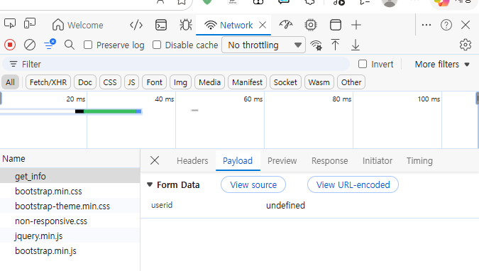
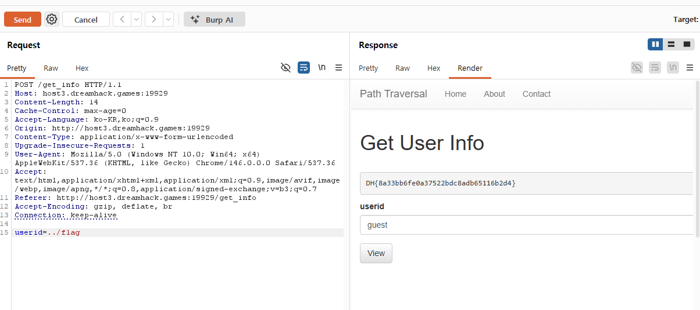
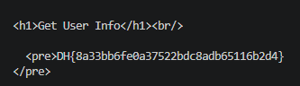

# [Dreamhack] Path Traversal - Web Hacking

## 1. 문제 개요
* **문제 링크:** [Dreamhack - pathtraversal](https://dreamhack.io/wargame/challenges/12)

* **분야:** Web

* **목표:** SSRF와 Path Traversal 취약점을 연계하여, 로컬(`127.0.0.1`)에서만 접근 가능한 내부 API(`/api/flag`)를 호출하고 플래그 탈취.

## 2. 취약점 분석
제공된 `app.py` 소스 코드를 분석한 결과, 사용자 입력을 받아 서버 내부에서 다시 통신을 요청하는 로직에 검증이 누락되어 있음을 확인.

```python
API_HOST = 'http://127.0.0.1:8000'
# ... (생략) ...

# app.py 취약점 핵심 로직
elif request.method == 'POST':
    userid = request.form.get('userid', '')
    # [!] 취약점 발생: 사용자의 입력값(userid)을 검증 없이 내부 URL 생성에 결합
    info = requests.get(f'{API_HOST}/api/user/{userid}').text
    return render_template('get_info.html', info=info)

# ... (생략) ...

# 공격 목표 지점
@app.route('/api/flag')
@internal_api
def flag():
    return FLAG
```

* **분석 결론:** 서버가 자기 자신(`127.0.0.1:8000`)에게 `requests.get`을 수행하므로 `@internal_api` 데코레이터의 로컬 IP 검증을 우회할 수 있음. 이때 `userid` 파라미터에 `../flag`를 삽입하면, Path Traversal 기법을 통해 원래 의도된 경로인 `/api/user/`를 벗어나 최종적으로 플래그를 반환하는 `/api/flag` 엔드포인트에 도달할 수 있음.

## 3. 공격 수행

프론트엔드의 입력 폼을 사용할 경우, 자바스크립트 등 프론트엔드의 방어/예외 처리 로직에 의해 사전에 정의되지 않은 입력값이 변조되거나 비정상 처리되어 결과값 `{}`가 반환되는 현상 확인. 이를 우회하기 위해 파이썬 스크립트를 작성하여 백엔드로 직접 페이로드 전송.


* ../flag를 입력 폼에 넣었을 때 결과: {} 가 반환됨

### 3.1. 시행착오 및 분석
취약점 공략을 위해 단계별로 접근하며 발생한 문제와 원인을 분석.

#### 1) 1차 시도 (로컬 환경): 서버 엔진별 경로 정규화(Normalization) 한계
*   **현상:** 로컬 테스트 환경(Flask)의 입력 폼에 `../flag` 페이로드를 전송했으나 `404 Not Found` 에러 발생.

*   **분석:** 터미널 로그 확인 결과, 페이로드는 서버 내부 호출 로직에 정상적으로 도달함(`GET /api/user/../flag`). 그러나 Flask 내장 개발 서버는 `../`와 같은 경로 탐색 문자를 스스로 계산(정규화)하지 않고 있는 그대로 라우팅 테이블과 비교하기 때문에 경로를 찾지 못한 것.

*   **가설 수립:** 실제 운영 서버의 웹 엔진(uWSGI)은 상위 경로(`../`)를 자동으로 정규화하여 `/api/flag`로 깔끔하게 전달할 것이므로, **실제 원격 서버에서는 이 페이로드가 통할 것**이라고 판단.



#### 2) 2차 시도 (원격 환경): 클라이언트 JavaScript 변조 함정

*   **현상:** 앞선 가설을 바탕으로 실제 원격 서버의 입력 폼에 `../flag`를 입력 후 전송했으나, 예상과 달리 결과값 `{}`가 반환됨.

*   **분석:** 원인을 찾기 위해 브라우저 개발자 도구의 Network 탭에서 패킷을 분석함. 그 결과, 프론트엔드 내부 스크립트가 사전에 정의된 리스트(`guest`, `admin`)에 없는 입력값을 `undefined`로 강제 변조하여 전송하고 있음을 발견. 이로 인해 서버는 존재하지 않는 `users['undefined']`를 조회하여 빈 딕셔너리를 반환했던 것.



#### 3) 최종 결론
성공적인 공격을 위해서는 **프론트엔드의 JS 변조 함정을 우회** 함과 동시에, **운영 서버의 경로 정규화 특성을 온전히 활용**할 수 있는 통신 수단이 필요함을 깨달음.

### 3.2. 버프 스위트(Burp Suite)를 이용한 최종 공격

앞선 시행착오를 바탕으로, 브라우저의 JavaScript 변조 함정을 완전히 우회하고 운영 서버의 경로 정규화 기능을 온전히 활용하기 위해 버프스위트를 이용한 직접 공격을 수행함.



* 버프 스위트의 **Repeater** 기능을 사용하여, 캡처된 POST 요청의 바디 파라미터 값을 `userid=../flag`로 직접 변조하여 전송함.

* 브라우저 단의 자바스크립트 개입 없이 원격 서버로 직접 페이로드가 전달되었으며, 서버의 경로 정규화 처리를 거쳐 원래 접근이 불가한 내부 API(`/api/flag`)가 성공적으로 호출됨.

* 버프 스위트 응답(Response) 화면을 통해 정상적으로 탈취된 플래그(FLAG)를 확인함.

### 3.3. Exploit 자동화 스크립트 작성 (`exploit.py`)
버프스위트를 통해 확인한 취약점 발생 원리를 바탕으로, 이를 원클릭으로 재현할 수 있도록 파이썬 `requests` 모듈을 이용해 자동화 스크립트를 작성함.

```python
import requests

# 실전 드림핵 원격 서버 주소
url = "http://host3.dreamhack.games:19929/get_info"

# 프론트엔드(JS)를 거치지 않고 서버로 직접 '../flag' 페이로드를 POST로 전송
data = {
    "userid": "../flag"
}

# 요청 전송 및 결과 수신
response = requests.post(url, data=data)

# 서버가 응답한(플래그가 포함된) HTML 내용 출력
print(response.text)
```


* 파이썬 스크립트 실행 결과, 자바스크립트의 방해 없이 원격 서버에서 정규화된 경로(/api/flag)의 데이터(FLAG)를 성공적으로 불러옴.

## 4. 획득 결과
익스플로잇 스크립트 실행 결과, 실제 운영 서버의 경로 정규화 처리를 거쳐 내부 API인 `/api/flag` 라우터가 정상적으로 호출되었으며 플래그를 탈취함.

* **FLAG:** `DH{8a33bb6fe0a37522bdc8adb65116b2d4}`

## 5. 대응 방안
사용자의 입력값이 서버 내부의 요청 URL이나 파일/디렉토리 경로 생성에 직접적으로 사용될 경우, 반드시 엄격한 입력값 검증 로직을 구현해야 함.

* **입력값 검증 및 화이트리스트 적용:** 전달받은 `userid` 파라미터에 `../` 등 경로 탐색에 사용되는 특수문자가 포함되어 있는지 필터링하거나, 사전에 정의된 `users` 딕셔너리의 키 값(`'0'`, `'1'` 등)에 존재하는 유효한 사용자인지 먼저 검증한 후 내부 통신을 수행하도록 로직 보완.