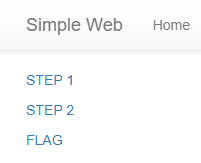
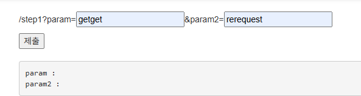
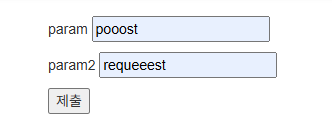
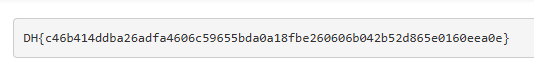

# [Dreamhack] simple-web-request - Web Hacking

## 1. 문제 개요
* **문제 링크:** [Dreamhack - simple-web-request](https://dreamhack.io/wargame/challenges/830)

* **분야:** Web

* **목표:** 제공된 Flask 웹 애플리케이션의 라우팅 소스 코드를 분석하고, 서버가 요구하는 올바른 HTTP GET 및 POST 요청 파라미터를 전송하여 단계별(STEP 1, STEP 2) 검증을 통과한 뒤 숨겨진 플래그 획득.

## 2. 서버 로직 및 소스코드 분석
제공된 `app.py` 소스 코드를 분석하여 각 라우트에서 요구하는 조건을 파악. 중간에 치팅 방지를 위한 세션 검증(난수 비교) 로직이 있어 순차적인 단계 진행이 필수.

* **`/step1` 라우트 (GET 요청 처리):**

```python
@app.route("/step1", methods=["GET", "POST"])
def step1():

    #### 풀이와 관계없는 치팅 방지 코드
    global step1_num
    step1_num = int.from_bytes(os.urandom(16), sys.byteorder)
    ####

    if request.method == "GET":
        prm1 = request.args.get("param", "")
        prm2 = request.args.get("param2", "")
        step1_text = "param : " + prm1 + "\nparam2 : " + prm2 + "\n"
        if prm1 == "getget" and prm2 == "rerequest":
            return redirect(url_for("step2", prev_step_num = step1_num))
        return render_template("step1.html", text = step1_text)
    else: 
        return render_template("step1.html", text = "Not POST")
```
  * 분석: URL의 쿼리 스트링(GET 방식)으로 파라미터를 받음.

  * 조건: `prm1 == "getget" and prm2 == "rerequest"` 조건을 만족해야 다음 단계로 정상 리다이렉트.


* **`/flag` 라우트 (POST 요청 처리):**

```python
@app.route("/flag", methods=["GET", "POST"])
def flag():
    if request.method == "GET":
        return render_template("flag.html", flag_txt="Not yet")
    else:

        #### 풀이와 관계없는 치팅 방지 코드
        prev_step_num = request.form.get("check", "")
        try:
            if prev_step_num == str(step2_num):
        ####

                prm1 = request.form.get("param", "")
                prm2 = request.form.get("param2", "")
                if prm1 == "pooost" and prm2 == "requeeest":
                    return render_template("flag.html", flag_txt=FLAG)
                else:
                    return redirect(url_for("step2", prev_step_num = str(step1_num)))
            return render_template("flag.html", flag_txt="Not yet")
        except:
            return render_template("flag.html", flag_txt="Not yet")
```

  * 분석: HTTP Request Body(POST 방식)로 파라미터를 받음.

  * 조건: 이전 단계의 난수 검증(`prev_step_num == str(step2_num)`)을 통과한 상태에서, `prm1 == "pooost" and prm2 == "requeeest"` 조건을 만족해야 최종 `FLAG` 변수 값을 렌더링.

## 3. 공격 수행 및 문제 풀이

### 3.1. STEP 1 통과 (GET 파라미터 조작)



1. 웹 브라우저에서 `STEP 1` 페이지로 이동.

2. 소스 코드 분석을 통해 알아낸 문자열을 폼에 입력.

   * `param`: **getget**
   * `param2`: **rerequest**

3. 제출 버튼을 누르면 `/step1?param=getget&param2=rerequest` 형식으로 서버에 GET 요청이 전송되며, 조건에 일치하여 난수 값을 품고 다음 단계 폼으로 리다이렉트.



### 3.2. FLAG 획득 (POST 파라미터 전송)
1. 정상적으로 리다이렉트 된 페이지(치팅 방지 코드가 hidden 폼으로 포함됨)에서 마지막 검증 값을 입력.

2. 소스 코드 분석을 통해 알아낸 문자열을 폼에 입력.

   * `param`: **pooost**
   * `param2`: **requeeest**

3. 제출 버튼을 누르면 POST 방식으로 데이터가 전송되며, 서버의 최종 검증을 통과하여 플래그 화면이 출력.



## 4. 획득 결과
모든 단계의 HTTP Method 요구사항과 파라미터 조건을 맞춰 전송한 결과, 성공적으로 플래그를 탈취.



* **FLAG:** `DH{c46b414ddba26adfa4606c59655bda0a18fbe260606b042b52d865e0160eea0e}`

## 5. 대응 방안
본 문제는 애플리케이션의 인증 및 인가 로직이 소스 코드에 평문으로 하드코딩되어 있고, 상태 유지를 위한 난수 값이 클라이언트(URL 파라미터 및 HTML Hidden 폼)를 통해 그대로 노출되는 취약점을 가지고 있음.

* **하드코딩 지양:** 인증에 필요한 중요 문자열("getget", "pooost" 등)이나 키 값을 소스 코드에 직접 기입하지 않고, 데이터베이스나 안전한 환경 변수를 통해 관리해야 함.

* **안전한 세션 관리:** 검증을 위한 난수 토큰 등을 URL이나 HTML 폼에 직접 노출하여 주고받는 대신, 서버 사이드 세션을 활용하거나 쿠키에 보안 속성(HttpOnly, Secure)을 적용하여 안전하게 상태를 관리해야 함.