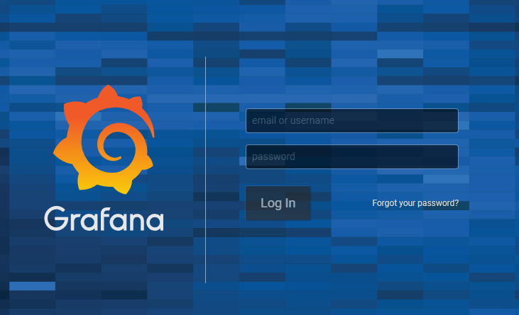
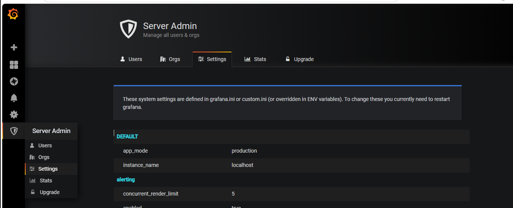
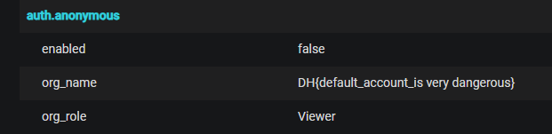

# [Dreamhack] web-misconf-1 - Web Hacking

## 1. 문제 개요
* **문제 링크:** [Dreamhack - web-misconf-1](https://dreamhack.io/wargame/challenges/45)

* **분야:** Web

* **목표:** 서비스 배포 시 발생한 기본 설정 미비 취약점을 이용해 관리자 권한을 획득하고 내부 설정에 숨겨진 플래그 탈취.

## 2. 취약점 분석
제공된 Dockerfile 및 초기 설정 파일(`defaults.ini`)을 분석한 결과, 오픈소스 모니터링 도구인 Grafana가 설치되어 있으며 초기 관리자 계정 비밀번호가 변경되지 않은 상태로 구동되고 있음을 확인.



* **분석 결론:** 서비스 벤더사에서 제공하는 널리 알려진 기본 자격 증명(`admin` / `admin`)을 그대로 사용하고 있어, 공격자는 별도의 익스플로잇 없이 최고 관리자 권한을 손쉽게 획득할 수 있음. 또한, 시스템 내부 설정값에 민감 정보가 하드코딩되어 노출될 위험이 존재함.

### 2.1. 로컬 설정 파일 분석
제공된 문제의 소스코드 압축 파일 내 `defaults.ini` 파일을 확인한 결과, `auth.anonymous` 섹션의 `org_name` 변수에 `DH{THIS_IS_FAKE_FLAG}`라는 가짜 플래그가 입력되어 있는 것을 확인.

```ini
[auth.anonymous]
# enable anonymous access
enabled = false

# specify organization name that should be used for unauthenticated users
org_name = DH{THIS_IS_FAKE_FLAG}
```

* **분석 결론:** 이를 통해 소스코드 자체에는 정답을 하드코딩하지 않았으며, 실제 드림핵 운영 서버가 구동될 때 환경 변수 주입이나 파일 교체를 통해 **진짜 플래그 값으로 덮어쓰기**를 진행한다는 시스템 아키텍처를 유추.

### 2.2. 관리자 초기 자격 증명 하드코딩 확인
`defaults.ini` 파일의 `[security]` 섹션을 상세 분석한 결과, 서비스 구동 시 생성되는 관리자의 이름(`admin_user`)과 비밀번호(`admin_password`)가 모두 `admin`으로 설정되어 있음을 확인.

```ini
[security]
# disable creation of admin user on first start of grafana
disable_initial_admin_creation = false

# default admin user, created on startup
admin_user = admin

# default admin password, can be changed before first start of grafana, or in profile settings
admin_password = admin
```

* **분석 결론:** 관리자가 해당 파일의 기본값을 수정하지 않고 배포할 경우, 누구나 공개된 소스코드나 벤더사 가이드를 통해 관리자 권한을 획득할 수 있는 상태.

## 3. 공격 수행
브라우저를 통해 대상 서버에 접근하여 취약점을 검증 및 익스플로잇.

### 3.1. 최고 관리자 권한 획득

1. 메인 로그인 페이지에서 확인된 기본 자격 증명인 `admin` / `admin`을 입력.

2. 정상적으로 인증을 통과하여 최고 관리자권한으로 대시보드 진입 성공.

3. 좌측 메뉴 하단의 방패 아이콘(**Server Admin**)을 클릭하여 서버 설정 및 조직 관리 메뉴로 이동.



### 3.2. 내부 설정 및 민감 정보 탐색
1. Server Admin 페이지 내 **Settings** 탭으로 이동.

2. 서버가 실행되면서 로드된 환경 변수 및 설정 파일 데이터 열람.

3. 설정 내역 중 `auth.anonymous` 섹션의 `org_name` 변수 등에 출제자가 환경 변수로 주입한 플래그 문자열이 평문으로 저장된 것을 확인.



## 4. 획득 결과
접근 통제가 누락된 관리자 페이지를 통해 실제 가동 중인 서버의 메모리/DB에 로드된 민감 정보를 성공적으로 탈취함.

* **FLAG:** `DH{default_account_is very dangerous}`

## 5. 대응 방안
시스템 프로덕션 환경 배포 시, 설치형 솔루션이 제공하는 기본 자격 증명은 반드시 복잡성이 확보된 강력한 패스워드로 즉시 변경해야 함. 

* **기본 설정 보안:** Grafana 인스턴스 배포 시 설정 파일(`grafana.ini`) 내 `admin_password`를 안전하게 변경하거나, 컨테이너 환경의 경우 환경 변수(`GF_SECURITY_ADMIN_PASSWORD`)를 통해 초기 비밀번호를 난수화하여 주입.

* **민감 정보 관리 강화:** 플래그나 인증 키와 같은 민감한 정보는 `org_name`과 같이 일반적인 환경 설정 변수에 하드코딩하지 않아야 하며, 안전한 시크릿 관리 도구를 통해 아키텍처를 구성해야 함.