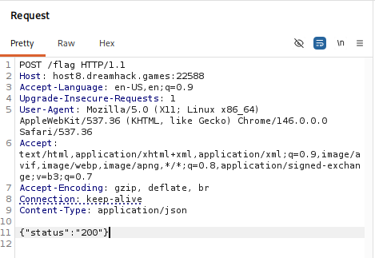
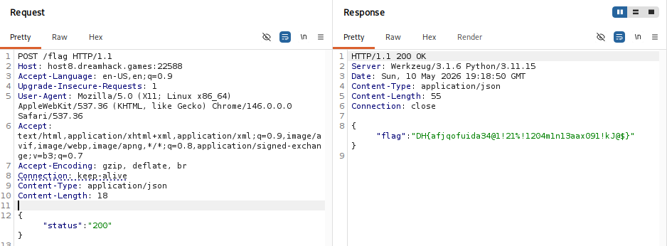

# [Dreamhack] 403 Forbidden - Web Hacking

## 1. 문제 개요

* **문제 링크:** [Dreamhack 403-forbbiden](https://dreamhack.io/wargame/challenges/2786) 

* **분야:** Web

* **목표:** 백엔드 로직을 분석하여 플래그 획득 조건을 파악하고, 프록시 도구를 이용해 HTTP 요청을 변조하여 숨겨진 플래그 탈취.

## 2. 취약점 분석
제공된 소스 코드를 통해 플래그를 반환하는 백엔드의 요구 조건을 확인.

### 2.1. 프론트엔드 로직 (`INDEX.HTML`)
```javascript
fetch("/flag", {
    method: "POST",
    headers: { "Content-Type": "application/json" },
    body: JSON.stringify({ status: "200" })
})
```

### 2.2. 백엔드 로직 (`app.py`)
```python
@app.route("/flag", methods=["POST"])
def flag():
    data = request.get_json(silent=True)
    if data and str(data.get("status")) == "200":
        return jsonify({"flag": FLAG})
    return jsonify({"error": "Forbidden"}), 403
```
* **분석 결론:** `/flag` 경로로 **POST 요청**을 보내야 하며, 요청 헤더는 JSON 형식(`application/json`)을 명시해야 함. 또한 바디(Body) 데이터 내에 **`"status": "200"`** 이라는 값이 포함되어 있어야 `403 Forbidden` 에러를 우회하고 정상적으로 플래그를 반환함.

## 3. 공격 수행
Burp Suite의 Repeater 기능을 활용하여 정상적인 HTTP 요청을 가로채고 조건을 만족하도록 변조하여 전송.



1. 대상 엔드포인트를 `POST /flag`로 변경.

2. 헤더에 `Content-Type: application/json`을 추가하여 데이터 형식을 명시.

3. 헤더 작성이 끝난 후 빈 줄(CRLF)을 하나 띄우고 JSON 문법에 맞게 `{"status":"200"}` 페이로드 삽입 후 전송.

## 4. 획득 결과
서버의 `if` 조건문을 성공적으로 통과하여 200 OK 상태 코드와 함께 JSON 형태로 플래그가 반환됨.



* **FLAG:** `DH{afjqofuida34@l!21%!1204mlnl3aax091!kJ@$}`

## 5. 대응 방안
본 취약점은 서버가 클라이언트에서 전송한 임의의 입력값(`status` 파라미터)을 검증 없이 신뢰하여 주요 권한(플래그 조회)을 부여했기 때문에 발생함.

* **클라이언트 신뢰 금지:** 클라이언트가 조작할 수 있는 HTTP 요청 데이터를 기반으로 인증 및 인가 로직을 처리해서는 안 됨.

* **서버 사이드 검증:** 중요 정보나 특정 페이지에 대한 접근 권한은 서버 측에서 세션을 확인하거나, 검증된 인증 토큰을 검사하는 방식으로 안전하게 구현해야 함.