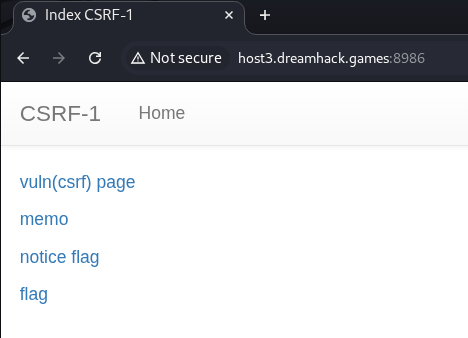
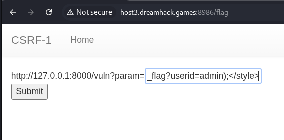
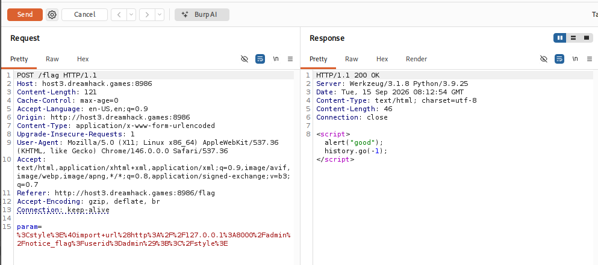
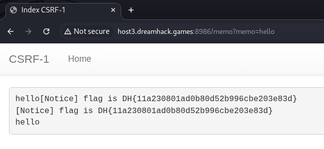

# [Dreamhack] CSRF-1 - Web Hacking

## 1. 문제 개요

* **문제 링크:** [Dreamhack - csrf-1](https://dreamhack.io/wargame/challenges/26)

* **분야:** Web

* **목표:** CSRF 취약점을 이용하여 관리자 전용 라우트(`/admin/notice_flag`)를 트리거, 플래그 획득

## 2. 취약점 분석
제공된 `app.py` 소스 코드 분석 결과, `/vuln` 라우트는 사용자 입력값(`param`)을 소문자로 변환한 뒤 `frame`, `script`, `on` 문자열을 `*`로 치환하는 블랙리스트 필터를 거쳐 서버 응답에 그대로 반사(Reflected)하는 구조로 확인.

```python
# [app.py] /vuln 라우트 - 블랙리스트 필터링 후 반사
@app.route("/vuln")
def vuln():
    param = request.args.get("param", "").lower()
    xss_filter = ["frame", "script", "on"]
    for _ in xss_filter:
        param = param.replace(_, "*")
    return param
```

```python
# [app.py] /admin/notice_flag 라우트 - IP 기반 인증만 존재
@app.route("/admin/notice_flag")
def admin_notice_flag():
    global memo_text
    if request.remote_addr != "127.0.0.1":
        return "Access Denied"
    if request.args.get("userid", "") != "admin":
        return "Access Denied 2"
    memo_text += f"[Notice] flag is {FLAG}\n"
    return "Ok"
```

```python
# [app.py] /memo 라우트 - 세션 구분 없는 전역 변수 저장소
memo_text = ""

@app.route("/memo")
def memo():
    global memo_text
    text = request.args.get("memo", None)
    if text:
        memo_text += text
    return render_template("memo.html", memo=memo_text)
```

* **분석 결론:** `frame`, `script`, `on` 세 키워드만 차단하는 블랙리스트 필터로, 이벤트 핸들러나 `<script>` 태그 없이도 리소스를 자동 요청하는 `<style>@import` 구문은 필터 우회 가능. `/admin/notice_flag`는 `remote_addr` 기준 IP 인증만 수행하는 구조로, 서버 내부에서 실행되는 Selenium 봇이 스스로 호출하는 시나리오에서는 무력화. 유출된 플래그는 세션과 무관한 전역 변수 `memo_text`에 저장되어 `/memo`로 직접 조회 가능한 구조.

## 3. 공격 수행

### 3.1. 서비스 구조 확인
1. 서버 실행 후 메인 페이지 접속, `vuln(csrf) page`, `memo`, `notice flag`, `flag` 네 개 엔드포인트 존재 확인.



### 3.2. 페이로드 작성 및 제출
2. `/flag` 페이지의 입력폼에 필터 우회용 CSRF 페이로드 입력.

```html
<!-- Payload - JS 실행 없이 CSS @import로 admin 라우트 자동 호출 -->
<style>@import url(http://127.0.0.1:8000/admin/notice_flag?userid=admin);</style>
```



3. Burp Suite Proxy로 해당 POST 요청 캡처, 인코딩된 원본 payload 및 응답 확인. 응답으로 `<script>alert("good");history.go(-1);</script>` 확인, 관리자 봇(Selenium)이 쿠키를 들고 `/vuln?param=<페이로드>`에 정상 접속하여 CSRF가 트리거되었음을 의미.



### 3.3. 유출된 플래그 확인
4. 관리자 봇의 요청 처리 이후, 브라우저로 `/memo`에 직접 접속하여 전역 변수에 누적된 플래그 확인.



## 4. 획득 결과
브라우저에서 `/memo` 페이지 접속 결과, 관리자 봇이 남긴 공지 메시지를 통해 서버 플래그 확인.

* **FLAG:** `DH{11a230801ad0b80d52b996cbe203e83d}`

## 5. 대응 방안
사용자 입력값을 서버 응답에 그대로 반사하면서 발생하는 위협이며, 블랙리스트 방식 필터의 한계와 IP 기반 인증의 취약성이 결합된 구조이므로 복수 계층에서의 대응 필요.

* **출력값 인코딩(Output Encoding) 적용:** `param`을 응답에 반영하기 전 `html.escape()` 등으로 `<`, `>`, `"` 등을 이스케이프 처리, HTML/CSS 컨텍스트 해석 자체를 차단.

* **블랙리스트 대신 화이트리스트 필터 전환:** `frame`, `script`, `on` 등 특정 키워드만 차단하는 방식 대신, 허용된 문자(영숫자 등)만 통과시키는 화이트리스트 기반 검증으로 전환.

* **Content-Security-Policy(CSP) 설정:** `style-src` 제한을 통해 외부 리소스를 불러오는 `@import` 등 인라인 스타일 실행 자체를 차단.

* **내부 전용 라우트에 별도 인증 토큰 적용:** `remote_addr` 단일 조건 대신, 관리자 세션 토큰이나 CSRF 토큰을 추가 검증, 서버 내부 컴포넌트(봇 등)가 임의로 호출 가능한 구조 자체를 차단.

* **응답 상태 저장 방식 개선:** `memo_text`와 같은 전역 변수 대신 세션별로 격리된 저장소 사용, 민감 정보가 공용 저장소에 누적되지 않도록 설계.

## 6. 블루팀 관점 요약
보안관제 및 침해사고 대응(IR) 관점에서, JS 실행 없는 CSS 기반 리소스 로드를 이용한 내부 라우트 트리거 및 정보 유출 행위 탐지.

* **WAF 및 웹 서버 로그 분석:** Access/Error 로그 모니터링 시, `POST /flag`의 파라미터에 `@import`, `<style`, `url(` 등 CSS 기반 자동 요청 트리거 시그니처가 포함된 비정상 트래픽 식별.

* **침해사고 대응(IR) 시나리오:** 유사 페이로드 삽입 시도 탐지 시, 해당 시간대 `/admin/`으로 시작하는 내부 전용 엔드포인트에 대한 비정상 호출 여부와 `/memo` 등 공용 저장소에 민감 정보가 유출된 이력이 있는지 전수 조사.

* **네트워크 기반 탐지 룰 제안 (Snort 3):**

  - `POST /flag` 요청의 body 내 `<style`과 `@import` 키워드가 동시 존재하는 패턴 탐지.

  - `alert tcp $EXTERNAL_NET any -> $HTTP_SERVERS $HTTP_PORTS (msg:"[Web] CSRF via CSS @import - Filter Bypass"; flow:to_server,established; http_method; content:"POST"; http_uri; content:"/flag"; http_client_body; content:"<style"; nocase; http_client_body; content:"@import"; nocase; sid:1000004; rev:1;)`