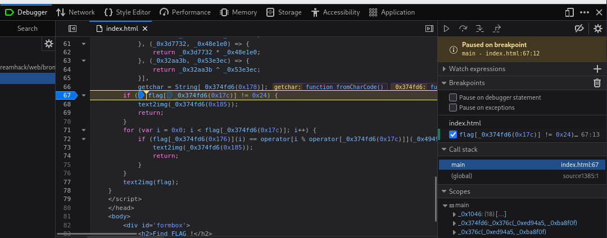
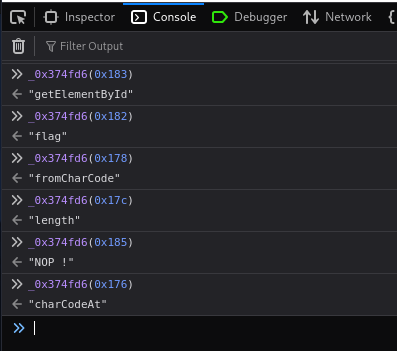
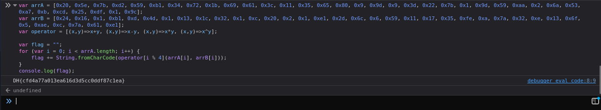
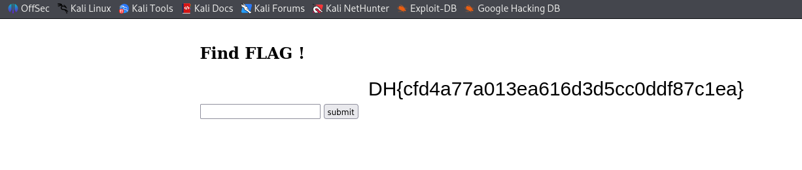

# [Dreamhack] FunJS - Web Hacking

## 1. 문제 개요

* **문제 링크:** [Dreamhack - funjs](https://dreamhack.io/wargame/challenges/116)

* **분야:** Web

* **목표:** 난독화된 클라이언트 사이드 JS 검증 로직을 분석해 조건을 만족하는 flag 값 계산

## 2. 취약점 분석
제공된 `index.html` 소스 코드 분석 결과, `submit` 버튼의 `onclick`에 연결된 `main()` 함수 내부에서 사용자가 입력한 flag 값을 전적으로 클라이언트 측 JS만으로 검증하는 구조로 확인. 검증에 사용되는 상수 배열과 연산 로직이 서버가 아닌 브라우저에 그대로 노출되어 있으며, 문자열 리터럴은 obfuscator.io류 자동 난독화 도구의 배열+오프셋 치환 방식(`_0x1046` 배열 + `_0x374fd6(idx)` 디코딩 함수)으로만 가려져 있어 디버거로 즉시 원복 가능한 구조.

```javascript
// [index.html] flag 값 획득 및 검증용 상수 - 함수/배열 구조는 자동 난독화 도구가 생성한 형태
var flag = document[_0x374fd6(0x183)](_0x374fd6(0x182))['value'],
    _0x4949 = [0x20, 0x5e, 0x7b, 0xd2, 0x59, 0xb1, 0x34, 0x72, 0x1b, 0x69, 0x61, 0x3c, 0x11, 0x35, 0x65, 0x80, 0x9, 0x9d, 0x9, 0x3d, 0x22, 0x7b, 0x1, 0x9d, 0x59, 0xaa, 0x2, 0x6a, 0x53, 0xa7, 0xb, 0xcd, 0x25, 0xdf, 0x1, 0x9c],
    _0x42931 = [0x24, 0x16, 0x1, 0xb1, 0xd, 0x4d, 0x1, 0x13, 0x1c, 0x32, 0x1, 0xc, 0x20, 0x2, 0x1, 0xe1, 0x2d, 0x6c, 0x6, 0x59, 0x11, 0x17, 0x35, 0xfe, 0xa, 0x7a, 0x32, 0xe, 0x13, 0x6f, 0x5, 0xae, 0xc, 0x7a, 0x61, 0xe1],
    operator = [(_0x3a6862, _0x4b2b8f) => {
                return _0x3a6862 + _0x4b2b8f;
            }, (_0xa50264, _0x1fa25c) => {
                return _0xa50264 - _0x1fa25c;
            }, (_0x3d7732, _0x48e1e0) => {
                return _0x3d7732 * _0x48e1e0;
            }, (_0x32aa3b, _0x53e3ec) => {
                return _0x32aa3b ^ _0x53e3ec;
            }];
```

```javascript
// [index.html] 길이/문자 단위 검증 로직
if (flag[_0x374fd6(0x17c)] != 0x24) {
    text2img(_0x374fd6(0x185));
    return;
}
for (var i = 0x0; i < flag[_0x374fd6(0x17c)]; i++) {
    if (flag[_0x374fd6(0x176)](i) == operator[i % operator[_0x374fd6(0x17c)]](_0x4949[i], _0x42931[i])) {}
    else {
        text2img(_0x374fd6(0x185));
        return;
    }
}
text2img(flag);
```

* **분석 결론:** flag는 36자(`0x24`) 고정 길이이며, 각 인덱스 `i`의 문자 코드는 `i%4`에 따라 순환하는 연산자(덧셈→뺄셈→곱셈→XOR)를 `_0x4949[i]`, `_0x42931[i]`에 적용한 값과 정확히 일치해야 통과. 검증 로직이 클라이언트에 전부 노출되어 있어, 서버와의 통신 없이 브라우저 콘솔에서 조건식을 그대로 재현·계산하면 정답 도출이 가능한 구조.

## 3. 공격 수행

### 3.1. 진입점 파악

1. 페이지 소스 확인, `submit` 버튼의 `onclick='main()'`을 통해 flag 검증이 `main()` 함수 내부에서 이루어짐을 확인.

### 3.2. 문자열 리터럴 디코딩

2. `moveBox()` 함수 내 `debugger;` 문으로 인한 반복 정지를 막기 위해 Debugger 패널의 `Pause on debugger statement` 옵션 해제.
3. `if (flag[...] != 0x24)` 조건문 줄에 breakpoint 설정 후 콘솔에서 `main()` 호출, 정지 시점의 Scopes 패널에서 `_0x1046`, `_0x374fd6` 등 지역 변수가 이미 초기화된 상태 확인.



4. 정지된 상태의 콘솔에서 코드 내 등장하는 `_0x374fd6(idx)` 호출을 하나씩 실행, 실제 문자열 값 확보.

```javascript
// Payload - 콘솔에서 직접 실행한 디코딩 함수 호출
_0x374fd6(0x183) // "getElementById"
_0x374fd6(0x182) // "flag"
_0x374fd6(0x178) // "fromCharCode"
_0x374fd6(0x17c) // "length"
_0x374fd6(0x185) // "NOP !"
_0x374fd6(0x176) // "charCodeAt"
```



### 3.3. flag 계산

5. 디코딩한 문자열을 바탕으로 검증 조건의 우변을 그대로 재현하는 스크립트를 콘솔에서 작성, 각 인덱스의 연산 결과를 문자로 변환해 flag 도출.

```javascript
// Payload - 콘솔에서 실행한 flag 계산 스크립트
var arrA = [0x20, 0x5e, 0x7b, 0xd2, 0x59, 0xb1, 0x34, 0x72, 0x1b, 0x69, 0x61, 0x3c, 0x11, 0x35, 0x65, 0x80, 0x9, 0x9d, 0x9, 0x3d, 0x22, 0x7b, 0x1, 0x9d, 0x59, 0xaa, 0x2, 0x6a, 0x53, 0xa7, 0xb, 0xcd, 0x25, 0xdf, 0x1, 0x9c];
var arrB = [0x24, 0x16, 0x1, 0xb1, 0xd, 0x4d, 0x1, 0x13, 0x1c, 0x32, 0x1, 0xc, 0x20, 0x2, 0x1, 0xe1, 0x2d, 0x6c, 0x6, 0x59, 0x11, 0x17, 0x35, 0xfe, 0xa, 0x7a, 0x32, 0xe, 0x13, 0x6f, 0x5, 0xae, 0xc, 0x7a, 0x61, 0xe1];
var operator = [(x,y)=>x+y, (x,y)=>x-y, (x,y)=>x*y, (x,y)=>x^y];

var flag = "";
for (var i = 0; i < arrA.length; i++) {
    flag += String.fromCharCode(operator[i % 4](arrA[i], arrB[i]));
}
console.log(flag);
```



### 3.4. 검증

6. 계산된 flag 값을 입력창에 대입 후 `main()` 실행, `text2img(flag)`를 통해 flag 문자열이 정상적으로 렌더링됨을 확인.



## 4. 획득 결과
`main()` 내부의 flag 검증 조건식이 클라이언트에 그대로 노출되어 있음을 확인, 문자열 리터럴을 디버거로 디코딩한 뒤 조건식의 연산 로직을 콘솔에서 재현해 flag 계산 및 검증 완료.

* **FLAG:** `DH{cfd4a77a013ea616d3d5cc0ddf87c1ea}`

## 5. 대응 방안
정답 판별 로직 전체가 클라이언트에 노출되어 있어 발생한 취약점이므로, 검증 위치와 난독화 방식 양쪽에서의 대응 필요.

* **서버 사이드 검증 전환:** flag 값의 정답 여부를 클라이언트 JS에서 판단하지 않고, 사용자 입력값을 서버로 전송해 서버 측에서 비교 후 성공/실패 결과만 반환하도록 구조 변경.

* **민감 로직의 클라이언트 노출 최소화:** 정답 산출에 필요한 상수 배열과 연산 로직을 브라우저에 내려보내지 않고, 서버 내부에서만 보관.

* **문자열 난독화 방식 강화:** 배열+오프셋 치환 방식은 breakpoint와 콘솔만으로 즉시 원복 가능하므로, 단순 오프셋 계산이 아닌 별도 암호화(AES 등)나 상용 난독화 도구의 강도 높은 옵션 적용 검토.

* **anti-debug 로직의 실효성 재검토:** `debugger;` 문 기반의 방해는 devtools의 `Pause on debugger statement` 옵션 하나로 무력화되므로, 근본적인 방어 수단으로 간주하지 말고 서버 사이드 검증과 병행할 것.

## 6. 블루팀 관점 요약
보안관제 및 침해사고 대응(IR) 관점에서, 클라이언트 계산형 문제 특성상 일반 트래픽과 구분이 어려운 지점과 탐지 가능한 지점을 구분.

* **접근 로그 분석:** flag 제출 엔드포인트에 대해 정답을 미리 계산해 단 1회만 제출하는 경우 일반적인 정상 제출과 구분이 어려우나, 짧은 시간 내 서로 다른 다수의 flag 값이 반복 제출되는 패턴은 브루트포스 시도로 식별 가능.

* **침해사고 대응(IR) 시나리오:** 짧은 간격으로 다수의 서로 다른 세션/IP에서 동일한 최종 정답이 제출되는 경우, 문제 풀이 공유(라이트업 유출) 가능성을 의심해 제출 로그의 flag 값 다양성을 모니터링.

* **네트워크 기반 탐지 룰 제안 (Snort 3):**

  - flag 제출 엔드포인트로 짧은 시간 내 다수의 서로 다른 요청 body가 전송되는 브루트포스 패턴 탐지.

  - `alert tcp $EXTERNAL_NET any -> $HTTP_SERVERS $HTTP_PORTS (msg:"[Web] Repeated Flag Submission Attempts"; flow:to_server,established; http_method; content:"POST"; http_uri; content:"submit"; nocase; detection_filter:track by_src, count 10, seconds 30; sid:1000006; rev:1;)`