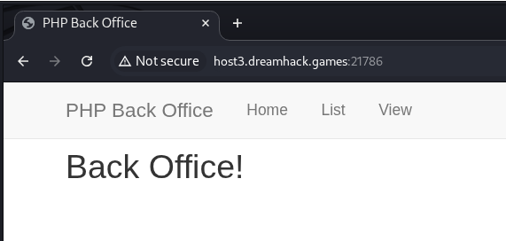
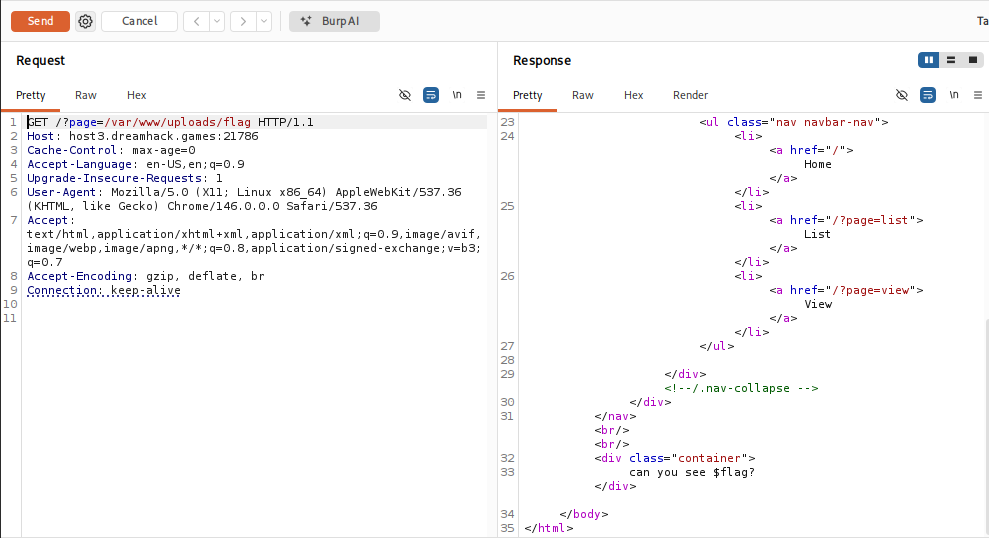
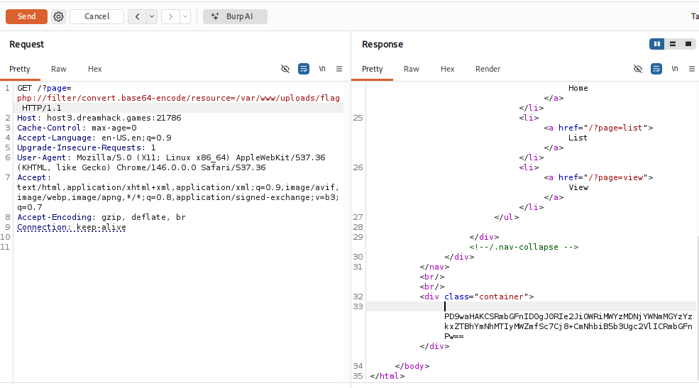
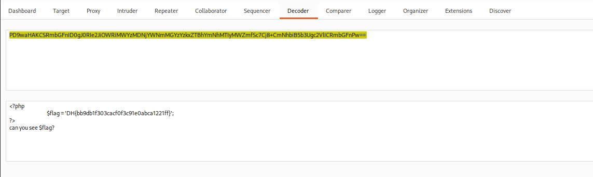

# [Dreamhack] PHP-1 - Web Hacking

## 1. 문제 개요

* **문제 링크:** [Dreamhack - php-1](https://dreamhack.io/wargame/challenges/46)

* **분야:** Web

* **목표:** LFI 취약점을 이용해 `/var/www/uploads/flag.php`에 저장된 플래그 획득

## 2. 취약점 분석
제공된 4개 PHP 파일(`index.php, list.php, main.php, view.php`) 소스 코드 분석 결과, `index.php`의 `page` 파라미터는 별도의 검증 없이 사용자 입력값을 그대로 `include`에 사용하는 구조로 확인. 반면 `view.php`의 `file` 파라미터는 `flag`, `:`(콜론) 두 문자열을 차단하는 블랙리스트 필터가 적용되어 있으나, `preg_match` 특성을 이용한 배열 우회 시도 시 필터 통과까지는 가능해도 후속 `file_get_contents` 처리까지는 이어지지 않는 구조로 확인.

```php
// [index.php] page 파라미터 - 검증 없는 include
include $_GET['page'] ? $_GET['page'].'.php' : 'main.php';
```

```php
// [view.php] file 파라미터 - flag/콜론 블랙리스트 필터
$file = $_GET['file'] ? $_GET['file'] : '';
if(preg_match('/flag|:/i', $file)){
    exit('Permission denied');
}
echo file_get_contents($file);
```

```php
// [list.php] uploads 디렉터리 목록 노출
$directory = '../uploads/';
$scanned_directory = array_diff(scandir($directory), array('..', '.', 'index.html'));
// ... (중략) ...
```

* **분석 결론:** `index.php`의 `include` 구문에는 입력 검증이 전무해 `php://filter` 등 PHP 스트림 래퍼를 이용한 소스코드 유출이 가능한 구조. `view.php`의 `file_get_contents`는 `flag`/콜론 문자열 필터가 걸려있어 직접적인 경로 지정은 차단되나, 별도의 출력 처리가 없는 `flag.php` 특성상 `include` 실행만으로는 플래그를 획득할 수 없어, 필터가 없는 경로에 스트림 래퍼를 결합한 비실행(base64 인코딩) 방식의 소스 유출이 최종 공격 경로로 확인.

## 3. 공격 수행

### 3.1. 서비스 구조 확인

1. 메인 페이지 접속, Home / List / View 엔드포인트와 각 파일(index/list/main/view.php) 소스코드 확인.



### 3.2. 필터 없는 include 경로 1차 시도

2. `index.php`의 `page` 파라미터에 필터가 없음을 확인, 절대경로로 `include` 직접 시도.

```http
// Payload - 필터 없는 include를 통한 1차 접근
GET /?page=/var/www/uploads/flag HTTP/1.1
```



3. 응답에 `can you see $flag?` 텍스트만 그대로 노출, `flag.php` 내부에 `$flag` 변수 저장 로직만 있고 출력(echo) 로직이 없어 `include` 실행만으로는 플래그 미획득 확인.

### 3.3. view.php 필터 우회 시도 (타입 저글링, 데드엔드)

4. `file` 파라미터의 `flag`/콜론 블랙리스트를 배열 파라미터로 우회 시도.

```http
// Payload - file 파라미터 타입 저글링 시도 (preg_match 배열 우회)
GET /?page=view&file[]=/var/www/uploads/flag.php HTTP/1.1
```

![Burp Proxy - file[]= 배열 페이로드 요청/응답, Permission denied 없이 pre 태그 빈 응답 확인](./images/03-get_flag_array.png)

5. `preg_match`가 배열을 처리하지 못해 필터는 통과(`Permission denied` 미출력)했으나, `file_get_contents` 역시 배열을 처리하지 못해 `<pre></pre>` 빈 응답 확인. 해당 경로는 데이터 획득이 불가능한 구조로 판단, 우회 경로 전환.

### 3.4. php://filter 스트림 래퍼를 통한 소스코드 추출

6. 필터가 없는 `page` 파라미터에 `php://filter/convert.base64-encode` 래퍼를 적용, `include`가 `flag.php`를 실행하는 대신 base64로 인코딩된 원문을 반환하도록 유도.

```http
// Payload - php://filter 스트림 래퍼를 이용한 소스코드 base64 추출
GET /?page=php://filter/convert.base64-encode/resource=/var/www/uploads/flag HTTP/1.1
```



7. Burp Decoder로 응답값 base64 디코딩, `flag.php` 원본 소스코드 및 플래그 값 확인.



## 4. 획득 결과
`page` 파라미터에 `php://filter` 스트림 래퍼를 적용해 `flag.php`를 실행 대신 base64로 인코딩, 디코딩 결과에서 서버 플래그 확인.

* **FLAG:** `DH{bb9db1f303cacf0f3c91e0abca1221ff}`

## 5. 대응 방안
사용자 입력값을 파일 시스템 경로로 직접 사용하는 구조와 PHP 스트림 래퍼가 결합되어 발생한 취약점이므로, 입력 검증과 실행 환경 설정 양쪽에서의 대응 필요.

* **화이트리스트 기반 include 대상 검증:** `page` 파라미터 값을 `list`, `view`, `main` 등 사전 정의된 목록과 비교하여 일치하는 경우에만 `include` 수행, `basename()` 또는 배열 매핑 방식으로 임의 경로/스트림 지정 자체를 차단.

* **PHP 스트림 래퍼 비활성화:** `php.ini`에서 `allow_url_include Off` 설정 및 `stream_wrapper_unregister()`로 `php://filter`, `data://`, `expect://` 등 불필요한 래퍼를 명시적으로 해제.

* **입력값 타입 강제 및 검증:** `preg_match`, `file_get_contents` 등 문자열 전용 함수 호출 전 `is_string()`으로 타입을 검증, 배열 등 예상치 못한 타입 입력 시 즉시 차단.

* **민감 정보 웹 루트 외부 분리:** `flag.php`와 같이 민감한 값을 담은 파일은 `document_root` 바깥에 저장하고, 별도의 내부 API나 환경변수를 통해서만 접근하도록 구조 변경.

* **디렉터리 리스팅 차단:** `list.php`의 `scandir()` 기반 파일 목록 노출 기능 제거 또는 화이트리스트 처리, 웹 서버 설정에서도 `Options -Indexes` 적용.

## 6. 블루팀 관점 요약
보안관제 및 침해사고 대응(IR) 관점에서, PHP 스트림 래퍼를 이용한 비실행형 소스코드 유출 행위 탐지.

* **WAF 및 웹 서버 로그 분석:** Access 로그에서 `page`, `file` 파라미터 값에 `php://`, `data://`, `expect://`, `phar://` 등 스트림 래퍼 키워드나 `../` 경로 순회 패턴이 포함된 비정상 요청 식별.

* **침해사고 대응(IR) 시나리오:** 유사 패턴 탐지 시 해당 세션의 전체 요청 이력을 추적하여 `/var/www/uploads/` 등 민감 경로에 대한 접근 시도 여부와, 응답 본문에 비정상적으로 긴 base64 문자열이 포함된 이력이 있는지 전수 조사.

* **네트워크 기반 탐지 룰 제안 (Snort 3):**

  - `GET` 요청의 URI 내 `page=` 파라미터에 `php://filter` 문자열이 포함된 패턴 탐지.

  - `alert tcp $EXTERNAL_NET any -> $HTTP_SERVERS $HTTP_PORTS (msg:"[Web] LFI via php Stream Wrapper - Source Disclosure"; flow:to_server,established; http_method; content:"GET"; http_uri; content:"page="; http_uri; content:"php://filter"; nocase; sid:1000005; rev:1;)`