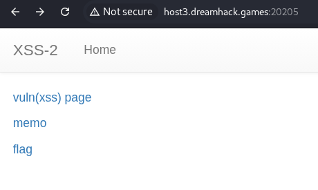
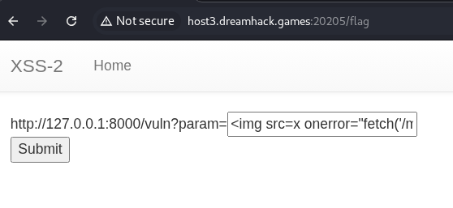
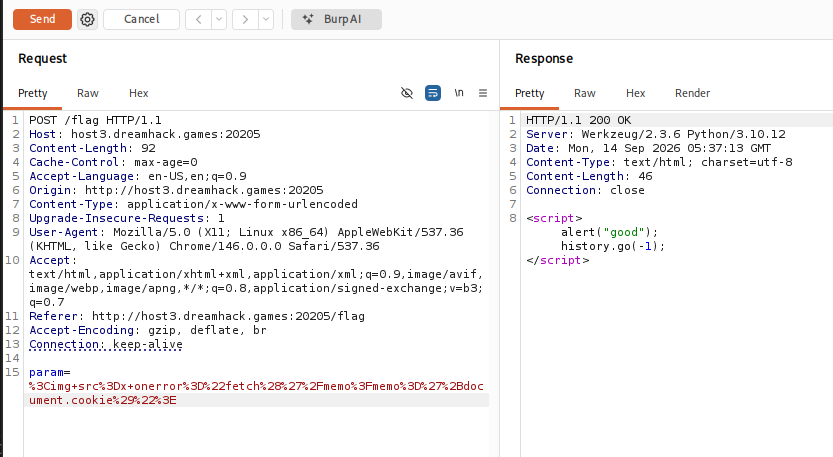
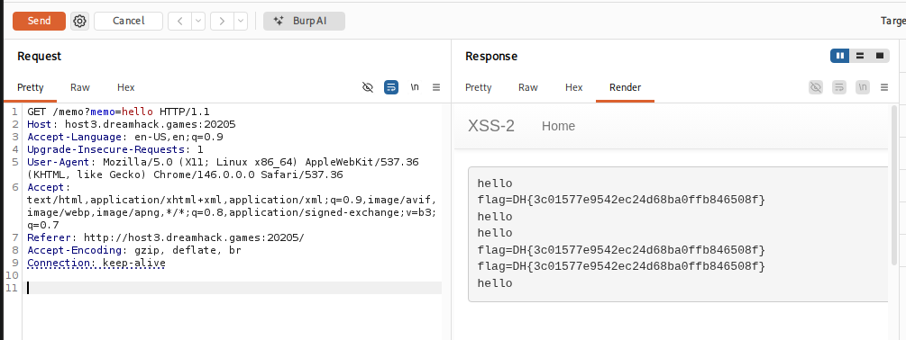

# [Dreamhack] XSS-2 - Web Hacking

## 1. 문제 개요

* **문제 링크:** [Dreamhack - xss-2](https://dreamhack.io/wargame/challenges/268)

* **분야:** Web

* **목표:** XSS 취약점을 이용하여 관리자(Admin) 봇의 쿠키(플래그) 탈취

## 2. 취약점 분석
제공된 `app.py` 및 `vuln.html` 소스 코드를 분석한 결과, `/vuln` 엔드포인트는 사용자 입력값을 서버 응답에 직접 반영하지 않고, 클라이언트 사이드 JavaScript가 `innerHTML`로 DOM에 사후 삽입하는 구조로 확인.

```python
# [app.py] /vuln 라우트 - param을 서버 응답에 직접 반영하지 않음
@app.route("/vuln")
def vuln():
    return render_template("vuln.html")
```

```html
<!-- [vuln.html] 클라이언트 사이드 innerHTML 삽입 로직 -->
<div id='vuln'></div>
<script>
  var x = new URLSearchParams(location.search);
  document.getElementById('vuln').innerHTML = x.get('param');
</script>
```

```python
# [app.py] /flag 라우트 - 관리자 봇에게 flag 쿠키 부여 후 /vuln 접속 유도
@app.route("/flag", methods=["GET", "POST"])
def flag():
    # ... (중략) ...
    elif request.method == "POST":
        param = request.form.get("param")
        if not check_xss(param, {"name": "flag", "value": FLAG.strip()}):
            return '<script>alert("wrong??");history.go(-1);</script>'
        return '<script>alert("good");history.go(-1);</script>'
```

```python
# [app.py] /memo 라우트 - 전역 변수에 누적 저장, 동일 오리진 쿠키 유출 채널로 활용 가능
memo_text = ""

@app.route("/memo")
def memo():
    global memo_text
    text = request.args.get("memo", "")
    memo_text += text + "\n"
    return render_template("memo.html", memo=memo_text)
```

* **분석 결론:** `param`이 HTML 파싱 시점이 아니라 파싱이 끝난 이후 `innerHTML`로 삽입되는 DOM 기반 Reflected XSS 취약점 존재. 이 방식에서는 브라우저 스펙상 `<script>` 태그는 실행되지 않으므로 `` 등 이벤트 핸들러 속성 기반 페이로드 필요. 봇이 심는 flag 쿠키는 `domain=127.0.0.1`로 제한되어 외부 서버로의 직접 유출은 불가하나, 동일 오리진 내 `/memo` 엔드포인트를 저장소 삼아 우회 가능한 구조.

## 3. 공격 수행

### 3.1. 서비스 구조 확인

1. 서버 실행 후 메인 페이지 접속, `vuln(xss) page`, `memo`, `flag` 세 개 엔드포인트 존재 확인.



### 3.2. 페이로드 작성 및 제출

2. `/flag` 페이지의 입력폼에 이벤트 핸들러 기반 XSS 페이로드 입력.

```html
<!-- Payload - document.cookie를 동일 오리진의 /memo로 전송 -->

```



3. Burp Suite Proxy로 해당 POST 요청 캡처, Repeater로 전달 후 Send. 응답으로 `<script>alert("good");history.go(-1);</script>` 확인. 이는 관리자 봇(Selenium)이 flag 쿠키를 들고 `/vuln?param=<페이로드>`에 정상 접속하여 XSS를 실행했음을 의미.



### 3.3. 유출된 플래그 확인

4. 관리자 봇의 XSS 실행 이후, `/memo`에 대한 GET 요청/응답을 Burp Suite로 캡처.

5. Response의 Render 탭에서 실제 렌더링된 화면 확인, 유출된 flag 쿠키 값 식별.



## 4. 획득 결과
Burp Suite의 Response 탭 확인 결과, 관리자 봇의 쿠키를 통해 서버 플래그 출력 확인.

* **FLAG:** `DH{3c01577e9542ec24d68ba0ffb846508f}`

## 5. 대응 방안
사용자 입력값을 검증 없이 `innerHTML`로 DOM에 직접 삽입하여 발생하는 위협이므로, 삽입 방식 자체의 전환 및 스크립트 실행 원천 차단이 필요.

* **`innerHTML` 대신 `textContent` 사용:** 삽입값이 항상 순수 텍스트로만 취급되어 태그/이벤트 핸들러 해석 자체가 불가능해짐.

* **HTML 엔티티 인코딩 적용:** `textContent` 전환이 어려운 경우, 서버 사이드에서 `html.escape()` 등으로 `<`, `>`, `"` 등을 이스케이프 처리 후 전달.

* **Content-Security-Policy(CSP) 설정:** 인라인 스크립트 및 인라인 이벤트 핸들러(`onerror`, `onload` 등) 실행을 차단.

* **민감 쿠키에 HttpOnly 속성 적용:** XSS가 발생하더라도 `document.cookie`를 통한 탈취 자체를 차단.

## 6. 블루팀 관점 요약
보안관제 및 침해사고 대응(IR) 관점에서 DOM 기반 XSS를 이용한 세션 탈취 및 내부 봇 악용 행위 탐지.

* **WAF 및 웹 서버 로그 분석:** Access/Error 로그 모니터링 시, `POST /flag`의 파라미터에 `onerror`, `onload`, `document.cookie`, `fetch(` 등 이벤트 핸들러 기반 공격 시그니처가 포함된 비정상 트래픽 식별.

* **침해사고 대응(IR) 시나리오:** 유사 페이로드 삽입 시도 탐지 시, 해당 시간대 `/memo` 등 사용자 입력값이 저장/노출되는 엔드포인트를 전수 조사하여 실제 세션 탈취 및 데이터 유출 여부 검증. 유출이 의심되는 세션은 즉시 파기.

* **네트워크 기반 탐지 룰 제안 (Snort 3):**

  - `POST /flag` 요청의 body 내 이벤트 핸들러와 쿠키 탈취 키워드가 동시 존재하는 패턴 탐지.

  - `alert tcp $EXTERNAL_NET any -> $HTTP_SERVERS $HTTP_PORTS (msg:"[Web] DOM-based XSS - Cookie Theft via Event Handler"; flow:to_server,established; http_method; content:"POST"; http_uri; content:"/flag"; http_client_body; content:"onerror"; nocase; http_client_body; content:"document.cookie"; nocase; sid:1000003; rev:1;)`