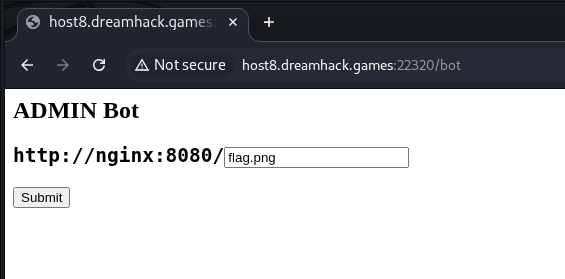
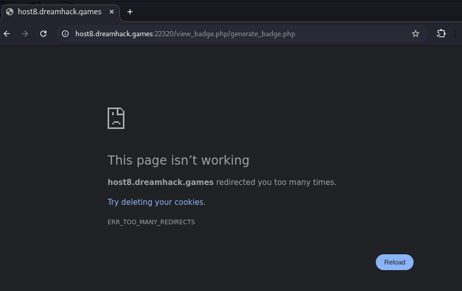
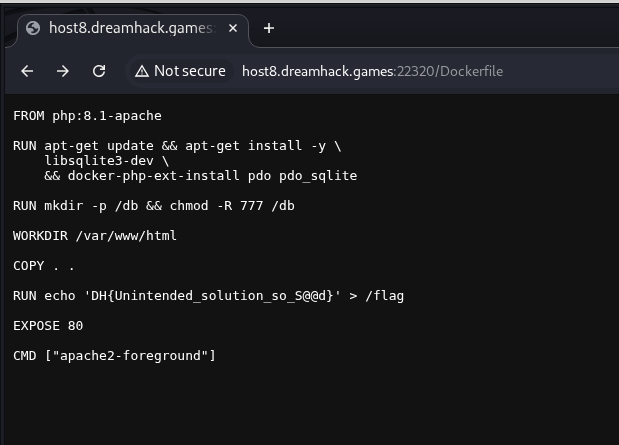

# [Dreamhack] Dream Badge - Web Hacking

## 1. 문제 개요
* **문제 링크:** [Dreamhack - Dream Badge](https://dreamhack.io/wargame/challenges/1583)

* **분야:** Web

* **목표:** admin 계정만이 접근 가능한 view_badge.php에서 플래그 탈취.

## 2. 취약점 분석

제공된 소스 코드를 분석한 결과, 시스템 설계 및 설정 파일에서 다음과 같은 두 가지 주요 취약점을 식별함.

### 2.1. Nginx 캐시 설정 결함 (Intended)

`default.conf` 파일의 설정에서 특정 확장자(`.css`, `.png`)로 끝나는 요청에 대해 강제 캐싱 정책을 적용하고 있음.

```conf
location ~* \.(css|png)$ {
    proxy_cache nginxcache;
    proxy_pass http://server:80;
    proxy_cache_valid 200 302 1d; # 302 Redirect 응답도 1일간 캐시
}
```
* **분석 결과:** 사용자가 존재하지 않는 경로(예: `view_badge.php/flag.png`)를 요청하더라도 PHP 서버는 `view_badge.php`를 실행함. 이때 Nginx는 파일 확장자만을 보고 응답 결과를 캐시에 저장하므로, 관리자(Bot)가 해당 경로를 방문하게 유도하면 관리자의 화면(플래그 포함)이 캐시에 저장되어 일반 사용자가 탈취할 수 있는 **Web Cache Deception** 공격이 가능함.

### 2.2. 중요 파일 노출 (Unintended)

배포 설정 파일인 `Dockerfile`이 웹 루트 디렉토리에 노출되어 있음.

```Dockerfile
FROM php:8.1-apache

RUN apt-get update && apt-get install -y \
    libsqlite3-dev \
    && docker-php-ext-install pdo pdo_sqlite

RUN mkdir -p /db && chmod -R 777 /db

WORKDIR /var/www/html

COPY . .

RUN echo 'DH{sample_flag}' > /flag

EXPOSE 80

CMD ["apache2-foreground"]
```

* **분석 결과:** 로컬 분석 중 플래그가 루트 디렉토리(`/flag`)에 생성됨을 확인. 서버 설정 미비로 인해 `Dockerfile `자체에 접근이 가능하다면, 빌드 시점에 하드코딩된 실제 플래그 값을 직접 획득할 수 있음.

## 3. 공격 수행

### 3.1. 시행착오 및 분석 (1차 시도: 캐시 기만 공격)

**1) 봇 방문 유도 및 캐싱 시도**

* **현상:** `/bot` 페이지를 통해 봇에게 `view_badge.php/flag.png` 방문을 요청했으나, 이후 해당 경로에 접근 시 `ERR_TOO_MANY_REDIRECTS` 에러와 함께 무한 튕김 현상 발생.





* **분석:** 봇 서버(`bot.js`)의 타임아웃이 `500ms`로 매우 짧게 설정되어 있음. 봇이 로그인을 완료하고 페이지에 도달하기 전, 공격자가 먼저 해당 경로에 접속하여 "권한 없음(302 Redirect)" 응답이 캐시에 먼저 생성됨(Cache Poisoning).

```js
await page.goto(`http://nginx:8080/${path}`, {
			timeout: 500
		});
```

* **결론:** 물리적 환경(서버 속도 및 타임아웃)의 한계로 인해 의도된 캐시 기만 공격이 정상적으로 작동하기 매우 까다로움.

### 3.2. 최종 공격 (2차 시도: 정보 노출 취약점 활용)

**1) 설정 파일 직접 접근**

* **가설:** 소스 코드 구조상 웹 서버 최상단에 `Dockerfile`이 존재하므로, 정적 파일에 대한 별도의 접근 제어가 없다면 직접 열람이 가능할 것으로 판단.

* **실행:** 브라우저 주소창에 `http://host8.dreamhack.games:22320/Dockerfile` 직접 입력.

**2) 결과 확인**

* 서버에 배포된 실제 `Dockerfile`이 평문으로 출력됨. 내부 명령어 중 플래그를 파일로 생성하는 로직에서 실제 플래그 문자열이 하드코딩되어 노출된 것을 확인.



## 4. 획득 결과

노출된 설정 파일을 통해 출제자가 의도하지 않은 방식으로 플래그를 성공적으로 탈취함.

* **FLAG:** `DH{Unintended_solution_so_S@@d}`

    * *비고: 플래그 내용 자체가 언인텐(Unintended) 풀이를 암시함.*

## 5. 대응 방안

* **Nginx ACL 설정:** 정적 자원 서비스 시 권한 검증을 강화하거나, 중요 설정 파일(`.conf`, `Dockerfile`, `.git` 등)에 대한 외부 접근을 명시적으로 차단(`deny all`)해야 함.

* **민감 정보 분리:** 빌드 스크립트나 설정 파일 내에 플래그와 같은 민감한 정보를 하드코딩하지 않고, 환경 변수나 보안 볼륨을 통해 관리해야 함.

* **HttpOnly 쿠키 설정:** 자바스크립트를 통한 쿠키 탈취를 방지하기 위해 인증 쿠키 생성 시 `HttpOnly` 옵션을 필수로 적용해야 함.