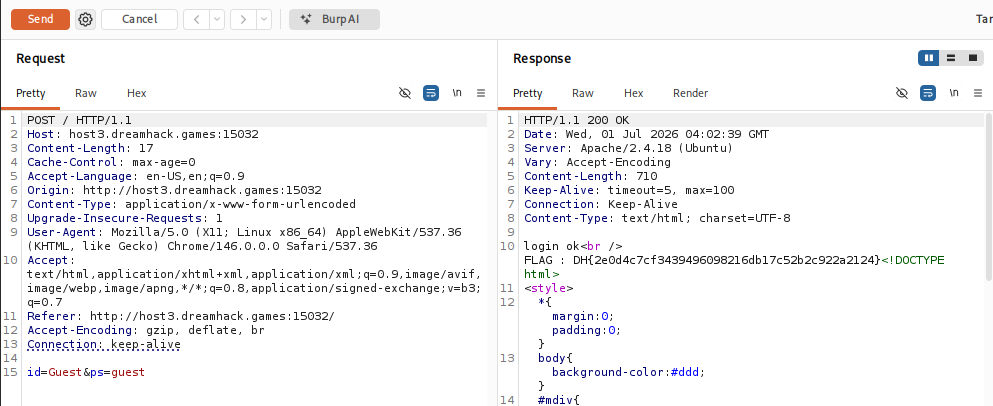

# [Dreamhack] Login Filtering - Web Hacking

## 1. 문제 개요

* **문제 링크:** [Dreamhack - login filtering](https://dreamhack.io/wargame/challenges/336)

* **분야:** Web

* **목표:** MySQL과 PHP 간의 문자열 대소문자 처리(Case Sensitivity) 방식 차이를 악용한 필터링 우회 및 플래그 획득.


## 2. 취약점 분석
문제 서버 웹 페이지에서 직접 확인한 소스 코드를 분석한 결과, 데이터베이스 조회 결과와 애플리케이션(PHP) 단의 검증 로직 간 불일치 취약점 확인.

```php
// ... (중략) ...
$id = mysqli_real_escape_string($conn, trim($_POST['id']));
$ps = mysqli_real_escape_string($conn, trim($_POST['ps']));

// [!] 취약점 발생: MySQL은 대소문자를 구분하지 않으므로, 대문자가 섞인 'Guest'를 입력해도 'guest' 행을 정상적으로 반환함
$row=mysqli_fetch_array(mysqli_query($conn, "select * from user where id='$id' and ps=md5('$ps')"));

if(isset($row['id'])){
    // [!] 취약점 발생: PHP는 '==' 비교 시 대소문자를 엄격히 구분함. 입력값 'Guest'와 필터링 문자열 'guest'가 다르다고 판단하여 차단 로직을 우회함
    if($id=='guest' || $id=='blueh4g'){
        echo "your account is blocked";
    }else{
        echo "login ok"."<br />";
        echo "FLAG : ".$FLAG;
    }
}
// ... (중략) ...
```

* **분석 결론:** MySQL은 대소문자를 구분하지 않아 `id='Guest'`와 `id='guest'`를 동일하게 취급하여 정상적으로 쿼리 결과를 반환. 반면, PHP의 `==` 연산자는 대소문자를 엄격히 구분. 이를 악용하여 입력값에 대문자를 섞어 전송하면 DB 조회를 성공시키는 동시에 PHP의 계정 차단 조건문(`$id=='guest'`) 우회 가능.


## 3. 공격 수행
대소문자 차이를 이용한 파라미터 조작으로 필터링 우회 및 권한 획득 진행.

1. 웹 브라우저를 통해 문제 서버의 로그인 폼에 접근.

2. 입력 폼의 `id` 필드에 대문자가 포함된 `Guest`, `ps` 필드에 `guest`를 입력 후 로그인 시도.

3. Burp Suite를 사용하여 브라우저에서 전송되는 POST 요청 패킷을 캡처하고, `id=Guest&ps=guest` 형태의 파라미터가 정상적으로 전달되는지 확인 후 서버로 전송.




## 4. 획득 결과
PHP의 필터링 조건문 우회 성공 후, HTTP 응답을 통해 서버 내부에 숨겨진 최종 플래그 출력.

* **FLAG:** `DH{2e0d4c7cf3439496098216db17c52b2c922a2124}`


## 5. 대응 방안
시큐어 코딩 관점에서 데이터베이스와 애플리케이션 간의 데이터 검증 로직 불일치 해소 요망.

* **안전한 비교 연산 및 데이터 정제 적용:** PHP에서 계정 차단 검증 수행 전, 입력된 `$id` 변수를 `strtolower()` 함수를 통해 소문자로 일괄 변환 후 검증 수행. 또는 대소문자 구분 없이 문자열을 비교하는 `strcasecmp()` 함수 사용.

* **데이터베이스 쿼리단 대소문자 구분 적용:** MySQL 쿼리 작성 시 `BINARY` 연산자를 사용하여 대소문자를 엄격하게 구분하도록 수정. (예: `select * from user where id=BINARY '$id'`)


## 6. 블루팀 관점 요약
보안관제 및 침해사고 대응(IR) 관점에서 대소문자 변형(Case Variation)을 통한 필터링 우회 시도 탐지.

* **WAF 및 웹 서버 로그 분석:** Access 로그 모니터링 시, 동일 IP에서 `guest`, `Guest`, `gUeSt` 등 대소문자만 변경된 파라미터로 반복적인 로그인 POST 요청이 발생하는 비정상 HTTP 트래픽 식별.

* **침해사고 대응 시나리오:** 특정 IP에서 필터링 우회 성공 정황(로그인 성공 로그와 변형된 ID 패턴 동시 발생) 발견 시, 해당 세션의 공격 성공 여부 판단. 이후 해당 계정으로 수행된 비정상적인 데이터 열람 및 추가 취약점 연계 공격 여부 조사.

* **네트워크 기반 탐지 룰 제안 (Snort):**
  - POST Request Body의 파라미터를 검사하여 대소문자를 혼용하여 주요 시스템 계정(guest, admin 등) 우회를 시도하는 패턴 탐지.

  - `alert tcp $EXTERNAL_NET any -> $HTTP_SERVERS $HTTP_PORTS (msg:"[Web] Login Filtering Bypass Attempt (Case Variation)"; flow:to_server,established; content:"POST"; http_method; pcre:"/id=(?i)(guest|blueh4g)&ps=/"; sid:1000005; rev:1;)`