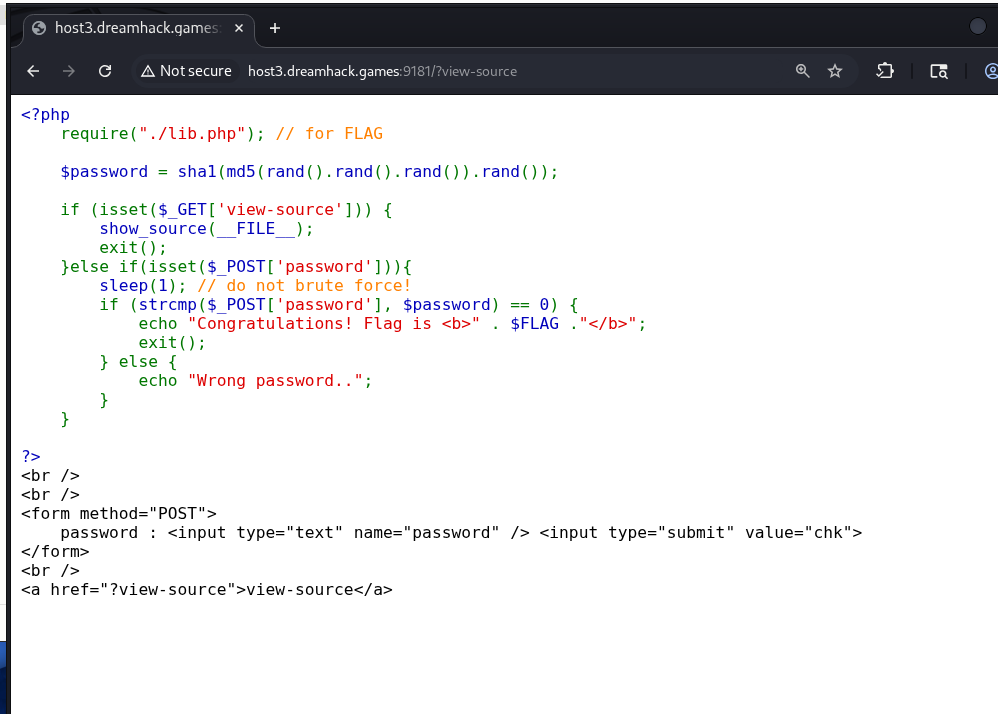
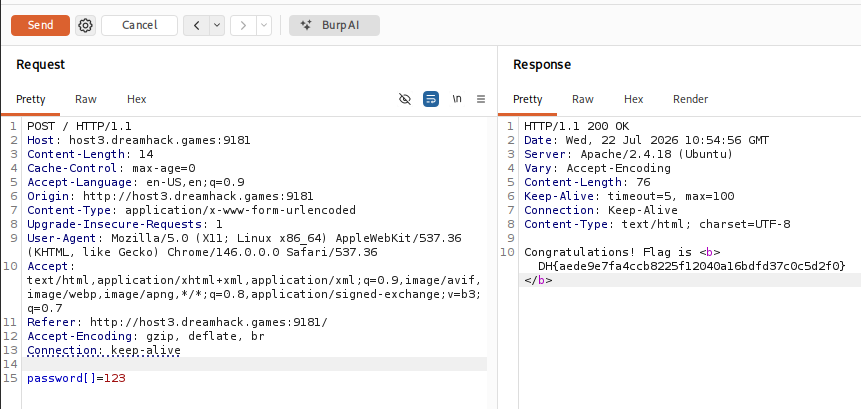

# [wargame.kr] StrCmp - Web Hacking

## 1. 문제 개요

* **문제 링크:** [Dreamhack - strcmp](https://dreamhack.io/wargame/challenges/328)

* **분야:** Web

* **목표:** PHP `strcmp` 함수의 특징 및 느슨한 비교 연산자(`==`)의 Type Juggling 취약점을 악용한 패스워드 검증 우회.

## 2. 취약점 분석
문제 서버의 `view-source`를 클릭하여 소스 코드를 분석한 결과, 사용자 입력값(`$_POST['password']`)을 검증하는 과정에서 데이터 타입 변조를 통한 취약점 식별.

```php
<?php
// ... (중략) ...
$password = sha1(md5(rand().rand().rand()).rand());

if (isset($_GET['view-source'])) {
// ... (중략) ...
}else if(isset($_POST['password'])){
    sleep(1); // do not brute force!
    if (strcmp($_POST['password'], $password) == 0) {
        echo "Congratulations! Flag is <b>" . $FLAG ."</b>";
        exit();
    } else {
// ... (중략) ...
?>
```

* **분석 결론:** `strcmp` 함수는 문자열 비교 목적이나, 배열(Array)이 전달될 경우 처리하지 못하고 `NULL`을 반환. 이후 느슨한 비교(`==`) 환경에서 `NULL == 0`이 형변환에 의해 참(`true`)으로 평가되는 Type Juggling 취약점 존재. 이를 악용하여 난수로 생성된 패스워드를 몰라도 우회 가능.

## 3. 공격 수행
웹 브라우저를 통해 검증 로직을 먼저 파악한 뒤, Burp Suite를 활용하여 HTTP 요청 파라미터의 데이터 타입을 문자열에서 배열로 변환하는 익스플로잇 진행.

### 3.1. 소스 코드 확인

1. 문제 서버의 `view-source` 링크를 클릭하여 웹 브라우저상에서 소스 코드를 열람.

2. 검증 로직 확인 결과, `strcmp` 함수와 느슨한 비교(`==`)가 사용되고 있음을 파악하여 Type Juggling 공격 방향 수립.



### 3.2. 파라미터 조작 및 페이로드 전송

3. Burp Suite의 Proxy/Repeater 기능을 사용하여 목표 서버로 `POST` 요청 전송.

4. 파라미터를 배열 타입으로 인식시키기 위해, 기존 문자열 입력 폼의 `password` 키 값을 `password[]`로 변조하여 서버로 전송.
   - 변조된 페이로드: `password[]=123`

5. 서버 처리 결과 `strcmp(Array, String)`가 `NULL`을 반환하고 조건문이 통과됨.



## 4. 획득 결과
Burp Suite의 Response 탭 확인 결과, 관리자 인증 조건 우회 성공 및 플래그 출력 확인.

* **FLAG:** `DH{aede9e7fa4ccb8225f12040a16bdfd37c0c5d2f0}`

## 5. 대응 방안
Type Juggling을 유발하는 느슨한 비교 연산 지양 및 입력값 타입에 대한 철저한 검증을 적용하는 시큐어 코딩 필수.

* **엄격한 비교 연산자(Strict Comparison) 사용:** `==` 대신 `===`를 사용하여 값뿐만 아니라 데이터 타입(Type)까지 완벽히 일치하는지 비교. `NULL === 0`은 `false`로 엄격하게 평가되므로 우회 원천 차단.

* **입력값 데이터 타입 검증:** `is_string()` 등 내장 함수를 활용하여 `$_POST['password']` 파라미터가 배열이 아닌 의도된 문자열(String) 타입인지 검증하는 선행 로직 구성.

## 6. 블루팀 관점 요약
보안관제 및 침해사고 대응(IR) 관점에서 웹 애플리케이션의 Type Juggling 결함을 노린 인증 우회 공격 모니터링 및 방어.

* **WAF 및 웹 서버 로그 분석:** Error 로그 상에서 `Warning: strcmp() expects parameter 1 to be string, array given` 와 같은 PHP Type 에러 발생 여부 중점 모니터링. Access 로그 분석 시 일반적인 평문 전송 필드에 비정상적인 배열 기호(`%5B%5D`, `[]`)가 파라미터 키값으로 포함된 트래픽 식별.

* **침해사고 대응 (IR) 시나리오:** 특정 IP 대역에서 인증, 결제 등의 주요 엔드포인트에 `[]` 문자가 포함된 페이로드 전송이 지속 탐지될 경우, 애플리케이션 로직 우회 스캐닝으로 간주. 해당 IP의 접근을 차단 조치하고, 공격 시도 시간대의 응답 길이(Content-Length)나 상태 코드 변화를 추적하여 실제 우회 성공 및 중요 정보 유출 여부 검증.

* **네트워크 기반 탐지 룰 제안 (Snort):**
  - POST 요청 본문(Client Body)에서 `password` 등 민감한 파라미터가 배열 형태로 조작되어 전송되는 패턴 탐지.

  ```snort
  alert tcp $EXTERNAL_NET any -> $HTTP_SERVERS $HTTP_PORTS (msg:"[Web] PHP Type Juggling - Array Parameter Injection Attempt Detected"; flow:to_server,established; content:"POST"; http_method; pcre:"/password(?:%5B%5D|\[\])=/i"; http_client_body; sid:1000004; rev:1;)
  ```