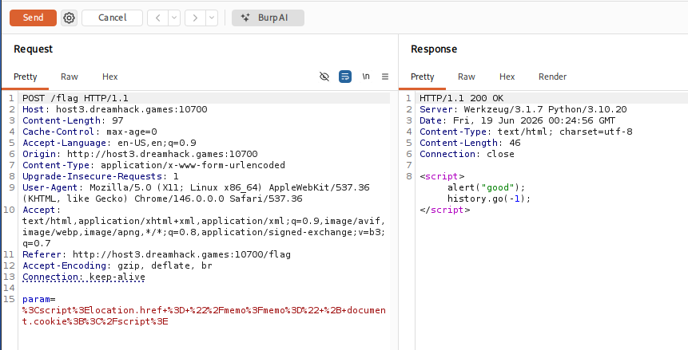
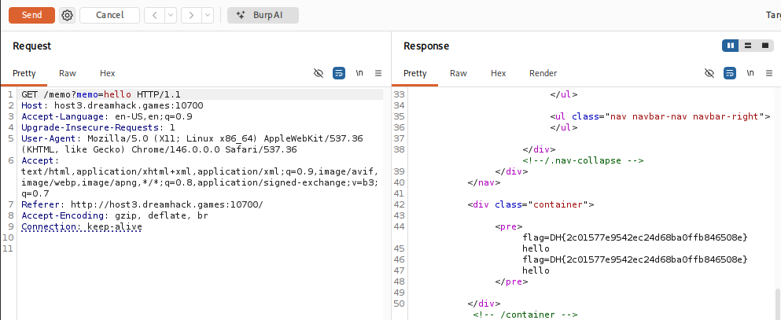

# [Dreamhack] XSS-1 - Web Hacking

## 1. 문제 개요

* **문제 링크:** [Dreamhack - xss-1](https://dreamhack.io/wargame/challenges/28)

* **분야:** Web

* **목표:** XSS 취약점을 이용하여 관리자(Admin) 봇의 쿠키(플래그) 탈취.

## 2. 취약점 분석
제공된 `app.py` 소스 코드를 분석한 결과, `/vuln` 엔드포인트에서 사용자 입력값이 HTML 렌더링 과정에서 필터링 없이 그대로 반환되는 것을 확인.

```python
# ... (중략) ...
@app.route("/vuln")
def vuln():
    param = request.args.get("param", "")
    # [!] 취약점 발생: 사용자 입력값(param)이 필터링 없이 그대로 반환됨 (Reflected XSS)
    return param

# ... (중략) ...
@app.route("/memo")
def memo():
    global memo_text
    text = request.args.get("memo", "")
    memo_text += text + "\n"
    return render_template("memo.html", memo=memo_text)
# ... (중략) ...
```

* **분석 결론:** 사용자가 입력한 `param` 값이 이스케이프 처리 없이 그대로 반환되므로, 악성 스크립트를 삽입할 경우 브라우저에서 실행되는 **Reflected XSS** 취약점 존재. 이를 악용하여 내부 관리자 봇이 해당 URL을 열도록 유도한 뒤, 봇의 쿠키를 `/memo` 엔드포인트로 전송시키도록 설계 가능.

## 3. 공격 수행
Burp Suite를 활용하여 웹 브라우저를 거치지 않고 직접 조작된 페이로드를 서버로 전송하여 익스플로잇.

### 3.1. 페이로드 전송 및 관리자 봇 실행 유도

1. Burp Suite의 Repeater를 사용하여 `/flag` 엔드포인트로 `POST` 요청 전송. 파라미터(`param`)에 관리자 봇의 세션 쿠키를 `/memo` 페이지로 전송시키는 XSS 페이로드 삽입.
   - 원본 페이로드: `<script>location.href="/memo?memo=" + document.cookie;</script>`

2. HTTP 응답(Response) 확인 결과 `<script>alert("good");history.go(-1);</script>` 가 반환됨. 이는 서버 내부의 관리자 봇(Selenium)이 정상적으로 악성 페이로드가 포함된 URL에 접속하여 스크립트를 실행했음을 의미.



### 3.2. 탈취한 플래그 확인

3. 관리자 봇의 동작 이후, 브라우저와 서버 간에 정상적으로 오고 간 `GET /memo` 요청 및 응답 패킷을 Burp Suite를 통해 캡처.

4. 캡처된 응답 패킷의 HTML Body 내 `<pre>` 태그 영역에서 최종적으로 유출된 관리자 봇의 세션 쿠키(플래그) 식별.



## 4. 획득 결과
Burp Suite의 Response 탭 확인 결과, 관리자 봇의 쿠키를 통해 서버 플래그 출력 확인.

* **FLAG:** `DH{2c01577e9542ec24d68ba0ffb846508e}`

## 5. 대응 방안
사용자 입력값을 검증 없이 HTML 컨텍스트에 직접 출력하여 발생하는 위협이므로, 스크립트 실행을 원천 차단하는 시큐어 코딩 적용 요망.

* **HTML 엔티티 인코딩 (Entity Encoding) 적용:** 서버 사이드에서 사용자 입력값(`param`)을 화면에 출력하기 전에 `<` , `>` , `"` , `'` 등의 특수문자를 브라우저가 스크립트로 해석하지 못하도록 단순 문자인 HTML 엔티티(`&lt;`, `&gt;` 등)로 치환. 파이썬의 경우 `html.escape()` 함수 등을 활용.

* **Content-Security-Policy (CSP) 설정:** HTTP 응답 헤더에 CSP를 적용하여 브라우저에서 실행 가능한 스크립트의 출처를 명시적으로 제한. 인라인 스크립트(`'unsafe-inline'`) 실행을 차단하여 XSS 공격 방어.

## 6. 블루팀 관점 요약
보안관제 및 침해사고 대응(IR) 관점에서 XSS 취약점을 이용한 세션 탈취 및 내부 봇 악용 행위 탐지.

* **WAF 및 웹 서버 로그 분석:** Access 로그 및 Error 로그 모니터링 시, `GET /vuln` 또는 `POST /flag` 엔드포인트의 파라미터에 `<script>`, `document.cookie`, `location.href`와 같은 공격 의심 시그니처가 포함된 비정상적인 트래픽 식별.

* **침해사고 대응 (IR) 시나리오:** 특정 IP에서 다량의 XSS 페이로드 삽입 시도가 탐지될 경우, 해당 시간대의 `/memo` 또는 게시판 등 사용자 입력값이 저장/노출되는 엔드포인트를 전수 조사하여 실제 세션 탈취 및 데이터 유출 여부 검증. 유출이 의심되는 세션은 즉시 파기 조치.

* **네트워크 기반 탐지 룰 제안 (Snort):**

  - 파라미터 내 스크립트 태그와 쿠키 탈취 키워드가 동시 존재하는 패턴 탐지.

  - `alert tcp $EXTERNAL_NET any -> $HTTP_SERVERS $HTTP_PORTS (msg:"[Web] Reflected XSS - Cookie Theft Payload Detected"; flow:to_server,established; content:"POST"; http_method; content:"/flag"; http_uri; pcre:"/(%3C|<)script(%3E|>).*document\.cookie.*(%3C|<)\/script(%3E|>)/i"; sid:1000002; rev:1;)`