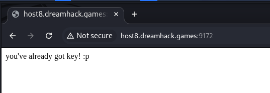
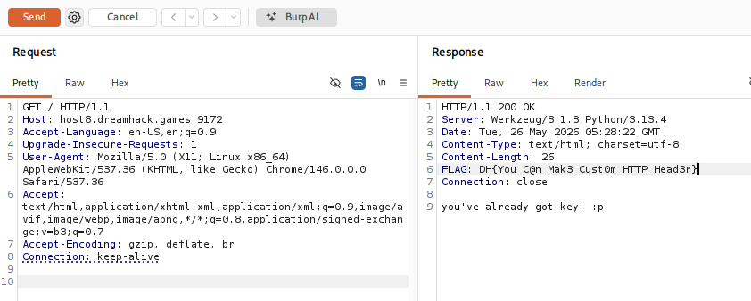

# [Dreamhack] Already Got - Web Hacking

## 1. 문제 개요

* **문제 링크:** [Dreamhack - already got](https://dreamhack.io/wargame/challenges/1976)

* **분야:** Web

* **목표:** HTTP 응답 헤더를 분석하여 서버에 숨겨진 플래그 탈취.

## 2. 취약점 분석

문제 다운로드 파일에 더미 파일(`no_need_to_download.txt`)만 존재하므로 블랙박스 관점에서 접근. 웹 브라우저 화면상에는 텍스트 외 상호작용 요소가 없으며 프론트엔드 소스코드에서도 단서 미발견. 문제 설명에서 `Can you see HTTP Response header?`라는 명시적인 단서 제공. 이에 따라 일반적인 웹 브라우저 렌더링 화면이나 프론트엔드 소스코드가 아닌, 서버가 반환하는 HTTP 응답 헤더 내에 플래그를 포함한 중요 데이터가 평문으로 노출되어 있을 것으로 추론.

* **분석 결론:** 프록시 툴을 이용해 서버와 클라이언트 간의 HTTP 통신 패킷 응답 헤더를 캡처하여 검증 필요.

## 3. 공격 수행

### 3.1. 웹 페이지 접근 및 기초 분석
문제 페이지 접속 시, 화면상에는 `you've already got key! :p` 문자열만 출력. 개발자 도구를 통한 프론트엔드 소스코드 검사에서도 특이사항 미발견. 

### 3.2. 패킷 캡처 및 응답 헤더 분석
Burp Suite를 활용하여 브라우저 통신 패킷 캡처 진행. 서버로 전송한 GET 요청에 대한 응답(Response) 패킷 확인. 분석 결과, 아래와 같이 HTTP 응답 헤더에 사용자 정의 헤더(`FLAG`)가 삽입되어 평문으로 노출되는 것을 확인.

## 4. 획득 결과
Burp Suite의 Response 내역 확인 결과, 하드코딩된 서버 플래그 획득.

* **FLAG:** `DH{You_C@n_Mak3_Cust0m_HTTP_Head3r}`

## 5. 대응 방안
운영 서버 배포 시 응답 헤더에 시스템 중요 정보, 인증키, 플래그 등 민감한 데이터가 포함되지 않도록 설정 검토.
웹 서버 설정 파일이나 백엔드 프레임워크 라우팅 로직을 점검하여, 불필요한 Custom Header 출력을 차단하는 방안 적용.