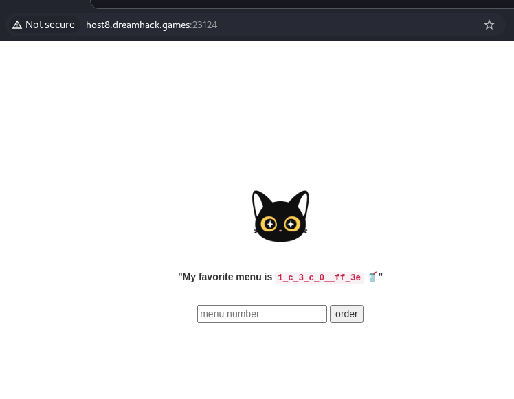
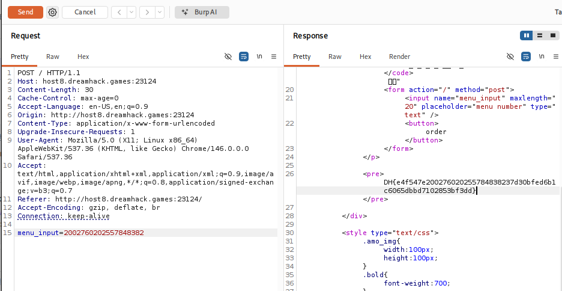

# [Dreamhack] AmoCafe - Web Hacking

## 1. 문제 개요

* **문제 링크:** [Dreamhack - amocafe](https://dreamhack.io/wargame/challenges/899)

* **분야:** Web

* **목표:** 서버의 비트 연산 기반 인코딩 로직을 역산하여, 화면에 출력된 암호 문자열(`menu_str`)로부터 원래의 10진수 `org` 값을 복원하고 플래그 획득.

## 2. 취약점 분석
제공된 `app.py` 소스 코드 분석 결과, 플래그의 일부분을 숫자로 변환한 뒤 특정 비트 연산 규칙에 따라 문자열로 치환하여 노출하는 로직 확인.

```python
# ... (생략) ...
org = FLAG[10:29]
org = int(org)
st = ['' for i in range(16)]

for i in range (0, 16):
    res = (org >> (4 * i)) & 0xf
    if 0 < res < 12:
        if ~res & 0xf == 0x4:
            st[16-i-1] = '_'
        else:
            st[16-i-1] = str(res)
    else:
        st[16-i-1] = format(res, 'x')
menu_str = menu_str.join(st)
# ... (생략) ...
```

**분석 결론:** * `FLAG`의 19글자를 10진수 정수 `org`로 변환 후, 비트 시프트(`>>`)와 마스킹(`& 0xf`)을 통해 4비트씩 16번 분할.

* 분할된 4비트 값(`res`)에 따라 `_`(11일 때), 일반 숫자, 16진수 알파벳(`c~f`)으로 치환하여 `st` 배열에 역순 저장.

* 이 암호화 과정은 단방향 해시가 아닌 단순 치환이므로, 규칙을 거꾸로 적용하면 원래의 정수 `org` 값 복원 가능.

## 3. 공격 수행

### 3.1. 역산 원리 및 16진수 복원
웹 페이지 메인 화면에서 대상 문자열 획득.

* **타겟 문자열:** `1_c_3_c_0__ff_3e`



서버가 변환한 로직을 역으로 추적하여 원래 값을 구하는 원리는 다음과 같음.

1. **4비트 분할은 곧 16진수를 의미:** 서버 코드의 `& 0xf` 연산은 숫자를 4비트 단위로 자르는 행위. 컴퓨터에서 4비트는 정확히 16진수 1자리와 일치하므로, 화면에 나온 글자들의 알맹이는 본질적으로 모두 **16진수 자릿수**임.

2. **치환된 문자 되돌리기 (역매핑):** 문자열 앞에서부터 차례대로 토큰을 읽으며 본래의 16진수 값으로 복원.

   * `_` ➔ `b` (11)

   * `c~f` ➔ 알파벳 그대로

   * `0~9` ➔ 숫자 그대로

3. **배열 순서의 정방향 유지:** 코드는 `org`의 맨 뒤(가장 작은 자리수)부터 계산하여 배열의 맨 뒤(`16-i-1`)에 넣음. 역으로 계산하더라도, 눈에 보이는 문자열 순서 그대로가 실제 16진수의 자릿수 순서와 일치함.

4. **16진수 조합:** 복원한 16개의 조각을 나란히 배열하면 원래 숫자의 16진수 형태 완성.

   * `1` / `b` / `c` / `b` / `3` / `b` / `c` / `b` / `0` / `b` / `b` / `f` / `f` / `b` / `3` / `e`

   * **복원된 16진수 값:** `0x1bcb3bcb0bbffb3e`

### 3.2. 10진수 변환 및 페이로드 전송
서버는 최종 검증 시 사용자의 입력값을 10진수 형태의 문자열로 비교하므로, 복원한 16진수 값을 10진수로 변환해야 함.

* **16진수:** `0x1bcb3bcb0bbffb3e`

* **10진수 변환:** `2002760202557848382`

변환한 10진수 값을 Burp Suite를 사용하여 `menu_input` 파라미터 값으로 POST 요청 전송.



## 4. 획득 결과
Burp Suite의 Response 탭 확인 결과, 서버의 조건문을 통과하여 숨겨진 플래그 출력 확인.

* **FLAG:** `DH{e4f547e200276020255784838237d30bfed6b1c6065dbbd7102853bf3dd}`

## 5. 대응 방안
플래그와 같은 중요/민감 정보를 유추 가능한 단순 인코딩(치환) 방식으로 화면에 노출하는 로직 지양.

* **근본적 조치:** 중요 데이터는 서버 내부에서만 처리하고, 클라이언트에게는 식별 불가능한 난수 세션 ID나 안전한 해시 함수를 거친 결과만 제공하도록 아키텍처 개선 필요.