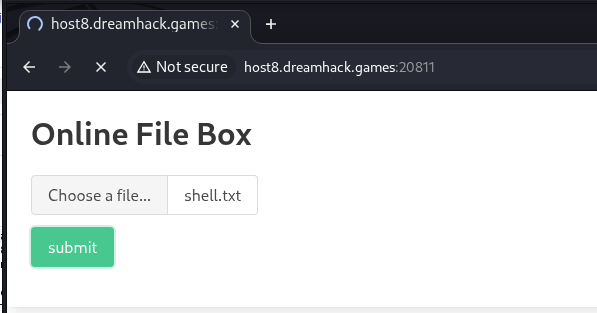
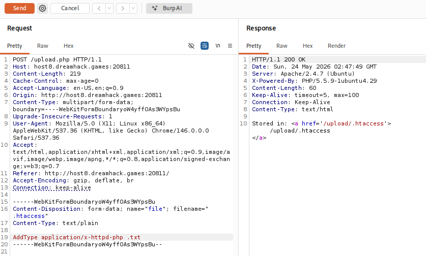
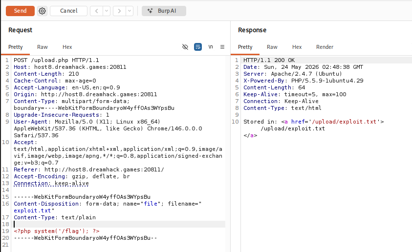
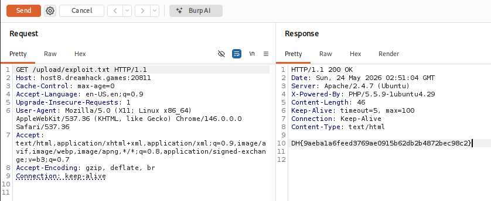

# [Dreamhack] Apache htaccess - Web Hacking

## 1. 문제 개요

* **문제 링크:** [Dreamhack - Apache htaccess](https://dreamhack.io/wargame/challenges/418)

* **분야:** Web

* **목표:** 파일 업로드 취약점과 Apache 설정 우회를 이용하여 서버 내부의 플래그 탈취.

## 2. 취약점 분석
제공된 서버 설정 파일(`000-default.conf`) 및 업로드 로직(`upload.php`) 분석 결과, 로컬 설정 덮어쓰기 허용 및 미흡한 확장자 필터링 확인.

```apache
# 000-default.conf
<Directory /var/www/html/>
    AllowOverride All
    Require all granted
</Directory>
```

```php
// upload.php
$deniedExts = array("php", "php3", "php4", "php5", "pht", "phtml");

if(in_array($extension, $deniedExts)){
    die($extension . " extension file is not allowed to upload ! ");
}
```

* **분석 결론:** `AllowOverride All` 설정으로 인해 `.htaccess` 파일을 업로드하여 서버 설정 조작 가능. 필터링 블랙리스트에 `.htaccess` 및 `.txt`가 누락되어 있어, 우회 업로드 후 텍스트 파일을 PHP 스크립트로 강제 실행시킬 수 있는 취약점 존재. (Apache 웹 서버 환경이기 때문에 가능한 공격)

## 3. 공격 수행
Burp Suite를 활용하여 브라우저의 정상 업로드 패킷을 캡처한 뒤, Repeater에서 파일명 및 페이로드를 직접 변조하여 익스플로잇.

### 3.1. 패킷 캡처 및 .htaccess 업로드 (서버 설정 변조)

1. 웹 브라우저에서 문제 서버의 업로드 페이지(`index.php`)에 접근.



2. 임의의 파일 업로드 요청을 Burp Suite로 캡처하여 Repeater로 진입. 이후 `filename` 파라미터를 `.htaccess`로 수정하고, 파일 본문에 `.txt`를 PHP로 처리하라는 아파치 지시어(`AddType application/x-httpd-php .txt`) 삽입 후 전송.



### 3.2. 웹 셸 업로드 및 페이로드 실행

1. 이전과 동일한 패킷 뼈대에서 `filename`을 `exploit.txt`로 변경. 파일 본문에는 시스템 명령어(`/flag`)를 실행하는 PHP 코드(<`?php system('/flag'); ?>`) 삽입 후 서버로 전송.



2. Burp Suite를 통해 업로드된 파일의 경로(`/upload/exploit.txt`)로 GET 요청을 전송하여 악성 스크립트 실행.



## 4. 획득 결과
Burp Suite의 Response 탭 확인 결과, 조작된 `.htaccess` 설정이 정상 적용되어 텍스트 파일 내의 PHP 코드가 실행되었으며 시스템 플래그 출력 확인.

* **FLAG:** `DH{9aebala6feed3769ae0915b62db2b4872bec98c2}`

## 5. 대응 방안
디렉터리별 자치 설정 파일 무효화 및 업로드 파일 확장자에 대한 강력한 통제 필요.

* **AllowOverride None 적용:** 아파치 메인 설정 파일(`000-default.conf`)에서 `AllowOverride None`으로 속성을 변경하여, 사용자 업로드 폴더 내의 `.htaccess` 구문 해석 원천 차단.

* **화이트리스트 기반 확장자 검증:** 블랙리스트 우회 공격을 막기 위해, 시스템에 안전하다고 검증된 특정 확장자(예: `.jpg`, `.png`)만 업로드가 가능하도록 소스 코드 검증 로직 수정.