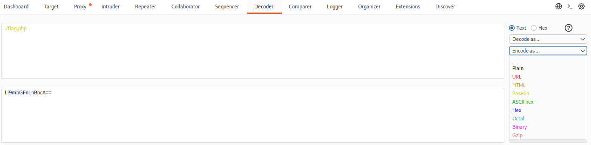
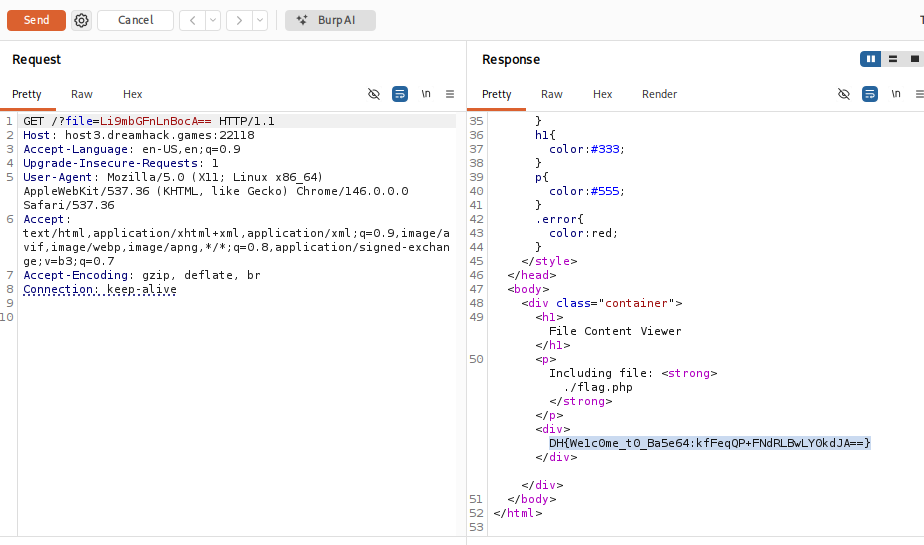

# [Dreamhack] Base64 based - Web Hacking

## 1. 문제 개요

* **문제 링크:** [Dreamhack - Base64 based](https://dreamhack.io/wargame/challenges/1785)

* **분야:** Web

* **목표:** 필터링 로직을 우회하는 Base64 페이로드를 생성하여 LFI(Local File Inclusion) 취약점을 트리거하고 숨겨진 플래그 획득.

## 2. 취약점 분석
제공된 `index.php` 소스 코드 분석 결과, 사용자의 입력값을 Base64 디코딩하여 `require_once` 함수로 직접 실행하는 취약점(LFI) 확인. 특정 문자열(`../`, `flag`, `hp`)에 대한 필터링 로직 존재.

```php
$encodedFileName = $_GET['file'];

// 필터링 로직: 우회 필요
if (stripos($encodedFileName, "Li4v") !== false){ ... } // ../ 차단
if ((stripos($encodedFileName, "ZmxhZ") !== false) || (stripos($encodedFileName, "aHA=") !== false)){ ... } // flag, hp 차단

$decodedFileName = base64_decode($encodedFileName);
$filePath = __DIR__ . DIRECTORY_SEPARATOR . $decodedFileName;

// [!] 취약점 발생: 필터링을 통과한 문자열을 디코딩하여 파일 그대로 실행
if (...) {
    require_once($decodedFileName);
}
```

* **분석 결론:** 검증 로직이 평문이 아닌 Base64 인코딩된 상태의 문자열(`ZmxhZ` 등)만 검사. Base64의 인코딩 특성(3바이트 단위 묶음 처리)을 이용하여, 의미는 같으나 인코딩 결과가 완전히 달라지는 대체 경로(`./flag.php`)를 입력하면 필터링 우회 가능.

## 3. 공격 수행
Burp Suite를 활용하여 페이로드 생성 및 익스플로잇 진행.

### 3.1. 페이로드 생성
단순히 `flag.php`를 인코딩하면 필터링에 걸리므로, 현재 경로를 의미하는 `./`를 앞에 추가하여 인코딩 수행.
Burp Suite의 Decoder 탭을 이용하여 `./flag.php`를 Base64로 인코딩한 결과 `Li9mbGFnLnBocA==` 획득.



### 3.2. 익스플로잇 및 응답 확인
Burp Suite의 Repeater를 사용하여 변조된 패킷 전송.
GET 파라미터 `file`의 값으로 생성한 페이로드(`Li9mbGFnLnBocA==`) 삽입 후 요청 전송.



## 4. 획득 결과
서버 내부의 `flag.php` 코드가 `require_once`에 의해 실행되어 하드코딩된 서버 플래그 출력.

* **FLAG:** `DH{WeLc0me_t0_Ba5e64:kfFeqQP+FNdRLBwLYOkdJA==}`

## 5. 대응 방안
사용자 입력값을 직접적으로 파일 포괄 함수(`require_once`, `include` 등)에 전달하는 것은 매우 위험.

* **안전한 코딩 기법:** 동적 파일 포함이 반드시 필요한 경우, 사용자 입력값을 직접 경로로 사용하지 말고 서버 측에 미리 정의된 **화이트리스트** 배열과 매핑하여 허용된 파일만 로드되도록 로직 수정.