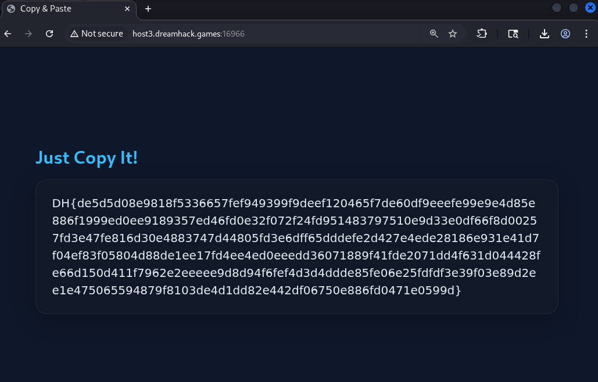
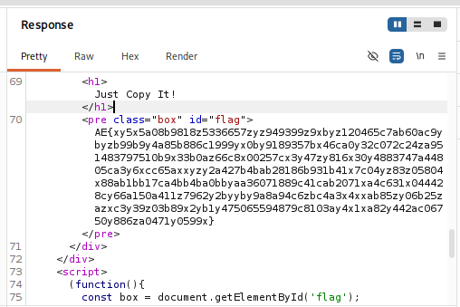
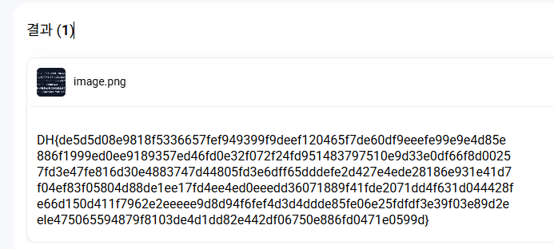

# [Dreamhack] Copy And Paste - Web Hacking

## 1. 문제 개요

* **문제 링크:** [Dreamhack - Copy And Paste](https://dreamhack.io/wargame/challenges/2199)

* **분야:** Web

* **목표:** Font Obfuscation(폰트 난독화) 기법을 우회하여 화면에 렌더링된 원본 플래그 텍스트 추출 및 획득.

## 2. 취약점 분석
웹 브라우저 화면에 렌더링된 텍스트를 눈으로 볼 때와, 실제 마우스로 드래그하여 복사한 소스코드 상의 텍스트가 서로 일치하지 않음을 확인.



```html
AE{xy5x5a08b9818z5336657zyz949399z9xbyz120465c7ab60ac9ybyzb99b9y4a85b886c1999yx0by9189357bx46ca0y32c072c24za951483797510b9x33b0az66c8x00257cx3y47zy816x30y4883747a44805ca3y6xcc65axxyzy2a427b4bab28186b931b41x7c04yz83z05804x88ab1bb17ca4bb4ba0bbyaa36071889c41cab2071xa4c631x044428cy66a150a411z7962y2byyby9a8a94c6zbc4a3x4xxab85zy06b25zazxc3y39z03b89x2yb1y475065594879c8103ay4x1xa82y442ac06750y886za0471y0599x}
```

정확한 원인 파악을 위해 프록시 도구를 사용하여 서버의 응답 패킷을 가로채어 분석함



* **분석 결론:** 서버 측에서 폰트 파일의 내부 매핑을 조작하여, 브라우저 소스코드의 암호문(`AE{...}`)이 화면상에서만 플래그 형태(`DH{...}`)로 보이도록 위장하는 **Font Obfuscation(폰트 난독화)** 기법 적용 식별.

## 3. 공격 수행
단순 복사-붙여넣기 시 원시 암호문이 추출되는 것을 우회하기 위해 텍스트 변환기(OCR) 활용.

1. 브라우저 화면에 렌더링된 실제 플래그 이미지를 캡처.

2. 캡처한 이미지를 텍스트 변환기(OCR)에 입력하여 시각 데이터를 텍스트로 직접 추출.



## 4. 획득 결과
텍스트 변환기를 통해 추출된 문자열 검수 결과, 무결한 서버 플래그 출력 확인.

* **FLAG:** `DH{de5d5d08e9818f5336657fef949399f9deef120465f7de60df9eeefe99e9e4d85e886f1999ed0ee9189357ed46fd0e32f072f24fd951483797510e9d33e0df66f8d00257fd3e47fe816d30e4883747d44805fd3e6dff65dddefe2d427e4ede28186e931e41d7f04ef83f05804d88de1ee17fd4ee4ed0eeedd36071889f41fde2071dd4f631d044428fe66d150d411f7962e2eeeee9d8d94f6fef4d3d4ddde85fe06e25fdfdf3e39f03e89d2ee1e475065594879f8103de4d1dd82e442df06750e886fd0471e0599d}`

## 5. 대응 방안
웹 브라우저의 렌더링 폰트를 조작하여 텍스트를 숨기는 행위는 OCR 기술이나 폰트 글리프 구조 분석을 통해 쉽게 우회 가능하므로 실효성 있는 보호 대책으로 부적합. 근본적인 데이터 노출 방지를 위해 시스템적 접근 필요.

* **동적 캡차(CAPTCHA) 이미지 렌더링:** 자동화 텍스트 추출 및 복사를 원천 차단해야 하는 중요 데이터(플래그, 인증코드 등)는 서버 측에서 노이즈 픽셀과 왜곡이 포함된 1회성 정적 이미지 파일로 생성하여 클라이언트에 제공.

* **데이터 마스킹 및 백엔드 검증:** 화면에 노출되는 민감 정보 자체를 `***` 형태로 물리적 마스킹 처리하고, 전체 데이터가 필요한 경우 별도의 권한 검증 API를 통해 안전한 환경에서만 로드되도록 설계.