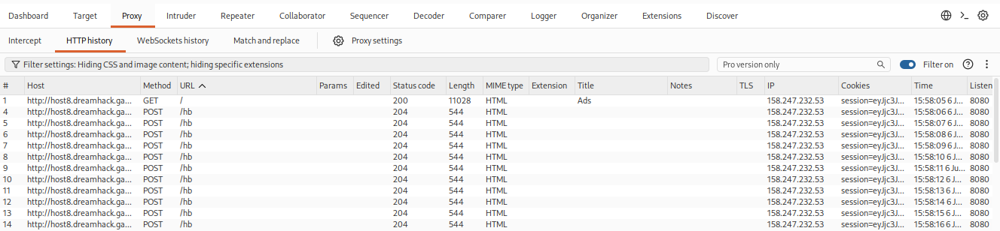
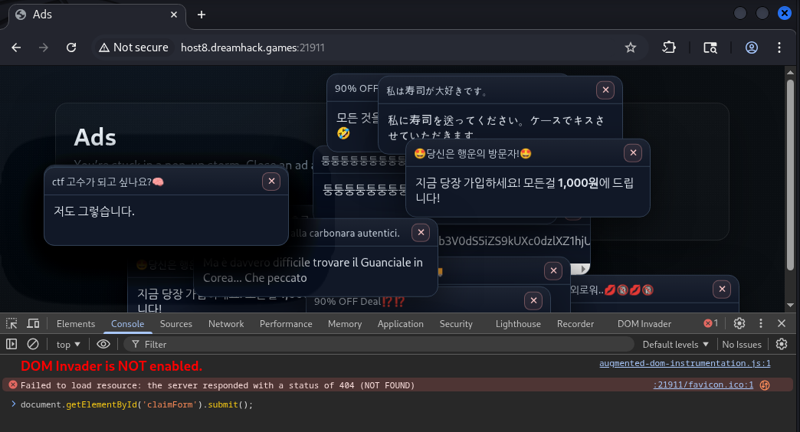
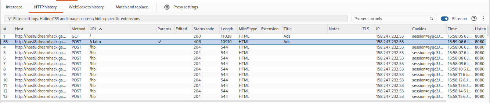
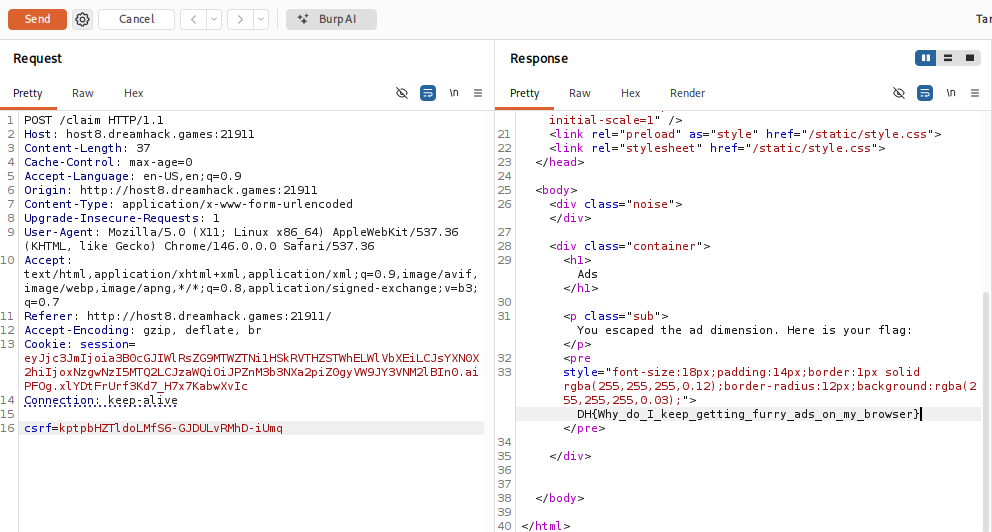

# [Dreamhack] Disgusting Ads - Web Hacking

## 1. 문제 개요

* **문제 링크:** [Dreamhack - Disgusting Ads](https://dreamhack.io/wargame/challenges/2259)

* **분야:** Web

* **목표:** 1초 간격으로 서버에 하트비트를 보내는 프론트엔드 타이머를 우회하고, 세션 생성 후 5초 이상 대기하여 검증 로직을 통과한 뒤 플래그 획득.

## 2. 취약점 분석
제공된 `app.py` 소스 코드와 `index.html` 프론트엔드 코드를 분석한 결과, 세션의 시간을 클라이언트 쿠키에 의존하여 검증하는 구조적 한계를 확인.

```python
# 서버의 하트비트 갱신 로직 (app.py)
@app.route("/hb", methods=["POST"])
def hb():
    if "sid" not in session:
        return ("", 204)
    session["last_hb"] = _now()  # 요청이 올 때마다 현재 시간으로 지속 초기화
    return ("", 204)
```

```javascript
// 프론트엔드의 1초 무한 갱신 로직 (index.html)
window._hb = setInterval(() => {
    try {
        // ... 생략 ...
        fetch("/hb", { method: "POST", credentials: "same-origin" });
    } catch (e) { }
}, HEARTBEAT_MS); // HEARTBEAT_MS = 1000 (1초)
```

```python
# [!] 취약점 발생: 플래그 발급 검증 로직 (app.py)
@app.route("/claim", methods=["POST"])
def claim():
    # ... 생략 ...
    last_hb = session.get("last_hb", 0)
    age = _now() - last_hb
    
    if age < 5:  # 마지막 하트비트 이후 5초가 경과하지 않으면 403 에러 및 가짜 플래그 반환
        msg = f"You're still in ads, kill all ads"
        return render_template(..., error=msg), 403
```

* **분석 결론:** 클라이언트(브라우저)에서 1초마다 지속적으로 하트비트를 보내 세션의 `last_hb` 값을 갱신하므로, 정상적인 방법으로는 `age < 5` 검증을 통과할 수 없음. 또한, 상태 정보가 서버가 아닌 클라이언트의 쿠키에 저장되는 Client-side Session 방식을 사용 중. 이를 역이용하여 과거 시점의 시간이 기록된 세션 쿠키를 패킷에 담아 재전송(Session Replay)하면 서버의 시간 검증 로직 우회 가능.

## 3. 공격 수행
Burp Suite와 브라우저 개발자 도구를 활용하여 패킷을 발생시킨 뒤, Session Replay 기법을 통해 익스플로잇 진행.

1. 웹 브라우저로 접속 후 Burp Suite HTTP History를 확인한 결과, 프론트엔드의 타이머 스크립트에 의해 1초 간격으로 `POST /hb` 패킷이 무한히 전송되며 세션 갱신.



2. 브라우저의 개발자 도구 콘솔에서 `document.getElementById('claimForm').submit();` 명령어를 실행하여 강제로 `/claim` 검증 패킷 전송 유도.



3. 5초가 지나지 않은 시점에서 전송되었으므로, `POST /claim` 요청은 서버에서 거부되어 403 Status Code와 Fake Flag 응답 발생. 이후에도 브라우저는 살아있어 계속 1초마다 백그라운드에서 `/hb`를 갱신 중임을 확인.



4. 브라우저에 의한 지속적인 시간 갱신을 회피하기 위해, Burp Suite HTTP History에서 실패했던 해당 65번 `POST /claim` 패킷을 가로채어 Repeater로 전송.

5. 해당 패킷에 담긴 세션 쿠키는 캡처된 **과거 시점**의 `last_hb` 값을 그대로 보유하고 있음. 프론트엔드의 간섭을 받지 않는 Repeater 환경에서 현실 시간으로 5초 이상 대기한 후 서버로 해당 패킷 재전송.

6. 서버는 전송된 과거 시점의 쿠키와 현재 서버 시간을 비교. 5초 이상의 시간차(`age >= 5`)가 발생했으므로 조건 충족으로 판단, 검증 로직 우회 성공.



## 4. 획득 결과
Repeater Response 탭 확인 결과, 200 OK 응답과 함께 본문에 최종 플래그 출력 확인.

* **FLAG:** `DH{Why_do_I_keep_getting_furry_ads_on_my_browser}`

## 5. 대응 방안
클라이언트가 제출하는 세션 쿠키의 내부 데이터에 전적으로 의존하는 구조적 취약점 해결 필요.

* **서버사이드 세션 관리 도입:** 상태 정보를 클라이언트 쿠키에 직접 암호화하여 저장하는 대신, 서버 측 메모리나 데이터베이스에 세션 상태를 기록하고 클라이언트에게는 난수화된 Session ID만 부여하는 방식으로 변경하여 쿠키 재사용 기반의 우회 공격 원천 차단.

* **단발성 검증 토큰(Nonce) 적용:** 클라이언트가 `/claim` 요청 시 이전에 사용했던 패킷을 재사용하지 못하도록, 요청마다 1회용 토큰(Anti-Replay Token)을 발급 및 검증하여 상태 변조 및 재전송 방지.